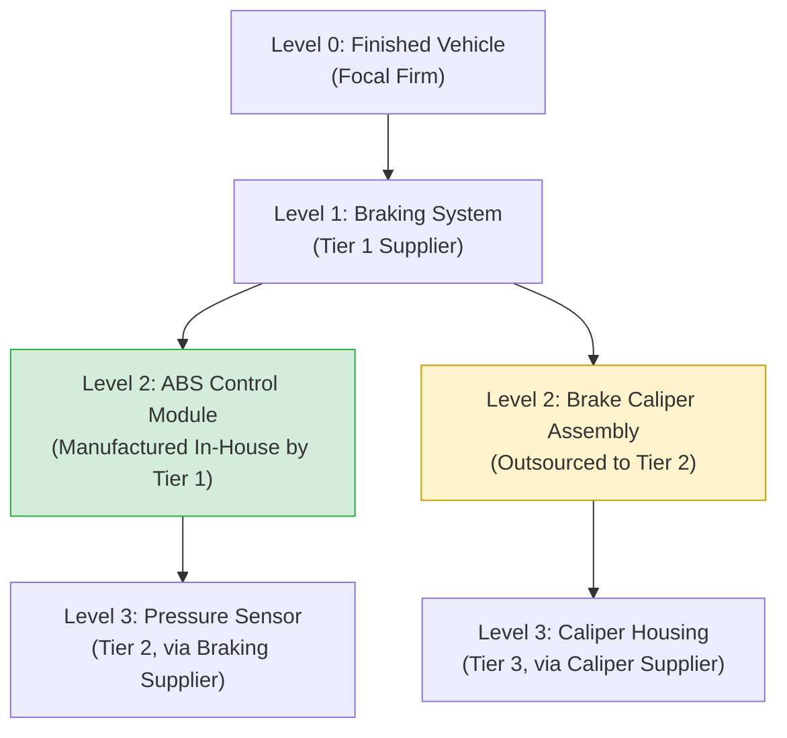

## Tiering in Complex Assemblies and Bills of Materials

### Core Concept

The Bill of Materials (BOM) is the structural blueprint that defines how tiering manifests physically within a product. A BOM decomposes a finished product into a hierarchical tree of assemblies, sub-assemblies, and individual parts — and this **engineering hierarchy** maps onto (but is not identical to) the **supply chain tier hierarchy**. Understanding this mapping, and where it breaks down, is essential for connecting product structure to sourcing structure.

### BOM Hierarchy Fundamentals

**Key Points**

- **Single-level BOM**: Lists only the immediate components of a parent item, one level deep.
- **Multi-level (indented) BOM**: Recursively expands every sub-assembly into its own constituent parts, forming a complete tree from finished product down to raw materials.
- **Where-used analysis**: The inverse view — given a single part, identify every higher-level assembly that consumes it. Critical for impact analysis when a part is discontinued or a supplier is disrupted.
- A BOM node is not the same as a supply-chain tier node: a single BOM level (e.g., "final assembly") can be supplied by a Tier 1, while its child node ("sub-assembly") might be manufactured internally, by the same Tier 1, or by a distinct Tier 2 supplier — the mapping is a design/sourcing decision, not a structural given.

$$\text{BOM Depth} \neq \text{Supply Chain Tier Depth (in general)}$$

### Mapping BOM Structure to Supply Chain Tiers

| BOM Level | Example (Automotive) | Typical Supply Chain Tier |
| --- | --- | --- |
| Level 0 (Finished Product) | Vehicle | Focal Firm (OEM) |
| Level 1 (Major Assembly) | Braking System | Tier 1 |
| Level 2 (Sub-Assembly) | ABS Control Module | Tier 1 or Tier 2 (depends who integrates it) |
| Level 3 (Component) | Pressure Sensor | Tier 2 |
| Level 4 (Raw/Basic Material) | Silicon Wafer | Tier 3+ |

**Key Points**

- The mapping is **not fixed**: a Tier 1 supplier might vertically manufacture a Level 2 sub-assembly internally, collapsing what looks like two BOM levels into a single supply-chain tier — or it might outsource that same sub-assembly, extending the tier chain by one hop.
- This means BOM structure alone cannot be used to infer supply chain tier structure; procurement records (who is contracted with whom) must be overlaid onto the engineering BOM to produce an accurate tiered supply map.

### Structural Diagram

Note that both L2A and L2B sit at the same BOM depth, yet L2A stays within Tier 1's internal operations while L2B introduces an entirely new supply-chain tier (Tier 2) for a component at the identical structural level.

### Complex Assembly Challenges

**Key Points**

- **Convergent BOM structures**: In complex assemblies (aircraft, industrial machinery), a single low-level part (e.g., a standard fastener or connector) may appear in dozens of different sub-assemblies across multiple business units — creating a many-to-many relationship between BOM nodes and supplier tiers that complicates where-used impact analysis.
- **Phantom assemblies**: BOM nodes that exist only for planning/costing purposes and are never physically stocked or separately sourced — these must be excluded from tier-mapping exercises since they don't correspond to an actual supplier relationship.
- **Engineering vs. manufacturing BOM divergence**: The engineering BOM (EBOM), designed by product engineers, often differs from the manufacturing BOM (MBOM), which reflects actual production/assembly sequence and sourcing reality — sourcing and tier analysis should generally be based on the MBOM.
- **Configurable/modular BOMs**: Products with high variant complexity (e.g., automotive trims, configurable industrial equipment) use "150%" or super-BOMs containing all possible options, with configuration rules selecting the actual build — this can obscure which specific supplier tier chain applies to any single unit sold.

### Example: BOM-Driven Tier Risk Analysis

**Example**

A "where-used" query is run to identify all finished products affected by a disruption at a specific Tier 3 semiconductor fab producing a single chip part number:

1. The chip's part number is looked up in the where-used index.
2. The query traces upward through every sub-assembly that consumes it (e.g., three different sensor modules).
3. Each sensor module is traced further upward to the Tier 1 systems it feeds into (e.g., ABS module, airbag control unit, infotainment display).
4. Finally, the query resolves to every finished vehicle trim/model that includes any of those Tier 1 systems.

This is precisely the kind of analysis that becomes computationally and organizationally difficult without an accurate, unified BOM-to-supplier-tier mapping — commonly implemented via Product Lifecycle Management (PLM) systems integrated with supplier master data.

### PLM and Data Architecture Considerations

**Key Points**

- **Product Lifecycle Management (PLM) systems** typically own the authoritative EBOM/MBOM structure.
- **ERP systems** typically hold the supplier/procurement master data (who supplies which part number, at what tier, under what contract).
- Effective multi-tier risk visibility requires **integrating PLM part-level data with ERP/procurement supplier data**, since neither system alone contains the full picture; a part number in the BOM without an associated supplier record cannot be tier-mapped, and a supplier contract without an associated BOM part number cannot be traced to product-level impact.
- [Inference] Organizations without integrated PLM-ERP data pipelines commonly resort to manual spreadsheet reconciliation for tier-impact analysis, which is slower and more error-prone, though the exact prevalence of this practice varies by company maturity.

### Related Topics

- Product Lifecycle Management (PLM) and Master Data Integration
- Engineering BOM vs. Manufacturing BOM Divergence
- Where-Used Analysis and Impact Assessment
- N-Tier Supply Chain Mapping and Visibility Techniques
- Configurable/Modular BOM ("150% BOM") Structures
- Tier Position as Contractual Distance Rather Than Importance
- Directly Managed versus Indirectly Managed Tiers