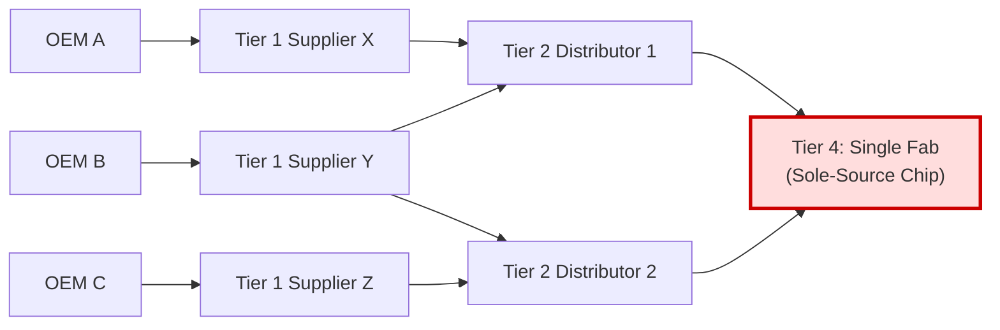

## Concentration Risk and Shared Sub-Tier Chokepoints

### Core Concept

Concentration risk in tiered supply chains arises when multiple, apparently independent, and often uncoordinated supply paths **converge on a single shared point of failure** deep in the sub-tier structure. A "chokepoint" is a node (a facility, a firm, a geographic region, or even a specific process technology) that a disproportionate share of downstream demand depends on, whether or not that dependency is visible to the affected downstream firms.

This risk is structurally distinct from ordinary single-sourcing risk at the Tier 1 level because it emerges from **hidden convergence** — a focal firm may believe it has diversified suppliers (multiple Tier 1s, sourced from multiple Tier 2s) while all of them ultimately draw from the same Tier 3 or Tier 4 chokepoint, unknown to any single actor in the chain.

### The Convergence/Bowtie Structure

**Key Points**

- Global supply networks for many advanced components exhibit a **"bowtie" or "hourglass" topology**: many divergent downstream demand paths (numerous OEMs, numerous Tier 1s) funnel into a small number of upstream chokepoints (a handful of foundries, refineries, or mines), before diverging again into finished goods.
- This topology arises from **economies of scale and technological specialization** — advanced semiconductor fabrication, rare-earth refining, and specialty chemical synthesis all require capital intensity and technical expertise that naturally concentrates supply among very few global players.
- Chokepoints can be defined at multiple levels: a single **facility** (a specific fab), a single **firm** (even with multiple facilities, if governance/IP is centralized), a single **geographic region** (a country or industrial cluster), or a single **process/technology** (e.g., a specific lithography node).

### Structural Diagram

All three OEMs believe they have diversified supply (three different Tier 1s, two different Tier 2 distributors), yet every path converges on a single Tier 4 fab. A disruption there simultaneously impacts all three OEMs regardless of their apparent Tier 1/Tier 2 diversification efforts.

### Why This Risk Is Systematically Underestimated

**Key Points**

- **Limited N-tier visibility**: As covered in prior topics, focal firms typically have strong visibility only into Tier 1, and rapidly diminishing visibility beyond that — making it structurally difficult to even detect shared chokepoints.
- **False diversification**: Procurement teams measure diversification by counting distinct Tier 1 contracts, without verifying whether those Tier 1s (or their Tier 2s) ultimately share upstream sources — a form of **diversification illusion**.
- **Commodity fungibility masking**: Sub-tier suppliers often source interchangeable/fungible inputs (e.g., a generic chemical or basic metal), making it non-obvious that two seemingly different Tier 2 suppliers are actually reselling material from the identical Tier 3 origin.
- [Inference] The degree of hidden convergence tends to be higher in industries with high capital-intensity upstream stages (semiconductors, batteries, specialty chemicals) than in industries with more fragmented, lower-capital-intensity upstream stages, though comprehensive comparative data across industries is limited.

### Historical/Illustrative Cases

**Example**

- **2011 Thailand floods**: A significant share of the world's hard disk drive component manufacturing was concentrated in flood-affected industrial estates, disrupting global PC production despite OEMs sourcing from many different drive brands — because those brands shared common upstream component suppliers in the same geographic cluster.
- **2011 Tōhoku earthquake**: A number of specialized chemical and electronic component manufacturers concentrated in the affected region supplied a large share of global semiconductor and automotive production inputs, illustrating how geographic concentration functions as a chokepoint even when firm-level sourcing appears diversified.
- **Semiconductor node concentration**: Advanced-node chip fabrication capacity has historically been concentrated among a very small number of global foundries, meaning that products from many different competing brands can depend on the same limited manufacturing capacity.

[Unverified] Specific market-share percentages and capacity figures for any given period should be checked against current data, as these shift with new fab investments and capacity expansions.

### Detection and Mitigation Approaches

| Approach | Description |
| --- | --- |
| **N-tier mapping surveys** | Systematically requiring Tier 1 (and where possible Tier 2) suppliers to disclose their own sourcing, then cross-referencing across the full supplier base to identify overlapping nodes |
| **Third-party convergence analytics** | Using trade/customs data, corporate ownership records, and shipment data to independently infer shared upstream dependencies not self-reported by suppliers |
| **Geographic risk clustering** | Mapping supplier facilities (across all tiers) by physical location to identify geographic concentration risk (natural disaster, geopolitical, single-region regulatory risk) |
| **Dual-sourcing at the chokepoint level** | Rather than merely dual-sourcing Tier 1s, qualifying genuinely independent sources at the identified chokepoint tier itself |
| **Strategic inventory buffers** | Holding safety stock specifically sized around chokepoint-tier lead times and disruption probability, rather than generic Tier 1 lead times |
| **Vertical integration of the chokepoint** | In extreme cases, a focal firm may acquire or invest directly in chokepoint capacity to secure supply (see vertical integration topic) |

### Quantifying Concentration Risk

**Key Points**

- A common quantitative proxy borrowed from industrial economics is the **Herfindahl-Hirschman Index (HHI)**, applied to a chokepoint tier to measure how concentrated market share is among the few firms/facilities operating there:

$$HHI = \sum_{i=1}^{n} s_i^2$$

where $s_i$ is the market share (as a fraction) of firm $i$ at the chokepoint tier. Higher HHI values indicate greater concentration and, correspondingly, greater systemic chokepoint risk.

- [Inference] While HHI is a standard economic concentration measure, its direct application to sub-tier supply chain risk quantification is a synthesized/adapted use rather than a universally standardized supply chain risk metric; practitioners may weight it alongside geographic and single-source indicators rather than relying on it in isolation.

### Related Topics

- N-Tier Supply Chain Mapping and Visibility Techniques
- Directly Managed versus Indirectly Managed Tiers
- Single-Sourcing vs. Dual-Sourcing Strategy
- Geographic/Geopolitical Supply Chain Risk Clustering
- Herfindahl-Hirschman Index and Market Concentration Analysis
- Semiconductor Supply Chain Case Studies
- Vertical Integration versus Horizontal Specialization