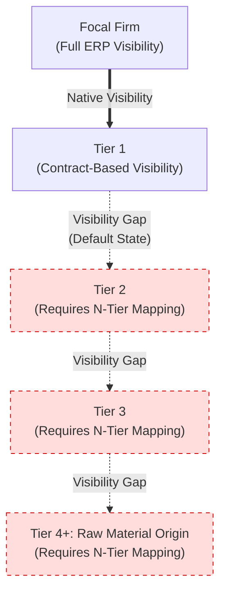

## What N-Tier Mapping Is and Why It Matters

### Core Concept

N-Tier Mapping is the practice of systematically identifying, documenting, and maintaining visibility into supply chain relationships **beyond Tier 1**, extending as deep as Tier 2, Tier 3, Tier N, ultimately toward raw material origin. It transforms the supply chain from a contractually-bounded, Tier-1-only view into a **network graph** representing the actual physical and transactional dependencies underlying a product.

Formally, N-tier mapping seeks to construct:

$$G = (V, E)$$

where $V$ is the set of all supplying entities across all tiers (from focal firm to raw material origin) and $E$ represents the supply relationships (material or component flows) connecting them — as opposed to the much sparser graph a focal firm can construct from its own contracts alone.

### Why Tier 1-Only Visibility Is Insufficient

**Key Points**

- A focal firm's enterprise systems (ERP, procurement records) natively capture only **directly contracted relationships**, i.e., Tier 1. Everything beyond that is, by default, invisible to standard corporate data infrastructure.
- As established in earlier topics, tier position does not correlate with criticality — meaning the invisible tiers can (and frequently do) contain the most operationally significant chokepoints.
- Regulatory, ESG, and compliance pressures increasingly require visibility beyond Tier 1 (e.g., conflict minerals disclosure, forced labor due diligence, carbon accounting across Scope 3 emissions), which by definition cannot be satisfied by Tier 1-only data.
- Disruption events (natural disasters, geopolitical shocks, pandemics) have repeatedly demonstrated that impact often originates at Tier 2/3/4 nodes that were entirely unknown to the affected focal firm prior to the event.

### What N-Tier Mapping Produces

| Output | Description |
| --- | --- |
| **Supplier network graph** | Nodes (suppliers/facilities) and edges (material/component flows) spanning multiple tiers |
| **Facility-level geolocation data** | Physical location of manufacturing sites at each tier, enabling geographic risk overlay |
| **Part-to-supplier linkage** | Mapping specific components/materials to the specific sub-tier facility producing them |
| **Ownership and corporate structure data** | Identifying shared parent companies or shared facilities across nominally distinct suppliers |
| **Risk indicators per node** | Financial health, geopolitical exposure, single-source status, capacity constraints, compliance history |

### Structural Diagram

The dashed lines represent the default visibility gap that N-tier mapping initiatives are specifically designed to close.

### Core Methods for Building N-Tier Maps

**Key Points**

- **Supplier self-disclosure surveys**: Requiring Tier 1 suppliers (and cascading the requirement down) to report their own upstream suppliers via structured questionnaires or supplier portals — the most common starting method, but dependent on supplier cooperation and accuracy.
- **Contractual flow-down requirements**: Embedding sub-tier disclosure obligations directly into Tier 1 contracts, sometimes with financial or relationship consequences for non-disclosure.
- **Trade and customs data analysis**: Using import/export records, bills of lading, and shipment manifests (aggregated by specialized data providers) to independently infer likely supplier relationships without relying on self-reporting.
- **Corporate ownership and financial database cross-referencing**: Identifying shared parent entities, joint ventures, or financial interdependencies that reveal hidden concentration (see concentration risk topic).
- **Blockchain/distributed ledger provenance systems**: Emerging approaches, particularly in industries like conflict minerals and food safety, where each participant in the chain records a transaction on a shared ledger, providing an auditable chain of custody.
- [Inference] Self-disclosure and trade-data inference are typically used in combination rather than in isolation, since each method has complementary weaknesses — self-disclosure is accurate but often incomplete/stale, while trade data is objective but can be ambiguous about exact product/part identity.

### Challenges in Practice

**Key Points**

- **Data quality decay with depth**: Visibility completeness and accuracy typically decline sharply beyond Tier 2, since intermediate suppliers may be unwilling or unable to fully disclose their own upstream relationships (competitive sensitivity, lack of internal tracking, or genuine complexity).
- **Dynamic/changing relationships**: Supplier relationships change over time (new sourcing, capacity shifts), meaning an N-tier map is a snapshot that requires ongoing refresh rather than a one-time exercise.
- **Confidentiality and competitive sensitivity**: Suppliers may resist disclosing their own supplier lists, viewing this information as proprietary competitive intelligence.
- **Scale and complexity**: A single finished product can involve thousands of distinct parts, each potentially tracing through multiple tiers — making full manual mapping infeasible without software tooling.
- **Standardization gaps**: Lack of universal identifiers for facilities/parts across different suppliers' systems complicates automated matching and deduplication in mapping software.

### Business Value and Use Cases

**Example**

An N-tier map enables several concrete capabilities that Tier-1-only visibility cannot support:

1. **Disruption impact simulation**: When a natural disaster affects a specific region, the focal firm can immediately query the N-tier map to identify which finished products, and which Tier 1 relationships, are exposed — rather than waiting for the disruption to manifest as a Tier 1 delivery failure weeks later.
2. **Concentration risk detection**: Identifying shared chokepoints across nominally diversified Tier 1 sourcing strategies (as covered previously).
3. **Regulatory compliance**: Satisfying disclosure requirements such as conflict minerals reporting (which requires tracing to smelter/refiner level, often Tier 4+) or forced labor due diligence legislation, which increasingly requires demonstrable sub-tier visibility.
4. **Carbon footprint (Scope 3) accounting**: Emissions embedded in purchased goods and services span the full supply chain; accurate Scope 3 reporting depends on N-tier data rather than Tier 1 estimates alone.

### Maturity Model

| Maturity Level | Characteristics |
| --- | --- |
| **Level 0: Tier 1 only** | Visibility limited to direct contracts; no formal sub-tier mapping |
| **Level 1: Ad hoc / reactive** | Sub-tier information gathered only after a disruption occurs, via manual investigation |
| **Level 2: Systematic self-disclosure** | Formal surveys/portals requiring Tier 1 (and sometimes Tier 2) to report upstream sourcing |
| **Level 3: Data-augmented mapping** | Self-disclosure combined with third-party trade data and analytics for validation and gap-filling |
| **Level 4: Continuous, integrated visibility** | Real-time or near-real-time N-tier data integrated into procurement, risk, and PLM systems, feeding automated alerts |

[Speculation] Advancement between maturity levels is often driven by a triggering disruption event rather than proactive investment, though the relative weight of regulatory pressure versus disruption experience as a driver likely varies by industry and region.

### Related Topics

- Concentration Risk and Shared Sub-Tier Chokepoints
- Directly Managed versus Indirectly Managed Tiers
- Supplier Risk Intelligence Platforms and Third-Party Data Sources
- Conflict Minerals and Responsible Sourcing Disclosure Requirements
- Scope 3 Carbon Accounting Across Supply Chains
- Blockchain-Based Supply Chain Provenance Systems
- Tiering in Complex Assemblies and Bills of Materials