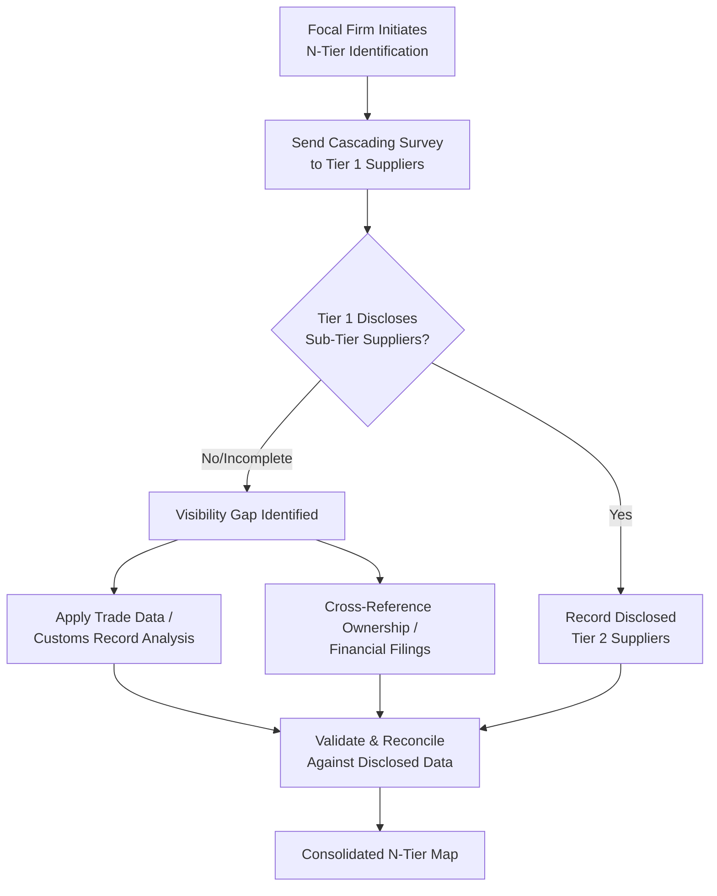

## Techniques for Identifying Tier 2 and Tier 3 Suppliers

### Core Concept

Identifying Tier 2 and Tier 3 suppliers requires methods that go beyond a focal firm's own contractual records, since by definition these suppliers exist outside the firm's direct procurement relationships. Techniques fall into three broad categories: **disclosure-based methods** (asking someone in the chain to reveal the information), **inference-based methods** (deriving relationships from independent external data), and **hybrid/technology-enabled methods** (using shared infrastructure such as ledgers or portals to make sub-tier data visible by design).

### Category 1: Disclosure-Based Methods

**Key Points**

- **Cascading supplier surveys**: The focal firm requires each Tier 1 supplier to complete a structured questionnaire identifying its own key suppliers (by part number, category, or facility), and contractually requires Tier 1s to cascade the same requirement to their own Tier 2 suppliers, in principle propagating visibility down the chain.
- **Supplier portals and SRM (Supplier Relationship Management) platforms**: Digital platforms where Tier 1 suppliers are required to input and maintain their own sub-tier supplier data as a condition of doing business, often integrated with scorecarding and onboarding workflows.
- **Contractual disclosure clauses**: Legal requirements embedded in Tier 1 contracts mandating disclosure of sub-tier sourcing changes above a defined materiality threshold (e.g., single-source components exceeding a cost-share percentage).
- **Site visits and joint audits**: Physical or virtual audits of Tier 1 facilities that incidentally or deliberately surface sub-tier supplier names (e.g., inbound material shipping labels, incoming inspection records).

**Limitations**: [Inference] Disclosure-based methods tend to have high accuracy when suppliers cooperate but suffer from incompleteness, since Tier 1 suppliers may be reluctant to disclose their own sourcing due to competitive sensitivity, may lack full visibility into their own Tier 2 base, or may simply fail to keep survey responses current.

### Category 2: Inference-Based Methods

**Key Points**

- **Trade and customs data analysis**: Import/export filings, bills of lading, and shipping manifests are often publicly or commercially available (via data aggregators) and can reveal shipment flows between specific named companies, allowing inference of supplier relationships without requiring self-disclosure.
- **Corporate ownership and financial filings analysis**: Cross-referencing shared parent companies, joint ventures, and equity stakes (via financial databases or public filings) can reveal non-obvious relationships, such as two nominally distinct Tier 1s ultimately owned by, or dependent on, the same upstream entity.
- **Patent and intellectual property analysis**: Examining patent citations, co-filings, or licensing records can reveal technical/component dependencies between firms that are not otherwise disclosed.
- **Certification and regulatory filing cross-referencing**: Many regulated industries (aerospace, medical devices, automotive safety systems) require public or semi-public certification filings that name component manufacturers, which can be mined for sub-tier identification.
- **Web and news mining**: Press releases, supplier award announcements, trade publication articles, and even LinkedIn/employment data can surface supplier relationships not formally disclosed elsewhere.

**Limitations**: [Inference] Inference-based methods provide independent verification unaffected by supplier willingness to disclose, but often carry ambiguity about the *specific* part or product involved (e.g., a shipment record may confirm Company A ships to Company B, but not confirm which specific component or whether it maps to the product line in question).

### Category 3: Hybrid and Technology-Enabled Methods

**Key Points**

- **Blockchain/distributed ledger provenance**: Each participant in the physical supply chain records transactions on a shared, often permissioned, ledger — providing a cryptographically auditable chain of custody from raw material to finished good, used notably in conflict minerals traceability and food safety initiatives.
- **Digital product passports / material passports**: Emerging regulatory and industry initiatives (particularly in the EU) that attach persistent digital records to products or components, carrying embedded supplier and material origin data through the value chain.
- **Third-party risk intelligence platforms**: Commercial platforms that combine self-disclosure, trade data, financial data, and news monitoring into a unified sub-tier mapping and risk-scoring service, reducing the burden on any single focal firm to build this infrastructure independently.
- **Industry consortia and shared registries**: Sector-specific initiatives where multiple focal firms pool sub-tier supplier data (e.g., shared smelter/refiner lists in the conflict minerals space) to reduce duplicated due diligence effort across the industry.

### Comparative Summary

| Technique | Accuracy | Completeness | Cost/Effort | Independence from Supplier Cooperation |
| --- | --- | --- | --- | --- |
| Cascading surveys | High (when answered) | Low-Medium (depends on response rate) | Medium | Low |
| Contractual disclosure clauses | High | Medium | Low (embedded in existing contracts) | Low-Medium |
| Trade/customs data | Medium (shipment-level, not part-level) | Medium-High | Medium-High (often requires paid data services) | High |
| Financial/ownership analysis | High (for ownership facts) | Low (only reveals ownership, not sourcing detail) | Low-Medium | High |
| Blockchain/ledger systems | High (if adopted) | Low (requires full-chain participant adoption) | High (infrastructure/adoption cost) | Medium |
| Third-party risk platforms | Medium-High | Medium-High | Medium-High (subscription cost) | High |

### Process Flow Diagram

### Example: Combined Approach in Practice

**Example**

A focal firm attempting to identify the Tier 3 semiconductor fab behind a critical Tier 1-supplied electronics module might:

1. Send a cascading survey to the Tier 1, which discloses its Tier 2 chip distributor.
2. Find that the Tier 2 distributor declines to disclose its own upstream fab source, citing confidentiality.
3. Use customs/shipping data to identify inbound wafer or die shipments to the distributor's known facility address, narrowing candidate fabs by shipment volume and part classification codes.
4. Cross-reference the candidate fab list against public foundry customer disclosures or industry news (e.g., capacity expansion announcements naming customer segments).
5. Validate the inferred fab identity, where possible, through a direct conversation with the Tier 1 or Tier 2, framed around risk mitigation rather than commercial disintermediation, to avoid straining the relationship.

### Practical Constraints and Ethical Considerations

**Key Points**

- Aggressive independent identification of sub-tier suppliers (bypassing the Tier 1's disclosure) can strain Tier 1 relationships if perceived as disintermediation or distrust; framing such efforts around **shared risk mitigation** (e.g., "we want to help ensure your supply continuity") is a commonly recommended approach.
- Trade data and customs records, while often legally accessible, carry [Inference] varying degrees of formal public availability depending on jurisdiction — some countries' import records are broadly public, while others restrict access, meaning global coverage from any single data source is typically uneven.
- Data quality validation (cross-checking disclosure-based and inference-based sources against each other) is generally considered a best practice given that neither method alone is fully reliable.

### Related Topics

- What N-Tier Mapping Is and Why It Matters
- Concentration Risk and Shared Sub-Tier Chokepoints
- Supplier Risk Intelligence Platforms and Third-Party Data Sources
- Blockchain-Based Supply Chain Provenance Systems
- Conflict Minerals and Responsible Sourcing Disclosure Requirements
- Digital Product Passports and Material Traceability Regulation
- Directly Managed versus Indirectly Managed Tiers