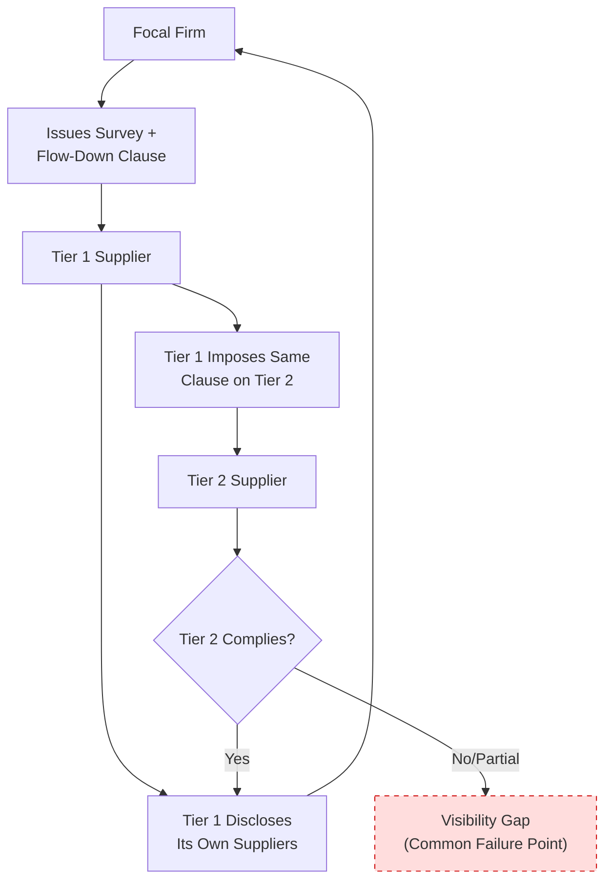

## Supplier Disclosure, Surveys, and Contractual Visibility Clauses

### Core Concept

Supplier disclosure mechanisms are the **formal instruments** — surveys, portal-based reporting requirements, and contractual clauses — through which a focal firm compels or incentivizes its direct suppliers to reveal information about their own upstream (sub-tier) supply base. These mechanisms constitute the primary "voluntary/compelled disclosure" pillar of N-tier mapping, complementing the independent inference-based methods (trade data, financial analysis) covered elsewhere.

### Survey-Based Disclosure

**Key Points**

- **Structured supplier questionnaires**: Standardized forms requesting information such as: names and locations of key sub-tier suppliers, single-source dependencies, percentage of spend by sub-tier supplier, facility certifications, and business continuity plans.
- **Periodic vs. event-triggered surveys**: Some programs conduct annual or semi-annual blanket surveys; others trigger targeted surveys in response to a specific event (e.g., a geopolitical development affecting a region, or a new regulatory requirement).
- **Standardized industry questionnaire formats**: Certain industries have converged on common survey templates to reduce duplicated effort across multiple focal firms requesting similar information from the same shared supplier base (analogous in spirit to shared due-diligence templates used in some compliance domains).
- **Response rate and data quality challenges**: [Inference] Survey-based programs commonly experience declining response completeness and accuracy as they cascade further down the tier structure, since deeper-tier suppliers may have less staff capacity, less incentive, or less complete internal records to respond thoroughly.

### Contractual Visibility Clauses

**Key Points**

- **Flow-down disclosure obligations**: Contract language requiring the Tier 1 supplier not only to disclose its own sub-tier suppliers but to impose equivalent disclosure obligations on those Tier 2 suppliers, in principle propagating the requirement indefinitely down the chain.
- **Materiality thresholds**: Many disclosure clauses are scoped to significant dependencies only (e.g., single-sourced components representing more than a specified percentage of the item's cost or of the Tier 1's total spend in that category), rather than requiring exhaustive disclosure of every minor input.
- **Change-notification requirements**: Clauses requiring the Tier 1 to proactively notify the focal firm of material sourcing changes (e.g., switching a sub-tier supplier, relocating a facility) rather than only responding to periodic surveys.
- **Audit and inspection rights**: Contractual rights allowing the focal firm (or a designated third party) to conduct audits that may incidentally or deliberately surface sub-tier supplier information.
- **Consequences for non-disclosure**: Typically framed as a contractual breach, but [Inference] enforcement in practice is often more relational than punitive, since aggressive contractual enforcement against a strategically important Tier 1 supplier can damage the broader relationship — meaning actual leverage depends heavily on the focal firm's relative bargaining power over that specific supplier.

### Comparative Disclosure Mechanism Table

| Mechanism | Trigger | Data Depth | Enforcement Basis |
| --- | --- | --- | --- |
| Periodic survey | Scheduled (annual/semi-annual) | Broad but often shallow | Relationship/goodwill; sometimes tied to scorecards |
| Event-triggered survey | Specific disruption or regulatory event | Narrow but deep on the triggering topic | Relationship/goodwill |
| Flow-down contractual clause | Contract signing/renewal | Potentially deep (if cascaded) | Legal/contractual breach |
| Change-notification clause | Ongoing, as changes occur | Narrow (only material changes) | Legal/contractual breach |
| Audit/inspection rights | Scheduled or for-cause | Deep but resource-intensive | Legal/contractual right |

### Structural Diagram: Disclosure Cascade

The diagram highlights that cascaded flow-down clauses commonly break down at the Tier 2 level, since the focal firm has no direct contractual relationship with Tier 2 and must rely entirely on the Tier 1's willingness and ability to enforce the requirement downstream.

### Example: Materiality-Threshold Clause in Practice

**Example**

A contract clause might specify: *"Supplier shall disclose to Buyer, within 30 days, any sub-tier supplier providing a component or material representing more than 10% of the total cost of the delivered product, or any sole-source sub-tier dependency regardless of cost share."*

This scopes disclosure obligations to genuinely material dependencies rather than requiring an exhaustive parts list, balancing the focal firm's visibility needs against the administrative burden imposed on suppliers — a design trade-off common to most well-constructed disclosure programs.

### Barriers to Effective Disclosure

**Key Points**

- **Competitive sensitivity**: Suppliers may view their own sourcing relationships as proprietary competitive knowledge and resist disclosure even under contractual obligation, particularly regarding pricing or unique process capabilities.
- **Genuine lack of visibility**: A Tier 1 supplier may itself lack full visibility into its Tier 2's own sourcing, especially for commodity or fungible inputs, meaning disclosure gaps are not always attributable to unwillingness.
- **Administrative burden asymmetry**: Smaller sub-tier suppliers, especially deep in the chain, may lack the staff or systems to respond comprehensively to survey requests, particularly if they are simultaneously fielding similar requests from multiple different focal firms in their customer base.
- **Legal and data privacy constraints**: In some jurisdictions, certain categories of business data disclosure may be constrained by local data protection or competition law considerations, adding complexity to cross-border disclosure programs.

### Best-Practice Design Considerations

**Key Points**

- Aligning disclosure requests with **industry-standard formats** where they exist, to reduce the compounding survey burden on shared suppliers.
- Tying disclosure compliance to **existing scorecard/relationship mechanisms** rather than solely to punitive contract enforcement, to improve response rates through incentive alignment.
- Scoping requests to **materiality-based thresholds** rather than exhaustive disclosure, improving both compliance likelihood and the practical usefulness of the resulting data.
- Combining disclosure-based data with independent inference-based verification (trade data, financial records) to validate and fill gaps, rather than relying on disclosure as the sole source of truth.

### Related Topics

- Techniques for Identifying Tier 2 and Tier 3 Suppliers
- What N-Tier Mapping Is and Why It Matters
- Directly Managed versus Indirectly Managed Tiers
- Flow-Down Compliance and Contractual Accountability Gaps
- Supplier Risk Intelligence Platforms and Third-Party Data Sources
- Conflict Minerals and Responsible Sourcing Disclosure Requirements