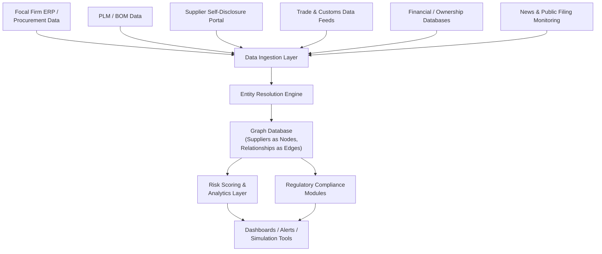

## Technology Platforms for Automated Supply Chain Mapping

### Core Concept

Technology platforms for automated supply chain mapping are software systems designed to construct, maintain, and continuously update N-tier supplier network graphs at a scale and speed unattainable through manual survey-and-spreadsheet processes alone. These platforms combine data ingestion (from ERPs, supplier disclosures, trade data, and public records), graph-based data modeling, risk analytics, and increasingly AI/ML-driven inference to automate what was traditionally a labor-intensive manual mapping exercise.

### Core Architectural Components

**Key Points**

- **Data ingestion layer**: Connectors that pull structured data from the focal firm's own ERP/procurement systems (Tier 1 contracts, purchase orders, BOM data) as well as external sources (customs/trade records, corporate registries, financial databases, news feeds).
- **Entity resolution engine**: Software logic that deduplicates and reconciles supplier identities across disparate data sources — since the same physical facility may appear under different legal names, addresses, or identifiers depending on the data source.
- **Graph data model**: The underlying representation storing suppliers as nodes and material/transactional relationships as edges, enabling multi-hop traversal queries (e.g., "show every path from this raw material to this finished product").
- **Risk scoring/analytics layer**: Modules that overlay risk indicators (financial health, geopolitical exposure, ESG compliance status, single-source concentration) onto the mapped network.
- **Supplier-facing portal**: A collaborative interface allowing Tier 1 (and cascading Tier 2+) suppliers to self-report and maintain their own upstream sourcing data directly within the platform.
- **Regulatory compliance modules**: Purpose-built workflows for specific regulatory regimes (e.g., mapping to smelter/refiner level for conflict minerals disclosure, or facility-level data for deforestation and forced-labor import regulations).

### Platform Architecture Diagram

### Current Landscape of Approaches (as of 2026)

**Key Points**

- **Dedicated N-tier mapping and traceability platforms**: Purpose-built platforms in this category emphasize securely mapping large numbers of sub-tier suppliers into a live, interactive database, using machine learning and real-time data to flag risks and streamline compliance for regulatory frameworks. [sourcemap](https://www.sourcemap.com/company/news/sourcemap-recognized-by-ciocoverage-for-supply-chain-innovation)
- **Multi-tier visibility-focused vendors**: Some vendors position multi-tier mapping as their standout differentiator, marketed specifically toward enterprises that need multi-tier supply chain visibility as their primary use case. [tradeverifyd](https://tradeverifyd.com/blog/best-supply-chain-mapping-software)
- **Integrated business planning suites**: Larger enterprise platforms bundle supply chain mapping and visibility features alongside broader end-to-end planning capabilities, positioned for large enterprises needing integrated demand/supply planning alongside risk visibility.
- **ESG/sustainability-focused platforms**: A distinct category emphasizes sustainability dashboards, ratings, and ESG performance tracking as the primary lens for supplier mapping, often used to satisfy sustainability disclosure obligations specifically.
- **AI-driven supplier data hubs**: Some newer entrants center their value proposition on AI-powered centralization of supplier data across an organization's fragmented internal systems.
- [Unverified] Specific vendor names, feature sets, and market positioning in this space change frequently as the category consolidates and evolves; verify current vendor capabilities directly before making procurement decisions.

### Emerging Technique: AI/LLM-Based Mapping from Public Data

**Key Points**

- Recent research demonstrates using **Retrieval-Augmented Generation (RAG)** techniques to automatically extract supplier-customer relationships from unstructured public sources. One documented methodology extracts supplier-customer relationships from unstructured public data sources, including SEC 10-K filings and earnings calls, structuring the extracted entities into a directed supply chain graph analyzed using network science metrics such as centrality, modularity, and path length. [mit](https://ctl.mit.edu/publications/supply-chain-mapping-through-retrieval-augmented-generation-applications-electronics)
- This approach was demonstrated in a case study of major electronics contract manufacturers, illustrating how AI-driven text extraction from regulatory filings and corporate disclosures can supplement or partially substitute for manual survey-based disclosure, particularly for large, publicly-traded sub-tier suppliers that file regular disclosures.
- [Inference] This class of technique is likely most effective for larger, publicly-traded or heavily-regulated sub-tier suppliers who generate substantial public disclosure text, and less effective for small, privately-held deep-tier suppliers (e.g., small mineral processors or family-owned component shops) that generate little or no public textual data to mine.

### Regulatory Integration Trends

**Key Points**

- Some mapping platforms have begun integrating directly with government regulatory systems, enabling supply chain mapping data to feed directly into customs and compliance processes. One vendor reports being among the first software integrated with the EU's TRACES platform and piloting US CBP's new ACE 2.0 system, with these platforms requiring digital supply chain mapping data to be transmitted as part of customs clearance. [sourcemap](https://www.sourcemap.com/blog/2025-in-review-and-what-we-re-looking-forward-to-in-2026)
- Some platforms have also built **automated ERP-triggered mapping**, where end-to-end ERP integrations trigger supply chain mapping directly from purchase orders and bills of materials, aiming for a fully automated mapping experience rather than periodic manual survey cycles. [sourcemap](https://www.sourcemap.com/blog/2025-in-review-and-what-we-re-looking-forward-to-in-2026)
- [Inference] This trend toward embedding mapping platforms directly into regulatory clearance infrastructure suggests a broader shift from mapping-as-a-standalone-compliance-exercise toward mapping-as-continuous-operational-infrastructure, though the pace and breadth of this shift across different regulatory jurisdictions remains to be seen.

### Category Comparison

| Platform Category | Primary Strength | Primary Use Case | Typical Limitation |
| --- | --- | --- | --- |
| Dedicated N-tier/traceability platforms | Deep sub-tier mapping, regulatory automation | Conflict minerals, deforestation, forced-labor compliance | May require significant supplier onboarding effort |
| Integrated planning suites | Combines mapping with demand/supply planning | Large enterprises needing unified operations view | Mapping may be less specialized than dedicated tools |
| ESG/sustainability platforms | Sustainability scoring and reporting | ESG disclosure, sustainability ratings | Narrower focus than full operational risk mapping |
| AI-driven data hubs | Centralizing fragmented internal supplier data | Internal data consolidation | Effectiveness depends on internal data quality |
| Transportation/logistics visibility platforms | Shipment-level tracking and execution | Freight visibility, ocean/logistics execution | Distinct focus (in-transit visibility rather than N-tier structural mapping) |
| Research-stage AI/RAG extraction methods | Extracting relationships from public filings/text | Supplementing disclosure for public sub-tier suppliers | Less effective for private, deep-tier, small suppliers |

### Selection Considerations

**Key Points**

- **Regulatory alignment**: Firms with specific compliance obligations (conflict minerals, deforestation regulation, forced labor import bans) should prioritize platforms with purpose-built compliance modules for those specific regimes.
- **ERP/PLM integration depth**: The value of automated mapping depends heavily on how deeply the platform integrates with the focal firm's existing procurement and product data systems, since disconnected mapping data quickly becomes stale.
- **Supplier onboarding burden**: Platforms requiring extensive supplier self-registration/disclosure effort may face adoption resistance from smaller sub-tier suppliers, a factor that should be weighed against the platform's reliance on independent data inference versus disclosure.
- **Data freshness/continuity model**: Whether the platform supports continuous/triggered updates (e.g., ERP-triggered mapping on new purchase orders) versus periodic survey-cycle refreshes materially affects how current the resulting map remains between review cycles.

### Related Topics

- What N-Tier Mapping Is and Why It Matters
- Techniques for Identifying Tier 2 and Tier 3 Suppliers
- Supplier Disclosure, Surveys, and Contractual Visibility Clauses
- Conflict Minerals and Responsible Sourcing Disclosure Requirements
- Retrieval-Augmented Generation (RAG) for Enterprise Data Extraction
- ESG and Scope 3 Supply Chain Reporting Platforms
- Graph Database Architectures for Network Analysis