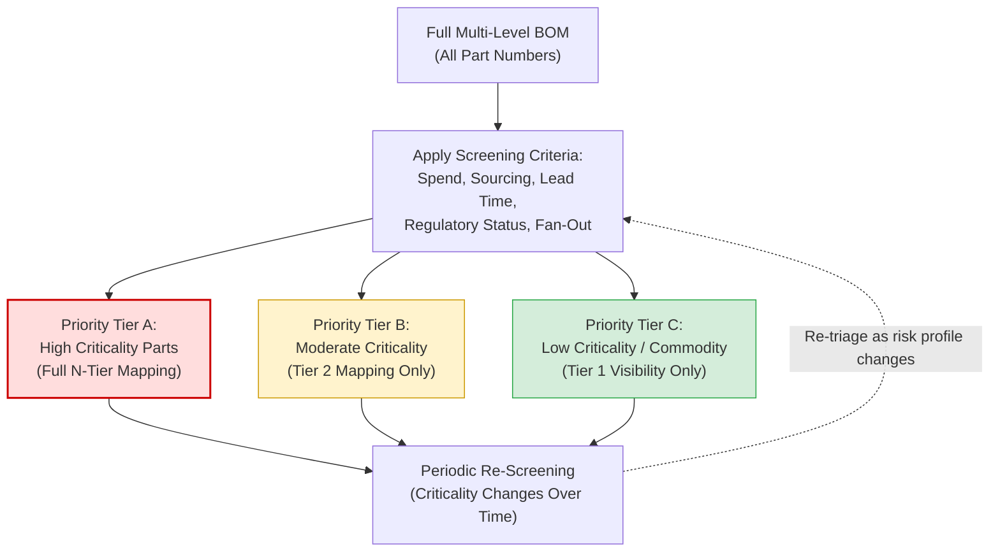

## Prioritizing Critical Bill-of-Materials Coverage Over Full Mapping

### Core Concept

Full N-tier mapping of every part number across an entire BOM, extended to raw material origin, is generally computationally, financially, and organizationally infeasible for most firms with complex products. **Prioritized mapping** is the pragmatic alternative: rather than pursuing exhaustive coverage, firms deliberately target mapping effort at the subset of the BOM most likely to contain critical risk, accepting reduced visibility elsewhere in exchange for tractable cost and speed.

This reframes N-tier mapping from a completeness problem into a **resource allocation problem**: given finite mapping capacity, which parts of the BOM yield the highest risk-reduction return per unit of mapping effort invested?

### Why Full Mapping Is Often Infeasible

**Key Points**

- A complex assembly (automotive, aerospace, industrial equipment) can contain from thousands to tens of thousands of unique part numbers, each with its own supplier chain potentially extending four or more tiers deep.
- Mapping effort (surveys, trade-data analysis, validation) scales roughly with the number of distinct part-supplier relationships being traced, meaning full-depth mapping of an entire BOM can require orders of magnitude more effort than mapping a targeted critical subset.
- Deep-tier data quality and disclosure willingness degrade with depth (as covered in prior topics), meaning that even attempting full-depth mapping yields diminishing returns on data completeness for large portions of the BOM — the effort-to-insight ratio worsens substantially past a certain depth for non-critical items.
- [Inference] For most complex durable-goods products, a comparatively small percentage of total part numbers are likely to account for the large majority of both cost and disruption risk, following a Pareto-like distribution — though the exact ratio varies by product and industry.

### Prioritization Criteria

**Key Points**

- **Spend concentration**: Parts representing a disproportionate share of total cost of goods sold, since disruption or price shock on these parts carries outsized financial impact.
- **Single-source or sole-source status**: Parts with no qualified alternate supplier, where a disruption cannot be mitigated through rapid resourcing.
- **Long lead-time items**: Components with manufacturing or procurement lead times long enough that a disruption cannot be absorbed through expedited reordering within the product's typical planning horizon.
- **Safety-critical or regulatory-critical parts**: Components subject to functional safety requirements (e.g., automotive ASIL-rated components, aerospace flight-critical parts) or specific regulatory disclosure mandates (e.g., conflict minerals-relevant materials).
- **Known geographic/geopolitical exposure**: Parts sourced from regions with elevated natural disaster risk, political instability, or trade/export-control exposure.
- **High BOM fan-out ("where-used" breadth)**: A single part number used across many different finished products or platforms, meaning a single sub-tier disruption has outsized blast radius (see earlier where-used analysis discussion).

### Prioritization Framework: Criticality Matrix

| Criticality Driver | Low Priority for Mapping | High Priority for Mapping |
| --- | --- | --- |
| Sourcing structure | Multi-sourced, readily substitutable | Single/sole-sourced |
| Spend share | Low percentage of total cost | High percentage of total cost |
| Lead time | Short, easily expedited | Long, difficult to expedite |
| Regulatory status | No specific disclosure requirement | Subject to safety/compliance disclosure mandate |
| BOM fan-out | Used in one product/configuration | Used across many products/platforms |
| Substitutability | Commodity, standard specification | Proprietary, custom-engineered |

### Prioritization Process Diagram

### Example: Tiered Mapping Effort Allocation

**Example**

An electronics manufacturer with 15,000 distinct part numbers in its finished product's full BOM might apply a prioritization screen and arrive at an allocation such as:

1. **Priority Tier A (approximately 5% of part numbers)**: Sole-sourced semiconductors, safety-critical sensors, and any part with lead times exceeding a defined threshold. These receive full N-tier mapping down to raw material/wafer origin, combining disclosure-based surveys with independent trade-data validation.
2. **Priority Tier B (approximately 15% of part numbers)**: Multi-sourced but moderately specialized components (custom-molded plastics, specialized connectors). These receive Tier 2 mapping only — sufficient to identify major sub-tier concentration risk without full depth tracing.
3. **Priority Tier C (the remaining majority)**: Commodity fasteners, standard passive electronic components, generic packaging materials. These rely on standard Tier 1 contractual visibility only, with no dedicated sub-tier mapping investment, on the reasoning that substitutability and low individual criticality make deep mapping a poor use of limited resources.

This allocation is not static: parts can migrate between priority tiers as market conditions shift (e.g., a previously multi-sourced commodity part becoming effectively single-sourced due to a supplier exit).

### Trade-offs of the Prioritized Approach

**Key Points**

- **Advantage**: Concentrates finite mapping budget and organizational attention on the parts most likely to cause material business disruption, achieving most of the risk-reduction benefit of full mapping at a small fraction of the cost and effort.
- **Advantage**: More sustainable as an ongoing operational practice, since periodic re-screening of a prioritized subset is far more maintainable than attempting to keep a full exhaustive map current.
- **Disadvantage**: Creates residual blind spots in the deliberately deprioritized portion of the BOM — a low-priority commodity part can occasionally still surprise the organization if an unexpected disruption occurs in a supplier or region not previously flagged as high-risk (the classic "unknown unknown" risk).
- **Disadvantage**: Prioritization criteria (spend, lead time, single-source status) are themselves estimates that can be wrong or stale, meaning the screening process carries its own risk of misclassifying a genuinely critical part as low priority.
- [Inference] Firms adopting this approach commonly supplement targeted deep mapping with lighter-weight, broader-coverage monitoring (e.g., automated news/disruption alerting across the full supplier base) specifically to catch unexpected risks emerging in the deprioritized portion of the BOM, though the specific balance of "deep vs. broad" investment varies by organizational risk tolerance.

### Related Topics

- What N-Tier Mapping Is and Why It Matters
- Tiering in Complex Assemblies and Bills of Materials
- Concentration Risk and Shared Sub-Tier Chokepoints
- Technology Platforms for Automated Supply Chain Mapping
- Single-Sourcing vs. Dual-Sourcing Strategy
- Where-Used Analysis and Impact Assessment
- Supply Chain Risk Segmentation and Criticality Scoring