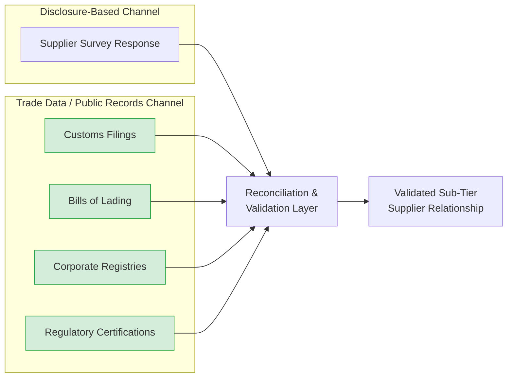

## Trade Data and Public Records as Sub-Tier Discovery Sources

### Core Concept

Trade data and public records constitute an **independent, disclosure-free channel** for discovering sub-tier supplier relationships. Unlike survey-based methods, which depend on a supplier's willingness and ability to self-report, these sources rely on data that is generated as a natural byproduct of cross-border commerce, corporate governance, and regulatory compliance — making them observable regardless of whether any party in the chain intends to reveal the relationship.

### Categories of Trade Data

**Key Points**

- **Customs/import-export filings**: Government-mandated declarations filed when goods cross international borders, typically including shipper, consignee, product classification (e.g., Harmonized System/HS codes), quantity, weight, and value.
- **Bills of lading**: Shipping documents issued by ocean/air/land carriers, often containing more granular shipment-level detail (specific consignee names, product descriptions, port of origin/destination) than aggregated customs statistics.
- **Vessel/container tracking data**: AIS (Automatic Identification System) vessel position data combined with port call records, useful for inferring shipment timing and corroborating bill-of-lading claims.
- **Aggregated commercial trade databases**: Third-party data providers compile, clean, and cross-reference raw customs/shipping records into searchable, standardized databases, often adding entity resolution (matching company name variants to a single canonical entity).

### Categories of Public Records

**Key Points**

- **Corporate registry and ownership filings**: Government business registries disclosing legal entity names, registered addresses, and often parent/subsidiary ownership structures.
- **Financial filings and disclosures**: Public company filings (e.g., annual reports, regulatory disclosures) that may name major suppliers or customers, particularly where customer/supplier concentration is a material risk factor requiring disclosure.
- **Regulatory certification records**: Filings required for regulated products (aerospace parts certification, medical device manufacturer registration, automotive safety component certification) that often name the manufacturing facility and responsible legal entity.
- **Environmental and industrial permits**: Facility-level permits (emissions permits, industrial operating licenses) that can confirm the existence, location, and sometimes production capacity of a specific manufacturing site.
- **Litigation and regulatory enforcement records**: Court filings, regulatory enforcement actions, and dispute records can incidentally reveal supplier relationships, especially in contract disputes or product liability cases.

### Structural Diagram: Trade Data as Independent Verification Layer

### Strengths of Trade Data and Public Records

**Key Points**

- **Independence from supplier cooperation**: These sources exist regardless of whether a Tier 1 or Tier 2 supplier chooses to disclose the relationship, making them uniquely valuable for validating or challenging self-reported data, and for filling gaps where disclosure is refused or incomplete.
- **Objectivity**: Since the data is generated by regulatory/commercial processes rather than voluntary reporting, it is less subject to the incentive distortions that can affect self-disclosure (e.g., a supplier downplaying a risky single-source dependency).
- **Historical trend visibility**: Trade data accumulated over time can reveal shifts in sourcing patterns (e.g., a sudden change in shipment origin country) that may signal an undisclosed supplier change worth investigating.
- **Scalability**: Once aggregated and structured by a data provider, trade data can be queried computationally across thousands of part numbers or supplier relationships simultaneously, unlike manual survey follow-up.

### Limitations and Interpretive Challenges

**Key Points**

- **Product-level ambiguity**: Customs classification codes (e.g., HS codes) typically describe broad product categories rather than specific part numbers, meaning a confirmed shipment between two companies does not necessarily confirm which specific component is involved.
- **Entity name variation and shell structures**: The same physical facility may transact under multiple legal entity names (subsidiaries, trading arms, distributors), requiring entity resolution work before trade data can be reliably mapped to a known supplier node.
- **Incomplete or inconsistent jurisdictional coverage**: [Inference] The degree of public availability and granularity of customs/trade data varies substantially by country, with some jurisdictions publishing detailed shipment-level records and others treating similar data as restricted or aggregated only at a national statistical level — meaning global coverage from any single data source is typically uneven.
- **Domestic-only transactions are invisible**: Trade/customs data by definition only captures relationships involving a cross-border shipment; a Tier 2 and Tier 3 supplier located in the same country will not generate customs records, requiring reliance on other data sources (corporate registries, site visits, disclosure) for domestic-only sub-tier links.
- **Time lag**: Depending on the data provider and jurisdiction, trade data may be published with a delay (weeks to months) relative to when the actual shipment occurred, limiting its usefulness for real-time disruption response relative to direct supplier communication.

### Example: Combining Trade Data with Public Records for Discovery

**Example**

A focal firm suspects that its Tier 2 electronics distributor sources a critical chip from an undisclosed Tier 3 fab. An analyst might:

1. Query aggregated customs data for inbound shipments to the Tier 2 distributor's known facility address, filtering by the relevant HS code category for semiconductor components.
2. Identify a small number of candidate shipping origins (specific ports/countries) with shipment volumes consistent with the Tier 2's known production output.
3. Cross-reference candidate origin facilities against public regulatory certification records (e.g., a facility's export license or industry safety certification), which may name the specific manufacturing entity.
4. Corroborate the finding by checking corporate ownership filings to confirm whether the candidate facility is independently owned or shares ownership with an already-known supplier, revealing potential hidden concentration.
5. Where possible, validate the inferred relationship directly with the Tier 1 or Tier 2, framed as a shared risk-mitigation exercise, before relying on it for formal risk-management decisions.

### Best-Practice Use as a Complement, Not a Replacement

**Key Points**

- Trade data and public records are most effective when used to **validate, corroborate, or fill gaps in** disclosure-based data, rather than as a wholly standalone source of truth, given their product-level ambiguity and jurisdictional coverage limitations.
- Discrepancies between self-disclosed data and independently inferred trade-data relationships should be treated as a **flag for further investigation** rather than an automatic assumption that the supplier misrepresented information — genuine data quality issues, entity-naming mismatches, and outdated survey responses are common causes of apparent discrepancies.
- [Inference] Organizations with mature N-tier mapping programs commonly combine both channels systematically (disclosure plus independent trade-data cross-validation) rather than relying on either exclusively, given the well-documented complementary strengths and weaknesses of each.

### Related Topics

- Techniques for Identifying Tier 2 and Tier 3 Suppliers
- Supplier Disclosure, Surveys, and Contractual Visibility Clauses
- What N-Tier Mapping Is and Why It Matters
- Technology Platforms for Automated Supply Chain Mapping
- Concentration Risk and Shared Sub-Tier Chokepoints
- Entity Resolution and Corporate Ownership Analysis
- Conflict Minerals and Responsible Sourcing Disclosure Requirements