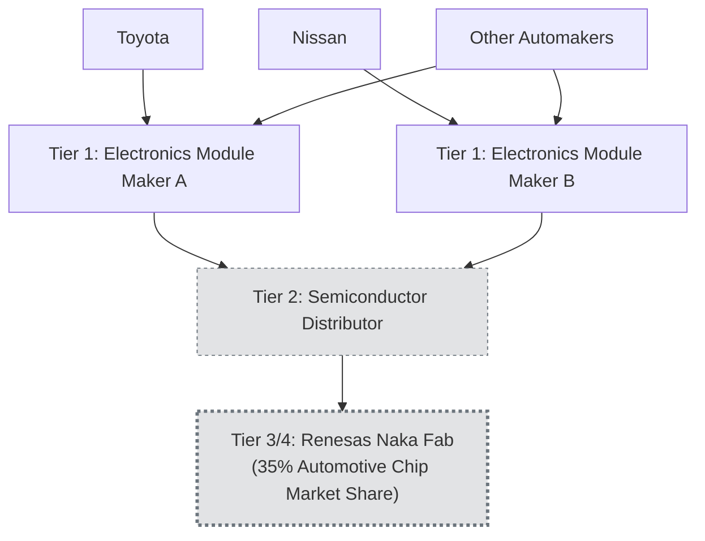

## Case Studies in Sub-Tier Disruption and Visibility Gaps

### Core Concept

Historical disruption events provide the empirical foundation for the visibility-gap arguments developed throughout N-tier mapping theory. Each case below illustrates a common pattern: a disruption at a sub-tier node (typically Tier 2, 3, or 4) that was **largely or entirely invisible to affected downstream focal firms**, resulting in production impact that was disproportionate to the affected firms' formal awareness of the dependency beforehand.

### Case Study 1: Renesas Naka Factory Fire (2021) — Automotive Semiconductor Sector

**Key Points**

- On March 19, 2021, a fire broke out in the N3 building (300mm wafer production line) at Renesas's Naka factory in Hitachinaka, Japan, caused by overcurrent igniting plating equipment casing, burning approximately 600 square meters, roughly 5% of the cleanroom area of that buildingat 2:47 am in their N3 Building (300mm line) of Renesas Semiconductor Manufacturing Co., Ltd The burn area extended approximately 600m², or about 5% of the cleanroom area (12000m²) of the N3 Building. [siliconexpert](https://www.siliconexpert.com/blog/fire-halts-production-for-chipmaker-renesas)[siliconexpert](https://www.siliconexpert.com/blog/fire-halts-production-for-chipmaker-renesas)
- Renesas controlled about 35 percent of the market for automotive semiconductors at the time, with other sources citing Renesas as the world's No. 2 automotive chip supplier, controlling around a 20% global share in microcontrollers, supplying Toyota Motor and Nissan Motor directly and indirectly. [techxplore](https://techxplore.com/news/2021-03-renesas-threatens-deepen-global-chip.html)[caixinglobal](https://www.caixinglobal.com/2021-03-22/chip-starved-automakers-shudder-at-renesas-plants-one-month-halt-101678670.html)
- Critically, an estimated two-thirds of the wafers produced in that building were used in automotive production, yet most automotive OEMs and even many Tier 1 suppliers had no direct commercial relationship with Renesas — the chips typically flowed through Tier 1 electronics module makers and Tier 2 semiconductor distributors, making the ultimate fab dependency largely invisible at the OEM level. [fusionww](https://info.fusionww.com/de/blog/fire-at-renesas-plant-affecting-automotive-chips-mosfets-and-more)
- A car is made from around 30,000 parts, and automakers hold almost no inventories of their own, relying on distributor inventories that could provide only two to three months of buffer — illustrating how thin buffers combined with poor sub-tier visibility compound disruption severity. [caixinglobal](https://www.caixinglobal.com/2021-03-22/chip-starved-automakers-shudder-at-renesas-plants-one-month-halt-101678670.html)[caixinglobal](https://www.caixinglobal.com/2021-03-22/chip-starved-automakers-shudder-at-renesas-plants-one-month-halt-101678670.html)
- The disruption compounded pre-existing shortages: the industry was already battling a global semiconductor shortage and had been affected by a Texas winter storm that knocked out production at NXP Semiconductors and Infineon Technologies, the world's No. 1 and No. 3 automotive chip suppliers, demonstrating how concentration risk (a small number of dominant chokepoint suppliers) amplifies the impact of independent, geographically dispersed disruptions occurring close together in time. [caixinglobal](https://www.caixinglobal.com/2021-03-22/chip-starved-automakers-shudder-at-renesas-plants-one-month-halt-101678670.html)
- Recovery estimates diverged sharply from initial company guidance: Renesas initially hoped to restore operations within a month, but analysts suggested it could take closer to three months to restore capacity, and Renesas was reported to need approximately 100 days to fully restore the cleanroom and resume operations — with full supply chain normalization estimated to take even longer given multi-stage semiconductor fabrication processes. [techxplore](https://techxplore.com/news/2021-03-renesas-threatens-deepen-global-chip.html)[fusionww](https://info.fusionww.com/de/blog/fire-at-renesas-plant-affecting-automotive-chips-mosfets-and-more)

### Case Study Pattern Comparison Table

| Case | Disrupted Node (Tier) | Visibility Gap | Key Structural Lesson |
| --- | --- | --- | --- |
| Renesas Naka fire (2021) | Tier 3/4 wafer fab | OEMs had no direct relationship; dependency routed through Tier 1 modules and Tier 2 distributors | Chokepoint concentration (35% automotive chip market share) massively amplifies single-facility disruption |
| 2011 Thailand floods (referenced in prior topic) | Tier 2/3 component manufacturing cluster | Geographic concentration in flood-affected industrial estates invisible to brand-level sourcing diversification | Geographic clustering creates shared risk even across nominally different suppliers |
| 2011 Tōhoku earthquake (referenced in prior topic) | Tier 2/3 specialty chemical/electronics suppliers | Regional concentration of niche material producers unknown to most downstream OEMs | Highly specialized, low-substitutability inputs can originate from a very small number of facilities |

### Structural Diagram: The Renesas Case Visibility Chain

Multiple automakers, believing themselves diversified through distinct Tier 1 relationships, were simultaneously exposed to the identical Tier 3/4 chokepoint — the defining signature of a hidden concentration risk event as discussed in earlier topics.

### Common Structural Lessons Across Cases

**Key Points**

- **Thin inventory buffers amplify visibility gaps into production impact**: Just-in-time manufacturing philosophies, which minimize held inventory to reduce carrying cost, mean that even a short disruption at an invisible sub-tier node can rapidly cascade into finished-goods production halts once distributor/pipeline inventory is exhausted.
- **Recovery timelines are frequently underestimated at the outset**: In the Renesas case, initial one-month recovery guidance expanded to multi-month estimates as the complexity of semiconductor fabrication recovery became clearer — a pattern common across sub-tier disruption events, since downstream firms and even the affected supplier itself often lack full insight into second-order recovery complexity.
- **Compounding/correlated disruptions are common, not rare**: The Renesas fire occurred while the industry was already absorbing impacts from a separate weather-related disruption affecting different chip suppliers, illustrating that chokepoint risk analysis should account for the possibility of near-simultaneous, independent shocks across a concentrated supplier base.
- **Post-disruption response often includes ad hoc direct engagement bypassing normal tiers**: [Inference] In major disruption events of this kind, it is common for downstream firms and even government bodies to engage directly with the affected sub-tier facility despite lacking a formal contractual relationship (as seen in patterns of automaker and government support offered directly to Renesas), reflecting the "directed sourcing"/direct-management dynamic covered in earlier topics — though the precise scope of such interventions varies by event and jurisdiction.

### Implications for N-Tier Mapping Practice

**Key Points**

- These cases collectively support the core rationale for prioritized critical-BOM mapping (covered in a prior topic): dependencies on dominant, high-market-share sub-tier suppliers in single-source-prone categories (advanced semiconductor fabrication, specialty chemicals) warrant deep mapping investment specifically because chokepoint concentration in these categories is empirically well-documented, not merely theoretical.
- The recurring pattern of OEMs having no direct visibility into fab-level dependencies reinforces the argument for combining disclosure-based Tier 1/2 surveys with independent trade-data and market-share analysis (as covered in prior topics), since Tier 1 self-disclosure alone would be unlikely to surface a Tier 3/4 fab dependency shared with dozens of unrelated downstream customers.
- [Inference] Post-2021 semiconductor shortage experience appears to have accelerated adoption of formal N-tier mapping and semiconductor-specific chokepoint monitoring within the automotive industry specifically, though the durability and industry-wide consistency of this shift would require more recent, sector-specific verification.

### Related Topics

- Concentration Risk and Shared Sub-Tier Chokepoints
- What N-Tier Mapping Is and Why It Matters
- Prioritizing Critical Bill-of-Materials Coverage Over Full Mapping
- Trade Data and Public Records as Sub-Tier Discovery Sources
- Just-In-Time Inventory Philosophy and Buffer Stock Trade-offs
- Semiconductor Industry Supply Chain Structure
- Directly Managed versus Indirectly Managed Tiers