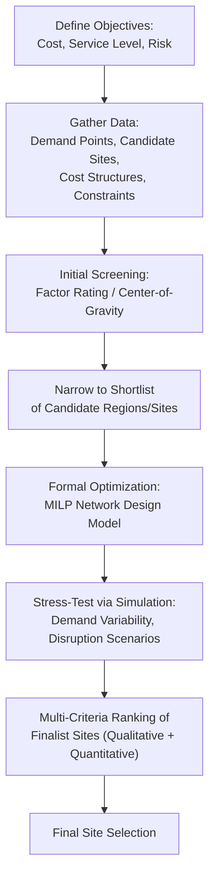

## Facility Location Decision Frameworks

### Core Concept

Facility location decision frameworks are structured analytical methodologies used to determine **where** to site supply chain facilities — manufacturing plants, distribution centers, warehouses, cross-docks — in order to optimize a combination of cost, service level, and risk objectives. These decisions are typically long-horizon and capital-intensive, making the choice of framework and the quality of underlying data critical, since poor facility location decisions are costly and slow to reverse.

### Categories of Facility Location Frameworks

**Key Points**

- **Factor rating (weighted scoring) models**: Qualitative-to-semi-quantitative methods that score candidate locations against a weighted list of criteria (labor cost, labor availability, infrastructure quality, tax incentives, proximity to markets/suppliers, regulatory environment).
- **Center-of-gravity models**: Quantitative methods that compute an optimal facility location as a weighted average of demand-point coordinates, weighted by shipment volume or demand quantity, minimizing aggregate transportation distance/cost.
- **Mathematical optimization models**: Formal operations-research approaches (mixed-integer linear programming) that simultaneously optimize facility location, capacity allocation, and flow assignment across a full network, subject to constraints (capacity limits, service-level requirements, demand satisfaction).
- **Simulation-based approaches**: Discrete-event or Monte Carlo simulation models used to evaluate candidate network configurations under demand uncertainty, disruption scenarios, or variable lead times, complementing the more deterministic optimization approaches.
- **Multi-criteria decision analysis (MCDA)**: Structured frameworks (e.g., Analytic Hierarchy Process) for formally combining multiple, often conflicting, qualitative and quantitative criteria into a single comparative ranking across candidate sites.

### Factor Rating Model — Mechanics

**Key Points**

- Decision-makers identify a set of relevant location factors (e.g., labor cost, transportation access, proximity to customers, energy cost, regulatory/tax environment, workforce skill availability).
- Each factor is assigned a weight reflecting its relative importance, with weights typically summing to 1 (or 100).
- Each candidate location is scored against each factor (often on a 1–10 or 1–100 scale), and a weighted composite score is computed:

$$S_j = \sum_{i=1}^{n} w_i \cdot r_{ij}$$

where $S_j$ is the composite score for candidate location $j$, $w_i$ is the weight of factor $i$, and $r_{ij}$ is the rating of location $j$ on factor $i$.

**Example**

| Factor | Weight | Site A Score | Site B Score | Site C Score |
| --- | --- | --- | --- | --- |
| Labor cost | 0.25 | 7 | 9 | 6 |
| Transportation access | 0.20 | 8 | 6 | 9 |
| Proximity to customers | 0.20 | 9 | 5 | 7 |
| Regulatory/tax environment | 0.15 | 6 | 8 | 7 |
| Workforce availability | 0.20 | 7 | 7 | 8 |
| **Weighted Total** |  | **7.55** | **6.95** | **7.35** |

Under this illustrative scoring, Site A would be selected on a factor-rating basis, though the method's simplicity means it should typically be paired with more rigorous quantitative validation for high-capital decisions.

### Center-of-Gravity Model — Mechanics

**Key Points**

- Computes the geographic coordinate that minimizes total weighted transportation distance to a set of known demand points (customers, markets, or existing facilities), using the formula:

$$X^* = \frac{\sum_{i=1}^{n} X_i \cdot W_i}{\sum_{i=1}^{n} W_i}, \quad Y^* = \frac{\sum_{i=1}^{n} Y_i \cdot W_i}{\sum_{i=1}^{n} W_i}$$

where $X_i, Y_i$ are the coordinates of demand point $i$, and $W_i$ is its associated demand/volume weight.

- This method is computationally simple and useful as a **first-pass screening tool** to identify a general geographic region of interest, but it has notable limitations: it assumes straight-line (Euclidean) distance rather than actual road/rail network distance, ignores fixed facility costs and capacity constraints, and does not account for multiple candidate facilities interacting with each other's service territories.
- [Inference] In practice, the center-of-gravity result is typically used to narrow a search to a general region, after which more granular criteria (actual site availability, zoning, labor market specifics) determine the final selection within that region, rather than being treated as a precise, final answer.

### Mathematical Optimization Models

**Key Points**

- **Mixed-Integer Linear Programming (MILP)** formulations are the standard approach for formal network design optimization, typically structured as a **facility location problem** with binary decision variables indicating whether a facility is opened at a candidate location, combined with continuous flow variables representing shipment quantities between nodes.
- A simplified objective function structure:

$$\min \sum_{j} f_j y_j + \sum_{i,j} c_{ij} x_{ij}$$

subject to capacity, demand-satisfaction, and single-assignment constraints, where $y_j$ is a binary variable indicating whether facility $j$ is opened, $f_j$ is its fixed cost, $x_{ij}$ is the flow from facility $j$ to demand point $i$, and $c_{ij}$ is the per-unit transportation cost.

- Common variants include the **capacitated facility location problem** (facilities have finite throughput capacity), the **uncapacitated facility location problem** (simplifying assumption of unlimited capacity), and multi-echelon extensions that simultaneously optimize plant, distribution center, and last-mile facility locations together.
- These models can incorporate service-level constraints (e.g., maximum allowable distance/time to serve a given percentage of demand), multiple product types, and multiple time periods to reflect phased network build-out.

### Decision Framework Process Diagram

### Key Decision Criteria Categories

| Category | Example Factors |
| --- | --- |
| **Cost factors** | Land/construction cost, labor cost, energy cost, tax incentives, transportation cost to markets/suppliers |
| **Market access factors** | Proximity to key customers, population density, market growth trends |
| **Supply access factors** | Proximity to key raw material or component suppliers, port/rail/highway access |
| **Labor factors** | Workforce availability, skill level, unionization rates, labor cost trends |
| **Risk factors** | Political stability, natural disaster exposure, currency risk, regulatory volatility |
| **Regulatory/incentive factors** | Free trade zone status, tax abatements, environmental permitting complexity |
| **Infrastructure factors** | Utility reliability (power, water), telecommunications, road/rail/port capacity |

### Multi-Criteria Decision Analysis (MCDA) Approaches

**Key Points**

- The **Analytic Hierarchy Process (AHP)** is a widely referenced formal MCDA method that structures a decision into a hierarchy of criteria and sub-criteria, uses pairwise comparisons to derive relative weights, and produces a mathematically consistent overall ranking of alternatives — offering more rigor than simple factor-rating weight assignment.
- MCDA approaches are particularly useful when decision criteria include a mix of quantitative (cost, distance) and difficult-to-quantify qualitative factors (political stability perception, cultural fit, brand/reputational considerations), which pure optimization models struggle to incorporate directly.
- [Inference] In large-scale corporate site-selection processes, a combination of quantitative optimization (to identify cost-efficient candidate configurations) and MCDA/qualitative judgment (to make the final selection among near-equivalent quantitative options) is a commonly described best practice, since purely quantitative models cannot fully capture organizational, political, or strategic considerations relevant to a final decision.

### Incorporating Risk and Resilience into Location Decisions

**Key Points**

- Modern facility location frameworks increasingly incorporate **disruption risk** as an explicit decision criterion rather than treating location purely as a cost/service optimization, reflecting lessons from concentration risk and chokepoint case studies covered in earlier topics.
- Techniques include scenario-based stress testing (evaluating network performance under simulated regional disruptions), diversification constraints (limiting the share of total capacity sited within a single region or country), and dual-facility strategies (deliberately siting redundant capacity across geographically uncorrelated risk zones).
- [Speculation] There is some indication that geopolitical and trade-policy volatility in recent years has elevated the relative weight given to risk/resilience factors versus pure cost-minimization in facility location decisions for some industries, though the extent and permanence of this shift across industries broadly is not fully established.

### Related Topics

- Center-of-Gravity and Network Optimization Modeling
- Mixed-Integer Linear Programming for Supply Chain Design
- Multi-Echelon Inventory and Distribution Network Design
- Vertical Integration versus Horizontal Specialization
- Concentration Risk and Shared Sub-Tier Chokepoints
- Reshoring, Friend-Shoring, and Supply Chain Reconfiguration
- Analytic Hierarchy Process and Multi-Criteria Decision Analysis