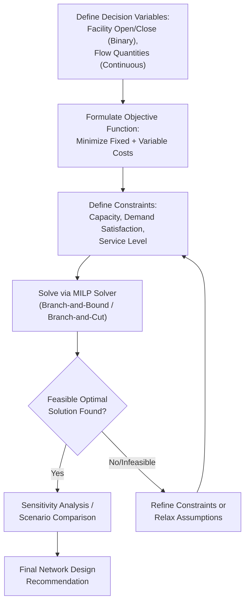

## Network Optimization Using Linear and Mixed-Integer Programming

### Core Concept

Linear Programming (LP) and Mixed-Integer Programming (MIP/MILP) are the foundational mathematical optimization techniques used to design and configure supply chain networks — determining facility locations, capacity allocations, and flow assignments that minimize total cost (or maximize service/profit) subject to a system of linear constraints. These methods formalize network design as a constrained optimization problem solvable by dedicated algorithms, rather than relying on heuristic or manual scenario comparison alone.

### Linear Programming Fundamentals

**Key Points**

- **Linear Programming** optimizes a linear objective function subject to linear equality and inequality constraints, over continuous decision variables.
- The general form:

$$\min \; c^T x \quad \text{subject to} \quad Ax \le b, \; x \ge 0$$

where $x$ is the vector of decision variables (e.g., shipment quantities between nodes), $c$ is the cost coefficient vector, and $A$, $b$ define the constraint system (capacity limits, demand satisfaction requirements).

- Pure LP is well-suited to problems where decisions are inherently continuous and divisible, such as **transportation and flow allocation problems**: given a fixed, already-determined set of facilities, how should flow be routed between them to minimize total transportation cost while satisfying capacity and demand constraints.
- LP problems are solved efficiently by algorithms such as the **Simplex method** or **interior-point methods**, and are guaranteed to find a global optimum given the problem's convexity, unlike many heuristic approaches.

### The Classic Transportation Problem

**Example**

A canonical LP formulation in supply chain network design is the transportation problem: given a set of supply nodes (factories) with known capacities and a set of demand nodes (distribution centers or customers) with known requirements, determine the shipment quantity $x_{ij}$ from each supply node $i$ to each demand node $j$ that minimizes total transportation cost:

$$\min \sum_{i} \sum_{j} c_{ij} x_{ij}$$

subject to:

$$\sum_{j} x_{ij} \le S_i \; \forall i \quad \text{(supply constraints)}$$

$$\sum_{i} x_{ij} \ge D_j \; \forall j \quad \text{(demand constraints)}$$

$$x_{ij} \ge 0$$

where $S_i$ is the supply capacity of node $i$ and $D_j$ is the demand requirement of node $j$.

### Why Mixed-Integer Programming Is Needed for Network Design

**Key Points**

- Pure LP cannot natively represent **discrete "yes/no" decisions**, such as whether to open a facility at a given candidate location — a facility either exists or it does not; there is no meaningful concept of "half opening" a warehouse.
- **Mixed-Integer Linear Programming (MILP)** extends LP by introducing binary or integer decision variables alongside continuous variables, enabling the model to jointly optimize discrete facility-opening decisions and continuous flow-allocation decisions within a single unified formulation.
- This joint optimization is essential because facility location and flow allocation are interdependent: the optimal flow pattern depends on which facilities are open, while the optimal facility-opening decision depends on the resulting flow costs — solving these sequentially rather than jointly can produce meaningfully suboptimal network designs.

### Capacitated Facility Location Problem (CFLP) Formulation

**Key Points**

- The Capacitated Facility Location Problem is a standard MILP formulation combining binary facility-opening variables with continuous flow variables:

$$\min \sum_{j} f_j y_j + \sum_{i} \sum_{j} c_{ij} x_{ij}$$

subject to:

$$\sum_{j} x_{ij} = D_i \; \forall i \quad \text{(demand satisfaction)}$$

$$\sum_{i} x_{ij} \le K_j y_j \; \forall j \quad \text{(capacity linked to facility opening)}$$

$$y_j \in \{0,1\}, \quad x_{ij} \ge 0$$

where $y_j$ is a binary variable equal to 1 if facility $j$ is opened (0 otherwise), $f_j$ is the fixed cost of opening facility $j$, $K_j$ is its capacity, $c_{ij}$ is the unit transportation cost from facility $j$ to demand point $i$, and $D_i$ is demand at point $i$.

- The capacity constraint's structure ($x_{ij}$ bounded by $K_j y_j$) is the key mechanism linking the discrete and continuous decisions: if $y_j = 0$ (facility closed), the constraint forces all flow from that facility to zero; if $y_j = 1$, flow is permitted up to the facility's capacity.

### Common Extensions to the Base Model

| Extension | Purpose |
| --- | --- |
| **Multi-echelon formulation** | Simultaneously optimizes multiple network layers (plants → distribution centers → customers) rather than a single flow layer |
| **Multi-period formulation** | Incorporates a planning horizon with multiple time periods, allowing phased facility openings/closures as demand evolves |
| **Multi-product formulation** | Extends flow variables to be indexed by product type, accommodating different products with different volumes, costs, or facility compatibility |
| **Single-sourcing constraints** | Restricts each demand point to be served by only one facility (rather than split across multiple), often for operational simplicity, at the cost of some flexibility |
| **Service-level/distance constraints** | Adds constraints ensuring a specified percentage of demand is served within a maximum distance/time threshold |
| **Risk-aware/robust formulations** | Incorporates disruption scenarios or demand uncertainty directly into the optimization (e.g., stochastic programming, robust optimization variants) |

### Network Design Optimization Workflow

### Solution Methods and Computational Considerations

**Key Points**

- MILP problems are solved using algorithms such as **branch-and-bound** and **branch-and-cut**, which systematically explore the solution space by relaxing integer constraints (solving the LP relaxation), then branching on fractional integer variables until an integer-feasible optimal solution is found.
- Commercial and open-source solvers (e.g., Gurobi, CPLEX, open-source alternatives such as CBC or HiGHS) implement highly optimized versions of these algorithms, and are typically accessed via modeling languages or libraries (e.g., Python's PuLP, Pyomo, or direct solver APIs) rather than implemented from scratch.
- **Computational complexity**: MILP problems are, in general, NP-hard, meaning solve time can grow exponentially with problem size in the worst case; large-scale, real-world network design problems (many candidate facilities, many demand points, multiple products/periods) often require problem-specific formulation refinements, valid inequalities, or decomposition techniques (e.g., Benders decomposition) to achieve tractable solve times.
- [Inference] In industry practice, exact optimal solutions are often accepted with a small optimality gap (e.g., solver-reported gap of a few percent) rather than solved to full mathematical optimality, since the marginal solution-quality improvement from additional solve time frequently becomes impractical for large-scale real-world instances.

### Practical Application Example

**Example**

A retailer redesigning its distribution network might formulate a two-echelon capacitated facility location model where:

- Candidate distribution center (DC) locations are represented by binary opening variables.
- Flow variables represent shipment quantities from factories to candidate DCs, and from DCs to regional demand clusters.
- Constraints enforce DC capacity limits, require all customer demand to be met, and impose a service-level constraint that at least a specified percentage of demand must be served within a maximum transit time.
- The objective minimizes total fixed DC operating costs plus all transportation costs across both echelons.

Running this model across multiple demand-growth scenarios (e.g., current demand, a moderate-growth projection, a high-growth projection) allows the retailer to compare candidate network configurations and identify designs that perform robustly across scenarios rather than optimizing narrowly for a single point forecast.

### Limitations and Complementary Techniques

**Key Points**

- MILP models require **accurate, well-structured input data** (cost coefficients, capacity figures, demand forecasts); model output quality is fundamentally bounded by input data quality, per the standard "garbage in, garbage out" caveat applicable to all optimization approaches.
- Pure deterministic MILP models do not natively capture uncertainty; **stochastic programming** and **robust optimization** extensions exist specifically to incorporate demand or cost uncertainty, at the cost of significantly increased model complexity and computational burden.
- MILP network design is typically complemented by, rather than replacing, simulation-based stress-testing (evaluating a chosen network design's performance under disruption scenarios) and qualitative multi-criteria judgment, as covered in the facility location frameworks discussion, since optimization models capture quantifiable cost/service trade-offs but may not fully represent softer strategic or risk considerations.

### Related Topics

- Facility Location Decision Frameworks
- Multi-Echelon Inventory and Distribution Network Design
- Stochastic Programming and Robust Optimization Under Uncertainty
- Center-of-Gravity and Network Optimization Modeling
- Branch-and-Bound and Branch-and-Cut Algorithms
- Benders Decomposition for Large-Scale Optimization