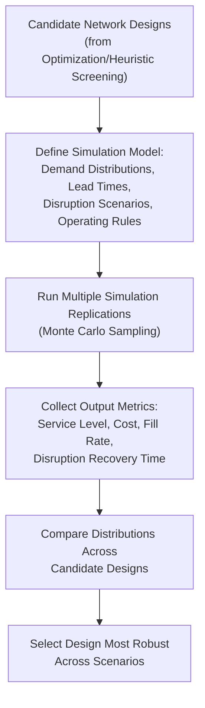

## Heuristic and Simulation-Based Network Design

### Core Concept

Heuristic and simulation-based approaches to supply chain network design serve as **complements to, and practical substitutes for, exact mathematical optimization** (LP/MILP) when problems become too large, too uncertain, or too complex in behavioral detail for exact methods to solve tractably or realistically. Where MILP guarantees a mathematically optimal solution for a well-defined deterministic problem, heuristics trade a guarantee of optimality for computational speed and scalability, while simulation trades analytical tractability for the ability to model realistic stochastic and dynamic system behavior.

### Why Heuristics and Simulation Are Needed

**Key Points**

- **Computational intractability**: As problem size grows (many candidate facilities, many products, many time periods), exact MILP solve times can become impractically long, even with modern solvers, particularly for real-time or frequently-repeated decision-making needs.
- **Modeling realistic uncertainty and dynamics**: MILP formulations are fundamentally most natural for deterministic, static, or simplified stochastic representations; capturing realistic time-varying demand, stochastic lead times, queueing effects, and complex operational rules (e.g., specific dispatching or inventory policies) is often more naturally handled through simulation.
- **Non-linear or complex behavioral relationships**: Some real-world cost or service relationships are non-linear, discontinuous, or depend on complex interacting rules that resist clean linear/mixed-integer formulation, making simulation-based evaluation more practical.
- **Rapid scenario exploration**: Heuristics and simulation models are often faster to run repeatedly across many "what-if" scenarios, supporting iterative exploratory analysis rather than a single formal optimization run.

### Heuristic Methods for Network Design

**Key Points**

- **Greedy/constructive heuristics**: Build a solution incrementally by making locally optimal choices at each step (e.g., opening the facility that reduces total cost the most at each iteration), without guaranteeing global optimality but often producing reasonable solutions quickly.
- **Local search / improvement heuristics**: Start from an initial feasible solution and iteratively apply small modifications (e.g., swap which facility serves a given demand point, or toggle a facility open/closed) to improve the objective, stopping when no further local improvement is found.
- **Metaheuristics**: Higher-level heuristic frameworks designed to escape local optima and search more broadly across the solution space, including:
  - **Genetic algorithms**: Evolve a population of candidate network configurations through selection, crossover, and mutation operations analogous to biological evolution.
  - **Simulated annealing**: Accepts occasional worse solutions with a probability that decreases over time (analogous to a cooling process), allowing escape from local optima early in the search.
  - **Tabu search**: Maintains a memory of recently visited solutions to avoid cycling back to them, encouraging exploration of new regions of the solution space.
  - **Particle swarm optimization**: Models candidate solutions as particles moving through the solution space, influenced by their own best-found position and the best position found by the swarm collectively.
- [Inference] Metaheuristics are generally chosen over simpler greedy/local-search heuristics specifically for large, complex network design problems where solution quality matters enough to justify the additional implementation and tuning complexity, though the specific choice among metaheuristic variants is often problem- and practitioner-dependent rather than governed by a single dominant standard.

### Heuristic Approach Trade-off Summary

| Method Type | Solution Quality | Computational Speed | Implementation Complexity |
| --- | --- | --- | --- |
| Greedy/constructive | Lower (no optimality guarantee) | Very fast | Low |
| Local search | Moderate (can get stuck in local optima) | Fast | Low-Medium |
| Genetic algorithms | Moderate-High | Moderate | Medium-High |
| Simulated annealing | Moderate-High | Moderate | Medium |
| Tabu search | Moderate-High | Moderate | Medium-High |
| Exact MILP | Guaranteed optimal (if solved to completion) | Slow for large problems | Medium (given solver tooling) |

### Simulation-Based Network Design

**Key Points**

- **Discrete-event simulation (DES)**: Models the supply chain as a sequence of discrete events (order arrival, shipment departure, inventory replenishment) occurring at specific points in simulated time, capturing queueing, variability, and operational rule interactions realistically.
- **Monte Carlo simulation**: Repeatedly samples random variables (demand, lead time, disruption occurrence) from specified probability distributions to generate a distribution of possible outcomes for a given network configuration, rather than a single deterministic result.
- **Agent-based simulation**: Models individual entities (suppliers, distribution centers, transportation modes) as autonomous agents following defined behavioral rules, allowing emergent system-level behavior to arise from local agent interactions — useful for modeling complex, decentralized decision-making across a multi-tier network.
- Simulation is typically used to **evaluate and stress-test** a small number of candidate network designs (often shortlisted via a prior optimization or heuristic screening step) under realistic variability and disruption scenarios, rather than to search the full space of possible network configurations directly.

### Simulation Process Flow

### Combining Optimization, Heuristics, and Simulation

**Key Points**

- A common practical workflow uses **exact or heuristic optimization to generate a small set of promising candidate network configurations**, then uses **simulation to stress-test and validate** those candidates under realistic stochastic conditions that the optimization model may have simplified or ignored.
- This hybrid approach leverages the complementary strengths of each method: optimization efficiently searches a large combinatorial solution space to identify promising candidates, while simulation provides a higher-fidelity evaluation of a manageable shortlist under realistic uncertainty.
- [Inference] Purely optimization-driven network designs that are not subsequently stress-tested via simulation risk being "optimal" only under the simplified deterministic assumptions of the optimization model, and may perform less robustly than expected once realistic variability and disruption risk are introduced — this is a commonly cited rationale for the hybrid workflow rather than relying on optimization alone.

### Example: Hybrid Workflow in Practice

**Example**

A consumer goods company redesigning its distribution network might:

1. Use a capacitated facility location MILP model to generate the top three candidate network configurations that minimize expected total cost under a base-case demand forecast.
2. Build a discrete-event simulation model incorporating realistic order-arrival variability, transportation lead-time variability, and a set of scripted regional disruption scenarios (e.g., a simulated port closure or regional weather event).
3. Run each of the three candidate configurations through the simulation across many replications, collecting distributions of service level, total cost, and disruption recovery time for each.
4. Select the final network design not purely on lowest expected cost, but based on an acceptable balance of expected cost and downside risk (e.g., the 95th-percentile worst-case service-level outcome across simulated disruption scenarios).

This approach explicitly incorporates risk/resilience considerations that a purely deterministic optimization model would not surface on its own.

### Limitations of Heuristic and Simulation Approaches

**Key Points**

- Heuristics provide **no formal guarantee of solution optimality**, meaning the final network design could, in principle, be meaningfully worse than the true mathematical optimum, particularly for poorly-tuned or inappropriately-chosen heuristic methods.
- Simulation models require careful **validation and calibration** against real-world data (e.g., historical demand variability, actual observed lead-time distributions); a simulation built on poorly calibrated input distributions can produce misleading conclusions despite appearing methodologically rigorous.
- Both approaches generally require greater specialized modeling expertise to implement well compared to simpler factor-rating or center-of-gravity screening methods, representing a real trade-off in required organizational capability versus analytical rigor.

### Related Topics

- Network Optimization Using Linear and Mixed-Integer Programming
- Facility Location Decision Frameworks
- Stochastic Programming and Robust Optimization Under Uncertainty
- Discrete-Event and Agent-Based Simulation Modeling
- Multi-Echelon Inventory and Distribution Network Design
- Genetic Algorithms and Metaheuristic Optimization Methods