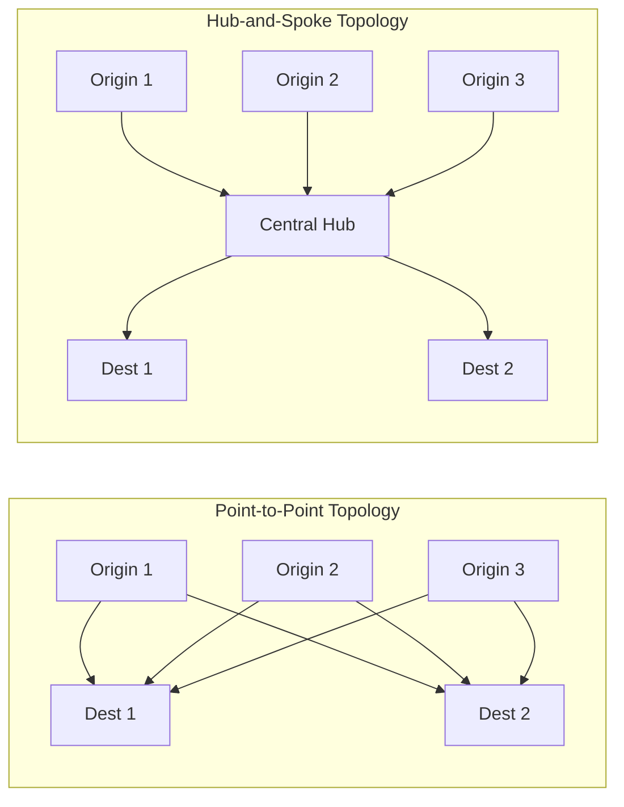
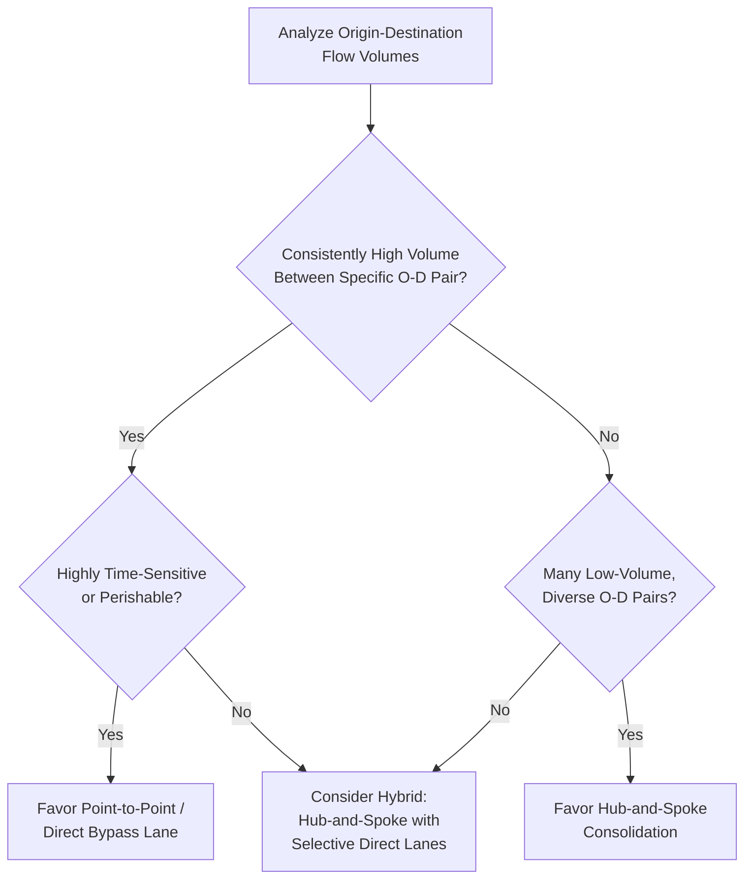

## Hub-and-Spoke versus Point-to-Point Network Topologies

### Core Concept

Hub-and-spoke and point-to-point represent two fundamentally different **topological structures** for organizing the flow of goods, information, or transportation between origin and destination nodes in a supply chain or logistics network. The choice between them involves a core trade-off between **consolidation efficiency** and **direct-routing speed/simplicity**.

- **Point-to-Point (P2P)**: Every origin node connects directly to every destination node it serves, with no intermediate consolidation point.
- **Hub-and-Spoke (H&S)**: Flows are routed through one or more central hub facilities, where shipments from multiple origins are consolidated, sorted, and redistributed toward final destinations.

### Structural Comparison

$$\text{P2P connections required} = n \times m$$

$$\text{Hub-and-Spoke connections required} = n + m$$

where $n$ is the number of origin nodes and $m$ is the number of destination nodes. This illustrates the core mathematical rationale for hub-and-spoke designs: as the number of nodes grows, the number of required direct connections in a point-to-point network grows multiplicatively, while a hub-and-spoke network's connection requirement grows only additively.

### Structural Diagram

### Comparative Trade-off Table

| Dimension | Point-to-Point | Hub-and-Spoke |
| --- | --- | --- |
| Number of connections needed | Grows multiplicatively ($n \times m$) | Grows additively ($n + m$) |
| Transportation cost per shipment | Higher (low consolidation, more partial loads) | Lower (consolidated full loads between hub and spokes) |
| Transit time (single shipment) | Faster (direct route, no intermediate stop) | Slower (extra handling/sorting at hub, potential indirect routing) |
| Network complexity to manage | High (many distinct routes/relationships) | Lower (fewer distinct routes to manage) |
| Flexibility to add new nodes | Requires new direct connections for each pairing | Only requires connecting new node to existing hub(s) |
| Single point of failure risk | Low (failures are localized to one route) | Higher (hub disruption affects all routes through it) |
| Suitability for low-volume/high-variety flows | Poor (uneconomical without consolidation) | Good (consolidation makes low individual volumes economical) |
| Suitability for high-volume, stable, direct flows | Good (direct routing justified by volume) | May add unnecessary handling/delay |

### When Hub-and-Spoke Is Favored

**Key Points**

- **Low-density, high-variety flow patterns**: When individual origin-destination volumes are too small to economically justify dedicated direct transportation capacity, consolidating multiple smaller flows at a hub allows full-truckload/full-container economics to be achieved on the hub-to-spoke legs.
- **Networks with many nodes**: As the number of origin and destination points grows, the combinatorial explosion of required direct connections in a point-to-point design becomes operationally unmanageable, favoring the additive scaling of hub-and-spoke.
- **Sortation and value-added processing needs**: Hubs can serve not merely as transshipment points but as locations for sorting, labeling, quality inspection, or light assembly/postponement operations that add value during the consolidation stop.
- **Classic examples**: Air cargo and passenger airline networks, parcel/package delivery networks (e.g., overnight courier services), and less-than-truckload (LTL) freight networks are frequently structured around hub-and-spoke principles specifically because they aggregate many low-volume, high-variety shipment flows.

### When Point-to-Point Is Favored

**Key Points**

- **High, stable volume between specific origin-destination pairs**: When shipment volume between a given origin and destination is consistently high enough to fill a full truckload or container on its own, consolidation at an intermediate hub adds unnecessary cost, handling, and transit time without offsetting benefit.
- **Time-sensitive or perishable goods**: Direct routing avoids the additional transit time and handling risk introduced by an intermediate hub stop, which matters disproportionately for products with short shelf life or urgent delivery requirements.
- **Reduced handling/damage risk**: Each additional touch point (loading, unloading, sorting) at a hub introduces incremental risk of damage, loss, or error; point-to-point minimizes total touches for a given shipment.
- **Classic examples**: Dedicated truckload freight between a major factory and a major distribution center with consistently high volume, or direct vessel routes between two major ports with sufficient stable cargo volume, often bypass hub consolidation.

### Hybrid and Intermediate Topologies

**Key Points**

- **Multi-hub networks**: Rather than a single central hub, some networks use multiple regional hubs, balancing some of the consolidation benefit of hub-and-spoke with reduced average distance/transit time compared to a single-hub design, at the cost of somewhat higher network complexity.
- **Hub-and-spoke with direct bypass lanes**: A common practical hybrid where the majority of low-volume flows are routed through hubs, but specific high-volume origin-destination pairs are given dedicated direct ("bypass") lanes that skip hub consolidation entirely, capturing the benefit of point-to-point routing specifically where volume justifies it.
- **Milk-run/multi-stop routing**: An intermediate approach where a single vehicle makes multiple sequential stops (picking up or dropping off at several nodes along a route) rather than either a single direct point-to-point trip or full hub consolidation, often used for supplier pickup or in-market distribution.
- [Inference] Most large-scale real-world logistics networks (e.g., major parcel carriers, large retail distribution networks) employ hybrid designs combining hub-and-spoke for the bulk of variable, lower-volume flow with direct bypass lanes for high-volume specific lanes, rather than adopting a pure form of either topology exclusively — though the exact mix is company- and network-specific.

### Decision Framework Diagram

### Example: Parcel Delivery Network Design

**Example**

A parcel delivery company receives shipments from thousands of individual senders destined for thousands of individual recipients across a wide geography, with any single sender-recipient pair typically representing only one or a few packages per day — far too low a volume to justify direct transportation. The company instead routes packages through a hub-and-spoke design: local pickup facilities feed into regional sortation hubs, which consolidate volume onto high-capacity transportation legs (e.g., line-haul trucks or cargo aircraft) between hubs, before packages are broken down and distributed to local delivery routes at the destination hub. This structure allows the network to achieve efficient transportation utilization despite the extremely fragmented, low-volume nature of any individual shipment lane — the defining justification for hub-and-spoke topology.

### Risk and Resilience Considerations

**Key Points**

- Hub-and-spoke designs concentrate risk: a disruption at a central hub (e.g., a major sortation facility outage, a severe weather event at a hub airport) can simultaneously affect a large share of total network flow, since so many origin-destination paths depend on that single consolidation point — a topological parallel to the sub-tier chokepoint concentration risk covered in earlier topics.
- Multi-hub designs and selective direct bypass lanes are common mitigation strategies, reducing dependence on any single hub and providing some resilience against localized hub disruption.
- [Inference] The risk-concentration trade-off inherent in hub-and-spoke topology is analogous in structure, though distinct in origin, to the supplier concentration risk discussed in the N-tier mapping chapter — both arise from deliberately concentrating flow through a small number of nodes to capture efficiency gains, at the cost of increased vulnerability to disruption at those specific nodes.

### Related Topics

- Facility Location Decision Frameworks
- Concentration Risk and Shared Sub-Tier Chokepoints
- Network Optimization Using Linear and Mixed-Integer Programming
- Multi-Echelon Inventory and Distribution Network Design
- Less-Than-Truckload (LTL) and Freight Consolidation Strategies
- Milk-Run and Multi-Stop Routing Design