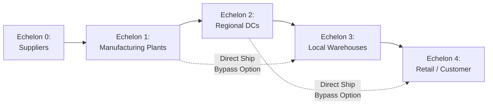
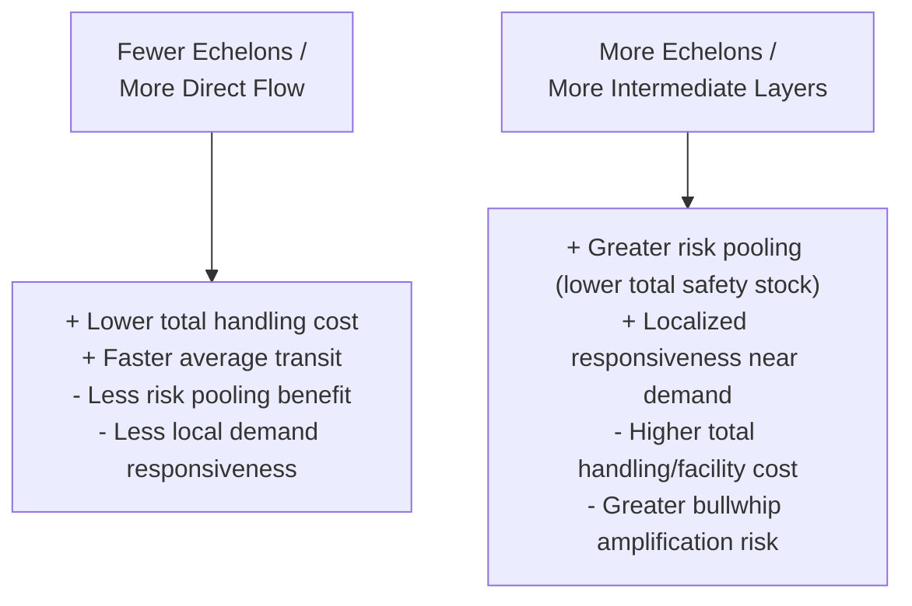

## Multi-Echelon Network Structures

### Core Concept

A multi-echelon network structure organizes a supply chain into multiple sequential layers, or **echelons**, of facilities (e.g., plants → regional distribution centers → local warehouses → retail/customer points), with inventory and material flowing through each layer in sequence before reaching final demand. Multi-echelon design and planning explicitly account for the **interdependencies between echelons** — decisions at one layer (inventory policy, capacity, location) affect performance and optimal decisions at adjacent layers — distinguishing it from single-echelon analysis, which optimizes each layer independently and can produce systematically suboptimal overall network performance.

### Typical Echelon Structure

**Key Points**

- **Echelon 0 (Raw material/supplier tier)**: Upstream supply sources feeding into manufacturing.
- **Echelon 1 (Manufacturing/Plants)**: Facilities producing finished or semi-finished goods.
- **Echelon 2 (Central/Regional Distribution Centers)**: Facilities consolidating output from one or more plants and holding buffer inventory before onward distribution.
- **Echelon 3 (Local Distribution Centers/Warehouses)**: Facilities positioned closer to final demand, often serving a defined regional territory.
- **Echelon 4 (Retail/Point of Sale or End Customer)**: The final consumption point where demand is realized.
- Not every supply chain uses all echelon layers; simpler networks may compress several of these into fewer physical layers (e.g., shipping directly from a central DC to retail, skipping a regional DC layer), while complex global networks may include additional intermediate layers (e.g., port consolidation hubs, cross-docks).

### Structural Diagram

The dashed lines represent common bypass flows, where a multi-echelon network permits certain products or orders to skip intermediate layers (e.g., direct-to-consumer shipment from a plant or central DC) when doing so is more efficient for specific demand patterns.

### Why Echelon Interdependency Matters

**Key Points**

- **Inventory positioning trade-offs**: Holding inventory further upstream (closer to manufacturing) pools variability across a broader downstream demand base, reducing total safety stock needed system-wide, but increases the time and transportation required to fulfill any individual downstream demand — a form of the classic **risk pooling** principle.
- **The bullwhip effect**: Multi-echelon networks are the classic setting in which demand variability is amplified as orders propagate upstream through successive echelons, since each echelon typically orders based on its own local forecast and order-batching logic rather than true end-customer demand, distorting the signal seen by upstream echelons.
- **Local optimization can be globally suboptimal**: If each echelon independently optimizes its own inventory or ordering policy without considering the impact on adjacent echelons, the resulting system-wide performance (total cost, total inventory, aggregate service level) is generally inferior to a jointly-optimized multi-echelon policy — a foundational insight motivating dedicated multi-echelon inventory optimization methods.

### Multi-Echelon Inventory Optimization

**Key Points**

- **Multi-Echelon Inventory Optimization (MEIO)** is a class of quantitative methods that jointly determine safety stock and reorder policies across all echelons simultaneously, explicitly accounting for how inventory positioning at one echelon affects the required inventory at adjacent echelons.
- A core principle is that safety stock should be positioned at the echelon (or "decoupling point") that provides the best trade-off between responsiveness and pooling benefit, rather than each echelon independently accumulating its own local safety stock buffer — over-buffering at every echelon compounds into excess system-wide inventory without proportional service benefit.
- MEIO models typically require characterizing demand variability, lead-time variability, and desired service levels at each echelon and using this to compute jointly optimal reorder points and order quantities across the network, often via specialized software given the mathematical complexity of solving these interdependent stochastic inventory problems analytically at scale.

### Common Multi-Echelon Network Configurations

| Configuration | Description | Typical Use Case |
| --- | --- | --- |
| **Serial (linear) structure** | Each echelon feeds only into the next single downstream echelon in a strict sequence | Simple, single-channel product flows |
| **Arborescent (tree/divergent) structure** | A single upstream node feeds multiple downstream nodes, which may further branch | Central DC serving multiple regional DCs, each serving multiple local warehouses |
| **Convergent (assembly) structure** | Multiple upstream nodes feed into a single downstream node | Multiple component suppliers feeding a single final assembly plant |
| **General network (mixed)** | Combination of divergent and convergent flows across the network, potentially with multiple paths between any given origin-destination pair | Complex global manufacturing and distribution networks with cross-shipping options |

### Decoupling Points and Postponement

**Key Points**

- The **decoupling point** (or order penetration point) is the location in a multi-echelon network where a product transitions from forecast-driven (make-to-stock) production/positioning to order-driven (make-to-order) fulfillment.
- Positioning the decoupling point further upstream (closer to raw materials) increases flexibility to customize the final product late in the process (a strategy known as **postponement**) but generally increases total lead time to fulfill an individual customer order; positioning it further downstream reduces customer lead time but reduces flexibility and increases forecast risk on finished-goods inventory.
- Multi-echelon network design decisions (how many echelons, where inventory is held, where the decoupling point sits) are therefore deeply interconnected with a firm's broader competitive strategy around lead time, product variety, and forecast accuracy.

### Multi-Echelon Design Trade-off Diagram

### Example: Multi-Echelon Redesign Scenario

**Example**

A consumer electronics company currently operates a three-echelon network (plants → national DC → regional DCs), with each regional DC independently setting its own safety stock based on local historical demand variability. Analysis reveals excessive aggregate inventory system-wide, driven by each regional DC over-buffering independently against demand variability that, when pooled at the national DC level, is actually much less variable in relative terms (a direct consequence of the statistical risk-pooling principle). A multi-echelon inventory optimization exercise might recommend shifting a greater share of safety stock to the national DC echelon, supplying regional DCs more frequently with smaller buffer quantities, reducing total system-wide inventory while maintaining or improving overall service levels — illustrating the core value proposition of treating echelons jointly rather than independently.

### Related Topics

- Hub-and-Spoke versus Point-to-Point Network Topologies
- The Bullwhip Effect Across Tiered Structures
- Multi-Echelon Inventory Optimization Methods
- Risk Pooling and Safety Stock Positioning
- Postponement Strategy and Decoupling Point Design
- Network Optimization Using Linear and Mixed-Integer Programming
- Facility Location Decision Frameworks