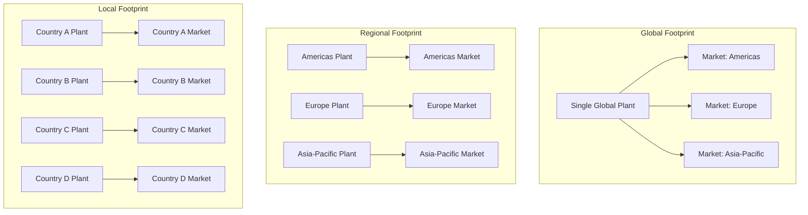
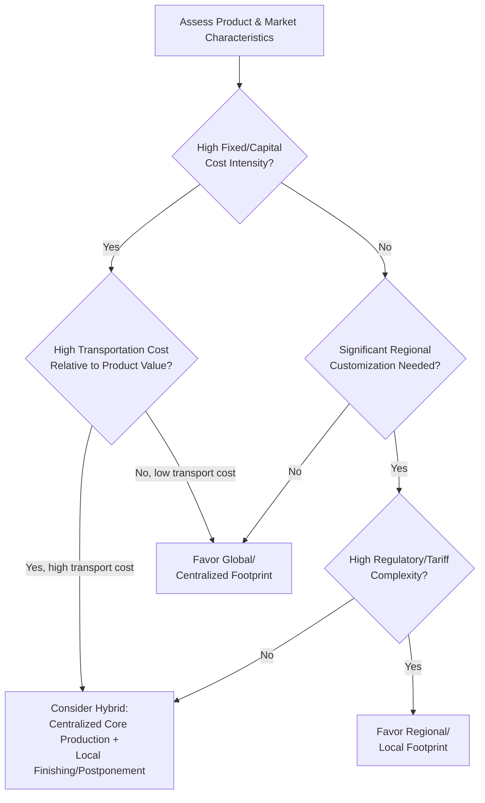

## Designing for Global, Regional, and Local Footprints

### Core Concept

Footprint design is the strategic decision of **how geographically distributed** a supply chain's manufacturing and distribution assets should be — ranging from a small number of large, centralized global facilities to a larger number of smaller, geographically dispersed regional or local facilities. This is a distinct but related decision from facility location (where specific sites go) and network topology (how nodes connect); footprint design addresses the **scale and geographic granularity** of the network as a whole.

### The Core Trade-off: Centralization vs. Localization

**Key Points**

- **Global/centralized footprint**: A small number of large-scale facilities (often one or a few per major world region, or even globally) serving broad geographic territories, capturing significant economies of scale in production and inventory pooling.
- **Regional footprint**: An intermediate structure with dedicated facilities per major economic region (e.g., North America, Europe, Asia-Pacific), balancing some scale economies with improved regional responsiveness and reduced cross-border logistics complexity.
- **Local footprint**: A larger number of smaller facilities positioned close to end demand within individual countries or sub-national markets, maximizing responsiveness and minimizing last-mile lead time and transportation cost, at the expense of scale economies.

$$\text{Total Network Cost} = \text{Fixed Facility Costs} + \text{Production/Handling Costs} + \text{Transportation Costs} + \text{Inventory Holding Costs}$$

Centralization tends to reduce the first two cost components (fewer, larger facilities capture scale economies) while increasing the latter two (longer average transportation distances, and less risk-pooling benefit realized locally when inventory must still be held forward to meet local service requirements) — the footprint decision is fundamentally about where the minimum of this aggregate cost function lies given a firm's specific cost structure and service requirements.

### Comparative Footprint Table

| Dimension | Global/Centralized | Regional | Local |
| --- | --- | --- | --- |
| Scale economies | Highest | Moderate | Lowest |
| Transportation cost to end markets | Highest (longest average distance) | Moderate | Lowest |
| Responsiveness/lead time to local demand | Slowest | Moderate | Fastest |
| Exposure to single-region disruption | High (concentrated risk) | Moderate | Low (distributed risk) |
| Regulatory/tariff/customs complexity | Higher (more cross-border flows) | Moderate | Lower (more in-region/in-country flow) |
| Inventory pooling benefit | Highest | Moderate | Lowest |
| Capital investment required | Lower (fewer, larger facilities) | Moderate | Higher (more facilities, more duplicated capacity) |
| Product customization/localization capability | Lower | Moderate | Higher |

### Structural Diagram

### Key Drivers Favoring a Global/Centralized Footprint

**Key Points**

- **High fixed facility/capital costs**: Industries with capital-intensive manufacturing (e.g., semiconductor fabrication, large-scale chemical processing) benefit disproportionately from concentrating capital investment into fewer, larger, more efficient facilities rather than duplicating high fixed costs across many smaller regional plants.
- **Low product variety/high standardization**: Products requiring little regional customization can be efficiently produced centrally and shipped globally without needing local production flexibility.
- **Low transportation cost relative to product value**: High-value, low-bulk products (e.g., semiconductors, precision instruments) can absorb longer-distance transportation costs as a small fraction of total product value, reducing the penalty for centralization.
- **Strong risk-pooling benefit from demand variability**: Products with highly variable, poorly-correlated regional demand patterns benefit more from centralized inventory pooling, since centralization allows demand variability across regions to partially offset rather than requiring independent local safety stock in each region.

### Key Drivers Favoring a Regional or Local Footprint

**Key Points**

- **High transportation cost relative to product value**: Bulky, heavy, or low-value-density products (e.g., beverages, bulk building materials) incur transportation costs that quickly erode the benefit of centralized production, favoring production closer to end demand.
- **Regulatory, tariff, and trade-policy considerations**: Import tariffs, local content requirements, and trade-policy volatility can make local or regional production economically or strategically preferable to importing from a centralized global facility, particularly in regions with significant trade barriers.
- **Need for product localization**: Products requiring meaningful regional customization (different specifications, languages, regulatory compliance variants, taste/preference adaptation) often require local or regional production/finishing capability rather than fully centralized production.
- **Service-level and lead-time requirements**: Markets with demanding delivery-time expectations may require local or regional inventory positioning that a purely centralized global footprint cannot support without excessive expedited transportation cost.
- **Risk diversification and resilience**: Distributing production across multiple regions reduces exposure to any single region's disruption risk (natural disaster, geopolitical instability, trade-policy shock), directly paralleling the concentration-risk concerns discussed in earlier N-tier mapping topics but applied to owned/controlled facilities rather than suppliers.
- **Currency risk management**: Producing within a region where sales occur ("natural hedging") reduces exposure to currency fluctuation risk relative to producing centrally in one currency zone and selling globally across multiple currency zones.

### Footprint Decision Framework

### Hybrid Footprint Strategies

**Key Points**

- **Centralized core production with local/regional finishing (postponement)**: A common hybrid strategy where capital-intensive, standardized core production remains centralized to capture scale economies, while final customization, packaging, or light assembly occurs at regional or local facilities closer to demand — directly connecting footprint design to the decoupling point concept covered in multi-echelon network structures.
- **Regional footprints with cross-region flexibility**: Maintaining regional production capability while retaining the option to ship across regions during localized demand surges or supply disruptions, balancing normal-state regional efficiency with disruption-state flexibility.
- **Follow-the-market localization over time**: Firms sometimes begin with a centralized global footprint during early growth stages (when regional demand volume does not yet justify dedicated local capacity), then progressively localize production as regional demand scales sufficiently to justify dedicated investment.

### Example: Automotive Industry Footprint Evolution

**Example**

Global automakers have historically evolved toward largely regional (rather than purely global or purely local) manufacturing footprints: vehicles sold in a given major market (e.g., North America, Europe, China) are frequently manufactured within or near that same region, reflecting the combined influence of high transportation cost relative to vehicle value/bulk, substantial local content and tariff requirements in the automotive sector in many jurisdictions, and the need for some degree of regional model/specification variation — while certain highly specialized, lower-volume components (e.g., specific electronic modules or advanced powertrain components) may still be sourced from more centralized global production given their different cost/customization profile. [Inference] The specific balance between regional vehicle assembly and globally centralized component sourcing varies considerably by automaker, platform, and evolving trade-policy conditions, and should be verified against current company-specific disclosures for any detailed analysis.

### Related Topics

- Facility Location Decision Frameworks
- Vertical Integration versus Horizontal Specialization
- Multi-Echelon Network Structures
- Postponement Strategy and Decoupling Point Design
- Reshoring, Friend-Shoring, and Supply Chain Reconfiguration
- Currency Risk and Natural Hedging in Global Operations
- Concentration Risk and Shared Sub-Tier Chokepoints