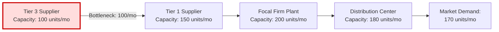
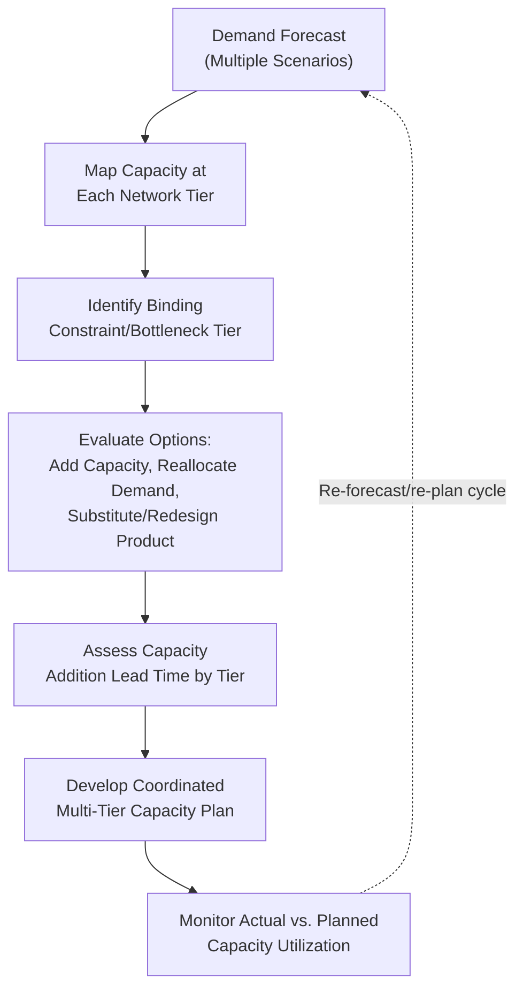

## Capacity Planning Across Network Tiers

### Core Concept

Capacity planning across network tiers is the process of determining the **appropriate production, storage, and throughput capacity** at each echelon/tier of a supply chain network, while explicitly accounting for how capacity constraints at one tier interact with and constrain performance at adjacent tiers. Unlike single-facility capacity planning, this discipline treats capacity as a **networked resource allocation problem**, since a bottleneck at any single tier can constrain the effective throughput of the entire chain regardless of how much excess capacity exists elsewhere.

### The Bottleneck Principle

**Key Points**

- In a sequential multi-tier network, the **effective throughput capacity of the entire chain is bounded by its most constrained tier** (the bottleneck), regardless of how much surplus capacity exists at other tiers — a direct application of the Theory of Constraints as applied to supply networks.

$$\text{Effective Network Throughput} = \min(C_1, C_2, \ldots, C_n)$$

where $C_i$ is the effective capacity of tier $i$.

- This principle implies that capacity investment at non-bottleneck tiers generally does not improve overall network throughput, and can represent wasted capital if not carefully coordinated with bottleneck-tier capacity — a common capacity-planning pitfall when tiers are planned independently rather than jointly.

### Capacity Planning Dimensions Across Tiers

| Tier | Capacity Dimension | Typical Planning Horizon |
| --- | --- | --- |
| Raw material/Tier 3+ suppliers | Extraction/processing throughput, often externally controlled | Long (years) — often outside focal firm's direct control |
| Tier 1/Tier 2 component suppliers | Manufacturing throughput, tooling capacity | Medium-long (1–3+ years for major capacity additions) |
| Focal firm manufacturing plants | Production line throughput, shift capacity, equipment capacity | Medium (months to years) |
| Distribution centers/warehouses | Storage capacity, throughput (pick/pack/ship rate) | Short-medium (months) |
| Transportation | Fleet/carrier capacity, mode availability | Short (weeks to months), though structural mode capacity is longer-term |

### Structural Diagram: Capacity Interdependency Across Tiers

In this illustrative example, despite the focal firm's plant having 200 units/month capacity and market demand reaching 170 units/month, the entire network's effective output is capped at 100 units/month by the Tier 3 supplier — demonstrating why capacity planning must extend beyond the focal firm's own facilities to be meaningful.

### Capacity Planning Challenges Specific to Multi-Tier Networks

**Key Points**

- **Limited visibility into upstream tier capacity**: As established in the N-tier mapping discussion, focal firms often have poor visibility into Tier 2+ supplier capacity, making it difficult to identify where the true network bottleneck lies without deliberate investigation.
- **Capacity lead times vary drastically by tier**: Adding capacity at a semiconductor fab (Tier 3/4) may require multi-year lead time for new facility construction and equipment qualification, while adding warehouse capacity may be achievable within months — meaning coordinated capacity planning must account for highly asymmetric response times across tiers.
- **Demand allocation across shared capacity**: When an upstream supplier's capacity is shared across multiple downstream customers (a common scenario at concentrated chokepoint tiers, as discussed in concentration risk topics), capacity planning must also account for competitive allocation dynamics — a focal firm's effective available capacity depends not only on the supplier's total capacity but on its own negotiated allocation share relative to other customers.
- **Capacity flexibility and fungibility**: Some capacity is flexible (can be reallocated across products or customers with minimal cost/delay), while other capacity is highly specific (dedicated tooling, qualified only for a specific part) — flexible capacity provides more resilience to demand shifts but often at higher unit cost or lower peak efficiency than dedicated capacity.

### Capacity Planning Methods

**Key Points**

- **Rough-cut capacity planning (RCCP)**: A high-level, aggregate check of whether a proposed production plan is feasible given known bottleneck resource capacities, typically used early in planning cycles before detailed scheduling.
- **Capacity Requirements Planning (CRP)**: A more detailed method that translates a Material Requirements Planning (MRP)-generated production schedule into time-phased capacity requirements at each work center or facility, identifying specific periods of capacity shortfall or surplus.
- **Theory of Constraints (TOC)-based approaches**: Focus planning effort specifically on identifying and managing the system's current bottleneck (the "constraint"), following the principle that improving non-constraint resources yields little system-wide benefit until the constraint itself is addressed or shifted.
- **Scenario-based capacity stress testing**: Evaluating network capacity adequacy under multiple demand scenarios (base case, high-growth, disruption-reduced-capacity) to identify capacity plans that perform acceptably across a range of plausible futures rather than only under a single point forecast.

### Capacity Planning Process Flow

### Strategies for Managing Cross-Tier Capacity Constraints

**Key Points**

- **Long-term capacity commitments and take-or-pay contracts**: Focal firms may negotiate advance capacity reservations or minimum-purchase commitments with critical upstream suppliers (particularly at concentrated chokepoint tiers) to secure guaranteed allocation ahead of anticipated demand growth, especially where upstream capacity lead times are long.
- **Dual-sourcing and capacity diversification**: Qualifying multiple suppliers at a constrained tier reduces dependency on any single supplier's capacity ceiling, though this must be weighed against the qualification cost and potential loss of volume-based pricing leverage with a single supplier.
- **Demand shaping and allocation prioritization**: When upstream capacity constraints are binding, firms may prioritize allocation of constrained input to their highest-margin or most strategically important products/customers, effectively managing demand to fit available capacity rather than assuming capacity will always meet unconstrained demand.
- **Capacity buffer/safety capacity**: Deliberately maintaining some capacity headroom above expected average demand at critical tiers, to absorb demand variability or short-term disruptions without immediately becoming the binding constraint — analogous in principle to safety stock but applied to throughput capacity rather than inventory.
- [Inference] The appropriate size of a capacity buffer is generally understood as a trade-off between the cost of underutilized capacity in normal periods and the cost of lost sales/service failures during demand or supply variability, though the specific optimal buffer size is highly context- and industry-dependent and typically requires quantitative analysis specific to the firm's cost structure.

### Example: Capacity Planning in a Semiconductor-Dependent Industry

**Example**

An electronics manufacturer forecasts strong demand growth for a product line but identifies, through supply chain mapping, that its critical semiconductor input is sourced from a Tier 3 fab already operating near full capacity utilization across its full customer base (a chokepoint concentration scenario, as covered in earlier topics). Recognizing that fab capacity expansion may require a multi-year lead time, the firm might respond by: (1) negotiating an advance capacity reservation or long-term supply agreement with the fab, ahead of competitors making similar requests; (2) simultaneously qualifying a second-source semiconductor supplier at a different fab to diversify capacity dependency; and (3) redesigning the product where feasible to use a less capacity-constrained alternative component for lower-priority product variants, freeing constrained capacity allocation for higher-priority variants. This illustrates how capacity planning across tiers often requires coordinated action spanning contractual, sourcing, and product-design levers simultaneously, rather than capacity planning being treated as a purely internal, single-facility exercise.

### Related Topics

- Concentration Risk and Shared Sub-Tier Chokepoints
- Multi-Echelon Network Structures
- What N-Tier Mapping Is and Why It Matters
- Theory of Constraints and Bottleneck Management
- Single-Sourcing vs. Dual-Sourcing Strategy
- Designing for Global, Regional, and Local Footprints
- Network Optimization Using Linear and Mixed-Integer Programming