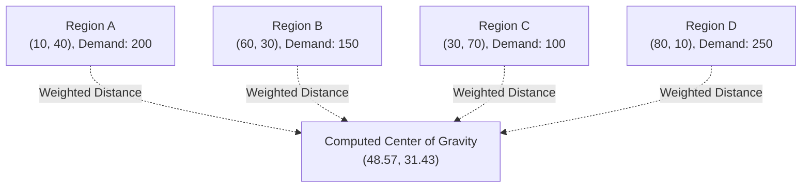

## Gravity Models and Center-of-Gravity Analysis

### Core Concept

Gravity models and center-of-gravity analysis are quantitative techniques for identifying an optimal facility location based on the geographic distribution and weighted magnitude (volume, demand, or cost) of the points a facility must serve. The name derives from an analogy to physical center-of-mass calculations: just as a physical system's center of gravity is the weighted average position of its constituent masses, a logistics network's "center of gravity" is the weighted average position of its demand or supply points, weighted by shipment volume or cost.

### The Center-of-Gravity Formula

**Key Points**

- The method computes an optimal coordinate location $(X^*, Y^*)$ that minimizes total weighted transportation distance (or cost) to a set of $n$ known points:

$$X^* = \frac{\sum_{i=1}^{n} X_i \cdot W_i}{\sum_{i=1}^{n} W_i}, \quad Y^* = \frac{\sum_{i=1}^{n} Y_i \cdot W_i}{\sum_{i=1}^{n} W_i}$$

where $X_i, Y_i$ are the coordinates (often latitude/longitude or a projected planar coordinate system) of demand/supply point $i$, and $W_i$ is the weight associated with that point — typically shipment volume, demand quantity, or a cost-adjusted volume metric.

- This formula computes a simple weighted average of coordinates, analogous to computing a physical center of mass, and can be solved with basic arithmetic without requiring specialized optimization software, making it an accessible first-pass analytical tool.

### Worked Example

**Example**

A company needs to determine an approximate central distribution point to serve four customer regions with known demand volumes:

| Region | X Coordinate | Y Coordinate | Demand (Weight) |
| --- | --- | --- | --- |
| A | 10 | 40 | 200 |
| B | 60 | 30 | 150 |
| C | 30 | 70 | 100 |
| D | 80 | 10 | 250 |

Applying the formula:

$$X^* = \frac{(10)(200) + (60)(150) + (30)(100) + (80)(250)}{200+150+100+250} = \frac{2000+9000+3000+20000}{700} = \frac{34000}{700} \approx 48.57$$

$$Y^* = \frac{(40)(200) + (30)(150) + (70)(100) + (10)(250)}{700} = \frac{8000+4500+7000+2500}{700} = \frac{22000}{700} \approx 31.43$$

The computed center of gravity, approximately $(48.57, 31.43)$, represents the coordinate that minimizes total weighted distance to the four demand points, given their respective volumes — note that the result is pulled toward Region D, which carries the highest demand weight, illustrating how the method naturally favors proximity to higher-volume points.

### Structural Diagram

### Gravity Models Beyond Simple Center-of-Gravity

**Key Points**

- **Retail gravity models (Huff Model / Reilly's Law of Retail Gravitation)**: A related but distinct family of models, originally developed in retail location theory, that estimate the probability a customer at a given location will patronize a particular facility, based on the facility's attractiveness (often modeled as size or assortment) divided by a function of distance — conceptually borrowing the inverse-relationship structure of Newtonian gravity (attraction proportional to mass, inversely related to distance).
- **Huff Model formulation** (illustrative form):

$$P_{ij} = \frac{A_j / D_{ij}^{\lambda}}{\sum_{k} A_k / D_{ik}^{\lambda}}$$

where $P_{ij}$ is the probability a customer at location $i$ chooses facility $j$, $A_j$ is a measure of facility $j$'s attractiveness, $D_{ij}$ is the distance between $i$ and $j$, and $\lambda$ is a distance-decay parameter calibrated from observed data.

- While center-of-gravity analysis is used primarily for **facility siting** (where to build), retail gravity models are used primarily for **demand estimation and market-share prediction** (how much demand a facility at a given location will capture) — a complementary but analytically distinct application within the broader "gravity model" family.

### Key Assumptions and Limitations

**Key Points**

- **Euclidean (straight-line) distance assumption**: The basic center-of-gravity formula assumes straight-line distance between points, which does not account for actual road, rail, or shipping network routing, terrain obstacles, or infrastructure limitations — meaning the computed "optimal" point may not correspond to an actual feasible or optimal site once real transportation networks are considered.
- **No consideration of fixed facility costs**: The method optimizes only for weighted transportation distance/cost and does not account for facility construction cost, land price, labor cost, or other location-specific fixed costs that vary significantly across candidate regions — a computed center-of-gravity point in an economically unsuitable or infeasible location (e.g., a body of water, a location with no available land) provides no practical guidance on its own.
- **No capacity or multi-facility interaction modeling**: The basic method assumes a single facility serving all demand points; it does not natively address scenarios where multiple facilities interact (each serving a subset of demand), which is the more realistic scenario handled by MILP-based facility location models.
- **Static, single-period assumption**: The method uses a snapshot of demand weights and does not account for demand growth, seasonality, or shifts over time, which may cause an initially optimal location to become suboptimal as demand patterns evolve.
- [Inference] Because of these limitations, center-of-gravity analysis is generally best used as a **rapid, low-cost first-pass screening tool** to identify a general geographic region of interest, rather than as the final basis for a capital-intensive facility investment decision — more rigorous methods (MILP optimization, simulation stress-testing, qualitative site-specific due diligence) are typically applied to refine the final site selection within the identified region.

### Extensions to Address Basic Limitations

| Extension | Addresses Limitation |
| --- | --- |
| **Weighted by transportation cost rather than raw distance** | Better approximates actual cost impact, especially when different points have different per-mile shipping rates |
| **Road-network distance substitution** | Replaces Euclidean distance with actual routable road/rail distance for more realistic results |
| **Iterative/multiple center-of-gravity for multi-facility networks** | Approximates a multi-facility solution by iteratively clustering demand points and recomputing centers for each cluster |
| **Combination with MILP facility location models** | Uses center-of-gravity output as an initial candidate region, then applies formal optimization for final site and multi-facility allocation decisions |

### Comparison to Other Location Methods

| Method | Best Used For | Key Limitation |
| --- | --- | --- |
| Center-of-gravity | Rapid single-facility geographic screening | Ignores fixed costs, capacity, real-road distances |
| Factor rating | Incorporating qualitative and semi-quantitative site criteria | Subjective weighting; not purely optimization-driven |
| MILP facility location | Formal multi-facility, capacity-constrained optimization | Requires more data and computational setup |
| Retail gravity models (Huff-type) | Estimating demand capture/market share at candidate sites | Requires calibration data on customer choice behavior |

### Related Topics

- Facility Location Decision Frameworks
- Network Optimization Using Linear and Mixed-Integer Programming
- Designing for Global, Regional, and Local Footprints
- Retail Location Theory and Market Area Analysis
- Heuristic and Simulation-Based Network Design
- Multi-Echelon Network Structures