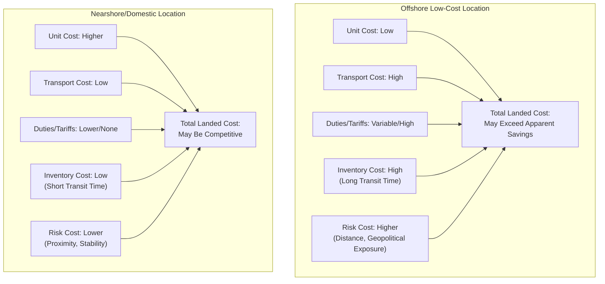

## Total Landed Cost in Location Decisions

### Core Concept

Total Landed Cost (TLC) is a comprehensive cost metric that aggregates **every cost incurred in getting a product from its point of origin to its final destination**, extending well beyond the unit purchase price or manufacturing cost alone. In facility location decisions, TLC analysis prevents the common error of comparing candidate locations based only on obvious, visible costs (labor, unit production cost) while overlooking substantial hidden costs (logistics, duties, inventory carrying cost, risk-related costs) that can reverse an apparently favorable location decision once fully accounted for.

### Total Landed Cost Formula

$$TLC = C_{\text{unit}} + C_{\text{transport}} + C_{\text{duties/tariffs}} + C_{\text{inventory}} + C_{\text{overhead}} + C_{\text{risk}}$$

where each component represents a distinct cost category that must be estimated and summed to arrive at the true comparative cost of sourcing or manufacturing from a given location.

### Component Breakdown

**Key Points**

- **Unit production/purchase cost ($C_{\text{unit}}$)**: The base manufacturing or procurement cost per unit at the origin location — the cost most commonly compared in naive location analysis, and often the primary driver of apparent cost advantage for low-labor-cost regions.
- **Transportation cost ($C_{\text{transport}}$)**: All freight costs from origin to destination, including inland transportation at origin, ocean/air freight, inland transportation at destination, and any transshipment/handling fees at intermediate points.
- **Duties, tariffs, and customs costs ($C_{\text{duties/tariffs}}$)**: Import duties, tariffs, customs brokerage fees, and compliance costs associated with cross-border movement — a category whose magnitude can shift substantially and rapidly with changes in trade policy.
- **Inventory carrying cost ($C_{\text{inventory}}$)**: The cost of capital tied up in transit and safety stock inventory, which scales with both transit time (longer transit from distant locations ties up more inventory value in transit) and the inherent value of the product.
- **Overhead and administrative cost ($C_{\text{overhead}}$)**: Costs of managing a more geographically distant or complex supply relationship, including quality oversight, supplier management travel, compliance administration, and coordination overhead.
- **Risk-related cost ($C_{\text{risk}}$)**: An often-underestimated component representing the expected cost of disruption risk (e.g., extended lead times increasing exposure to demand forecast error, geopolitical/currency volatility, natural disaster exposure) — frequently estimated using a risk-adjusted cost premium or expected-value calculation based on disruption probability and impact.

### Why Naive Cost Comparison Is Misleading

**Key Points**

- A location offering the lowest unit production cost may simultaneously carry the highest transportation cost (due to distance from key markets), the highest inventory carrying cost (due to long transit times requiring more safety stock and pipeline inventory), and hidden tariff exposure — meaning a location's total landed cost can be higher than a nominally more expensive but more proximate alternative once all factors are included.
- [Inference] This dynamic has been a significant factor in some firms' reshoring or nearshoring decisions in recent years, where re-evaluation using full total-landed-cost methodology (rather than unit cost alone) revealed that previously favorable low-labor-cost offshore locations were less advantageous than initially assumed once transportation, inventory, tariff, and risk costs were fully incorporated — though the extent and prevalence of this reassessment varies by industry and specific trade-policy conditions, which continue to evolve.

### Total Landed Cost Comparison Diagram

### Worked Example

**Example**

A firm compares two candidate manufacturing locations for a mid-value electronic component:

| Cost Component | Location A (Offshore) | Location B (Nearshore) |
| --- | --- | --- |
| Unit production cost | $8.00 | $11.00 |
| Ocean/inland transport per unit | $1.80 | $0.40 |
| Duties/tariffs per unit | $1.20 | $0.00 |
| Inventory carrying cost per unit (60-day vs. 10-day transit) | $0.90 | $0.15 |
| Overhead/admin allocation per unit | $0.35 | $0.15 |
| **Total Landed Cost** | **$12.25** | **$11.70** |

In this illustrative example, Location A appears substantially cheaper when comparing unit production cost alone ($8.00 vs. $11.00), but once transportation, duties, inventory carrying cost (driven by the much longer 60-day transit time), and overhead are fully included, Location B emerges as the lower total-landed-cost option — precisely the kind of reversal that TLC analysis is designed to surface.

### Building a Total Landed Cost Model

**Key Points**

- **Data requirements**: Accurate TLC analysis requires reasonably granular data across all cost categories — freight rate quotes by mode and lane, current duty/tariff schedules for the relevant product classification and trade agreement status, cost of capital assumptions for inventory carrying cost calculations, and historical or estimated disruption probability/impact data for the risk component.
- **Inventory carrying cost estimation**: Typically calculated as:

$$C_{\text{inventory}} = C_{\text{unit}} \times r \times \frac{T}{365}$$

where $r$ is the annual carrying cost rate (reflecting cost of capital, obsolescence risk, storage, and insurance, often expressed as a percentage of unit value per year) and $T$ is the relevant inventory duration in days (transit time plus any required safety stock coverage).

- **Sensitivity analysis**: Given that several TLC components (duties/tariffs, freight rates, currency exchange rates) can be volatile, robust TLC analysis typically includes sensitivity testing across plausible ranges for these more volatile inputs, rather than relying on a single point estimate — a location that is only marginally favorable under base-case assumptions may not remain favorable under a plausible adverse scenario.

### Total Landed Cost and Trade Policy Volatility

**Key Points**

- Because duties and tariffs can represent a significant and highly variable share of total landed cost, TLC-based location decisions are particularly sensitive to trade-policy shifts — a location decision that was cost-optimal under one tariff regime can become suboptimal following a tariff change, without any change in underlying production or transportation costs.
- [Inference] This volatility has likely increased the relative emphasis some firms place on scenario-based TLC analysis (modeling location cost competitiveness under multiple plausible future trade-policy scenarios) rather than relying on a single current-state calculation, particularly for firms with significant exposure to jurisdictions experiencing active or anticipated trade-policy change, though the extent of this practice shift across industries broadly would require further verification.

### Related Topics

- Facility Location Decision Frameworks
- Designing for Global, Regional, and Local Footprints
- Reshoring, Friend-Shoring, and Supply Chain Reconfiguration
- Inventory Carrying Cost and Safety Stock Economics
- Vertical Integration versus Horizontal Specialization
- Currency Risk and Natural Hedging in Global Operations