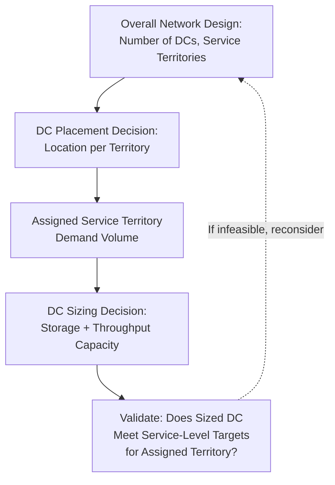

## Distribution Center Sizing and Placement

### Core Concept

Distribution center (DC) sizing and placement addresses two intertwined decisions: **where** to locate a DC (placement) and **how large** it should be built or leased (sizing), given projected throughput volume, storage requirements, service-level targets, and operational constraints. While placement determines geographic and network positioning (drawing on facility location frameworks and gravity models covered previously), sizing determines the physical and operational capacity required at each selected location — and the two decisions are interdependent, since a DC's optimal size depends on how much demand territory it is assigned to serve.

### Key Sizing Drivers

**Key Points**

- **Storage capacity requirements**: Determined by peak inventory levels the DC must hold, driven by average inventory plus safety stock, seasonality peaks, and any strategic buffer stock — typically expressed in pallet positions, square/cubic footage, or storage unit counts.
- **Throughput capacity requirements**: The rate at which the facility must receive, process, and ship goods, driven by daily/peak order volume, line-item pick rates, and required order-to-ship cycle time — this often, rather than storage volume alone, becomes the binding design constraint for e-commerce and fast-turn distribution facilities.
- **Value-added service requirements**: Some DCs perform additional functions beyond pure storage and pick/pack (e.g., kitting, light assembly, labeling, quality inspection, returns processing), each adding space and labor requirements beyond baseline storage/throughput needs.
- **Seasonality and peak-to-average ratio**: Facilities serving highly seasonal demand (e.g., holiday retail) must be sized to handle peak-period throughput, which may substantially exceed average-period requirements — creating a trade-off between capacity utilization efficiency in normal periods and adequate capacity during peaks.
- **Automation and material handling technology**: The degree of automation (conveyor systems, automated storage and retrieval systems, robotics) affects both the required footprint (automated storage can achieve higher storage density) and the achievable throughput rate per square foot, changing the sizing calculus relative to a purely manual operation.

### Sizing Calculation Framework

**Key Points**

- A basic storage sizing approach estimates required storage positions as:

$$\text{Required Storage Positions} = \frac{\text{Average Inventory} + \text{Safety Stock} + \text{Seasonal Buffer}}{\text{Storage Density per Position}}$$

- A basic throughput sizing approach estimates required processing capacity as:

$$\text{Required Throughput Rate} = \frac{\text{Peak Period Order Volume}}{\text{Operating Hours} \times \text{Target Cycle Time Compliance}}$$

- [Inference] In practice, sizing calculations are typically more sophisticated than these simplified formulas suggest, incorporating discrete-event simulation of actual warehouse operations (travel time, congestion, labor shift patterns) to validate that a proposed facility size and layout can actually achieve target throughput under realistic operating conditions, rather than relying on aggregate formulas alone.

### Placement Considerations Specific to DCs

**Key Points**

- **Service-area coverage and transit time**: DC placement is often driven by a target maximum transit time or distance to serve a defined percentage of demand within the assigned service territory (e.g., "next-day ground delivery to 95% of the region's population"), directly linking placement to customer service-level commitments.
- **Inbound vs. outbound transportation balance**: DC placement must balance proximity to inbound supply sources (reducing inbound freight cost/time) against proximity to outbound demand points (reducing outbound freight cost/time) — the optimal balance depends on relative inbound vs. outbound shipment volume and value density.
- **Labor market availability**: DC operations, particularly less-automated facilities, are labor-intensive; placement decisions must account for local labor market depth, wage rates, and availability, especially in regions with high concentrations of competing distribution facilities driving up local labor competition.
- **Infrastructure access**: Proximity to highway interchanges, rail intermodal terminals, or ports (for facilities handling significant inbound import volume) materially affects both transportation cost and achievable transit times.
- **Land availability and cost**: Large-footprint DCs, particularly automated facilities requiring significant clear height and specialized construction, require locations with available, appropriately-zoned, and reasonably-priced land — a growing constraint in some established, high-demand logistics corridors.

### Placement-Sizing Interdependency Diagram

The diagram illustrates the core interdependency: placement determines what territory (and therefore what demand volume) a DC must serve, which in turn drives its required size — meaning placement and sizing decisions cannot be fully separated and are often iterated together during network design.

### Comparative Sizing Approaches

| Approach | Description | Best Suited For |
| --- | --- | --- |
| **Static peak sizing** | Size for maximum anticipated peak-period demand | Facilities with predictable, limited seasonality |
| **Phased/modular sizing** | Build initial capacity for near-term needs with structural provision for future expansion | Growing markets with uncertain long-term demand trajectory |
| **Flexible/overflow capacity strategy** | Size core facility for average-to-moderate peak demand, supplemented by temporary or third-party overflow capacity during extreme peaks | Highly seasonal businesses (e.g., holiday-driven retail) |
| **Simulation-validated sizing** | Use discrete-event simulation to validate that a proposed size/layout achieves target throughput under realistic variability | Complex, high-throughput, or highly automated facilities |

### Example: Sizing a Regional E-Commerce Fulfillment Center

**Example**

An e-commerce retailer redesigning its distribution network determines, through network optimization, that a new regional DC should serve a territory with average daily order volume of 15,000 units, but with a holiday-season peak reaching 45,000 units/day (a 3x peak-to-average ratio). Rather than sizing the entire facility for the 45,000-unit peak (which would leave substantial capacity underutilized for most of the year), the retailer might size the core facility and permanent workforce for approximately 25,000–30,000 units/day of sustainable throughput, while planning to absorb the holiday peak through a combination of temporary seasonal labor, extended operating hours, and pre-positioned overflow inventory at a nearby flexible-capacity third-party logistics (3PL) facility — a common practical compromise between capital efficiency in normal periods and adequate service during peak demand.

### Risks of Sizing and Placement Errors

**Key Points**

- **Undersizing risk**: Insufficient storage or throughput capacity leads to service-level failures (stockouts, missed delivery commitments), congestion-driven operational inefficiency, and potential need for costly emergency expansion or overflow arrangements.
- **Oversizing risk**: Excess capacity relative to actual demand results in unnecessarily high fixed facility costs, underutilized labor and equipment, and reduced overall network cost efficiency — particularly costly given DCs' typically long useful life and the difficulty of downsizing a built facility.
- **Misplacement risk**: A DC placed suboptimally relative to its assigned demand territory (even if correctly sized) results in persistently higher transportation costs or longer transit times than an alternative location would have achieved, a cost that compounds over the facility's entire operating life.
- [Inference] Given the long capital life and high switching cost of DC facilities, sizing and placement decisions are generally treated as requiring more rigorous, scenario-tested analysis (combining network optimization, gravity/center-of-gravity screening, and simulation validation) than shorter-horizon operational decisions, reflecting the asymmetric cost of getting a long-lived capital decision wrong versus the lower cost of adjusting a short-term operational plan.

### Related Topics

- Facility Location Decision Frameworks
- Gravity Models and Center-of-Gravity Analysis
- Multi-Echelon Network Structures
- Capacity Planning Across Network Tiers
- Heuristic and Simulation-Based Network Design
- Total Landed Cost in Location Decisions