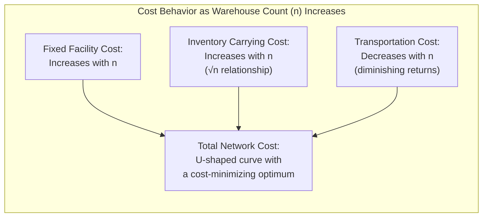

## Balancing the Number and Location of Warehouses

### Core Concept

The decision of **how many warehouses to operate**, and where to place them, is governed by a fundamental cost trade-off between two opposing forces: as the number of warehouses in a network increases, transportation cost to end customers typically decreases (facilities are closer to demand), while facility fixed costs and total system-wide inventory typically increase (more facilities each requiring their own fixed cost base and safety stock buffer). Finding the number of warehouses that minimizes total network cost — rather than optimizing any single cost component in isolation — is the central analytical challenge.

### The Core Cost Trade-off

$$\text{Total Network Cost}(n) = F(n) + I(n) + T(n)$$

where $n$ is the number of warehouses, $F(n)$ is total fixed facility cost (increasing in $n$), $I(n)$ is total inventory carrying cost (increasing in $n$, due to reduced risk-pooling benefit as inventory is split across more locations), and $T(n)$ is total outbound transportation cost (decreasing in $n$, since more warehouses reduce average distance to end customers).

### Cost Component Behavior as Warehouse Count Changes

**Key Points**

- **Fixed facility costs increase with warehouse count**: Each additional warehouse requires its own lease/ownership cost, fixed labor and management overhead, and material handling equipment — largely independent of how much volume that specific warehouse handles, meaning total fixed cost scales roughly linearly (or with step-function increases) with the number of facilities.
- **Inventory carrying cost increases with warehouse count due to reduced risk pooling**: A well-established statistical relationship (the "square root law" of inventory, discussed further below) shows that splitting a given total demand volume across more decentralized inventory locations increases total required safety stock, since each location must independently buffer against its own local demand variability rather than benefiting from variability offsetting across a larger pooled demand base.
- **Outbound transportation cost decreases with warehouse count**: More warehouses, positioned closer to end customers, reduce average last-mile transportation distance and cost — though this relationship typically exhibits diminishing returns, since the marginal transportation-cost benefit of each additional warehouse shrinks as the network becomes progressively denser.

### The Square Root Law of Inventory

**Key Points**

- A widely referenced approximation in inventory/network design theory states that total safety stock required across $n$ decentralized locations scales approximately with the square root of $n$, relative to a single centralized location holding equivalent total safety stock:

$$\text{Total Safety Stock}(n) \approx \text{Safety Stock}(1) \times \sqrt{n}$$

assuming demand at each location is independent and identically distributed.

- This relationship formalizes the risk-pooling principle discussed in earlier multi-echelon topics: consolidating inventory into fewer locations allows demand variability to partially offset across a larger pooled base, reducing the *proportional* safety stock needed relative to total volume, while decentralizing into more locations sacrifices this pooling benefit.
- [Inference] The square root law is a useful directional approximation for illustrating the inventory-decentralization trade-off, but its accuracy in any specific real-world application depends on how closely actual demand patterns match the underlying independence assumption — demand across warehouse territories that is correlated (e.g., driven by a shared regional economic factor) will not exhibit the full pooling benefit the formula assumes.

### Total Cost Curve and Optimal Warehouse Count

**Key Points**

- Because fixed and inventory costs increase with $n$ while transportation cost decreases with $n$ (at a diminishing rate), the total network cost curve is typically **U-shaped** with respect to the number of warehouses, implying a cost-minimizing optimal warehouse count exists rather than "more warehouses is always better" or "fewer is always better" holding universally.
- The location of this optimum shifts based on the relative magnitude of each cost component for a given business: businesses with high-value, low-bulk products (where inventory carrying cost is relatively more significant) tend to have optimal networks with fewer, more centralized warehouses; businesses with low-value, high-bulk products or highly time-sensitive delivery requirements (where transportation cost or service-level pressure dominates) tend to have optimal networks with more, more decentralized warehouses.

### Service-Level Constraints as a Modifying Factor

**Key Points**

- Pure cost-minimization analysis assumes transportation cost is the only consequence of warehouse placement, but in practice, **maximum acceptable delivery time or distance** (a service-level commitment, often competitively or contractually driven) frequently constrains the minimum feasible number of warehouses independent of the cost-optimal count.
- In markets where customers expect same-day or next-day delivery, the number of warehouses required to achieve that service-level target from a geographic coverage standpoint may exceed the number that would be selected under pure cost minimization — meaning the practical decision often becomes "the minimum-cost network configuration that satisfies the binding service-level constraint" rather than an unconstrained cost optimum.
- [Inference] This dynamic has become increasingly significant with the rise of rapid e-commerce delivery expectations, which has generally pushed many retail and e-commerce distribution networks toward more decentralized, higher-warehouse-count configurations than pure transportation-versus-inventory cost trade-off analysis alone would suggest, though the specific optimal count remains highly business- and market-specific.

### Analytical Approach to Determining Optimal Warehouse Count

**Key Points**

- **Total cost modeling across a range of scenarios**: Constructing and comparing total network cost (fixed + inventory + transportation) for candidate warehouse counts (e.g., 1, 3, 5, 8, 12 warehouses), often using MILP-based facility location optimization to determine the best-performing configuration at each candidate count.
- **Service-level constraint overlay**: Applying minimum service-level requirements (e.g., percentage of demand served within X hours/days) as explicit constraints in the optimization, ensuring the candidate configurations compared are all operationally feasible rather than only cost-efficient.
- **Sensitivity and scenario testing**: Testing how the optimal warehouse count shifts under different assumptions (demand growth scenarios, transportation cost inflation, changing service-level requirements) to identify a robust choice rather than one narrowly optimized to a single point-estimate assumption.

### Example: Warehouse Count Trade-off in Practice

**Example**

A specialty retailer currently operating from a single centralized warehouse is considering expansion to a multi-warehouse network to improve delivery times. Analysis might show:

| Warehouse Count | Est. Fixed Cost (Annual) | Est. Inventory Cost (Annual) | Est. Transportation Cost (Annual) | Est. Total Cost |
| --- | --- | --- | --- | --- |
| 1 | $2.0M | $3.0M | $9.0M | $14.0M |
| 3 | $4.5M | $5.2M | $6.0M | $15.7M |
| 5 | $6.8M | $6.7M | $5.0M | $18.5M |

In this illustrative example, pure cost minimization favors the single-warehouse configuration; however, if the retailer's competitive positioning requires 2-day delivery coverage to a broad national customer base that a single central warehouse cannot achieve, the 3-warehouse configuration may be selected instead, despite its higher total cost, because it is the lowest-cost configuration that satisfies the binding service-level constraint — illustrating how the "optimal" answer depends on whether the analysis is purely cost-driven or constrained by service requirements.

### Related Topics

- Multi-Echelon Network Structures
- Distribution Center Sizing and Placement
- Risk Pooling and Safety Stock Positioning
- Network Optimization Using Linear and Mixed-Integer Programming
- Gravity Models and Center-of-Gravity Analysis
- Total Landed Cost in Location Decisions
- Designing for Global, Regional, and Local Footprints