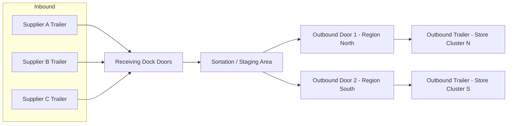

## Cross-Docking and Transshipment Point Design

### Definition and Core Concept

Cross-docking is a logistics practice in which inbound goods from suppliers or manufacturing plants are unloaded at a distribution facility and transferred directly to outbound trailers, with minimal or no intermediate storage. Transshipment points serve a related but broader function: they act as intermediate nodes where freight is consolidated, redirected, or transferred between transport modes or carriers before continuing to its final destination.

The defining operational goal of both facility types is inventory velocity: goods spend hours, not days, on the dock. A well-designed cross-dock aims for a dwell time of under 24 hours, and many high-throughput operations target under 4 hours for fast-moving SKUs.

### Strategic Rationale

**Key Points**

- Reduces or eliminates warehousing/storage costs since inventory does not rest in racked storage
- Shortens order-to-delivery lead time by removing put-away and pick cycles
- Enables consolidation of less-than-truckload (LTL) shipments into full-truckload (FTL) moves, lowering per-unit freight cost
- Reduces handling touches compared to a traditional store-and-pick warehouse, which lowers damage risk and labor cost per unit
- Improves inventory freshness for perishable or time-sensitive goods (produce, pharmaceuticals, retail promotions)
- Supports Just-In-Time (JIT) manufacturing supply strategies by synchronizing inbound component arrivals with outbound production-line delivery windows

### Types of Cross-Docking Operations

**Manufacturing Cross-Docking**

Pre-staged components from suppliers are received and immediately forwarded to assembly lines, timed against production schedules. This is common in automotive and electronics manufacturing.

**Distributor Cross-Docking**

Multiple suppliers' products are consolidated into a single mixed-SKU pallet or shipment destined for one customer, common in grocery and retail replenishment.

**Transportation Cross-Docking**

Freight is consolidated across carriers/modes to achieve better trailer utilization — for example, combining several LTL shipments bound for the same regional area into one FTL load.

**Retail/Opportunistic Cross-Docking**

Products are received already tagged for specific stores (pre-allocated by the retailer's replenishment system) and are sorted directly to the outbound door for that store, bypassing put-away entirely.

**Flow-Through Distribution**

A hybrid model where a small percentage of goods (typically slow movers or those needing quality inspection) are diverted to short-term storage while the majority flow through cross-dock lanes.

### Facility Layout Archetypes

The physical configuration of a cross-dock strongly determines its throughput capacity and travel-distance efficiency.

**I-Shaped (Linear) Layout**

Inbound doors on one side, outbound doors on the opposite side, with a straight-through flow path. Simple to design and staff but has poor door-to-door travel efficiency for high door counts, since travel distance grows linearly with facility length.

**L-Shaped Layout**

Inbound and outbound doors are arranged on perpendicular sides. Reduces the maximum travel distance compared to I-shaped for a given door count and is easier to expand incrementally.

**U-Shaped (or H-Shaped) Layout**

Inbound and outbound doors are on the same side or adjacent sides, allowing shared staging space and reduced total perimeter per door. This is the most common layout in modern parcel and LTL cross-docks because it minimizes the travel distance for the "hub-and-spoke" internal sortation pattern.

**T-Shaped and X-Shaped Layouts**

Used in very high-volume operations (e.g., parcel mega-hubs) to support four-directional flow segmentation, distributing dock doors across multiple wings radiating from a central sortation spine.

<svg xmlns="http://www.w3.org/2000/svg" viewBox="0 0 900 300">
<title>Cross-Dock Layout Archetypes Comparison (svg_diagram)</title>
\<style\>
.lbl { font-family: Arial, sans-serif; font-size: 13px; fill: #222; }
.hdr { font-family: Arial, sans-serif; font-size: 14px; font-weight: bold; fill: #111; }
.dock { fill: #6fa8dc; stroke: #1f4e79; stroke-width: 1; }
.out { fill: #f6b26b; stroke: #7f4a10; stroke-width: 1; }
.body { fill: #eeeeee; stroke: #666666; stroke-width: 1.5; }
\</style\>

<text x="30" y="20" class="hdr">I-Shaped</text>

<rect x="20" y="40" width="200" height="60" class="body" />

<rect x="15" y="45" width="6" height="12" class="dock" />

<rect x="15" y="65" width="6" height="12" class="dock" />

<rect x="15" y="85" width="6" height="12" class="dock" />

<rect x="219" y="45" width="6" height="12" class="out" />

<rect x="219" y="65" width="6" height="12" class="out" />

<rect x="219" y="85" width="6" height="12" class="out" />

<text x="20" y="118" class="lbl">In ← straight-through → Out</text>

<text x="330" y="20" class="hdr">L-Shaped</text>

<path d="M320,40 H460 V70 H400 V160 H320 Z" class="body" />

<rect x="315" y="45" width="6" height="10" class="dock" />

<rect x="315" y="60" width="6" height="10" class="dock" />

<rect x="315" y="130" width="6" height="10" class="dock" />

<rect x="405" y="80" width="10" height="6" class="out" />

<rect x="420" y="80" width="10" height="6" class="out" />

<rect x="435" y="80" width="10" height="6" class="out" />

<text x="320" y="185" class="lbl">Perpendicular in/out legs</text>

<text x="560" y="20" class="hdr">U-Shaped</text>

<path d="M550,40 H700 V160 H660 V80 H590 V160 H550 Z" class="body" />

<rect x="545" y="45" width="6" height="10" class="dock" />

<rect x="545" y="130" width="6" height="10" class="dock" />

<rect x="695" y="45" width="6" height="10" class="out" />

<rect x="695" y="130" width="6" height="10" class="out" />

<text x="555" y="185" class="lbl">Shared-side, short travel</text>

<text x="770" y="20" class="hdr">T/X-Shaped</text>

<rect x="760" y="40" width="30" height="120" class="body" />

<rect x="750" y="80" width="50" height="30" class="body" />

<rect x="755" y="35" width="6" height="10" class="dock" />

<rect x="775" y="35" width="6" height="10" class="dock" />

<rect x="745" y="90" width="6" height="10" class="out" />

<rect x="799" y="90" width="6" height="10" class="out" />

<text x="740" y="185" class="lbl">Multi-wing hub</text>

</svg>

### Transshipment Point Design Considerations

**Door Configuration and Staging Zone Sizing**

The ratio of inbound to outbound doors should reflect the shipment consolidation ratio. A distributor cross-dock combining many small inbound shipments into fewer large outbound loads typically has an inbound:outbound door ratio greater than 1:1 (e.g., 3:1), while a break-bulk parcel hub distributing one large inbound load to many outbound routes has the inverse ratio.

**Staging Lane Depth**

Staging areas immediately behind each outbound door must be sized to hold at least one full trailer load, plus buffer capacity for the peak arrival wave. Undersized staging causes congestion that cascades backward into the receiving area.

**Dock Door Spacing**

Standard spacing is 12–14 feet (3.7–4.3 m) center-to-center to accommodate trailer widths and maneuvering, though narrower spacing (10–11 ft) is used in parcel facilities with smaller package vans.

**Material Handling Equipment (MHE) Selection**

- Conveyor-based sortation: appropriate for uniform, conveyable parcels/cartons at high volume
- Forklift/pallet jack transfer: appropriate for palletized freight with mixed dimensions
- Automated Guided Vehicles (AGVs) or Autonomous Mobile Robots (AMRs): increasingly used for pallet transfer in high-throughput or labor-constrained facilities
- Tilt-tray or cross-belt sorters: used in parcel cross-docks for high-speed, small-item sortation to zone or door

### Network-Level Location Planning

**Hub-and-Spoke vs. Point-to-Point Trade-off**

Transshipment points enable a hub-and-spoke network topology, where freight is routed through a small number of consolidation hubs rather than moving directly between every origin-destination pair. This reduces the number of required transport links from $O(n^2)$ to approximately $O(n)$ for $n$ nodes, at the cost of added handling and slightly longer transit distance per shipment.

**Hub Location Selection Criteria**

- Centrality relative to the demand/supply node distribution (often solved via center-of-gravity or p-median facility location models)
- Access to multimodal transport infrastructure (highway interchanges, rail intermodal yards, airports, ports)
- Labor market availability and cost
- Land cost and availability for future expansion
- Proximity to the population-weighted centroid of the service area to minimize aggregate line-haul + last-mile distance

**Simplified Center-of-Gravity Formula**

For a set of demand points with coordinates $(x_i, y_i)$ and volumes $w_i$, the candidate hub location is:

$$\bar{x} = \frac{\sum_{i} w_i x_i}{\sum_{i} w_i}, \quad \bar{y} = \frac{\sum_{i} w_i y_i}{\sum_{i} w_i}$$

This gives an initial candidate location; real siting decisions then adjust for actual road network distances, zoning, and infrastructure access rather than straight-line distance alone. [Inference: the center-of-gravity output is a starting heuristic, not a final site decision, since it ignores network topology and fixed costs]

### Scheduling and Synchronization

The core operational challenge of cross-docking is wave synchronization: inbound trailer arrivals must be scheduled so that goods destined for a common outbound trailer arrive within a compatible time window.

**Key Points**

- Dock scheduling software coordinates appointment windows to avoid door congestion and idle staging
- Advance Shipping Notices (ASNs) from suppliers, transmitted before physical arrival, allow the facility to pre-plan sortation and staging assignments
- Cross-dock timing models often use a wave-based schedule (e.g., 3–6 inbound waves per day) rather than continuous flow, aligning outbound departure cutoffs with delivery SLAs

**Example**

A distributor cross-dock receiving from 40 suppliers for redistribution to 12 regional stores might schedule:

- Wave 1 (04:00–07:00): Inbound receiving and ASN-driven pre-sort
- Wave 2 (07:00–09:00): Cross-dock sortation to outbound staging lanes
- Wave 3 (09:00–11:00): Outbound loading and trailer departure by store-delivery cutoff

### Technology and Systems Integration

**Warehouse/Transportation Management System (WMS/TMS) Requirements**

- Real-time ASN ingestion and inbound-to-outbound mapping logic
- Dock door scheduling and yard management (often via a Yard Management System, YMS)
- Barcode/RFID scanning at receipt to trigger automatic outbound assignment ("directed cross-dock putaway")
- Exception handling workflows for freight that arrives without a matching outbound assignment (diverted to short-term storage, sometimes called "cross-dock overflow" or "flow-through exception")

**RFID and Real-Time Location Systems (RTLS)**

Used in higher-maturity operations to track pallet location on the dock floor in real time, reducing lost-freight incidents and enabling dynamic re-routing if an outbound trailer is delayed.

### Facility Sizing and Throughput Modeling

Cross-dock capacity is typically expressed in terms of doors, staging square footage per door, and daily throughput volume (pallets or cartons per day).

A commonly used sizing heuristic:

$$N_{doors} = \frac{V_{daily}}{C_{door} \times H_{operating}}$$

Where $V_{daily}$ is daily throughput volume, $C_{door}$ is the per-door handling capacity per hour, and $H_{operating}$ is operating hours per day. [Inference: this is a simplified planning heuristic; real capacity planning also accounts for peak-to-average volume ratios and MHE constraints, not just average daily volume]

### Common Design Pitfalls

**Key Points**

- Insufficient staging depth leading to trailer queuing and yard congestion
- Poor inbound/outbound door ratio mismatched to actual consolidation pattern
- Lack of real-time visibility (no ASN or RFID), forcing manual matching of inbound freight to outbound loads
- Underestimating exception volume (damaged goods, mislabeled freight, late-arriving trailers), which requires contingency storage space that is often omitted from initial facility sizing
- Poor labor shift alignment with wave scheduling, causing bottlenecks at wave transition points

### Illustrative Cross-Dock Flow

### Performance Metrics

**Key Points**

- **Dock-to-dock cycle time**: elapsed time from inbound trailer arrival to outbound trailer departure
- **Dock door utilization rate**: percentage of scheduled door-hours actually used for active loading/unloading
- **Cross-dock ratio**: percentage of total facility throughput that bypasses storage entirely (vs. flow-through exceptions)
- **On-time departure rate**: percentage of outbound trailers departing within their scheduled window
- **Touches per unit**: number of times a unit is physically handled between inbound receipt and outbound loading (lower is better)

### Related Topics

- Hub-and-Spoke Network Design and Optimization
- Yard Management Systems (YMS) and Trailer Sequencing
- Facility Location Models (p-median, center-of-gravity, mixed-integer programming formulations)
- Last-Mile Delivery Network Design
- Warehouse Slotting vs. Cross-Dock Flow-Through Hybrid Models
- Advance Shipping Notice (ASN) Standards and EDI Integration
- Multimodal Freight Transfer (Rail-to-Truck, Port-to-Rail Intermodal Yards)