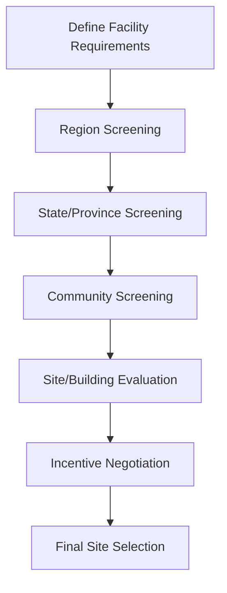

## Site Selection Criteria: Labor, Infrastructure, and Incentives

### Definition and Core Concept

Site selection is the structured decision-making process by which an organization evaluates and chooses a specific geographic location for a distribution center, warehouse, manufacturing plant, or other supply chain facility. The process weighs quantitative cost factors against qualitative and strategic factors across three primary domains: labor market conditions, physical and digital infrastructure, and government incentive programs.

### Overall Site Selection Process

**Key Points**

- Site selection typically proceeds through a funnel: region screening → state/province screening → community screening → specific parcel/building evaluation
- Early-stage screening uses macro data (labor cost indices, tax climate, market access); late-stage screening requires site-specific due diligence (soil surveys, utility capacity confirmation, zoning verification)
- Multi-criteria decision analysis (MCDA) or weighted-factor scoring models are commonly used to compare shortlisted sites objectively

### Labor Criteria

**Labor Availability**

The size and depth of the local labor pool within a commutable radius (typically 20–30 minutes for warehouse/distribution roles, up to 45–60 minutes in rural markets) determines whether a facility can staff its target headcount, especially during peak seasonal hiring.

**Key Points**

- Labor shed analysis: mapping the working-age population within commute distance, adjusted for existing employment saturation
- Unemployment rate and labor force participation rate as leading indicators of hiring difficulty
- Competing employer density: proximity to other distribution centers, manufacturing plants, or large employers competing for the same labor pool
- Turnover rate benchmarks for the specific facility type (warehouse/fulfillment turnover is historically high, often cited in the 40–100%+ annualized range depending on region and wage competitiveness) [Unverified: turnover figures vary significantly by company, region, and year and should be validated against current local data]

**Labor Cost**

- Prevailing wage rates for target job classifications (forklift operators, pickers/packers, dock workers, supervisors)
- State/local minimum wage requirements and scheduled increases
- Right-to-work status, which affects union organizing likelihood and can influence labor cost stability
- Workers' compensation insurance rates, which vary substantially by state/jurisdiction and industry classification

**Labor Quality and Skills**

- Availability of workforce training programs, community college logistics/supply chain curricula, or state-sponsored workforce development programs
- Language and literacy factors relevant to safety training and equipment certification
- For technical facilities (automated DCs, manufacturing), availability of skilled trades (electricians, controls technicians, robotics maintenance)

### Infrastructure Criteria

**Transportation Infrastructure**

- Highway access: proximity to interstate/national highway interchanges, ideally with direct or near-direct access to minimize local road congestion for truck traffic
- Rail access: availability of rail spur or intermodal ramp access for rail-dependent freight
- Port proximity: critical for import/export-heavy operations; measured in both distance and drayage cost/time to the nearest container port
- Airport proximity: relevant for time-sensitive or high-value goods requiring air freight
- Road weight restrictions and bridge clearance limits along primary truck routes to/from the site

**Utility Infrastructure**

- Electrical capacity and reliability: critical for automated facilities, cold storage, and any operation with high power draw (conveyor systems, robotics, refrigeration)
- Natural gas availability, relevant for heating in cold climates or process energy needs
- Water and wastewater capacity, particularly for food/beverage processing or manufacturing with process water requirements
- Telecommunications/broadband infrastructure, increasingly critical for WMS/TMS connectivity, RFID/RTLS systems, and cloud-based operations

**Site-Specific Physical Infrastructure**

- Parcel size and configuration relative to required building footprint, trailer/car parking, and future expansion
- Soil conditions and floodplain status, which affect construction cost and insurability
- Zoning classification and entitlement status (already zoned for industrial use vs. requiring rezoning)
- Existing building availability (for lease/retrofit scenarios) vs. greenfield/build-to-suit requirements

### Incentive Criteria

**Categories of Incentives**

- **Tax abatements**: property tax reductions or exemptions, often phased (e.g., declining abatement percentage over 5–10 years)
- **Tax credits**: job creation tax credits, investment tax credits, often tied to minimum job count and wage thresholds
- **Grants**: direct cash grants for infrastructure improvements (road, utility extension) or workforce training reimbursement
- **Free Trade Zones (FTZs)** or equivalent customs-deferral zones: reduce or defer duties on imported goods held or processed within the zone, relevant for import-heavy distribution operations
- **Utility rate discounts**: negotiated reduced electricity/gas rates for large industrial users, sometimes tied to job creation commitments
- **Infrastructure investment**: local government funding for road improvements, rail spur construction, or utility extension to the site

**Key Points**

- Incentive value must be evaluated on a net present value (NPV) basis against the facility's total lifecycle cost, not treated as a standalone deciding factor
- Most incentive agreements include "clawback" provisions requiring repayment if job creation or investment commitments are not met, which should be factored into risk assessment
- Incentive negotiation typically occurs after a site has been shortlisted, using competing locations as leverage — this is common practice in site selection consulting engagements [Inference: specific negotiation leverage and outcomes are situational and vary by company size, project scale, and jurisdiction]

### Weighted Factor Scoring Model

A common quantitative method for comparing shortlisted sites is a weighted-factor matrix, where each criterion is scored (e.g., 1–10) and multiplied by an importance weight.

$$S_j = \sum_{i=1}^{n} w_i \cdot r_{ij}$$

Where $S_j$ is the total score for site $j$, $w_i$ is the weight assigned to criterion $i$ (with $\sum w_i = 1$), and $r_{ij}$ is the rating of site $j$ on criterion $i$.

**Example**

| Criterion | Weight | Site A Score | Site B Score |
| --- | --- | --- | --- |
| Labor availability | 0.25 | 8 | 6 |
| Labor cost | 0.15 | 6 | 8 |
| Highway access | 0.20 | 9 | 7 |
| Utility capacity | 0.15 | 7 | 9 |
| Incentive package (NPV) | 0.15 | 6 | 8 |
| Land/construction cost | 0.10 | 7 | 7 |

Weighted total for Site A: $(0.25)(8) + (0.15)(6) + (0.20)(9) + (0.15)(7) + (0.15)(6) + (0.10)(7) = 7.55$

Weighted total for Site B: $(0.25)(6) + (0.15)(8) + (0.20)(7) + (0.15)(9) + (0.15)(8) + (0.10)(7) = 7.25$

In this illustrative example, Site A scores higher overall despite Site B's cost and incentive advantages, driven by its labor availability and highway access weighting.

### Total Cost of Ownership Framework

Site selection decisions should evaluate total cost of ownership (TCO) rather than any single factor in isolation:

**Key Points**

- One-time costs: land acquisition, construction/build-out, permitting fees, infrastructure connection fees
- Recurring costs: labor (largest ongoing cost for most DC operations), utilities, property taxes (net of abatements), insurance, transportation/freight to and from the site
- Risk-adjusted costs: exposure to natural disaster risk (flood, hurricane, seismic zones), which affects insurance premiums and business continuity planning
- Time-to-operation: permitting timelines, construction lead time, and workforce ramp-up time all affect when the facility becomes productive, which has an opportunity cost

### Site Selection Diagram

<svg xmlns="http://www.w3.org/2000/svg" viewBox="0 0 800 380">
<title>Site Selection Criteria Framework (svg_diagram)</title>
\<style\>
.box { fill: #d9ead3; stroke: #38761d; stroke-width: 1.5; }
.box2 { fill: #cfe2f3; stroke: #1155cc; stroke-width: 1.5; }
.box3 { fill: #fce5cd; stroke: #b45f06; stroke-width: 1.5; }
.center { fill: #e6b8af; stroke: #85200c; stroke-width: 2; }
.txt { font-family: Arial, sans-serif; font-size: 13px; fill: #111; }
.hdr { font-family: Arial, sans-serif; font-size: 15px; font-weight: bold; fill: #111; }
.line { stroke: #444; stroke-width: 1.5; fill: none; }
\</style\>
<rect x="330" y="170" width="140" height="50" rx="8" class="center" />
<text x="345" y="200" class="hdr">SITE</text>
<rect x="60" y="30" width="200" height="90" rx="6" class="box" />
<text x="70" y="50" class="hdr">Labor</text>
<text x="70" y="70" class="txt">- Availability / labor shed</text>
<text x="70" y="88" class="txt">- Wage cost &amp; competition</text>
<text x="70" y="106" class="txt">- Skills &amp; training</text>
<rect x="540" y="30" width="200" height="90" rx="6" class="box2" />
<text x="550" y="50" class="hdr">Infrastructure</text>
<text x="550" y="70" class="txt">- Highway / rail / port</text>
<text x="550" y="88" class="txt">- Utility capacity</text>
<text x="550" y="106" class="txt">- Zoning &amp; parcel fit</text>
<rect x="300" y="280" width="200" height="90" rx="6" class="box3" />
<text x="310" y="300" class="hdr">Incentives</text>
<text x="310" y="320" class="txt">- Tax abatement/credits</text>
<text x="310" y="338" class="txt">- Grants &amp; FTZ status</text>
<text x="310" y="356" class="txt">- Utility rate discounts</text>
<path d="M260,90 Q300,140 335,180" class="line" />
<path d="M540,90 Q500,140 465,180" class="line" />
<path d="M400,220 L400,280" class="line" />
</svg>

### Common Pitfalls in Site Selection

**Key Points**

- Overweighting incentive value relative to underlying operating cost fundamentals (an attractive incentive package cannot offset a structurally poor labor market long-term)
- Underestimating ramp-up time for labor recruitment in tight labor markets, leading to delayed facility launch
- Failing to verify utility capacity commitments in writing before finalizing site commitment (verbal assurances from local utilities are not binding)
- Ignoring competing facility announcements in the same labor shed that may saturate the labor pool shortly after the new facility opens
- Treating site selection as a one-time decision rather than revisiting network-wide facility locations periodically as demand patterns and cost structures shift

### Next Steps

- Facility Location Optimization Models (center-of-gravity, p-median, mixed-integer linear programming)
- Total Cost of Ownership (TCO) Modeling for Distribution Networks
- Free Trade Zone (FTZ) and Bonded Warehouse Design
- Labor Market Analysis and Workforce Planning for Distribution Operations
- Incentive Negotiation and Clawback Risk Management
- Network Design Software and Scenario Modeling Tools