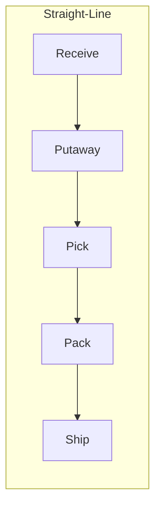

## Physical Product Flow Design and Sequencing

### Definition and Core Concept

Physical product flow design refers to the deliberate structuring of the path, sequence, and handling method by which physical goods move through a supply chain — from raw material or component sourcing, through production and consolidation, to final delivery. It encompasses both the macro-level path (which nodes goods traverse) and the micro-level sequencing (the order and timing of operations within a single facility).

Sequencing specifically addresses the ordering of operations and material movements to minimize wait time, congestion, and non-value-added handling while meeting delivery commitments.

### Flow Design Objectives

**Key Points**

- Minimize total distance traveled (both within a facility and across the network)
- Minimize the number of handling touches per unit
- Maximize throughput per unit of time given fixed labor and equipment capacity
- Minimize work-in-process (WIP) and in-transit inventory
- Ensure flow direction supports FIFO (First-In-First-Out) or FEFO (First-Expired-First-Out) requirements where product freshness or lot control matters
- Maintain flexibility to accommodate demand variability without redesigning the entire flow path

### Flow Pattern Types

**Straight-Line (Linear) Flow**

Materials move in one direction from receiving to shipping, passing through sequential processing stages without backtracking. This is the most efficient pattern for high-volume, standardized product flows but requires a facility shape (typically long and narrow) that supports it.

**U-Shaped Flow**

Receiving and shipping are co-located on the same side of the facility, with product flowing in a U-pattern through intermediate processing. This reduces the perimeter needed for dock doors and allows shared staff and equipment resources between inbound and outbound operations.

**L-Shaped Flow**

A compromise pattern used when facility geometry or land constraints prevent a straight-line or U-shaped layout; commonly seen in retrofitted or irregularly shaped buildings.

**S-Shaped (Serpentine) Flow**

Used within a single processing zone (e.g., pick module) to maximize use of available floor space by routing the pick path back and forth across aisles, common in manual and pick-to-light order fulfillment systems.

### Sequencing Principles

**Batching vs. Wave vs. Continuous Flow**

- **Batch processing**: units are grouped and processed together through each stage before moving to the next; reduces changeover frequency but increases WIP and lead time
- **Wave-based processing**: groups of orders/shipments are released into the flow at scheduled intervals (waves), balancing throughput predictability with reasonable cycle time — common in cross-docking and order fulfillment
- **Continuous (flow-through) processing**: units move individually or in small lots continuously through the process with minimal queuing, characteristic of lean/JIT systems and high-velocity cross-docks

**Sequencing Rules for Order/Task Release**

- **FIFO (First-In-First-Out)**: processes units in arrival order; simple and predictable but does not account for due-date urgency
- **EDD (Earliest Due Date)**: prioritizes units with the closest delivery deadline; reduces late shipments but can starve lower-priority items indefinitely under high load
- **SPT (Shortest Processing Time)**: processes the quickest tasks first to minimize average flow time across all units; a well-known result in scheduling theory shows SPT sequencing minimizes mean flow time in a single-stage system [Inference: this result assumes a single-machine, deterministic-processing-time scheduling model; real-world sequencing must also account for due dates, changeover cost, and stochastic processing variability]
- **Critical Ratio (CR)**: dynamically prioritizes based on remaining time until due date divided by remaining processing time, re-calculated as conditions change

### Facility-Level Flow Design Process

**Key Points**

1. Map current or projected volume by SKU/product family and flow path
2. Classify products by flow characteristic (fast-mover/slow-mover, full pallet/each-pick, ambient/cold-chain)
3. Assign each product class to an appropriate flow path (e.g., fast movers to a dedicated flow-through lane, slow movers to bulk storage with batch picking)
4. Determine required buffer/staging capacity at each transition point
5. Validate flow design against peak-period volume, not just average volume
6. Simulate or pilot the design before full-scale implementation

### Flow Design for Mixed-Velocity Product Portfolios

Most distribution operations handle products with heterogeneous demand velocity, requiring differentiated flow paths within the same facility.

**ABC Flow Segmentation**

- **A items** (high velocity, ~20% of SKUs, ~80% of volume): placed in flow-through or golden-zone pick locations closest to packing/shipping, often on dedicated conveyor or pick-to-light lines
- **B items** (moderate velocity): standard pallet rack or shelf storage with conventional pick paths
- **C items** (low velocity, long tail): consolidated in higher-density storage (deep-lane, mobile racking) since pick frequency does not justify prime location

This segmentation follows a Pareto-type distribution commonly observed in SKU velocity data, though the exact 80/20 split varies by industry and should be validated against actual demand data rather than assumed universally. [Inference: the specific ratio is empirically observed across many retail/distribution contexts but is not a fixed law and varies by product category]

### Cross-Functional Flow Coordination

Physical flow design must be synchronized with information flow (order release timing, WMS task sequencing) and financial flow (three-way match triggers on receipt) to avoid bottlenecks caused by misalignment between physical movement and system transaction timing. For example, a unit that is physically received but not yet system-confirmed cannot be released into downstream pick sequencing, creating an artificial flow stoppage even though the physical goods are present and ready.

### Flow Efficiency Metrics

**Key Points**

- **Cycle time**: total elapsed time for a unit to traverse the full flow path from entry to exit
- **Throughput rate**: units processed per unit of time at a given stage or across the full flow
- **Travel distance per unit**: average distance traveled by material handlers or automated systems per unit processed
- **WIP-to-throughput ratio**: used to estimate average time in system via Little's Law

**Little's Law**

$$L = \lambda W$$

Where $L$ is the average number of units in the system (WIP), $\lambda$ is the average arrival/throughput rate, and $W$ is the average time a unit spends in the system. This relationship holds for any stable flow system in steady state and is widely used to estimate expected cycle time from observed WIP and throughput data.

### Illustrative Mixed-Flow Facility Diagram

<svg xmlns="http://www.w3.org/2000/svg" viewBox="0 0 850 320">
<title>Mixed-Velocity Flow Path Design (svg_diagram)</title>
\<style\>
.zoneA { fill: #d9ead3; stroke: #38761d; stroke-width: 1.5; }
.zoneB { fill: #cfe2f3; stroke: #1155cc; stroke-width: 1.5; }
.zoneC { fill: #f4cccc; stroke: #990000; stroke-width: 1.5; }
.dock { fill: #ffe599; stroke: #7f6000; stroke-width: 1.5; }
.txt { font-family: Arial, sans-serif; font-size: 12px; fill: #111; }
.hdr { font-family: Arial, sans-serif; font-size: 13px; font-weight: bold; fill: #111; }
.arrow { stroke: #333; stroke-width: 2; fill: none; marker-end: url(#arrowhead); }
\</style\>
<rect x="20" y="130" width="90" height="60" class="dock" />
<text x="30" y="165" class="hdr">Receiving</text>
<rect x="160" y="30" width="150" height="70" class="zoneA" />
<text x="170" y="55" class="hdr">A-Items</text>
<text x="170" y="72" class="txt">Flow-through / conveyor</text>
<rect x="160" y="125" width="150" height="70" class="zoneB" />
<text x="170" y="150" class="hdr">B-Items</text>
<text x="170" y="167" class="txt">Pallet rack, std pick</text>
<rect x="160" y="220" width="150" height="70" class="zoneC" />
<text x="170" y="245" class="hdr">C-Items</text>
<text x="170" y="262" class="txt">Deep-lane bulk storage</text>
<rect x="700" y="130" width="90" height="60" class="dock" />
<text x="710" y="165" class="hdr">Shipping</text>
<path d="M110,150 L160,65" class="arrow" />
<path d="M110,155 L160,160" class="arrow" />
<path d="M110,165 L160,255" class="arrow" />
<path d="M310,65 Q500,65 700,150" class="arrow" />
<path d="M310,160 L700,160" class="arrow" />
<path d="M310,255 Q500,255 700,175" class="arrow" />
</svg>

### Common Design Pitfalls

**Key Points**

- Designing a single uniform flow path for all products regardless of velocity, causing fast movers to travel unnecessarily long distances
- Sizing buffer/staging areas for average volume rather than peak volume, causing congestion during demand spikes
- Failing to align physical flow sequencing with WMS task release logic, creating phantom bottlenecks where physical capacity exists but system-directed tasks lag behind
- Ignoring backtracking and cross-traffic in flow path design, which increases congestion and safety risk (aisle collisions between pickers and forklifts)
- Over-optimizing for one metric (e.g., minimum travel distance) at the expense of others (e.g., FIFO/lot integrity for regulated or perishable goods)

### Related Topics

- Warehouse Slotting and SKU Velocity Analysis
- Wave Planning and Order Release Sequencing
- Lean and Just-In-Time (JIT) Flow Principles in Distribution
- Little's Law and Queuing Theory Applications in Logistics
- Material Handling Equipment Selection for Flow-Based Layouts
- Information Flow Synchronization with WMS/TMS Systems