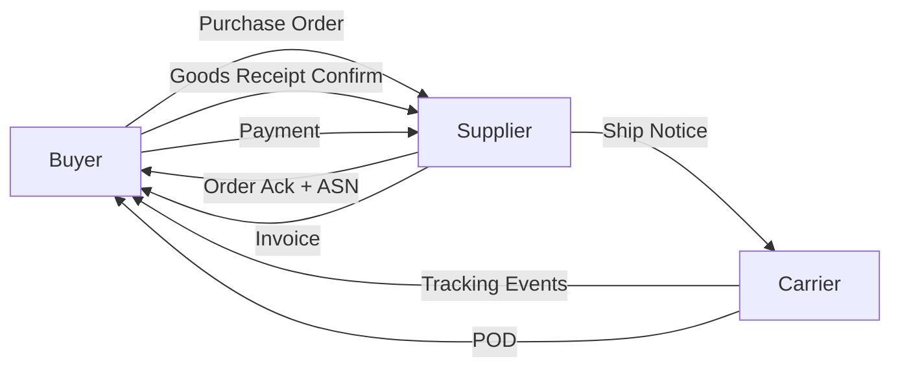
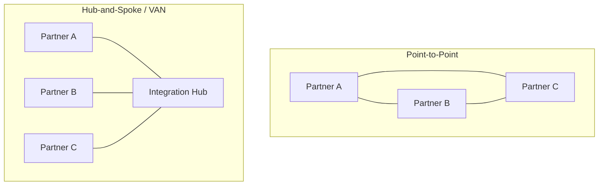

## Information Flow Architecture and Data Standards

### Definition and Core Concept

Information flow architecture describes how transactional, operational, and status data moves between the parties and systems participating in a supply chain — suppliers, manufacturers, distributors, carriers, and customers. It runs parallel to and synchronizes with the physical flow of goods, providing the visibility and coordination signals (orders, confirmations, shipment status, inventory levels) that allow physical flow to execute correctly. Data standards are the shared formats, schemas, and protocols that allow disparate systems across organizational boundaries to exchange this information without custom point-to-point translation for every trading partner.

### Why Information Flow Architecture Matters

**Key Points**

- Enables synchronization between physical movement and system-of-record confirmation (e.g., a receipt cannot be processed downstream until the information flow confirms it)
- Reduces the bullwhip effect by giving upstream supply chain partners visibility into actual downstream demand rather than relying on order patterns alone
- Supports exception management: delayed shipment notifications, quality holds, and demand spikes can only be acted upon if the information reaches decision-makers in time
- Enables financial flow triggers (invoicing, payment release) that typically depend on confirmed information flow milestones (e.g., proof of delivery)

### Core Information Flow Types

**Order-to-Cash Information Flow**

Purchase order → order acknowledgment → shipment notice → proof of delivery → invoice → payment confirmation. This is the customer-facing information sequence.

**Procure-to-Pay Information Flow**

Purchase requisition → purchase order → goods receipt → invoice matching → payment issuance. This is the supplier-facing information sequence.

**Demand and Forecast Information Flow**

Point-of-sale (POS) data, forecast updates, and replenishment signals flowing upstream from retailer/customer to supplier, often used in Vendor-Managed Inventory (VMI) and Collaborative Planning, Forecasting, and Replenishment (CPFR) arrangements.

**Shipment and Logistics Status Flow**

Booking confirmations, in-transit tracking events, customs status, and delivery confirmations flowing between shippers, carriers, and freight forwarders.

### Key Data Standards

**EDI (Electronic Data Interchange)**

A long-established standard for structured business document exchange between trading partners, predominantly used in retail, automotive, and freight transportation sectors.

- **ANSI X12**: the dominant EDI standard in North America. Common transaction sets include:
  - 850 (Purchase Order)
  - 855 (Purchase Order Acknowledgment)
  - 856 (Advance Ship Notice / ASN)
  - 810 (Invoice)
  - 214 (Transportation Carrier Shipment Status Message)
  - 997 (Functional Acknowledgment)
- **EDIFACT**: the dominant international EDI standard (ISO-governed), commonly used in Europe and in cross-border trade contexts, with equivalent message types (e.g., ORDERS for purchase orders, DESADV for dispatch advice)

**GS1 Standards**

GS1 is the global standards organization responsible for barcode and product identification standards widely used across supply chains.

- **GTIN (Global Trade Item Number)**: uniquely identifies a specific product/SKU at a given packaging level
- **GLN (Global Location Number)**: uniquely identifies a physical location (facility, dock door, or legal entity)
- **SSCC (Serial Shipping Container Code)**: uniquely identifies a specific logistics unit (pallet, case), enabling pallet-level tracking through the supply chain
- **EPCIS (Electronic Product Code Information Services)**: a GS1 standard for capturing and sharing supply chain event data (what, when, where, why) — increasingly used for track-and-trace and food safety traceability requirements

**API-Based and Modern Integration Standards**

- **REST/JSON APIs**: increasingly replacing or supplementing traditional EDI for real-time system-to-system integration, particularly for e-commerce and parcel carrier integrations
- **JSON Schema / OpenAPI specifications**: used to formally define API data contracts between trading partners or system integrators
- **Webhooks**: event-driven notification patterns used for real-time status updates (e.g., shipment status change triggers an automatic callback to the requesting system) rather than requiring polling

### Architecture Patterns for Information Flow

**Point-to-Point Integration**

Direct system-to-system connections between each pair of trading partners. Simple for a small number of partners but scales poorly — the number of required integrations grows toward $O(n^2)$ as trading partner count increases.

**Hub-and-Spoke / EDI VAN (Value-Added Network)**

A centralized intermediary (traditionally an EDI Value-Added Network, or increasingly a cloud integration platform) that each trading partner connects to once, with the hub handling routing, translation, and format mapping between partners.

**Enterprise Service Bus (ESB) / Integration Platform as a Service (iPaaS)**

Internal architecture pattern where a middleware layer mediates between an organization's internal systems (ERP, WMS, TMS) and external trading partner connections, decoupling internal system changes from external data format requirements.

**Event-Driven Architecture (EDA)**

Systems publish discrete events (e.g., "shipment departed," "inventory updated") to a message broker or event bus, and interested systems subscribe to relevant event types rather than being directly polled or invoked. This pattern is increasingly used for high-frequency, real-time supply chain visibility platforms.

### Master Data Management (MDM) Considerations

**Key Points**

- Consistent item master data (GTIN, description, dimensions, weight) across trading partners is a prerequisite for accurate automated information flow — mismatched item masters are a leading cause of EDI transaction rejections and manual exception handling
- Location master data (GLN or internal facility codes) must be synchronized across ERP, WMS, and TMS systems to avoid misrouted shipment or order data
- Data governance processes (who owns changes to shared master data, and how changes propagate) are as important as the technical integration itself

### Data Quality and Exception Handling

**Key Points**

- **Functional acknowledgments** (e.g., EDI 997) confirm that a transmitted document was received and syntactically valid, but do not confirm business-level acceptance
- **Business-level acknowledgments** (e.g., EDI 855 Purchase Order Acknowledgment) confirm the receiving party accepts the business terms of the transaction (quantity, price, delivery date)
- Reconciliation processes are needed to detect and resolve mismatches between what one system believes has occurred and what another system's records show (e.g., quantity discrepancies between ASN and actual physical receipt)
- Exception queues and alerting mechanisms should be designed proactively, since information flow failures are typically silent (a missing message does not always generate an obvious error) unless explicitly monitored

### Security and Access Control Considerations

**Key Points**

- Trading partner data exchange typically requires authentication (API keys, OAuth tokens, or VAN-mediated trading partner agreements) and encryption in transit (TLS/SFTP)
- Role-based access control ensures internal users and external trading partners only see data relevant to their transactions
- Given the cross-organizational nature of supply chain information flow, data privacy and contractual data-sharing terms (what data a partner may see, retain, or use) must be defined explicitly in trading partner agreements

### Common Design Pitfalls

**Key Points**

- Treating information flow design as an afterthought to physical flow and system implementation, resulting in fragile point-to-point integrations that don't scale with trading partner growth
- Inconsistent master data across systems, causing automated matching failures that require manual intervention
- Relying solely on functional acknowledgments as proof of successful transaction processing, missing business-level rejections
- Underinvesting in exception monitoring, allowing silent data flow failures to go undetected until a physical/financial discrepancy surfaces downstream
- Choosing an EDI or API standard without accounting for trading partner capability — smaller suppliers may lack EDI infrastructure and require alternative onboarding paths (web portals, CSV upload)

### Related Topics

- EDI Transaction Set Implementation and Trading Partner Onboarding
- GS1 Standards and Product/Location Identification
- Vendor-Managed Inventory (VMI) and CPFR Information Sharing Models
- Event-Driven Architecture for Real-Time Supply Chain Visibility
- Master Data Management (MDM) Governance in Multi-Party Supply Chains
- Financial Flow Triggers and Three-Way Match Automation