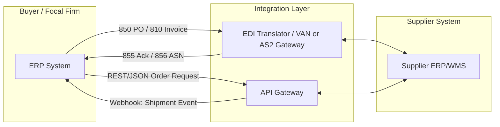

## EDI, APIs, and System-to-System Integration

### Definition

System-to-system integration in supply chains refers to the automated, machine-readable exchange of transactional and operational data between the disparate IT systems of trading partners — eliminating manual re-keying, fax, and email-based coordination. The two dominant technical paradigms are **Electronic Data Interchange (EDI)**, a decades-old standardized batch messaging protocol, and **Application Programming Interfaces (APIs)**, a newer request/response or event-driven integration style. Both serve the same architectural purpose — synchronizing the information flow layer of the supply chain with the physical and financial flows — but differ substantially in latency, flexibility, and implementation cost.

### Electronic Data Interchange (EDI)

**Core Characteristics**

- Structured, standardized document formats exchanged between trading partners' computer systems without human intervention
- Governed by formal standards bodies: **ANSI X12** (dominant in North America) and **UN/EDIFACT** (dominant internationally)
- Operates primarily in **batch mode**: documents are generated, transmitted, and processed on a schedule (e.g., nightly batches) rather than in real time
- Requires a **trading partner agreement** defining document types, transmission schedule, and acknowledgment protocol

**Common EDI Transaction Sets (X12)**

| Code | Name | Purpose |
| --- | --- | --- |
| 850 | Purchase Order | Buyer sends order to supplier |
| 855 | Purchase Order Acknowledgment | Supplier confirms/modifies order |
| 856 | Advance Ship Notice (ASN) | Supplier notifies shipment contents/timing before arrival |
| 810 | Invoice | Supplier bills buyer |
| 820 | Payment Order/Remittance Advice | Buyer's payment instruction |
| 940 | Warehouse Shipping Order | Instructs 3PL/warehouse to ship |
| 945 | Warehouse Shipping Advice | Confirms shipment from warehouse |
| 214 | Transportation Carrier Shipment Status | Carrier provides shipment tracking updates |

**Transmission Methods**

- **VAN (Value-Added Network)**: A third-party intermediary mailbox service; historically dominant, still common in legacy environments
- **AS2 (Applicability Statement 2)**: Direct, encrypted point-to-point transmission over HTTP/S with MDN (Message Disposition Notification) receipts; the modern retail-industry standard (mandated by major retailers like Walmart)
- **SFTP**: File-based batch transfer, common for simpler or lower-volume relationships

### APIs in Supply Chain Integration

**Core Characteristics**

- Typically **REST**ful over HTTPS with JSON payloads, though **SOAP**/XML and increasingly **GraphQL** and event-streaming (Kafka, webhooks) patterns are used
- Supports **real-time or near-real-time** data exchange, versus EDI's batch orientation
- Lower barrier to entry for smaller trading partners compared to formal EDI onboarding
- Enables richer, more granular data queries (e.g., "get current inventory for SKU X at warehouse Y" on demand) rather than fixed document schemas

**Common API-Driven Integration Patterns**

- **Order management APIs**: Real-time order creation, status polling, and cancellation
- **Inventory visibility APIs**: On-demand stock level queries across distributed nodes
- **Webhook-based event notification**: Push-based alerts (e.g., shipment departed, order fulfilled) replacing EDI's poll/batch cadence
- **Carrier/logistics APIs**: Real-time rate shopping, label generation, and tracking (e.g., integration with carrier systems for live transit updates)

### Comparative Analysis

| Dimension | EDI | API |
| --- | --- | --- |
| Latency | Batch (hours/overnight typical) | Real-time/near-real-time |
| Standardization | High (X12/EDIFACT formal standards) | Variable (each provider defines its own schema unless using an industry standard like GS1) |
| Onboarding cost/time | High — mapping, testing, trading partner agreements | Lower — often self-service developer portals |
| Typical adopters | Large enterprises, established retail/logistics networks | SMBs, modern SaaS platforms, direct-to-consumer integrations |
| Data granularity | Fixed document/transaction structure | Flexible query/response structure |
| Reliability pattern | MDN/functional acknowledgments (997) | HTTP status codes, retries, idempotency keys |
| Security | AS2 encryption, VAN access controls | OAuth 2.0, API keys, mTLS |

[Inference: The general trend toward API adoption is well documented industry-wide, but the pace of EDI displacement varies significantly by sector — large retail and automotive supply chains remain heavily EDI-dependent due to sunk infrastructure investment and regulatory/contractual mandates from dominant trading partners]

### Illustration: Dual Integration Architecture

### Middleware and Translation Layer

Because trading partners rarely run identical internal systems, an **integration/middleware layer** typically mediates between internal ERP/WMS systems and external EDI or API channels:

- **EDI translators**: Convert internal data formats to/from X12/EDIFACT segments (e.g., mapping an internal "SalesOrder" object to an 850 transaction)
- **Integration Platform as a Service (iPaaS)**: Cloud-based middleware (e.g., MuleSoft, Boomi, Azure Logic Apps) that orchestrates both EDI and API flows through unified pipelines
- **Master data synchronization**: Product/SKU catalogs, location codes (e.g., GS1 GLN), and partner IDs must be harmonized across systems to prevent transaction mismatches

### Convergence: EDI-over-API

A growing architectural pattern wraps traditional EDI transaction semantics in modern API interfaces — exposing EDI document types (850, 856, 810) as RESTful endpoints or JSON payloads internally, while still transmitting AS2/X12 externally to comply with partner requirements. This allows internal development teams to work with modern API tooling while preserving external EDI compliance. [Inference: this pattern is an increasingly common integration strategy based on general industry direction, though its prevalence has not been independently quantified here]

### **Example**

A retailer's ERP generates an 850 Purchase Order, transmitted via AS2 to a supplier's EDI translator, which parses it into the supplier's internal order system. The supplier responds with an 855 acknowledgment and later an 856 ASN before shipment. In parallel, the retailer's logistics team uses a carrier's REST API to fetch real-time tracking data via webhook, since the carrier's shipment status updates arrive faster through the API than waiting for a batch 214 transaction set.

### **Key Points**

- EDI and APIs are not mutually exclusive — most modern supply chains run **hybrid architectures**, using EDI for high-volume, standardized, contractually mandated transactions and APIs for real-time visibility and smaller/agile trading partners.
- The **information flow's timeliness** directly affects the accuracy of physical and financial flow synchronization; batch-based EDI latency is a known contributor to bullwhip-effect-style information distortion.
- Master data alignment (product codes, location identifiers) is a prerequisite for either integration method to function correctly — technical protocol choice does not solve semantic data mismatches.

### **Related Topics**

- GS1 Standards and Global Location Numbers (GLN) for Supply Chain Identification
- Advance Ship Notice (ASN) Processing and Warehouse Receiving Automation
- Bullwhip Effect and Information Flow Latency
- iPaaS and Middleware Architecture for Multi-Partner Integration
- Blockchain-Based Supply Chain Traceability
- Supply Chain Control Towers and Real-Time Visibility Platforms