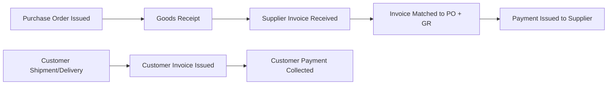

## Financial Flow and the Cash-to-Cash Cycle

### Definition and Core Concept

Financial flow refers to the movement of monetary value through a supply chain — payments, credit terms, invoicing, and the timing of cash inflows and outflows between trading partners. It is one of three parallel supply chain flows (alongside physical product flow and information flow) and is typically triggered by, and dependent on, milestones in the other two.

The cash-to-cash cycle (also called the cash conversion cycle, CCC) is the core financial flow metric: it measures the time elapsed between when a company pays cash out for inputs (raw materials, inventory) and when it collects cash in from customers for the resulting sales.

### Cash-to-Cash Cycle Formula

$$CCC = DIO + DSO - DPO$$

Where:

- **DIO (Days Inventory Outstanding)**: average number of days inventory is held before being sold
- **DSO (Days Sales Outstanding)**: average number of days it takes to collect payment after a sale
- **DPO (Days Payable Outstanding)**: average number of days a company takes to pay its own suppliers

**Component Formulas**

$$DIO = \frac{\text{Average Inventory}}{\text{Cost of Goods Sold}} \times 365$$

$$DSO = \frac{\text{Average Accounts Receivable}}{\text{Total Credit Sales}} \times 365$$

$$DPO = \frac{\text{Average Accounts Payable}}{\text{Cost of Goods Sold}} \times 365$$

**Example**

A distributor has:

- Average inventory of $2,000,000 and annual COGS of $12,000,000 → $DIO = (2{,}000{,}000 / 12{,}000{,}000) \times 365 \approx 61$ days
- Average accounts receivable of $1,500,000 and annual credit sales of $15,000,000 → $DSO = (1{,}500{,}000 / 15{,}000{,}000) \times 365 = 36.5$ days
- Average accounts payable of $1,000,000 and annual COGS of $12,000,000 → $DPO = (1{,}000{,}000 / 12{,}000{,}000) \times 365 \approx 30.4$ days

$$CCC = 61 + 36.5 - 30.4 \approx 67.1 \text{ days}$$

This means the company's cash is tied up in the operating cycle for approximately 67 days before it converts back to cash from customer collections.

### Why the Cash-to-Cash Cycle Matters

**Key Points**

- A lower (or negative) CCC means the company relies less on external financing to fund operations, since it collects cash from customers faster than it must pay suppliers
- Some large retailers achieve negative CCC by combining fast inventory turnover (low DIO), rapid customer payment (low DSO, often near-zero for cash/card retail sales), and extended supplier payment terms (high DPO) — this is a well-documented structural advantage of certain retail business models [Inference: achieving negative CCC depends heavily on industry, bargaining power with suppliers, and sales channel mix, and is not achievable or appropriate for every business type]
- CCC is a key input to working capital planning: a longer CCC means more cash is tied up in the operating cycle and unavailable for other uses (capital investment, debt reduction, growth financing)
- Supply chain design decisions directly affect CCC — for example, reducing inventory holding time (DIO) through better demand forecasting or faster replenishment cycles improves the CCC without touching payment terms at all

### Financial Flow Triggers Along the Supply Chain

Financial flow does not occur continuously; it is triggered at specific milestones tied to physical and information flow events.

**Key Points**

- **Purchase order issuance**: creates a financial commitment (encumbrance) but not yet a cash flow event
- **Goods receipt**: in many procurement processes, this is the trigger point for invoice matching to begin
- **Invoice receipt and matching**: the invoice must typically be reconciled against the purchase order and goods receipt record before payment is authorized
- **Payment issuance**: cash actually leaves the buyer's account, based on agreed payment terms (e.g., Net 30, Net 60)
- **Customer invoicing**: typically triggered by shipment or delivery confirmation, depending on contract terms (FOB origin vs. FOB destination)
- **Customer payment collection**: cash enters the seller's account, completing the cycle for that transaction

### The Three-Way Match Process

A common financial control used to authorize supplier payment, requiring agreement across three documents:

1. **Purchase Order**: what was ordered (quantity, price, terms)
2. **Goods Receipt (or Receiving Report)**: what was actually received
3. **Supplier Invoice**: what the supplier is billing for

**Key Points**

- Payment is only authorized when all three documents agree within acceptable tolerance (exact match or a defined tolerance percentage for quantity/price variance)
- Discrepancies trigger an exception workflow (e.g., short-shipment dispute, price variance investigation) rather than automatic payment
- Automating three-way match (via ERP or AP automation software) significantly reduces manual invoice processing time and reduces duplicate payment or overpayment risk, though exception rates and processing time savings vary by organization and data quality [Unverified: specific efficiency/error-reduction percentages depend heavily on the source system and baseline process maturity]

### Payment Terms and Their Supply Chain Impact

**Key Points**

- **Net terms** (Net 30, Net 60, Net 90): specify the number of days after invoice date that payment is due
- **Early payment discounts** (e.g., "2/10 Net 30" — 2% discount if paid within 10 days, otherwise full amount due in 30 days): incentivize faster payment in exchange for a cash discount, effectively an annualized cost of capital trade-off for the paying party
- **Extended payment terms**: increasingly used by large buyers to improve their own DPO, sometimes putting cash flow pressure on smaller suppliers with less financing flexibility
- **Consignment inventory arrangements**: the supplier retains ownership of inventory until it is sold or consumed, deferring the buyer's cash outflow until actual usage — this shifts inventory carrying cost (and DIO exposure) to the supplier

### Supply Chain Finance (SCF) Instruments

**Key Points**

- **Reverse factoring (supply chain finance programs)**: a financial institution pays the supplier early (at a discount) based on the buyer's approved invoice, while the buyer still pays the institution on the original due date — improves supplier cash flow without extending the buyer's own payment terms
- **Dynamic discounting**: buyers offer suppliers the option to receive early payment at a sliding-scale discount rate that increases the earlier payment is requested
- **Trade credit insurance**: protects a seller against customer non-payment risk, allowing more flexible credit terms to be extended without proportionally increasing bad-debt risk
- **Letters of credit (LC)**: used heavily in international trade to guarantee payment to an exporter upon presentation of compliant shipping documents, reducing counterparty risk in cross-border transactions

### Financial Flow and the Bullwhip/Working Capital Relationship

**Key Points**

- Poor information flow synchronization (e.g., delayed goods receipt confirmation) directly delays financial flow triggers, artificially inflating measured DPO/DSO even when underlying payment terms haven't changed
- Excess inventory held to buffer against demand uncertainty increases DIO and therefore CCC, tying up working capital that could otherwise be deployed elsewhere
- Network design decisions (e.g., adding a regional distribution center) that reduce lead time and required safety stock can have a measurable secondary effect of reducing DIO and improving overall cash-to-cash performance [Inference: the magnitude of this effect is company- and network-specific and requires case-specific financial modeling to quantify]

### Illustrative Cash-to-Cash Timeline

<svg xmlns="http://www.w3.org/2000/svg" viewBox="0 0 850 260">
<title>Cash-to-Cash Cycle Timeline (svg_diagram)</title>
\<style\>
.axis { stroke: #333; stroke-width: 2; }
.dio { fill: #cfe2f3; stroke: #1155cc; stroke-width: 1.5; }
.dso { fill: #d9ead3; stroke: #38761d; stroke-width: 1.5; }
.dpo { fill: #fce5cd; stroke: #b45f06; stroke-width: 1.5; }
.txt { font-family: Arial, sans-serif; font-size: 13px; fill: #111; }
.hdr { font-family: Arial, sans-serif; font-size: 14px; font-weight: bold; fill: #111; }
\</style\>
<line x1="60" y1="220" x2="780" y2="220" class="axis" />
<text x="60" y="240" class="txt">Day 0 (Pay Supplier begins DPO clock)</text>
<rect x="60" y="60" width="150" height="30" class="dpo" />
<text x="65" y="55" class="hdr">DPO (~30 days)</text>
<text x="65" y="105" class="txt">Buyer holds cash before paying supplier</text>
<rect x="210" y="100" width="300" height="30" class="dio" />
<text x="215" y="95" class="hdr">DIO (~61 days)</text>
<text x="215" y="145" class="txt">Inventory held before sale</text>
<rect x="510" y="140" width="180" height="30" class="dso" />
<text x="515" y="135" class="hdr">DSO (~36 days)</text>
<text x="515" y="185" class="txt">Time to collect from customer</text>
<line x1="60" y1="200" x2="690" y2="200" stroke="#990000" stroke-width="2" stroke-dasharray="6,3" />
<text x="300" y="215" class="txt" fill="#990000">Cash-to-Cash Cycle ≈ 67 days</text>
</svg>

### Common Pitfalls in Financial Flow Design

**Key Points**

- Optimizing DPO in isolation (extending supplier payment terms aggressively) without considering supplier financial health, which can create supply risk if smaller suppliers face cash flow strain
- Treating physical, information, and financial flows as independently managed processes rather than a synchronized system, leading to invoice/payment delays caused by information flow bottlenecks rather than genuine payment term issues
- Failing to reconcile three-way match exceptions promptly, causing invoice backlogs that distort true DPO measurement
- Underestimating the working capital impact of inventory decisions made purely for service-level reasons (e.g., safety stock increases) without a corresponding CCC impact analysis
- Ignoring currency and cross-border payment timing risk in global supply chains, which can introduce additional float and FX exposure into the financial flow cycle

### Related Topics

- Working Capital Optimization in Supply Chain Networks
- Supply Chain Finance Programs (Reverse Factoring, Dynamic Discounting)
- Three-Way Match Automation and Accounts Payable Systems
- Inventory Policy Design and Its Impact on Days Inventory Outstanding
- International Trade Finance Instruments (Letters of Credit, Trade Credit Insurance)
- Bullwhip Effect and Its Financial Flow Consequences