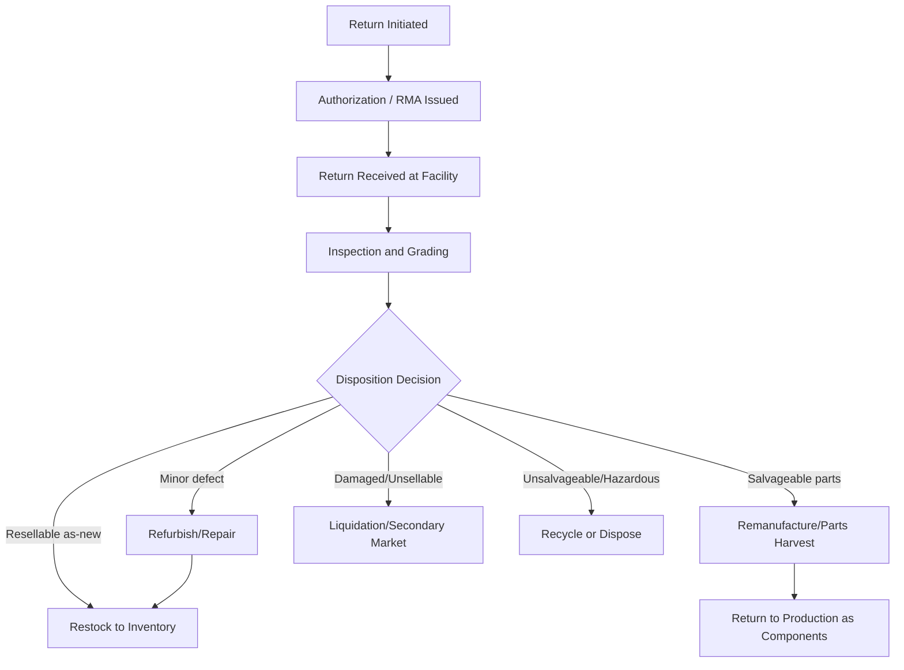

## Reverse Logistics and Return Flow Architecture

### Definition and Core Concept

Reverse logistics is the process of planning, implementing, and controlling the efficient, cost-effective flow of raw materials, in-process inventory, finished goods, and related information from the point of consumption back to the point of origin, for the purpose of recapturing value or ensuring proper disposal. It is the structural counterpart to forward (outbound) distribution, but with fundamentally different flow characteristics: return flow is typically less predictable, more fragmented in origin, and requires disposition decision-making that forward flow does not.

### Reverse Logistics vs. Forward Logistics: Key Structural Differences

**Key Points**

- **Origin fragmentation**: forward flow originates from a small number of known nodes (DCs, plants); reverse flow originates from a large number of unpredictable points (individual consumers, retail stores)
- **Quality uncertainty**: forward flow ships known, quality-verified inventory; reverse flow arrives in unknown condition (undamaged, damaged, defective, used) requiring inspection before disposition
- **Demand predictability**: forward flow can be forecasted using demand planning methods; return volume is harder to forecast and is often tied to unrelated factors (product defect rates, customer behavior, return policy generosity)
- **Value density decline**: returned goods often have declining value the longer they sit unprocessed (obsolescence, seasonal relevance, warranty window expiration), creating urgency around fast disposition that differs from forward inventory holding incentives

### Categories of Reverse Flow

**Product Returns**

Consumer or B2B returns of purchased goods, driven by buyer's remorse, sizing/fit issues, defects, or dissatisfaction. This is the highest-volume category in retail and e-commerce contexts.

**Warranty and Repair Returns**

Products returned for repair, replacement, or refurbishment under a manufacturer or extended warranty program.

**End-of-Life (EOL) Returns**

Products returned at the end of their useful life for recycling, remanufacturing, or disposal, often driven by environmental regulation (e.g., WEEE directive for electronics in the EU) or corporate sustainability commitments.

**Recalls**

Mandatory or voluntary product recalls requiring rapid, often regulator-mandated, retrieval of specific product lots from the market.

**Packaging and Reusable Asset Returns**

Return of reusable packaging, pallets, totes, or containers (e.g., pallet pooling systems) back to the originating node for reuse — a closed-loop flow distinct from product returns.

**Excess/Unsold Inventory Returns**

Returns of unsold inventory from retail partners back to distributors or manufacturers under contractual return-rights agreements (common in publishing, apparel, and consumer electronics).

### The Reverse Logistics Process Flow

### Return Merchandise Authorization (RMA) Process

**Key Points**

- The RMA process is the information-flow gatekeeper for reverse logistics: it validates that a return is eligible (within policy window, valid reason) before physical return is authorized
- A well-designed RMA process captures return reason codes at initiation, which feeds root-cause analysis for defect trends, sizing issues, or fulfillment errors
- RMA authorization typically generates a return shipping label and tracking number, allowing the receiving facility to anticipate incoming volume and match it against the original order record
- Reason code granularity is a key design trade-off: overly broad categories (e.g., generic "other") reduce the diagnostic value of return data, while overly granular categories increase friction in the return initiation process for customers

### Facility Design for Returns Processing

**Centralized Returns Centers (CRCs)**

Dedicated facilities specializing solely in return receipt, inspection, grading, and disposition. This model concentrates specialized labor and equipment (grading stations, refurbishment lines) but adds transportation time and cost to route returns to a single national or regional location.

**Integrated Returns Processing**

Returns processed within the same facility as forward distribution operations, typically in a physically separated zone to avoid cross-contamination of returned and new inventory before inspection is complete. Reduces transportation cost but can create resource contention with forward operations during peak return periods (e.g., post-holiday returns surge).

**Key Facility Design Considerations**

- Dedicated receiving and inspection zones, physically separated from forward-flow inventory until disposition grading is complete, to prevent unverified returns from being commingled with sellable stock
- Grading stations equipped for the product category (e.g., functional testing benches for electronics, visual inspection stations for apparel)
- Staging areas segmented by disposition outcome (restock, refurbish, liquidate, dispose) to support downstream routing
- Capacity planning that accounts for seasonal return surges, which can spike dramatically above baseline volume in retail/e-commerce contexts following peak selling periods

### Disposition Decision Framework

**Key Points**

- **Grade A (like-new)**: returned to sellable inventory, sometimes requiring repackaging
- **Grade B (minor cosmetic/functional issue)**: routed to refurbishment, then resold as "open box" or "refurbished" at a discount
- **Grade C (significant damage/defect)**: routed to secondary market liquidation channels (discount resellers, liquidation auction platforms) or parts harvesting
- **Grade D (unsalvageable/hazardous)**: routed to recycling or regulated disposal, particularly critical for electronics (e-waste regulations) and products with hazardous materials

The disposition decision directly determines the value recovery rate — the percentage of original product value recaptured through the reverse logistics process — which is a key performance metric for reverse logistics operations.

### Reverse Logistics Network Design Considerations

**Key Points**

- Reverse network topology does not need to mirror the forward network; many organizations use fewer, more centralized nodes for returns processing than for forward distribution, since return processing benefits more from specialized labor/equipment consolidation than from proximity to end customers
- Transportation mode selection for reverse flow often differs from forward flow — reverse shipments are frequently smaller, less time-sensitive (except for recalls), and may use different carriers or consolidation points optimized for cost over speed
- Some organizations use third-party reverse logistics providers (3PLs specializing in returns processing) rather than building internal capability, particularly for lower-volume or highly specialized categories (electronics refurbishment, apparel liquidation)

### Information Flow Requirements for Reverse Logistics

**Key Points**

- Return tracking must be linked back to the original order/shipment record to validate authenticity and support fraud detection (e.g., detecting return fraud patterns like wardrobing or serial returners)
- Disposition outcome data should feed back into quality/defect reporting systems to support root-cause corrective action with suppliers or manufacturing
- Inventory systems must distinguish between "in-transit return" (not yet available for resale), "in inspection" (pending grading), and "restocked" (available for resale) states to avoid overstating available inventory prematurely

### Reverse Logistics Cost Structure

**Key Points**

- **Transportation cost**: return shipping cost, often absorbed by the retailer/seller as part of a customer-friendly returns policy in competitive markets
- **Processing labor cost**: inspection, grading, and disposition routing labor, typically more labor-intensive per unit than forward-flow putaway due to condition variability
- **Value loss**: markdown or liquidation discount applied to returned goods relative to original sale price, representing the largest single cost component for many retail return programs [Inference: the relative weighting of cost components varies significantly by product category and return volume, and specific percentage breakdowns should be validated against company-specific data rather than assumed universally]
- **Disposal/recycling cost**: cost of proper disposal for unsalvageable or regulated waste categories, which can carry compliance risk if handled improperly

### Illustrative Reverse Logistics Network

<svg xmlns="http://www.w3.org/2000/svg" viewBox="0 0 850 300">
<title>Reverse Logistics Network Structure (svg_diagram)</title>
\<style\>
.cust { fill: #f4cccc; stroke: #990000; stroke-width: 1.5; }
.crc { fill: #cfe2f3; stroke: #1155cc; stroke-width: 2; }
.out1 { fill: #d9ead3; stroke: #38761d; stroke-width: 1.5; }
.out2 { fill: #fff2cc; stroke: #bf9000; stroke-width: 1.5; }
.out3 { fill: #e6b8af; stroke: #85200c; stroke-width: 1.5; }
.txt { font-family: Arial, sans-serif; font-size: 12px; fill: #111; }
.hdr { font-family: Arial, sans-serif; font-size: 13px; font-weight: bold; fill: #111; }
.arrow { stroke: #333; stroke-width: 1.5; fill: none; marker-end: url(#arrow2); }
\</style\>
<rect x="20" y="30" width="100" height="40" class="cust" />
<text x="30" y="55" class="hdr">Customer A</text>
<rect x="20" y="90" width="100" height="40" class="cust" />
<text x="30" y="115" class="hdr">Customer B</text>
<rect x="20" y="150" width="100" height="40" class="cust" />
<text x="30" y="175" class="hdr">Customer C</text>
<rect x="330" y="90" width="180" height="70" class="crc" />
<text x="345" y="120" class="hdr">Centralized Returns</text>
<text x="345" y="138" class="hdr">Center (CRC)</text>
<rect x="650" y="20" width="160" height="45" class="out1" />
<text x="660" y="47" class="hdr">Restock (Grade A)</text>
<rect x="650" y="80" width="160" height="45" class="out2" />
<text x="660" y="107" class="hdr">Refurbish (Grade B)</text>
<rect x="650" y="140" width="160" height="45" class="out3" />
<text x="660" y="167" class="hdr">Liquidate (Grade C)</text>
<rect x="650" y="200" width="160" height="45" class="cust" />
<text x="660" y="227" class="hdr">Recycle/Dispose (D)</text>
<path d="M120,50 L330,110" class="arrow" />
<path d="M120,110 L330,120" class="arrow" />
<path d="M120,170 L330,140" class="arrow" />
<path d="M510,105 Q580,60 650,42" class="arrow" />
<path d="M510,115 Q580,100 650,102" class="arrow" />
<path d="M510,130 Q580,150 650,162" class="arrow" />
<path d="M510,145 Q580,190 650,222" class="arrow" />
</svg>

### Sustainability and Regulatory Considerations

**Key Points**

- Extended Producer Responsibility (EPR) regulations in many jurisdictions require manufacturers to fund or manage end-of-life collection and recycling of their products, directly shaping reverse network design requirements
- Circular economy initiatives increasingly treat reverse logistics as a value-recovery function rather than a pure cost center, driving investment in refurbishment and remanufacturing capability
- Hazardous material handling in reverse flow (batteries, chemicals, electronics) is subject to specific regulatory transport and disposal requirements that differ from standard forward-flow freight classifications

### Common Design Pitfalls

**Key Points**

- Designing forward and reverse networks with identical topology, missing the cost/consolidation advantages of centralizing specialized returns processing
- Underinvesting in fast disposition, allowing returned inventory to sit un-graded and lose resale value while awaiting processing
- Failing to segregate ungraded returns from sellable inventory, risking commingling errors that could route unverified or defective goods back into forward-sale channels
- Treating reverse logistics purely as a cost center without capturing the diagnostic value of return reason-code data for upstream quality improvement
- Underestimating seasonal return volume spikes in capacity planning, leading to processing backlogs and delayed refunds/credits to customers

### Related Topics

- Circular Economy and Closed-Loop Supply Chain Design
- Extended Producer Responsibility (EPR) and E-Waste Regulation
- Returns Policy Design and Its Impact on Reverse Logistics Volume
- Refurbishment and Remanufacturing Operations Design
- Reusable Packaging and Pallet Pooling Systems
- Root-Cause Quality Feedback Loops from Return Data