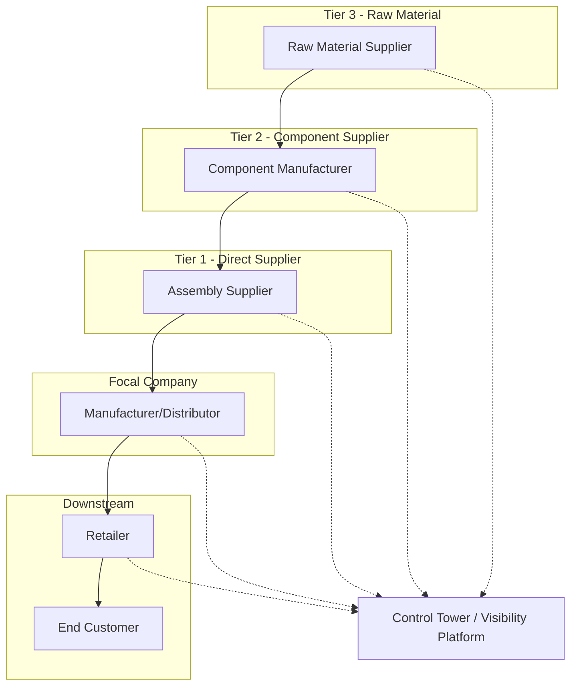

## Synchronizing Flows Across Multiple Tiers

### Definition and Core Concept

Multi-tier flow synchronization is the coordination of physical, information, and financial flows across successive supply chain tiers — from raw material/component suppliers (Tier 2, Tier 3, and beyond), through direct suppliers (Tier 1), through the focal manufacturer or distributor, and onward to downstream distributors, retailers, and end customers. Synchronization means that the timing, volume, and status of flow at each tier is coordinated with adjacent tiers so that no single tier's decisions create distortion, delay, or excess buffer elsewhere in the chain.

This differs from single-node flow design (covered in physical/information/financial flow architecture individually) in that the unit of analysis is the multi-party network, and the central challenge is that each tier typically has incomplete visibility into the others' actual demand, inventory position, and capacity constraints.

### Why Multi-Tier Synchronization Is Difficult

**Key Points**

- Each tier makes independent ordering and inventory decisions based on the demand signal it observes from the tier immediately downstream, not the true end-customer demand
- Order batching, promotional forecasting errors, and lead-time buffers introduced at each tier compound as they propagate upstream
- Information delay (the time between an actual event and when other tiers become aware of it) is a primary driver of poor synchronization — even accurate data loses value if it arrives too late to inform upstream decisions
- Financial flow terms (payment timing) at one tier can create incentives that conflict with physical/information flow optimization at another (e.g., a supplier extending production run length to reduce changeover cost, misaligned with the buyer's just-in-time delivery need)

### The Bullwhip Effect

The bullwhip effect is the most well-documented consequence of poor multi-tier synchronization: small fluctuations in end-customer demand become progressively amplified into larger swings in order volume at each successive upstream tier.

**Key Points**

- Commonly attributed causes include demand signal processing (each tier forecasting based on the tier below rather than true demand), order batching (ordering in large lots to reduce ordering cost), price fluctuations (forward-buying during promotions), and rationing/shortage gaming (inflated orders during perceived shortages)
- The effect was formally studied and popularized through supply chain research (notably associated with Hau Lee and colleagues in the 1990s) and remains a foundational concept in multi-tier coordination theory [Unverified: exact attribution and publication details should be confirmed if cited academically; the underlying phenomenon is well-established regardless of specific citation]
- Bullwhip amplification increases inventory carrying cost, safety stock requirements, and capacity planning difficulty at upstream tiers, even when true end demand is relatively stable

*(Order volume variance typically increases at each step moving right, illustrating amplification)*

### Synchronization Mechanisms

**Information Sharing Approaches**

- **Point-of-Sale (POS) Data Sharing**: providing upstream tiers direct visibility into actual end-customer sales data rather than relying solely on replenishment orders, reducing demand signal distortion
- **Vendor-Managed Inventory (VMI)**: the supplier is given visibility into (and often responsibility for) the buyer's inventory levels and makes replenishment decisions directly, collapsing a layer of independent forecasting/ordering decisions
- **Collaborative Planning, Forecasting, and Replenishment (CPFR)**: a structured, multi-step process (per the VICS CPFR model) in which trading partners jointly develop a single shared forecast rather than each maintaining separate, potentially conflicting forecasts
- **Control Tower / Multi-Tier Visibility Platforms**: technology platforms that aggregate status data across multiple tiers (often including sub-tier suppliers beyond direct Tier 1 relationships) into a unified view, allowing exception-based management across the extended network

**Physical Flow Synchronization Approaches**

- **Just-In-Time (JIT) Delivery Scheduling**: synchronizing supplier delivery windows directly to the buyer's production or replenishment schedule, minimizing buffer inventory at the receiving tier
- **Milk-Run Collection**: a single vehicle collects smaller quantities from multiple suppliers on a fixed route and schedule, synchronizing multiple upstream tiers' outbound timing to a single coordinated inbound delivery at the downstream facility
- **Kanban and Pull-Based Replenishment**: downstream consumption directly triggers upstream replenishment signals, rather than replenishment being driven by independent forecast-based push decisions at each tier

**Financial Flow Synchronization Approaches**

- **Aligned Payment Terms Across Tiers**: structuring payment terms consistently through the chain to avoid one tier's cash flow position degrading due to terms imposed by an adjacent tier
- **Supply Chain Finance Programs**: extending favorable early-payment financing to upstream tiers (particularly smaller sub-tier suppliers) to prevent cash flow constraints from disrupting physical flow reliability

### Multi-Tier Visibility Architecture

**Key Points**

- True multi-tier visibility (beyond direct Tier 1 suppliers) requires either direct data-sharing agreements with sub-tier suppliers or the use of a shared platform that sub-tier suppliers also participate in
- Many organizations have strong visibility into Tier 1 relationships but limited or no visibility into Tier 2/Tier 3, which becomes a significant risk exposure during supply disruptions (e.g., a Tier 3 raw material shortage that is invisible until it surfaces as a Tier 1 delivery delay)
- EPCIS (GS1 event data standard) and blockchain-based traceability platforms are increasingly used to extend visibility across multiple tiers for regulated or high-risk-of-disruption categories (pharmaceuticals, conflict minerals, food safety)

### Quantifying Synchronization Gaps

**Order Variance Amplification Ratio**

A simplified way to measure bullwhip amplification between two adjacent tiers is the ratio of order quantity variance to actual demand variance:

$$\text{Amplification Ratio} = \frac{\text{Var}(\text{Orders Placed})}{\text{Var}(\text{Actual Demand})}$$

A ratio greater than 1 indicates amplification is occurring at that tier transition; a ratio at or near 1 indicates the tier is passing through demand signal without distortion.

**Lead Time and Buffer Stacking**

$$LT_{total} = \sum_{i=1}^{n} LT_i$$

Where $LT_i$ is the lead time contributed by tier $i$. Each tier's independently-set safety stock is often calculated against its own perceived lead time and demand variability, without accounting for the fact that downstream tiers are simultaneously holding buffer against the same underlying uncertainty — resulting in redundant buffer stacking across the network rather than an optimally pooled safety stock position. [Inference: the degree of redundant buffering depends on how independently each tier sets its inventory policy, and is reduced substantially under coordinated policies like VMI or centrally optimized multi-echelon inventory models]

### Multi-Echelon Inventory Optimization (MEIO)

**Key Points**

- MEIO is a quantitative approach to setting inventory targets across multiple tiers simultaneously, rather than each tier optimizing independently, explicitly accounting for how safety stock at one echelon reduces the need for safety stock at another
- MEIO models typically require accurate lead time, demand variability, and service-level target data across all included tiers — data quality and cross-tier data sharing are prerequisites for effective implementation
- Full multi-echelon optimization software implementations are complex and are typically justified for networks with significant inventory investment and stable enough structure to model reliably [Inference: implementation complexity and ROI thresholds vary by organization size and network structure, and specific complexity/cost figures depend on the ERP/planning system used]

### Governance and Contractual Alignment

**Key Points**

- Synchronization requires not just technical integration but aligned incentives: if a tier's performance metrics reward behavior that conflicts with network-wide synchronization (e.g., a plant manager incentivized purely on production run efficiency rather than delivery timing), technical visibility alone will not resolve the misalignment
- Service level agreements (SLAs) and vendor scorecards should be designed with cross-tier impact in mind, not solely single-tier local optimization
- Trust and data-sharing willingness between independent legal entities (as opposed to internal divisions of one company) is often the limiting factor in multi-tier synchronization, more so than technology capability

### Common Pitfalls

**Key Points**

- Investing in Tier 1 visibility and synchronization while leaving Tier 2/Tier 3 as blind spots, creating disruption risk that only surfaces when it is already too late to mitigate
- Sharing information across tiers without addressing underlying incentive misalignment, resulting in visibility that does not change behavior
- Applying single-node inventory optimization independently at each tier rather than considering multi-echelon buffer redundancy
- Treating synchronization as a one-time integration project rather than an ongoing governance and relationship management function
- Underestimating the trust and contractual barriers to data sharing between independent companies, which are often harder to resolve than the technical integration itself

### Related Topics

- Bullwhip Effect: Causes, Measurement, and Mitigation
- Multi-Echelon Inventory Optimization (MEIO) Modeling
- Collaborative Planning, Forecasting, and Replenishment (CPFR)
- Vendor-Managed Inventory (VMI) Program Design
- Supply Chain Control Towers and Extended Network Visibility
- Sub-Tier Supplier Risk Mapping and Traceability