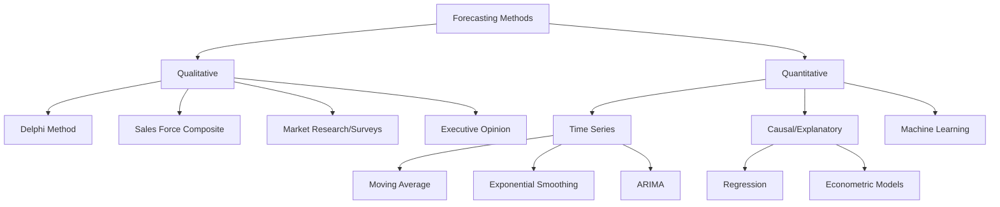

## Qualitative and Quantitative Forecasting Methods

### Definition and Core Concept

Demand forecasting methods fall into two broad categories: qualitative methods, which rely on human judgment, expertise, and structured opinion synthesis when historical data is unavailable, unreliable, or insufficient to capture future conditions; and quantitative methods, which use statistical and mathematical models applied to historical data to project future demand. Effective demand planning typically blends both categories rather than relying exclusively on one.

### When to Use Qualitative vs. Quantitative Methods

**Key Points**

- Qualitative methods are preferred when historical data is absent (new product launches), unreliable (recent business model change), or when structural discontinuities make historical patterns poor predictors of the future (new market entry, disruptive competitive event)
- Quantitative methods are preferred when sufficient historical data exists and the underlying demand pattern is expected to continue with reasonable stability, or when patterns (trend, seasonality) can be explicitly modeled
- Long-range strategic forecasts often lean more qualitative (market entry decisions, capacity investment); short- to medium-range operational forecasts (weekly/monthly replenishment) typically lean more quantitative
- Best practice in most mature demand planning organizations combines a statistical baseline forecast with qualitative overlay/adjustment from sales, marketing, or category management input — a process often called "forecast collaboration" or "consensus forecasting"

### Qualitative Forecasting Methods

**Delphi Method**

A structured, iterative process in which a panel of experts independently provides forecasts or judgments, which are then anonymously aggregated and shared back with the panel for a further round of revision. This repeats for multiple rounds until responses converge toward consensus.

- Reduces the influence of dominant personalities or groupthink compared to open group discussion, since responses are anonymous
- Time-intensive due to multiple rounds, making it more suited to infrequent, high-stakes forecasts (new market entry, long-range capacity planning) than routine operational forecasting

**Market Research and Surveys**

Direct collection of customer intentions, preferences, or purchase likelihood through structured surveys, focus groups, or conjoint analysis, commonly used for new product demand estimation prior to any sales history existing.

**Sales Force Composite**

Aggregating bottom-up estimates from individual sales representatives or account managers, who have direct customer-level knowledge that may not be reflected in aggregate historical data.

- Key risk: sales representatives may have incentive biases (e.g., under-forecasting to ensure they exceed targets, or over-forecasting to ensure inventory availability), which should be accounted for in how the composite is weighted or adjusted

**Executive/Jury of Executive Opinion**

A panel of senior managers or executives combines their judgment, often used for high-level strategic forecasts or when rapid consensus is needed without the multi-round time investment of a full Delphi process.

**Historical Analogy**

Using the demand pattern of a comparable existing product (a prior product launch, a similar product in an adjacent market) as a proxy for forecasting a new product with no history of its own.

**Scenario Planning**

Developing multiple plausible future scenarios (e.g., optimistic, base case, pessimistic) with associated qualitative and quantitative assumptions, used primarily for strategic and contingency planning rather than routine operational forecasting.

### Quantitative Forecasting Methods

**Time Series Methods**

Time series methods project future values based solely on the historical pattern of the variable itself (no external causal variables).

- **Moving Average**: forecasts the next period as the average of the most recent $n$ periods. Simple and smooths random noise but lags behind trend changes and treats all included periods with equal weight.

$$F_{t+1} = \frac{1}{n}\sum_{i=0}^{n-1} D_{t-i}$$

- **Weighted Moving Average**: similar to simple moving average but assigns higher weights to more recent periods, allowing the forecast to respond faster to recent changes while still smoothing noise.
- **Exponential Smoothing**: forecasts as a weighted average of the most recent actual demand and the most recent forecast, controlled by a smoothing constant $\alpha$ (between 0 and 1).

$$F_{t+1} = \alpha D_t + (1-\alpha) F_t$$

A higher $\alpha$ makes the forecast more responsive to recent actual demand; a lower $\alpha$ produces a smoother, more stable forecast that responds more slowly to change.

- **Holt's Linear Trend Method (Double Exponential Smoothing)**: extends exponential smoothing to explicitly track and project a trend component, appropriate for data with a consistent upward or downward trend but no seasonality.
- **Holt-Winters Method (Triple Exponential Smoothing)**: further extends Holt's method to include a seasonal component, appropriate for data exhibiting both trend and repeating seasonal patterns.
- **ARIMA (AutoRegressive Integrated Moving Average)**: a more statistically rigorous time series model that combines autoregressive terms, differencing (to achieve stationarity), and moving average terms, capable of modeling more complex time series patterns than exponential smoothing methods, at the cost of greater complexity in model identification and parameter tuning.

**Causal/Explanatory Methods**

Causal methods incorporate external variables believed to influence demand, rather than relying solely on the historical pattern of the demand variable itself.

- **Linear Regression**: models demand as a linear function of one or more explanatory variables (price, marketing spend, macroeconomic indicators).

$$D_t = \beta_0 + \beta_1 X_{1,t} + \beta_2 X_{2,t} + \cdots + \varepsilon_t$$

- **Multiple Regression with Leading Indicators**: uses variables that change in advance of demand (e.g., housing starts as a leading indicator for appliance demand) to improve forecast lead time
- **Econometric Models**: more complex systems of equations capturing multiple interacting economic relationships, typically used for macro-level, long-range demand forecasting rather than SKU-level operational forecasting

**Machine Learning–Based Methods**

Increasingly used in mature demand planning organizations, particularly for high-SKU-count, high-complexity demand environments.

- **Gradient Boosting Models** (e.g., XGBoost, LightGBM): tree-based ensemble methods effective at capturing non-linear relationships and interactions among many demand-driving features (price, promotion, weather, holiday calendars)
- **Neural Network–Based Forecasting** (e.g., LSTM, temporal fusion transformers): capable of modeling complex temporal dependencies and multiple related time series simultaneously, though requiring larger data volumes and more specialized modeling expertise than traditional statistical methods
- These approaches generally require substantially more historical data and feature engineering effort than traditional time series methods, and their incremental accuracy benefit over well-tuned statistical models varies by demand pattern complexity and data availability [Inference: the specific accuracy improvement from ML methods versus traditional statistical methods is context-dependent and should be validated through back-testing on the specific dataset rather than assumed]

### Forecast Accuracy Measurement

Regardless of method, forecast performance must be measured against actual outcomes to validate and continuously improve the approach.

**Mean Absolute Percentage Error (MAPE)**

$$MAPE = \frac{100\%}{n}\sum_{t=1}^{n} \left| \frac{D_t - F_t}{D_t} \right|$$

Widely used and intuitive (expressed as a percentage) but becomes distorted or undefined when actual demand $D_t$ is at or near zero, which is a known limitation for intermittent-demand SKUs.

**Mean Absolute Deviation (MAD)**

$$MAD = \frac{1}{n}\sum_{t=1}^{n} |D_t - F_t|$$

Expressed in the same units as demand, avoiding the divide-by-zero issue of MAPE, but less intuitive for cross-SKU comparison since it is not normalized.

**Bias**

$$Bias = \frac{1}{n}\sum_{t=1}^{n} (D_t - F_t)$$

Indicates whether a forecasting method systematically over-forecasts (negative bias) or under-forecasts (positive bias) over time, distinct from accuracy (which measures magnitude of error regardless of direction).

### Method Selection Framework

**Example**

| Situation | Recommended Approach |
| --- | --- |
| New product, no sales history | Qualitative: analogy, market research, sales force input |
| Stable, mature product with clear seasonality | Quantitative: Holt-Winters or seasonal ARIMA |
| High-SKU-count retail assortment with promotions | Quantitative: ML-based (gradient boosting) with promotional features |
| Long-range capacity/market-entry decision | Qualitative: Delphi, scenario planning, executive judgment |
| Product with known upcoming price change | Causal: regression incorporating price elasticity |
| Intermittent/lumpy demand (spare parts) | Specialized quantitative: Croston's method or similar intermittent-demand models |

### Common Pitfalls

**Key Points**

- Applying quantitative time series methods to new products with no historical pattern, producing a meaningless or zero-value forecast
- Relying solely on sales force composite forecasts without adjusting for known incentive bias, leading to systematic over- or under-forecasting
- Selecting model sophistication (e.g., ML-based methods) without sufficient historical data volume to support reliable training, resulting in overfitting
- Ignoring forecast bias in favor of monitoring only aggregate accuracy metrics like MAPE, missing systematic directional errors that compound over time
- Failing to incorporate qualitative overlay (known upcoming promotions, competitive actions, supply constraints) on top of a statistical baseline, missing information the statistical model cannot know from historical data alone

### Next Steps

- Forecast Accuracy Measurement and Continuous Improvement (MAPE, MAD, Bias, Forecast Value Added)
- Intermittent Demand Forecasting (Croston's Method, Syntetos-Boylan Approximation)
- Collaborative Planning, Forecasting, and Replenishment (CPFR)
- New Product Introduction (NPI) Forecasting Techniques
- Demand Sensing and Short-Term Forecast Adjustment
- Machine Learning Feature Engineering for Demand Forecasting