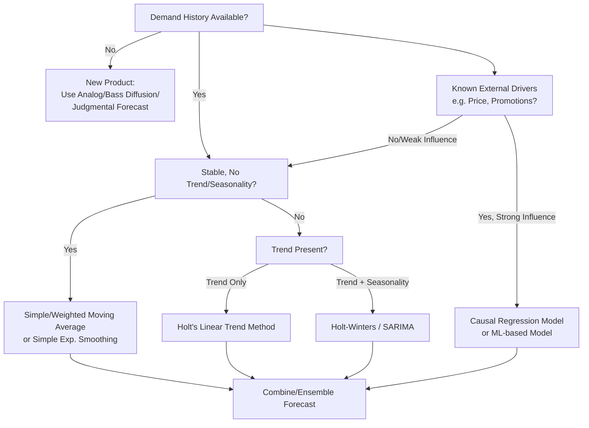

## Time Series and Causal Forecasting Models

### Definition

Demand forecasting models fall into two fundamental methodological families based on what information they use as predictors: **time series models**, which forecast future demand purely from the historical pattern of the demand series itself (trend, seasonality, cycles), and **causal (explanatory) models**, which forecast demand as a function of external explanatory variables believed to drive it (price, promotions, weather, economic indicators, marketing spend). Supply chain demand planning typically employs both, often in combination, selected based on data availability, forecast horizon, and the presence of known demand drivers.

### Time Series Models

Time series models assume that historical demand patterns — level, trend, seasonality, and noise — will persist into the near future. They require only the historical demand series itself as input.

**Decomposition Framework**

$$D_t = \text{Level} + \text{Trend}_t + \text{Seasonality}_t + \text{Noise}_t$$

or multiplicatively:

$$D_t = \text{Level} \times \text{Trend}_t \times \text{Seasonality}_t \times \text{Noise}_t$$

**Common Time Series Methods**

| Method | Description | Best Suited For |
| --- | --- | --- |
| Naive/Last-Period | Forecast = most recent actual value | Very stable, low-noise demand |
| Simple Moving Average | Average of last $n$ periods | Stable demand, no trend/seasonality |
| Weighted Moving Average | Recent periods weighted more heavily | Demand with mild recency bias |
| Simple Exponential Smoothing | Exponentially decaying weights on all history | Stable demand, no trend/seasonality |
| Holt's Linear Trend | Exponential smoothing extended with a trend component | Trending demand, no seasonality |
| Holt-Winters (Triple Exponential Smoothing) | Adds seasonal component to Holt's method | Trending and seasonal demand |
| ARIMA (AutoRegressive Integrated Moving Average) | Models autocorrelation structure via AR and MA terms after differencing for stationarity | Complex univariate patterns with autocorrelation |
| SARIMA | ARIMA extended with seasonal differencing/terms | Seasonal, autocorrelated demand |
| Croston's Method | Specialized for intermittent/sparse demand (splits into demand size and inter-arrival interval) | Slow-moving/spare parts SKUs |

**Simple Exponential Smoothing formula:**

$$F_{t+1} = \alpha D_t + (1-\alpha)F_t$$

where $\alpha$ is the smoothing constant ($0 < \alpha < 1$), $D_t$ is actual demand at period $t$, and $F_t$ is the forecast for period $t$.

**Holt-Winters (additive) core equations:**

$$L_t = \alpha(D_t - S_{t-p}) + (1-\alpha)(L_{t-1} + T_{t-1})$$

$$T_t = \beta(L_t - L_{t-1}) + (1-\beta)T_{t-1}$$

$$S_t = \gamma(D_t - L_t) + (1-\gamma)S_{t-p}$$

$$F_{t+m} = L_t + mT_t + S_{t+m-p}$$

where $L_t$ is level, $T_t$ is trend, $S_t$ is the seasonal component, $p$ is the seasonal period length, and $\gamma$/$\beta$/$\alpha$ are smoothing parameters for seasonality, trend, and level respectively.

### Causal (Explanatory) Models

Causal models relate demand to independent variables believed to have explanatory power, based on the premise that demand is *driven* by identifiable external factors rather than purely following its own historical pattern.

**Common Causal Methods**

| Method | Description | Typical Predictors |
| --- | --- | --- |
| Simple/Multiple Linear Regression | Demand as a linear function of one or more predictors | Price, advertising spend, temperature |
| Multiple Regression with Lagged Variables | Includes lagged predictor values to capture delayed effects | Prior-period promotions, lead indicators |
| Econometric Models | Systems of regression equations capturing market dynamics | GDP, employment, interest rates |
| Machine Learning Regression (Gradient Boosting, Random Forests) | Non-linear relationships between multiple demand drivers and outcome | Price, promotions, weather, competitor actions, calendar effects |
| Bass Diffusion Model | Models adoption curve for new products based on innovation/imitation coefficients | New product life cycle stage |

**General multiple regression form:**

$$D_t = \beta_0 + \beta_1 X_{1,t} + \beta_2 X_{2,t} + \dots + \beta_n X_{n,t} + \varepsilon_t$$

where $X_{1,t} \dots X_{n,t}$ are causal predictor variables (price, promotion flag, weather index, etc.) and $\varepsilon_t$ is the error term.

### Selection Criteria: Time Series vs. Causal

| Factor | Favors Time Series | Favors Causal |
| --- | --- | --- |
| Data availability | Only historical demand exists | Reliable external driver data exists |
| Forecast horizon | Short-term, stable patterns | Medium/long-term, driver-dependent |
| New product/no history | Not usable (no history to extrapolate) | Usable via analog/diffusion models |
| Known upcoming events | Cannot anticipate one-off shocks (promotions, price changes) | Directly incorporates planned interventions |
| Interpretability need | Lower — pattern-based | Higher — explains *why* demand moves |
| Computational/data maturity | Lower barrier to entry | Requires clean, available driver data and often more sophisticated modeling capability |

[Inference: In practice, most mature demand planning functions use a hybrid approach — a statistical time series baseline adjusted by causal factors (promotions, price changes) — though the specific blend depends on organizational maturity and is not governed by a single universal standard]

### Forecast Accuracy Measurement

Common error metrics used to evaluate and compare both model families:

$$\text{MAPE} = \frac{1}{n}\sum_{t=1}^{n}\left|\frac{D_t - F_t}{D_t}\right| \times 100\%$$

$$\text{MAD} = \frac{1}{n}\sum_{t=1}^{n}|D_t - F_t|$$

$$\text{Bias} = \frac{1}{n}\sum_{t=1}^{n}(D_t - F_t)$$

- **MAPE (Mean Absolute Percentage Error)**: Scale-independent, but undefined/unstable when actual demand approaches zero (a known limitation for intermittent demand)
- **MAD (Mean Absolute Deviation)**: Scale-dependent, useful for safety stock calculations since it relates directly to forecast error magnitude
- **Bias**: Detects systematic over- or under-forecasting; persistent non-zero bias indicates a structural model or process problem rather than random noise

### Illustration: Forecasting Method Selection Flow

### **Example**

A retailer forecasting weekly demand for a seasonal product (e.g., umbrellas) applies Holt-Winters to capture the recurring seasonal spike during rainy months, using historical sales as the sole input. Simultaneously, the retailer overlays a causal adjustment using a regression model that incorporates the weather forecast (predicted rainfall) and a planned promotional discount for the upcoming week, producing a final blended forecast that adjusts the time-series baseline upward when heavy rain and a promotion coincide.

### **Key Points**

- Time series models extrapolate the past; causal models explain demand through external drivers — the two are complementary, not mutually exclusive.
- No single method is universally superior; selection depends on data history, horizon, and the presence of quantifiable demand drivers. [Inference: this is a widely accepted forecasting principle but does not preclude specific studies showing method superiority in narrow, well-defined contexts]
- Forecast accuracy should be tracked using multiple metrics (MAPE, MAD, Bias) since each reveals a different failure mode.
- New product introductions cannot use pure time series methods due to absence of historical data, necessitating causal, analog, or judgmental approaches.

### **Related Topics**

- Bass Diffusion Model for New Product Forecasting
- Croston's Method for Intermittent Demand
- Sales & Operations Planning (S&OP) and Forecast Consumption
- Machine Learning Approaches to Demand Sensing
- Safety Stock Calculation Using Forecast Error (MAD/Standard Deviation)
- Collaborative Planning, Forecasting, and Replenishment (CPFR)