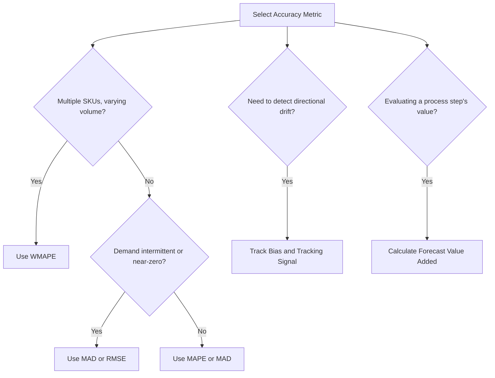

## Forecast Error Measurement and Accuracy Metrics

### Definition and Core Concept

Forecast error measurement is the quantitative evaluation of how closely a forecasting method's predictions match actual observed demand. Accuracy metrics serve three primary purposes: comparing performance across different forecasting methods or models, monitoring forecast health over time to detect degradation, and establishing accountability benchmarks for demand planning organizations. No single metric captures every dimension of forecast quality, so mature demand planning practices typically track multiple complementary metrics simultaneously.

### Forecast Error Fundamentals

**Basic Error Definition**

$$e_t = D_t - F_t$$

Where $e_t$ is the forecast error at period $t$, $D_t$ is actual demand, and $F_t$ is the forecasted value. A positive error indicates under-forecasting (actual exceeded forecast); a negative error indicates over-forecasting.

**Key Points**

- Error must be evaluated across both magnitude (how large is the typical error) and direction (is the method systematically biased in one direction)
- A method can have low bias but high variance (errors average out to zero but individual periods are wildly inaccurate), or the reverse (consistently small but directionally skewed errors) — both are forecast quality problems requiring different corrective actions

### Magnitude-Based Accuracy Metrics

**Mean Absolute Deviation (MAD)**

$$MAD = \frac{1}{n}\sum_{t=1}^{n} |D_t - F_t|$$

Expressed in the same units as the demand variable (units, cases, dollars). Straightforward to interpret for a single SKU but not directly comparable across SKUs of different volume scale, since a MAD of 50 units means something very different for a SKU selling 100 units/month versus one selling 10,000 units/month.

**Mean Squared Error (MSE)**

$$MSE = \frac{1}{n}\sum_{t=1}^{n} (D_t - F_t)^2$$

Squaring the error penalizes large errors disproportionately more than small ones, making MSE useful when large forecast misses are especially costly (e.g., stockouts of critical items). The squared units make direct interpretation less intuitive than MAD.

**Root Mean Squared Error (RMSE)**

$$RMSE = \sqrt{\frac{1}{n}\sum_{t=1}^{n} (D_t - F_t)^2}$$

Returns the error to the original unit scale (by taking the square root of MSE) while retaining MSE's sensitivity to large outlier errors. RMSE is generally greater than or equal to MAD for the same dataset, with the gap widening as error variance increases.

**Mean Absolute Percentage Error (MAPE)**

$$MAPE = \frac{100\%}{n}\sum_{t=1}^{n} \left| \frac{D_t - F_t}{D_t} \right|$$

Normalizes error as a percentage of actual demand, enabling comparison across SKUs of different volume scale. This is one of the most widely used forecast accuracy metrics in practice due to its intuitive interpretation.

**Key limitations of MAPE:**

- Becomes mathematically undefined when $D_t = 0$ and highly unstable/distorted when $D_t$ is very small relative to typical error magnitude — a known issue for intermittent-demand or low-volume SKUs
- Asymmetric penalty: MAPE penalizes over-forecasting (forecast exceeds actual) less severely than under-forecasting in percentage terms, because the percentage error for over-forecasting is bounded (cannot exceed 100% below zero) while under-forecasting error is unbounded above

**Symmetric Mean Absolute Percentage Error (sMAPE)**

$$sMAPE = \frac{100\%}{n}\sum_{t=1}^{n} \frac{|D_t - F_t|}{(|D_t| + |F_t|)/2}$$

Developed to address MAPE's asymmetry issue by dividing by the average of actual and forecast rather than actual alone. sMAPE still has known distortion issues when both $D_t$ and $F_t$ are near zero simultaneously. [Unverified: sMAPE's behavior under near-zero conditions and its adoption prevalence vary across the forecasting literature and practitioner community; some researchers have proposed further variants to address remaining distortions]

**Weighted Mean Absolute Percentage Error (WMAPE / WAPE)**

$$WMAPE = \frac{\sum_{t=1}^{n} |D_t - F_t|}{\sum_{t=1}^{n} |D_t|} \times 100\%$$

Weights each period's contribution by its actual demand volume, avoiding the divide-by-zero and small-denominator instability of standard MAPE. This makes WMAPE a preferred aggregate metric when summarizing accuracy across many SKUs with a mix of high- and low-volume items, since low-volume SKUs do not disproportionately distort the overall metric the way they can under simple-averaged MAPE.

### Bias Metrics

**Mean Error (ME) / Bias**

$$Bias = \frac{1}{n}\sum_{t=1}^{n} (D_t - F_t)$$

Unlike magnitude metrics, positive and negative errors are not converted to absolute values, so they can offset each other. A bias near zero suggests the method is not systematically skewed, even if individual period errors are large (high variance, low bias). A persistently positive or negative bias indicates systematic under- or over-forecasting requiring model recalibration.

**Tracking Signal**

$$TS_t = \frac{\sum_{i=1}^{t} (D_i - F_i)}{MAD_t}$$

The tracking signal is the cumulative sum of forecast errors divided by the mean absolute deviation, used as an early-warning control mechanism. Common practice sets control limits (e.g., ±4 to ±6) beyond which the tracking signal flags that the forecast has drifted into unacceptable systematic bias, prompting a model review before the issue is caught through periodic MAPE reporting alone. [Inference: specific control limit thresholds vary by organizational risk tolerance and demand volatility, and should be calibrated to the specific product/business context rather than applied as a universal constant]

### Forecast Value Added (FVA)

**Key Points**

- FVA measures whether a given step in the forecasting process (a statistical model, a manual override, a consensus adjustment) actually improves accuracy relative to a simpler baseline (commonly a naive forecast, where the forecast for the next period simply equals the most recent actual value)
- Calculated as the accuracy difference between the process step's output and the naive baseline: a negative FVA indicates the additional process step is making the forecast worse than doing nothing
- FVA analysis is used to identify and eliminate non-value-adding steps in the forecasting process, such as manual overrides that consistently reduce accuracy relative to the statistical baseline

$$FVA = Accuracy_{process} - Accuracy_{naive}$$

### Choosing the Right Metric for the Situation

**Example**

| Situation | Recommended Metric(s) | Rationale |
| --- | --- | --- |
| Comparing accuracy across many SKUs of different volume | WMAPE | Avoids small-denominator distortion of simple MAPE |
| Single high-volume, stable-demand SKU | MAPE or MAD | Intuitive, stable denominator |
| Intermittent/lumpy demand (frequent zero-demand periods) | MAD, RMSE, or specialized intermittent-demand metrics | MAPE undefined/unstable at zero actuals |
| Detecting systematic over/under-forecasting drift | Bias, Tracking Signal | Magnitude metrics do not reveal directional skew |
| Penalizing large misses more heavily (critical items) | RMSE or MSE | Squared term disproportionately penalizes large errors |
| Evaluating whether a forecasting process step adds value | Forecast Value Added (FVA) | Benchmarks against naive/simpler alternative |

### Aggregation Level Considerations

**Key Points**

- Forecast accuracy typically improves at higher levels of aggregation (product family, region, total company) compared to the most granular level (individual SKU at individual location), a well-documented statistical effect related to the pooling/cancellation of independent random errors — sometimes referred to informally as the aggregation or pooling effect
- Reporting only aggregate-level accuracy can mask significant SKU-level forecast quality problems that matter operationally for inventory and replenishment decisions, so both levels should typically be monitored
- Accuracy targets and metric selection should be aligned to the decision the forecast supports: a highly aggregated forecast may be adequate for capacity planning, while SKU-location level accuracy matters much more for daily replenishment decisions

### Statistical Interpretation Cautions

**Key Points**

- A "good" accuracy benchmark is highly context-dependent: fashion/seasonal apparel with inherently volatile demand will have structurally higher error rates than staple grocery items, so cross-category accuracy comparisons without context can be misleading
- Outliers (one-time large orders, data entry errors, promotional spikes not properly flagged) can dramatically distort magnitude-based metrics like MSE/RMSE; outlier review and cleansing prior to accuracy calculation is standard practice in mature demand planning processes
- Accuracy metrics evaluate historical fit; they do not by themselves guarantee future performance, particularly if the underlying demand-generating process is changing (new competition, macroeconomic shift, product lifecycle transition)

### Common Pitfalls

**Key Points**

- Relying exclusively on MAPE without recognizing its distortion at low-volume or intermittent-demand SKUs, leading to misleading "poor accuracy" conclusions for products where the metric itself is unreliable
- Monitoring accuracy (magnitude) without also monitoring bias (direction), missing systematic drift that compounds into significant inventory imbalance over time
- Comparing forecast accuracy across product categories or business units without adjusting for inherent demand volatility differences
- Failing to benchmark against a naive baseline (no FVA analysis), making it impossible to know whether complex forecasting processes or overrides are actually adding value
- Calculating aggregate accuracy metrics without cleansing known outliers or one-time events, distorting the metric's usefulness for ongoing model evaluation

### Related Topics

- Forecast Value Added (FVA) Analysis and Process Elimination
- Intermittent Demand Forecasting and Specialized Accuracy Metrics
- Statistical Process Control Applied to Forecast Monitoring
- Hierarchical Forecast Reconciliation Across Aggregation Levels
- Demand Planning Governance and Accountability Metrics
- Outlier Detection and Data Cleansing for Demand History