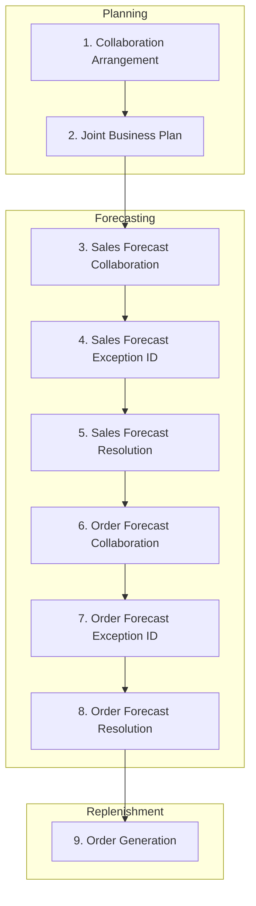

## Collaborative Planning, Forecasting, and Replenishment (CPFR)

### Definition and Core Concept

Collaborative Planning, Forecasting, and Replenishment (CPFR) is a structured, multi-step business process framework in which trading partners — typically a retailer/buyer and a manufacturer/supplier — jointly develop a single shared demand forecast and replenishment plan, rather than each party independently forecasting the other's behavior. The framework was developed and is maintained by the Voluntary Interindustry Commerce Solutions (VICS) standards body (now part of GS1 US), and is widely referenced as the standard reference model for buyer-supplier collaborative forecasting.

### Why CPFR Exists: The Underlying Problem

**Key Points**

- In a non-collaborative relationship, a retailer forecasts its own sales, and a supplier separately forecasts the retailer's orders — two independent forecasts of related but distinct variables, each introducing its own error and assumptions
- This independent forecasting structure is a primary contributor to the bullwhip effect, since the supplier's forecast is based on order patterns rather than true end-customer demand
- CPFR addresses this by collapsing the two independent forecasts into one shared, jointly-owned forecast, with both parties contributing the information they uniquely hold (the retailer knows POS/sell-through data; the supplier knows production capacity and constraints)

### The CPFR Reference Model: Nine-Step Process

The VICS CPFR framework is typically organized into three high-level activity categories — Planning, Forecasting, and Replenishment — subdivided into nine specific process steps.

**Planning Activities**

1. **Collaboration Arrangement**: trading partners establish the business goals, scope of collaboration, and define roles, responsibilities, and escalation/exception-handling procedures for the relationship
2. **Joint Business Plan**: partners share category-level strategies, promotional calendars, new product introductions, and assortment changes that will affect demand, forming the qualitative context for the forecast

**Forecasting Activities**

3. **Sales Forecast Collaboration**: partners jointly create and reconcile a sales forecast for the shared product/category, using shared POS or sell-through data alongside supplier-side market intelligence
4. **Sales Forecast Exception Identification**: automated or manual identification of significant discrepancies between the collaborative forecast and either party's independent view, flagging items requiring joint review
5. **Sales Forecast Collaboration/Resolution**: partners jointly resolve identified exceptions, adjusting the shared forecast to reach agreement
6. **Order Forecast Collaboration**: translating the agreed sales forecast into a specific order/replenishment forecast, accounting for lead times, minimum order quantities, and inventory policy
7. **Order Forecast Exception Identification**: identifying significant variances between the order forecast and what either party's systems would independently generate
8. **Order Forecast Collaboration/Resolution**: joint resolution of order forecast exceptions

**Replenishment Activities**

9. **Order Generation**: the agreed order forecast is converted into an actual firm order/replenishment action, executing the physical and financial flow that follows from the collaborative plan

### Data and Information Requirements

**Key Points**

- **Point-of-Sale (POS) data**: retailer sell-through data, ideally at the store-SKU-day level, providing the closest available proxy to true end-customer demand
- **Causal/event calendars**: shared visibility into promotions, price changes, seasonal events, and competitive actions that will influence demand but are not visible in historical data alone
- **Inventory position data**: both parties' current inventory levels, allowing the shared forecast to account for existing stock rather than just gross demand
- **Capacity and constraint data**: supplier production capacity, minimum order quantities, and lead times, which the retailer needs to translate a sales forecast into a feasible order forecast
- **New item/assortment change data**: upcoming product launches, discontinuations, and packaging changes that affect the comparability of historical data to future periods

### Technology Enablement

**Key Points**

- CPFR implementations typically rely on a shared collaboration platform (either a dedicated CPFR software solution, a shared portal, or increasingly cloud-based supply chain collaboration platforms) that both parties can access, rather than purely bilateral file exchange
- EDI transaction sets (e.g., forecast-related messages) or modern API-based data sharing can be used to automate the exchange of forecast and POS data between the partners' respective planning systems
- Exception-based workflow (automatically flagging only forecasts that vary beyond a defined threshold between the parties, rather than requiring manual review of every SKU) is essential to make CPFR scalable across large product assortments — full manual review of every SKU-level forecast is not practically sustainable at retail scale

### CPFR vs. Related Collaborative Models

**Key Points**

- **CPFR vs. VMI (Vendor-Managed Inventory)**: VMI gives the supplier responsibility for managing the buyer's inventory replenishment decisions based on shared inventory visibility; CPFR is broader in scope, encompassing joint forecast development and business planning, not just inventory replenishment execution. VMI is sometimes implemented as the replenishment execution layer within a broader CPFR relationship, though the two are conceptually distinct and can exist independently of each other
- **CPFR vs. simple EDI-based ordering**: standard EDI exchange (POs, ASNs) is transactional information flow without joint forecast development; CPFR requires an active, structured collaborative planning process layered on top of data exchange, not merely automated document transmission

### Benefits and Documented Outcomes

**Key Points**

- Reduced bullwhip amplification, since the shared forecast is anchored to actual sell-through data rather than independently-derived order pattern assumptions
- Improved forecast accuracy from combining the retailer's demand-side visibility with the supplier's supply-side constraint knowledge into a single reconciled view
- Reduced inventory levels and stockouts simultaneously, since both parties are planning against the same numbers rather than each holding independent safety stock against uncertainty about the other's behavior
- Early, well-documented CPFR pilot programs (including Walmart-Warner-Lambert in the late 1990s) are commonly cited as foundational proof-of-concept implementations in supply chain literature [Unverified: specific quantitative outcomes attributed to early pilot programs vary across secondary sources and should be verified against primary case study documentation if cited precisely]

### Implementation Challenges

**Key Points**

- **Data sharing trust barriers**: retailers may be reluctant to share granular POS data, and suppliers may be reluctant to share detailed capacity/cost information, since both represent competitively sensitive data
- **Organizational alignment**: CPFR requires cross-functional coordination (sales, demand planning, category management) on both sides of the relationship, not just a system integration between IT departments
- **Scalability across many trading partners**: a retailer with hundreds of suppliers, or a supplier with hundreds of retail customers, faces significant process overhead if attempting full CPFR with every partner — many organizations selectively apply full CPFR only to their highest-volume or highest-strategic-value relationships, using simpler collaboration models for the long tail of smaller partners
- **Sustaining engagement**: initial CPFR pilots often show strong results, but sustaining the ongoing collaborative discipline (regular exception review, joint business planning cadence) over time requires continued executive sponsorship and resourcing

### CPFR Maturity and Selective Application

**Example**

| Partner Segment | Typical Collaboration Approach |
| --- | --- |
| Top strategic accounts (high volume, high complexity) | Full 9-step CPFR with dedicated joint planning team |
| Mid-tier accounts | Simplified collaboration: shared POS data and periodic forecast review, without full exception workflow |
| Long-tail/smaller accounts | Standard EDI-based ordering without formal CPFR process |

### Common Pitfalls

**Key Points**

- Attempting full CPFR implementation across an entire trading partner base simultaneously rather than piloting with a small number of strategic partners first
- Treating CPFR as a one-time system integration project rather than an ongoing collaborative business process requiring sustained cross-functional engagement
- Sharing raw data without establishing clear exception thresholds, resulting in unmanageable manual review volume that undermines process sustainability
- Underestimating the organizational and trust-building work required on both sides, treating CPFR failure as a technology problem when it is often a relationship/incentive alignment problem
- Failing to update the joint business plan (promotions, new items) in step with actual business changes, causing the collaborative forecast to become stale relative to real market conditions

### Related Topics

- Vendor-Managed Inventory (VMI) Program Design
- Bullwhip Effect: Causes, Measurement, and Mitigation
- Point-of-Sale (POS) Data Sharing and Demand Sensing
- Multi-Tier Supply Chain Flow Synchronization
- Supply Chain Control Towers and Collaborative Platforms
- Trading Partner Segmentation and Collaboration Strategy