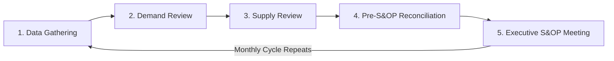

## Sales and Operations Planning (S&OP)

### Definition and Core Concept

Sales and Operations Planning (S&OP) is a structured, recurring cross-functional business process that reconciles demand plans, supply plans, and financial plans into a single, agreed operating plan for the organization. It operates at a higher level of aggregation than day-to-day demand forecasting or replenishment planning, typically at the product family or category level over a rolling horizon of 12–24 months, and serves as the governance mechanism that aligns sales, marketing, operations, finance, and executive leadership around one shared numbers set rather than each function operating from its own independent plan.

### Why S&OP Exists

**Key Points**

- Without S&OP, sales/marketing plans (often revenue- or volume-optimistic), operations/supply plans (often capacity- or cost-conservative), and finance plans (often budget-anchored) can diverge significantly, with no formal mechanism to reconcile them until the divergence causes a visible problem (stockouts, excess inventory, missed financial targets)
- S&OP creates a regular cadence (typically monthly) at which these functions are forced to reconcile their assumptions and commit to one integrated plan, surfacing misalignment while there is still time to act on it
- The process explicitly balances demand (what the market wants) against supply (what the organization can produce/deliver) and financial constraints (what the organization can profitably support), rather than optimizing any one dimension in isolation

### The Standard S&OP Process Cycle

Most mature S&OP implementations follow a five-step monthly cycle, sometimes described using slightly different step names depending on the specific framework or consulting methodology referenced.

**Key Points**

1. **Data Gathering / Product Review**: collection of updated sales history, new product introduction status, and product lifecycle changes to prepare inputs for the demand review
2. **Demand Review**: sales, marketing, and demand planning reconcile the statistical baseline forecast with market intelligence (promotions, competitive activity, new accounts) to produce an updated consensus demand plan
3. **Supply Review**: operations, manufacturing, and procurement assess whether the updated demand plan can be met given current capacity, material availability, and constraints, identifying gaps and proposing supply-side response options (overtime, outsourcing, inventory drawdown)
4. **Pre-S&OP / Reconciliation Meeting**: cross-functional planning team reconciles demand and supply plans, identifies unresolved gaps or trade-off decisions, and prepares scenarios/recommendations for executive decision
5. **Executive S&OP Meeting**: senior leadership reviews unresolved gaps and trade-off scenarios, makes final decisions on plan adjustments (e.g., approve additional capacity investment, accept a planned service level trade-off), and formally commits to the integrated plan for the coming cycle

### Key Inputs to the S&OP Process

**Key Points**

- Statistical demand forecast baseline, plus qualitative overlay from sales/marketing (per standard forecasting method practice)
- Current inventory position across the network
- Manufacturing and supplier capacity constraints, including planned maintenance downtime or known capacity investments in progress
- New product introduction and phase-out timelines
- Financial budget and margin targets, allowing the plan to be evaluated not just on volume feasibility but profitability
- Risk factors: known supply disruptions, material shortages, or demand volatility drivers that could affect plan feasibility

### Demand-Supply Balancing and Gap Resolution

**Key Points**

- When the demand plan exceeds available supply capacity, the S&OP process must generate and evaluate response options: adding capacity (overtime, additional shifts, outsourcing/co-manufacturing), building inventory ahead of the gap period, adjusting delivery lead times, or in some cases proactively managing demand (allocation, deprioritizing lower-margin business)
- When supply capacity exceeds the demand plan, the process must evaluate options: reducing production plans, redirecting capacity to other product lines, or pursuing demand-generation actions (promotions, new channel development)
- Trade-off decisions (e.g., prioritizing which customers or product lines receive constrained supply) are appropriately escalated to the executive S&OP meeting rather than resolved informally at lower levels, since they typically carry margin and customer relationship implications beyond the scope of operational planning alone

### Integrated Business Planning (IBP) as an S&OP Evolution

**Key Points**

- Integrated Business Planning (IBP) is often described as a more mature, financially-integrated evolution of traditional S&OP, explicitly tying the operating plan to financial outcomes (revenue, margin, cash flow) at every step rather than reconciling volume/capacity first and translating to financial impact afterward
- IBP typically extends the planning horizon further and incorporates scenario planning and risk-adjusted financial modeling more explicitly than traditional S&OP practice
- Organizations vary in whether they use "S&OP" and "IBP" as synonymous terms or as distinct maturity stages; terminology and scope differ somewhat across consulting firms and software vendors [Unverified: exact definitional boundaries between S&OP and IBP vary by source and are not universally standardized]

### S&OP Maturity Model

**Example**

| Maturity Level | Characteristics |
| --- | --- |
| Level 1: Informal/Reactive | No regular cadence; planning reconciliation happens ad hoc, often only after a visible problem occurs |
| Level 2: Basic S&OP | Monthly process exists but is largely a volume/capacity reconciliation exercise with limited financial integration |
| Level 3: Integrated S&OP | Full five-step monthly cycle with cross-functional participation and executive decision-making on trade-offs |
| Level 4: Integrated Business Planning (IBP) | Financially integrated, scenario-based planning tightly linked to strategic and financial planning processes |

### Organizational Roles and Governance

**Key Points**

- **S&OP Process Owner/Coordinator**: typically a demand or supply planning leader responsible for running the monthly cycle, ensuring data readiness, and preparing materials for each review meeting
- **Functional Participants**: sales, marketing, demand planning, manufacturing/operations, procurement, and finance each contribute their functional plan and constraint data
- **Executive Sponsor(s)**: senior leadership (often General Manager, COO, or CFO-level) who chair the executive S&OP meeting and hold final decision authority on unresolved trade-offs
- Clear escalation criteria (what triggers executive-level review vs. what can be resolved at the pre-S&OP level) are essential to keeping the executive meeting focused on genuine strategic trade-offs rather than routine operational details

### Technology Support for S&OP

**Key Points**

- Advanced Planning Systems (APS) and integrated business planning software platforms are commonly used to model demand-supply scenarios, run what-if analysis, and maintain the rolling plan across planning cycles
- Spreadsheet-based S&OP processes remain common, particularly at lower maturity levels, but face scalability and version-control challenges as product complexity and organizational size grow
- Scenario modeling capability (rapidly comparing the financial and operational impact of multiple demand-supply balancing options) is a key differentiator between basic and advanced S&OP technology platforms

### Common Pitfalls

**Key Points**

- Treating S&OP as a demand-planning-only or supply-planning-only exercise rather than a genuinely cross-functional reconciliation process, undermining its core purpose
- Allowing the executive S&OP meeting to become a status-reporting session rather than a genuine decision-making forum for unresolved trade-offs, which erodes the process's authority over time
- Running the process at too granular a level (SKU-location) rather than the appropriate aggregated level (product family, business unit), making the monthly cycle unsustainably time-consuming
- Inconsistent participation or delegation to junior staff without decision authority, preventing genuine trade-off resolution at the pre-S&OP and executive stages
- Failing to close the loop by tracking actual performance against the committed S&OP plan, missing the opportunity to identify and correct systematic planning gaps over successive cycles

### Related Topics

- Integrated Business Planning (IBP) and Financial Integration
- Demand Review and Consensus Forecasting Processes
- Capacity Planning and Supply Constraint Management
- Advanced Planning Systems (APS) and S&OP Technology Platforms
- Cross-Functional Governance in Supply Chain Planning
- Scenario Planning for Demand-Supply Trade-off Decisions