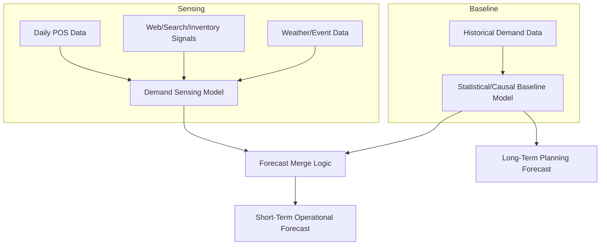

## Demand Sensing and Real-Time Signal Integration

### Definition and Core Concept

Demand sensing is a short-term forecasting approach that uses near-real-time or high-frequency data signals — point-of-sale transactions, web traffic, inventory depletion rates, weather, and other leading indicators — to detect and respond to actual demand shifts within days rather than relying solely on traditional statistical forecasts built from weekly or monthly historical aggregates. It is typically used to refine or override the short-term horizon (days to a few weeks) of a longer-range statistical baseline forecast, rather than replacing longer-horizon planning methods entirely.

### How Demand Sensing Differs from Traditional Forecasting

**Key Points**

- Traditional statistical forecasting (moving average, exponential smoothing, ARIMA) relies on historical demand patterns aggregated at weekly or monthly intervals, updated on a similarly infrequent cycle
- Demand sensing ingests granular, high-frequency data (often daily or even intraday) and recalculates short-term forecasts much more frequently, allowing the forecast to reflect emerging conditions before they would show up in a monthly historical pattern
- The two approaches are complementary rather than competing: demand sensing typically governs the near-term horizon (immediate replenishment decisions) while traditional statistical and collaborative methods (S&OP, CPFR) continue to govern the medium- and long-term planning horizon
- Demand sensing is most valuable for short lead-time, fast-moving categories where a multi-week-old forecast is likely to be meaningfully stale by the time it drives a replenishment decision

### Data Signals Used in Demand Sensing

**Key Points**

- **Point-of-sale (POS) data**: the most immediate proxy for true end-customer demand, ideally captured at daily or near-real-time frequency
- **E-commerce and web behavior signals**: search volume, page views, cart additions, and conversion rates for a given product, which can lead actual purchase demand by hours to days
- **Inventory depletion/velocity data**: the rate at which on-hand inventory is being consumed at downstream locations, which can reveal a demand shift before it is visible in aggregated order data
- **Weather data**: short-term weather forecasts correlated with demand for weather-sensitive categories (seasonal apparel, beverages, home improvement)
- **Social media and sentiment signals**: emerging product interest or negative sentiment (e.g., a viral moment or a quality issue trending in public discussion) that could precede a demand spike or drop
- **Local event and calendar data**: local events, sports schedules, or public holidays that create location-specific demand spikes not captured in generic seasonal calendars
- **Competitor pricing/promotion signals**: where available, changes in competitor pricing or promotional activity that could shift demand toward or away from a given product

### Technical Architecture for Demand Sensing

**Key Points**

- Demand sensing systems typically require a data pipeline capable of ingesting multiple heterogeneous, high-frequency data sources and normalizing them into a consistent format for model input
- Machine learning models (commonly gradient boosting or other ensemble methods, sometimes supplemented by neural network approaches) are frequently used because they can incorporate many heterogeneous signal types simultaneously and capture non-linear relationships between signals and demand response
- The architecture generally separates a **long-horizon statistical/causal baseline model** (updated less frequently) from a **short-horizon sensing layer** that adjusts or overrides the baseline for the imminent planning window, with a defined logic for how and when the sensing layer's output takes precedence

### Merge Logic Between Baseline and Sensed Forecasts

**Key Points**

- A common approach applies the demand-sensing adjustment only within a defined near-term window (e.g., the next 1–4 weeks), with the statistical baseline governing all periods beyond that window
- Merge logic may use a weighted blend that shifts weight progressively toward the baseline forecast as the horizon extends further into the future, since sensing signals lose predictive relevance at longer horizons
- Guardrail logic (maximum allowable deviation from baseline) is commonly implemented to prevent a noisy or anomalous short-term signal from producing an extreme, operationally disruptive forecast swing without human review

### Benefits and Trade-offs

**Key Points**

- Improved short-term forecast accuracy, particularly valuable for reducing stockouts and excess safety stock in fast-moving, short-lead-time categories
- Faster response to emerging demand shifts (new competitive entry, viral product moments, weather-driven spikes) than a monthly-cycle statistical forecast could capture
- Requires significant data infrastructure investment: reliable, low-latency data feeds from POS systems, e-commerce platforms, and external data providers, which can be a substantial implementation barrier for organizations without mature data pipelines
- Risk of over-reacting to noisy short-term signals if guardrails and model validation are insufficient, potentially introducing forecast volatility rather than improving accuracy [Inference: the net accuracy benefit versus added volatility risk depends heavily on data quality, signal relevance to the specific category, and model tuning, and should be validated through back-testing rather than assumed as a universal improvement]

### Implementation Prerequisites

**Key Points**

- Reliable, sufficiently granular POS or sell-through data feed as the foundational input; without this, demand sensing has little advantage over traditional short-term forecasting methods
- A defined near-term planning process that can actually act on a more frequently updated forecast (e.g., daily or twice-weekly replenishment cycles) — demand sensing provides limited value if downstream execution processes only review forecasts on a slower cadence
- Data governance and quality control for the multiple external and internal data sources being ingested, since poor-quality input signals can degrade rather than improve short-term forecast accuracy
- Change management and trust-building with planners who will need to understand and act on system-generated short-term adjustments, particularly when a sensed forecast diverges meaningfully from what planners' own intuition would suggest

### Demand Sensing vs. Related Concepts

**Key Points**

- **Demand sensing vs. demand shaping**: demand sensing detects and responds to demand signals; demand shaping actively influences demand (through pricing, promotion, or allocation) rather than merely forecasting it — the two are complementary but distinct disciplines
- **Demand sensing vs. CPFR**: CPFR is a structured collaborative process between trading partners typically operating on a periodic (often weekly/monthly) cadence; demand sensing is a technical/analytical capability that can operate at much higher frequency and does not inherently require multi-party collaboration, though sensed signals can also feed into a CPFR process
- **Demand sensing vs. traditional exponential smoothing**: both can technically update frequently, but traditional smoothing methods rely solely on the historical pattern of the demand variable itself, while demand sensing explicitly incorporates external, real-time causal signals beyond historical demand history

### Common Pitfalls

**Key Points**

- Implementing demand sensing technology without first ensuring downstream replenishment processes can actually act on a higher-frequency forecast, resulting in a more accurate forecast that produces no operational benefit
- Insufficient guardrails against noisy or anomalous short-term signals, leading to forecast volatility that undermines planner trust in the system
- Treating demand sensing as a full replacement for longer-horizon statistical and collaborative forecasting rather than a complementary near-term refinement layer
- Underestimating the data infrastructure investment (latency, data quality, integration complexity) required to make multiple heterogeneous real-time signals usable for modeling
- Applying demand sensing uniformly across all SKUs regardless of lead time or demand volatility, when the technique typically provides the greatest incremental value for short-lead-time, fast-moving, or highly volatile categories specifically

### Related Topics

- Machine Learning–Based Forecasting Methods and Feature Engineering
- Point-of-Sale (POS) Data Integration and Demand Signal Architecture
- Short-Cycle Replenishment and Rapid Response Inventory Systems
- Demand Shaping: Pricing, Promotion, and Allocation Strategies
- Forecast Value Added (FVA) Analysis for Sensing Layer Validation
- Collaborative Planning, Forecasting, and Replenishment (CPFR)