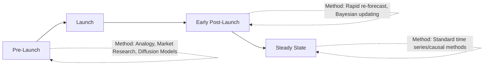

## New Product Introduction Forecasting

### Definition and Core Concept

New Product Introduction (NPI) forecasting is the practice of estimating demand for a product that has little or no historical sales data of its own, requiring fundamentally different techniques than the time-series-based methods used for established products. Since traditional quantitative methods (moving average, exponential smoothing, ARIMA) depend on a historical pattern to project forward, NPI forecasting relies primarily on analogous data, qualitative judgment, market research, and — once minimal sales history accumulates — rapid-adoption statistical models designed specifically for the launch period.

### Why NPI Forecasting Requires Distinct Methods

**Key Points**

- No historical demand pattern exists for the new item itself, so standard time series extrapolation is not applicable at launch
- Even after initial sales data begins accumulating, the very early data points are often unrepresentative of steady-state demand due to launch promotions, distribution ramp-up, and early-adopter versus mainstream buyer behavior differences
- Forecast accuracy requirements are often just as high (or higher) for NPI as for mature products, since initial inventory and production commitments are typically made before any sales data exists, creating higher financial risk from forecast error
- NPI forecasts must also account for cannibalization of existing products and/or halo effects on complementary products, which mature-product forecasting typically does not need to consider as centrally

### Pre-Launch Forecasting Methods

**Historical Analogy**

Using the demand curve of a comparable prior product launch (same category, similar price point, similar target segment) as a structural template, then scaling for expected differences in distribution breadth, marketing spend, or market size.

- Requires careful selection of a genuinely comparable analog product; a poorly chosen analog (e.g., using a category leader's launch curve for a niche follower product) can produce a badly miscalibrated forecast
- The analog's launch curve shape (rate of ramp-up, peak timing, decay pattern) is often more transferable than its absolute volume, which should be rescaled based on relative distribution and marketing investment

**Market Research and Concept Testing**

- **Concept tests**: gauge purchase intent for a product concept before it is manufactured, typically converting a stated "definitely would buy" response rate into an expected trial rate using category-specific conversion assumptions
- **Conjoint analysis**: quantifies how much value customers place on specific product attributes (price, features, packaging), useful for forecasting demand across product variants or estimating price elasticity for a new item
- **Test markets / limited launches**: releasing the product in a limited geographic or channel scope first, using actual observed sales to calibrate the forecast before a full-scale rollout, trading off launch speed against forecast accuracy improvement

**Sales Force and Trade Input**

- Direct input from sales representatives and key accounts regarding expected initial order/sell-in quantities, particularly valuable in B2B contexts where account-level relationships strongly influence early adoption
- Retail buyer commitments (initial purchase order quantities from retail partners) provide an early, though not fully reliable, signal of expected sell-through, since retailer buy-in quantities reflect the retailer's own forecast and risk tolerance rather than guaranteed end-customer demand

**Diffusion Models**

Formal mathematical models that project the adoption curve of a new product over time based on innovation and imitation effects, most notably the **Bass Diffusion Model**:

$$f(t) = \frac{(p+q)^2}{p} \cdot \frac{e^{-(p+q)t}}{\left(1 + \frac{q}{p}e^{-(p+q)t}\right)^2}$$

Where $p$ is the coefficient of innovation (adoption driven by external influence, e.g., advertising), $q$ is the coefficient of imitation (adoption driven by word-of-mouth/social influence), and $f(t)$ represents the rate of adoption at time $t$. The Bass model is widely referenced in new product diffusion literature for projecting the overall shape of an adoption curve (slow start, acceleration, peak, decline) even before company-specific sales data exists, typically calibrated using parameters estimated from analogous historical product launches. [Inference: while the Bass model's mathematical structure is well-established, the specific $p$ and $q$ parameter values must be estimated from comparable historical launches or expert judgment, and forecast quality depends heavily on how well those estimates transfer to the new product's context]

### Early Post-Launch Forecasting Methods

**Key Points**

- **Rapid re-forecasting cadence**: NPI forecasts should be updated much more frequently than mature-product forecasts during the initial weeks/months post-launch, since each new data point carries disproportionately high information value when the historical base is so small
- **Bayesian updating approaches**: formally blend a prior forecast (based on analogy/market research) with emerging actual sales data, with the weight given to actual data increasing as more observations accumulate — providing a structured way to transition from judgment-based to data-based forecasting as the product matures
- **Distribution ramp-up adjustment**: early sales data must be normalized for the fact that a new product typically has less-than-full distribution (not yet stocked in all intended locations) in its first weeks, so raw early sales velocity understates the eventual steady-state run rate once full distribution is achieved

### Cannibalization and Halo Effect Modeling

**Key Points**

- **Cannibalization**: the degree to which the new product's sales come at the expense of an existing product in the company's own portfolio, rather than representing incremental net demand — critical to model explicitly, since gross new-product sales can overstate the company's true incremental revenue/volume gain if cannibalization is ignored
- **Halo effect**: the degree to which introducing a new product increases demand for related existing products (e.g., a new accessory increasing sales of the base product it complements)
- Estimating cannibalization/halo typically relies on analogous historical launches within the same category, or controlled test-market comparisons between markets with and without the new product's introduction

### Forecast Accuracy Expectations for NPI

**Key Points**

- NPI forecast accuracy is structurally lower than mature-product forecast accuracy, given the absence of historical grounding, and this should be reflected in inventory buffer and financial risk planning rather than treated as a process failure when NPI forecasts miss by wider margins than mature-product benchmarks
- Forecast accuracy tracking for NPI items should generally be evaluated using magnitude-based metrics that are stable at low or emerging volume (MAD, WMAPE) rather than standard per-SKU MAPE, which is unstable when actual demand is near zero in the earliest periods
- Post-launch forecast accuracy reviews (comparing actual results to pre-launch forecast) should feed back into the historical analogy database used for future NPI forecasts, improving the quality of future launches' comparison base over time

### Inventory and Supply Chain Risk Management for NPI

**Key Points**

- Because pre-launch forecasts carry inherently higher uncertainty, supply and inventory strategies for NPI often favor flexibility over efficiency: shorter initial production runs, delayed differentiation (postponing product customization as late as possible in the process), and supplier agreements that allow faster capacity scaling than would be used for a mature, stable-demand product
- Phased inventory commitment strategies (committing to an initial launch quantity, with pre-negotiated fast-turn replenishment capability rather than a single large upfront production commitment) reduce the financial exposure of a launch forecast miss in either direction (stockout from under-forecasting or excess inventory from over-forecasting)

### Common Pitfalls

**Key Points**

- Selecting a poorly matched historical analogy product, transferring an inappropriate demand curve shape or scale to the new product's forecast
- Treating early post-launch sales data as fully representative of steady-state demand without adjusting for incomplete distribution ramp-up
- Ignoring cannibalization effects, overstating the true incremental value of the new product launch to the overall portfolio
- Applying standard MAPE-based accuracy benchmarks to NPI items, generating misleadingly poor accuracy assessments due to near-zero early-period actuals
- Committing to large, inflexible initial production/inventory quantities based on a single-point pre-launch forecast without building in supply flexibility to respond to actual early demand signals

### Related Topics

- Bass Diffusion Model and Product Adoption Curve Analysis
- Test Marketing and Concept Testing Methodologies
- Delayed Differentiation and Postponement Strategies
- Cannibalization and Portfolio-Level Demand Modeling
- Bayesian Forecasting Methods for Sparse Data Environments
- Forecast Accuracy Metrics for Low-Volume and Intermittent Demand