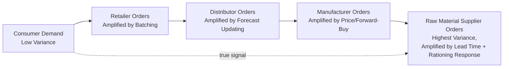

## Causes of the Bullwhip Effect Across Tiers

### Definition

The bullwhip effect refers to the phenomenon where small fluctuations in end-consumer demand become progressively amplified into larger order variability as they propagate upstream through successive tiers of a supply chain — from retailer to distributor to manufacturer to raw material supplier. Each upstream tier perceives greater demand variance than actually exists at the point of consumption, despite receiving accurate order data, leading to systematic overreaction in ordering, inventory buildup, and capacity planning distortions.

$$\text{Var}(\text{Orders}_{\text{tier } n}) > \text{Var}(\text{Orders}_{\text{tier } n-1}) > \dots > \text{Var}(\text{Demand}_{\text{consumer}})$$

### The Five Canonical Causes

The bullwhip effect was formally decomposed by Lee, Padmanabhan, and Whang (1997) into five primary operational causes, each independently sufficient to generate amplification even when every tier acts rationally on the information available to it.

**1. Demand Signal Processing (Demand Forecast Updating)**

Each tier forecasts its own orders based on the order pattern it receives from the tier below, rather than on true end-consumer demand. When a downstream tier's order increases, the upstream tier interprets this as a signal of a genuine upward demand shift and adjusts its own forecast, safety stock, and order quantities upward — often using exponential smoothing or similar reactive forecasting methods that overweight recent observations.

$$F_t = \alpha O_{t-1} + (1-\alpha)F_{t-1}$$

Where $O_{t-1}$ is the order received from the downstream tier (not true consumer demand). Because each tier's "demand signal" is actually an order stream already distorted by the tier below, forecast errors compound multiplicatively up the chain.

**2. Order Batching**

Downstream firms often do not order continuously but instead batch orders to reduce fixed ordering costs, meet minimum order quantities, achieve full-truckload shipping economies, or align with periodic review cycles (weekly, monthly, or quarterly ordering). This converts a relatively smooth stream of consumer purchases into large, infrequent, lumpy order spikes as seen by the upstream supplier — who sees zero orders for extended periods followed by large batch orders, even if underlying consumer demand is stable.

**3. Price Fluctuations (Forward Buying)**

Trade promotions, volume discounts, and periodic price reductions incentivize downstream buyers to purchase in advance of need ("forward buying") and stockpile inventory during low-price periods, then reduce or halt purchasing once prices return to normal. This creates order patterns that reflect the buyer's price-arbitrage behavior rather than actual consumption, generating artificial demand spikes and troughs disconnected from end-consumer purchasing.

**4. Rationing and Shortage Gaming**

When a supplier faces a shortage and rations available product among customers (e.g., allocating proportionally to order size), downstream buyers—anticipating this—inflate their orders beyond actual need to secure a larger allocation. Once the shortage passes, orders are abruptly cancelled or reduced, leaving the supplier with a distorted and unreliable demand signal. This is sometimes called the "shortage gaming" phenomenon.

**5. Lead Time Amplification**

The safety stock and order-up-to quantities firms hold scale with lead time and demand variance. Longer replenishment lead times require larger safety stock buffers to maintain a given service level, which amplifies the swing in order quantities needed to correct any perceived demand or inventory imbalance. Under common order-up-to policies:

$$\text{Order-Up-To Level} = \hat{D} \cdot L + z\sigma_D\sqrt{L}$$

Where $\hat{D}$ is expected demand per period, $L$ is lead time, $z$ is the service-level safety factor, and $\sigma_D$ is demand standard deviation. Since both the base-stock term and the safety stock term scale with $L$ (the safety stock term scaling with $\sqrt{L}$), longer lead times mechanically produce larger order swings for a given demand forecast error.

### Cross-Tier Amplification Mechanism

Each of the five causes compounds independently at every tier boundary. A retailer's order to a distributor already carries distortion from causes 1–5 at the retail level; the distributor then applies its *own* forecast updating, batching, price-driven buying, and lead-time buffering on top of the already-distorted retail order signal before passing an order to the manufacturer — and so on to raw material suppliers. This is why variance amplification is typically monotonically increasing with distance from the point of consumption. [Inference: strict monotonicity is the standard theoretical result under the classic order-up-to policy assumptions used in the original Lee et al. framework; real-world networks with information sharing or coordinated replenishment can dampen this pattern at specific tiers]

### Illustration: Cross-Tier Variance Amplification



### Illustration: Cause-to-Mechanism Mapping (svg_diagram)

<svg xmlns="http://www.w3.org/2000/svg" viewBox="0 0 760 340">
<text x="380" y="24" text-anchor="middle" font-size="15" font-weight="bold" fill="#1a1a1a">Bullwhip Effect: Five Causes (svg_diagram)</text>
<g font-size="12" fill="#1a1a1a">
<rect x="20" y="50" width="220" height="50" rx="6" fill="#dbeafe" stroke="#2563eb" />
<text x="130" y="72" text-anchor="middle" font-weight="bold">1. Demand Signal Processing</text>
<text x="130" y="88" text-anchor="middle" font-size="10">Reactive forecast updating on orders</text>



```
<rect x="20" y="115" width="220" height="50" rx="6" fill="#dcfce7" stroke="#16a34a" />
<text x="130" y="137" text-anchor="middle" font-weight="bold">2. Order Batching</text>
<text x="130" y="153" text-anchor="middle" font-size="10">Periodic/lumpy ordering vs. steady sales</text>

<rect x="20" y="180" width="220" height="50" rx="6" fill="#fef3c7" stroke="#d97706" />
<text x="130" y="202" text-anchor="middle" font-weight="bold">3. Price Fluctuations</text>
<text x="130" y="218" text-anchor="middle" font-size="10">Forward buying during promotions</text>

<rect x="20" y="245" width="220" height="50" rx="6" fill="#fee2e2" stroke="#dc2626" />
<text x="130" y="267" text-anchor="middle" font-weight="bold">4. Rationing/Shortage Gaming</text>
<text x="130" y="283" text-anchor="middle" font-size="10">Inflated orders to secure allocation</text>

<rect x="270" y="147" width="220" height="50" rx="6" fill="#ede9fe" stroke="#7c3aed" />
<text x="380" y="169" text-anchor="middle" font-weight="bold">5. Lead Time Amplification</text>
<text x="380" y="185" text-anchor="middle" font-size="10">Safety stock scales with lead time</text>

<rect x="540" y="147" width="200" height="60" rx="6" fill="#f3f4f6" stroke="#374151" />
<text x="640" y="172" text-anchor="middle" font-weight="bold">Amplified Order</text>
<text x="640" y="188" text-anchor="middle" font-weight="bold">Variance at</text>
<text x="640" y="204" text-anchor="middle" font-weight="bold">Upstream Tier</text>

<path d="M240 75 L540 160" stroke="#2563eb" stroke-width="1.5" fill="none" marker-end="url(#ah)" />
<path d="M240 140 L540 170" stroke="#16a34a" stroke-width="1.5" fill="none" marker-end="url(#ah)" />
<path d="M240 205 L540 180" stroke="#d97706" stroke-width="1.5" fill="none" marker-end="url(#ah)" />
<path d="M240 270 L540 195" stroke="#dc2626" stroke-width="1.5" fill="none" marker-end="url(#ah)" />
<path d="M490 172 L540 172" stroke="#7c3aed" stroke-width="1.5" fill="none" marker-end="url(#ah)" />
```

</g>
</svg>

### Consequences of Bullwhip Amplification

- **Excess inventory**: Upstream tiers hold inflated safety stock to buffer against perceived (but false) demand volatility
- **Poor capacity utilization**: Manufacturing and logistics capacity planned around distorted peak orders leads to alternating overtime/idle capacity cycles
- **Stockouts and reduced service levels**: Despite excess average inventory, mistimed replenishment can still produce localized stockouts during demand signal lag periods
- **Increased transportation costs**: Lumpy, batched orders reduce opportunities for efficient, steady-flow logistics planning
- **Reduced forecast accuracy confidence**: Planners lose trust in systematically distorted order data, sometimes triggering further manual overrides that add noise

### **Example**

A retailer sees a small, temporary uptick in weekly umbrella sales during an unusually rainy week and, applying standard forecast-updating logic, revises its reorder-point forecast upward and places a larger-than-usual batch order to its distributor to replenish and rebuild safety stock. The distributor, seeing this larger order arrive as its only signal of "demand," similarly revises its own forecast upward and places an even larger order with the manufacturer — who now perceives a major demand surge from a temporary weather blip and ramps up production and raw material orders accordingly, only to face an inventory glut when true consumer demand reverts to baseline the following week.

### **Key Points**

- The bullwhip effect arises from **rational, locally optimal decisions** made independently at each tier — no single tier needs to behave irrationally for the distortion to occur.
- The five causes (demand signal processing, order batching, price fluctuations, rationing/shortage gaming, lead time amplification) can act simultaneously and their effects compound multiplicatively across tiers.
- The core structural problem is that each tier's only visible "demand signal" is the order stream from the tier immediately downstream, not true consumer demand — meaning distortion compounds rather than cancels.
- Mitigation strategies (information sharing, Vendor-Managed Inventory, everyday-low-pricing, lead time reduction) target these five causes directly and are typically covered as a distinct, related topic. [Inference: mitigation effectiveness is well established in supply chain literature generally, but the magnitude of improvement is context-dependent and not quantifiable without specific case data]

### **Related Topics**

- Mitigation Strategies: Information Sharing, VMI, and CPFR
- Order-Up-To Inventory Policies and Safety Stock Formulas
- Everyday Low Pricing (EDLP) as a Bullwhip Countermeasure
- Beer Distribution Game as a Pedagogical Simulation
- Multi-Echelon Inventory Optimization
- Real-Time POS Data Sharing and Demand Sensing