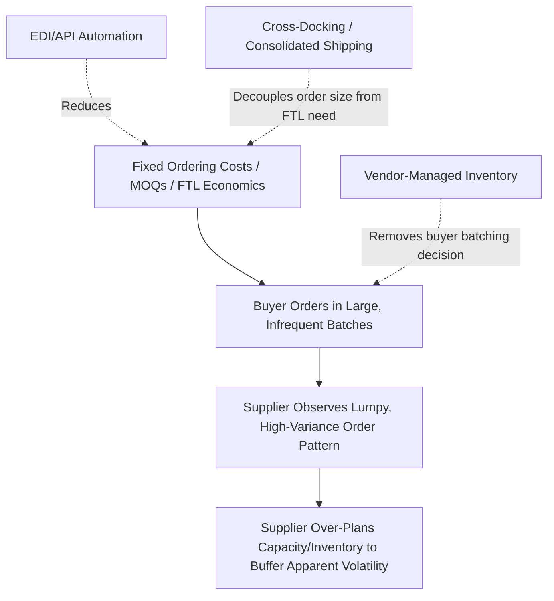

## Order Batching and Lot-Sizing Amplification

### Definition and Core Concept

Order batching and lot-sizing amplification is one of the primary structural causes of the bullwhip effect: it occurs when supply chain actors place orders in periodic, discrete batches (rather than ordering continuously in exact response to consumption) because of fixed ordering costs, minimum order quantities, transportation efficiency thresholds, or periodic review cycles. This batching converts a relatively smooth, continuous end-customer demand stream into a lumpy, intermittent order pattern as observed by the upstream supplier, amplifying variance at each successive tier.

### Why Batching Occurs

**Key Points**

- **Fixed ordering costs**: administrative, processing, or transaction costs associated with placing an order create an economic incentive to order larger quantities less frequently rather than smaller quantities more often, since fixed costs are amortized over a larger order size
- **Transportation economics**: full-truckload (FTL) shipping is typically far more cost-efficient per unit than less-than-truckload (LTL), incentivizing buyers to wait until they can fill a truckload before placing an order, rather than ordering in exact proportion to daily consumption
- **Minimum order quantities (MOQs)**: supplier-imposed MOQs force buyers to order in fixed lot sizes regardless of their actual immediate need, creating a step-function ordering pattern rather than a continuous one
- **Periodic review inventory policies**: many inventory systems review stock and place replenishment orders only at fixed intervals (e.g., weekly, monthly) rather than continuously, meaning multiple days or weeks of actual consumption are aggregated into a single order event
- **Quantity discount structures**: price breaks at certain order volumes incentivize buyers to order in larger batches to capture the discount, independent of their actual near-term consumption rate

### The Economic Order Quantity (EOQ) Connection

The classic Economic Order Quantity model, while primarily a single-firm cost-minimization tool, illustrates why batching is often individually rational even though it contributes to system-wide bullwhip amplification.

$$EOQ = \sqrt{\frac{2DS}{H}}$$

Where $D$ is annual demand, $S$ is the fixed cost per order, and $H$ is the annual holding cost per unit.

**Key Points**

- A higher fixed ordering cost $S$ increases the optimal batch size, which directly increases the "lumpiness" of the order pattern the upstream supplier observes
- Each firm in the chain independently optimizes its own EOQ based on its own cost structure, without considering that its batching decision creates order variance that the upstream tier must then absorb — a classic example of local optimization producing a globally suboptimal outcome
- Reducing the fixed cost of ordering (e.g., through EDI/API automation that lowers the transaction cost per order) directly reduces the economically optimal batch size, allowing more frequent, smaller orders that better track actual consumption

### Quantitative Illustration of Batching Amplification

**Example**

Consider a retailer with steady daily consumption of 100 units, ordering in batches every 10 days (fixed review cycle) rather than continuously.

- **Downstream (true) demand pattern**: constant 100 units/day, variance ≈ 0
- **Observed order pattern at the supplier**: a single order of 1,000 units placed once every 10 days, with zero units ordered on the other 9 days

Even though the underlying end-customer demand is perfectly stable, the supplier observes an extremely lumpy, high-variance order stream (1,000 units on order days, 0 on all other days) purely as a function of the batching interval — no actual demand volatility is present, yet the supplier must interpret and plan around apparent volatility. This illustrates why order variance can substantially exceed underlying demand variance purely due to batching structure, independent of any real change in consumer behavior. [Inference: this is a simplified illustrative example; real batching amplification also depends on the number of downstream accounts ordering on different, staggered cycles, which can partially offset lumpiness when aggregated across many customers]

### Aggregation Across Multiple Downstream Accounts

**Key Points**

- If a supplier serves many retail accounts that each batch-order on their own independent cycle (staggered rather than synchronized), the aggregate order pattern the supplier sees can be smoother than any individual account's order pattern, since the batches from different accounts land on different days
- Conversely, if multiple downstream accounts batch-order on synchronized cycles (e.g., common industry ordering days, or promotional calendars aligned across retailers), the aggregation effect works in the opposite direction — batches stack rather than offset, producing sharp spikes in aggregate order volume
- This means the degree of batching-driven amplification a supplier experiences depends not just on any single customer's batching behavior, but on the correlation structure of batching cycles across its full customer base

### Mitigation Strategies

**Reducing Fixed Ordering Costs**

- EDI and API-based order automation substantially reduces the transaction cost of placing an order, reducing the economic incentive to batch into large, infrequent orders
- Automated replenishment triggers (e.g., continuous review reorder-point systems rather than periodic review) allow ordering to track actual consumption more closely without proportionally increasing administrative burden

**Transportation Consolidation Without Order Batching**

- Cross-docking and pooled/consolidated shipping arrangements (e.g., combining multiple smaller, more frequent orders from different customers or product lines into a single truckload) allow buyers to order in smaller, more frequent quantities while still achieving full-truckload transportation efficiency — decoupling the order-frequency decision from the shipment-consolidation decision
- Third-party logistics providers (3PLs) offering consolidated distribution services can enable this decoupling for smaller buyers who could not achieve FTL volume independently

**Revisiting Minimum Order Quantities and Discount Structures**

- Suppliers can reduce buyer-side incentive to over-batch by restructuring volume discount tiers to reward consistent, predictable ordering patterns rather than purely large single-order volume
- Lowering or eliminating minimum order quantities, where the supplier's own cost structure allows it, removes an artificial batching constraint imposed on buyers

**Vendor-Managed Inventory (VMI)**

- Under VMI, the supplier directly manages replenishment timing based on observed inventory consumption rather than waiting for the buyer's independently-batched order, effectively removing the buyer-side batching decision from the equation entirely

### Interaction with Other Bullwhip Causes

**Key Points**

- Order batching interacts with demand signal processing: a supplier receiving a large batch order may misinterpret it as a genuine demand increase (rather than an artifact of the buyer's batching cycle) and adjust its own forecast and safety stock upward in response, compounding the distortion further upstream
- Batching can interact with price fluctuation-driven forward-buying: if a promotional discount coincides with a buyer's regular batch-order timing, the resulting order spike reflects both effects simultaneously, making it harder for the supplier to attribute the spike's cause and respond appropriately
- Rationing/shortage-gaming behavior can be worsened by batching, since a buyer uncertain about future supply availability may inflate an already-large batch order further as a precautionary measure, layering additional distortion onto the batching-driven variance

### Measuring Batching-Driven Amplification

**Key Points**

- The variance amplification ratio (variance of orders placed divided by variance of actual downstream demand/consumption) can be used to isolate the degree of amplification attributable to a given tier's batching behavior, holding other bullwhip causes constant where possible in analysis
- Comparing order pattern variance before and after implementing an order-frequency change (e.g., moving from monthly to weekly ordering, or implementing VMI) provides an empirical before/after measure of how much of the observed bullwhip amplification was attributable specifically to the batching/lot-sizing behavior being changed

### Common Pitfalls

**Key Points**

- Suppliers misreading batch-driven order spikes as genuine demand signals and adjusting production/capacity plans accordingly, compounding rather than absorbing the batching-driven distortion
- Buyers optimizing order batch size purely against their own visible ordering cost, without any mechanism or incentive to consider the amplification cost imposed on upstream tiers
- Implementing shipment consolidation programs without addressing the underlying MOQ or discount-tier incentives that originally drove the batching behavior, leaving the root cause unaddressed even as symptoms are partially masked
- Assuming that reducing one buyer's batch size will proportionally reduce aggregate order variance at the supplier, without accounting for the correlation structure across the supplier's full customer base
- Treating VMI or automated replenishment as a purely technical implementation, without addressing the underlying ordering-cost and transportation-economics incentives that would otherwise reassert batching behavior over time

### Related Topics

- Economic Order Quantity (EOQ) and Inventory Lot-Sizing Models
- Vendor-Managed Inventory (VMI) Program Design
- Cross-Docking and Transshipment Point Design
- Continuous Review vs. Periodic Review Inventory Policies
- Multi-Tier Supply Chain Flow Synchronization
- Variance Amplification Measurement Across Supply Chain Tiers