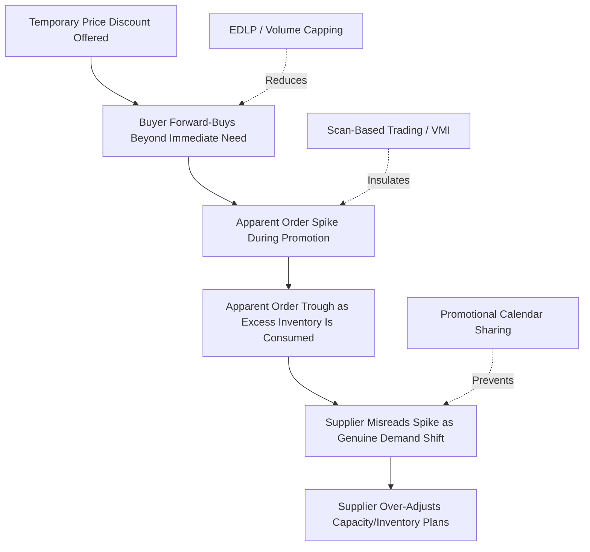

## Price Fluctuation and Forward Buying Effects

### Definition and Core Concept

Price fluctuation and forward buying is one of the primary structural causes of the bullwhip effect: it occurs when temporary price reductions (trade promotions, discounts, deals) cause buyers to purchase quantities well in excess of their immediate consumption needs, in order to stock up at the lower price. This creates an artificial demand spike during the promotional period followed by a corresponding demand trough afterward, as buyers draw down the excess inventory they forward-bought — distorting the true underlying consumption pattern that upstream tiers observe.

### The Forward Buying Mechanism

**Key Points**

- When a supplier offers a temporary price discount (a trade promotion, off-invoice allowance, or similar deal), the discount typically applies to whatever quantity the buyer chooses to order during the promotional window, not just their normal replenishment quantity
- Buyers with storage capacity and capital availability have an economic incentive to purchase far beyond their immediate need, effectively pre-buying future periods' consumption at the discounted price and holding the excess as inventory until it is consumed
- The larger the price discount relative to the buyer's holding cost, and the longer the buyer can store the product before spoilage/obsolescence, the greater the economic incentive to forward-buy aggressively
- This behavior is rational and profit-maximizing from the individual buyer's perspective, even though it introduces demand distortion that degrades the accuracy of the signal the supplier receives about true underlying consumption

### Quantitative Illustration

**Example**

A distributor's steady-state weekly consumption of a product is 500 units. A supplier offers a 15% price discount for one week.

- **Without forward buying**: distributor orders its normal 500 units during the promotional week, and 500 units in each subsequent week — the supplier sees a stable, easily forecastable pattern
- **With forward buying**: distributor orders 3,000 units during the promotional week (6 weeks' worth of consumption) to capture the discount on maximum volume, then orders 0 units for the next 5 weeks while drawing down the excess inventory it purchased

The supplier, observing the order pattern alone, sees an apparent demand spike of 6x normal volume in the promotional week, followed by five weeks of apparent zero demand — even though the distributor's true underlying consumption rate never changed. If the supplier interprets the spike as a genuine, sustained demand increase (rather than a forward-buying artifact) and adjusts production capacity or inventory targets accordingly, it compounds the distortion with real resource misallocation. [Inference: this is a stylized illustrative example; actual forward-buying magnitude depends on the specific discount depth, buyer storage/capital constraints, and product shelf life, and varies significantly across real promotional scenarios]

### Why This Amplifies Moving Upstream

**Key Points**

- Each tier that observes an order-pattern spike (rather than the true, stable consumption pattern) may itself respond with its own forward-buying or safety-stock adjustment, particularly if that tier is also uncertain whether the spike reflects a genuine, lasting shift in demand
- The distortion compounds because each successive upstream tier has even less visibility into the true root cause (an end-customer-facing promotion several tiers downstream) and must interpret the order signal with even less context than the tier immediately adjacent to the promotion
- Promotional calendars that are not shared transparently across tiers exacerbate this effect, since upstream suppliers may have no advance warning that an order spike is promotion-driven rather than an organic demand shift

### Categories of Price-Driven Distortion

**Trade Promotions and Off-Invoice Discounts**

Temporary price reductions offered by manufacturers to retailers/distributors, the most common and well-documented driver of forward buying in consumer goods supply chains.

**Volume/Tier Pricing Structures**

Even absent a temporary promotion, standing volume discount tiers (e.g., a lower per-unit price above a certain order threshold) can create a similar, though more chronic and predictable, incentive to batch and forward-buy to reach discount thresholds — this overlaps conceptually with order batching amplification but is specifically price-driven rather than purely transaction-cost-driven.

**End-of-Period Sales Incentives**

Sales team quota or bonus structures tied to period-end (monthly/quarterly) revenue targets can create a parallel, internally-generated version of the same distortion: sales teams may offer informal discounts or incentives near period-end to pull forward orders from the following period, creating an artificial spike-and-trough pattern independent of any customer-facing promotion.

**Anticipated Price Increases**

Buyers who anticipate an upcoming price increase (due to raw material cost inflation, tariff changes, or announced list price changes) have a similar incentive to forward-buy ahead of the increase, producing a comparable spike-and-trough distortion pattern even without an active discount being offered.

### Mitigation Strategies

**Every-Day Low Pricing (EDLP)**

- Replacing frequent, deep temporary promotions with a stable, consistently lower price structure removes the temporal price arbitrage opportunity that drives forward buying
- Some large retailers have adopted EDLP strategies partly for this reason, though the broader retail and CPG industry continues to use promotional pricing extensively for other strategic reasons (traffic generation, competitive response, category management objectives), so EDLP adoption varies significantly by retailer and category [Unverified: the specific prevalence and trend direction of EDLP adoption across the industry should be verified against current retail strategy sources if cited for a specific market]

**Scan-Based Trading / Pay-on-Scan**

- Payment and ownership transfer occurs based on actual point-of-sale scan data rather than at the time of shipment/order, reducing (though not eliminating) the buyer's incentive to forward-buy purely to capture a paper discount, since financial benefit is tied more directly to actual sell-through timing

**Promotional Calendar Transparency**

- Sharing promotional calendars and expected volume uplift estimates with upstream suppliers in advance (a core element of CPFR's Joint Business Plan step) allows suppliers to distinguish promotion-driven order spikes from genuine underlying demand shifts, preventing misinterpretation-driven overcorrection
- This does not eliminate the forward-buying volume itself but substantially improves the upstream tier's ability to plan for and absorb the distortion without compounding it further

**Volume Capping and Allocation Limits**

- Suppliers can limit the maximum quantity a buyer may purchase at a promotional price, directly capping the magnitude of forward buying possible during any single promotional event
- This trades off some promotional sales volume against reduced downstream inventory distortion and more stable underlying demand visibility

**Consumption-Based Replenishment (VMI/Scan-Based Systems)**

- Under vendor-managed inventory arrangements tied to actual consumption/POS data rather than buyer-initiated orders, the supplier's replenishment decisions are insulated from the buyer's forward-buying incentive, since replenishment volume is calculated from true depletion rather than from the buyer's independently-placed order

### Distinguishing Forward Buying from Genuine Demand Shift

**Key Points**

- The key diagnostic distinction is whether an order spike correlates with a known promotional or pricing event versus an unexplained increase with no corresponding causal driver — this is why causal/explanatory forecasting methods that explicitly model price and promotion as input variables are particularly valuable in categories where forward buying is common
- Post-promotion order troughs that closely mirror the magnitude and timing implied by the promotional spike (i.e., the trough approximately offsets the excess volume purchased during the spike) are a strong indicator of forward-buying distortion rather than genuine demand change
- Statistical decomposition techniques that separate a demand/order series into baseline, promotional lift, and residual components can help isolate the forward-buying-driven distortion from the underlying stable demand pattern for forecasting and planning purposes

### Common Pitfalls

**Key Points**

- Treating every promotional-period order spike as a genuine, sustained demand increase and permanently raising production capacity or safety stock targets in response
- Failing to model the corresponding post-promotion demand trough, leading to excess inventory buildup at the supplier level as the buyer's forward-bought stock is drawn down
- Running frequent, deep promotions without any volume capping or promotional calendar transparency, maximizing the bullwhip-amplifying distortion for a given amount of promotional sales lift achieved
- Sales teams creating informal end-of-period pull-forward incentives without visibility or coordination with the broader S&OP/demand planning process, introducing an additional, often undocumented, source of price-driven distortion
- Ignoring anticipated price-increase-driven forward buying as a distinct but mechanically similar distortion source to promotional forward buying, missing an equally disruptive pattern that isn't tied to an active discount

### Related Topics

- Order Batching and Lot-Sizing Amplification
- Every-Day Low Pricing (EDLP) vs. High-Low Promotional Pricing Strategy
- Scan-Based Trading and Pay-on-Scan Retail Models
- Trade Promotion Management and Promotional Calendar Sharing
- Causal/Explanatory Forecasting Methods Incorporating Price and Promotion
- Vendor-Managed Inventory (VMI) Program Design