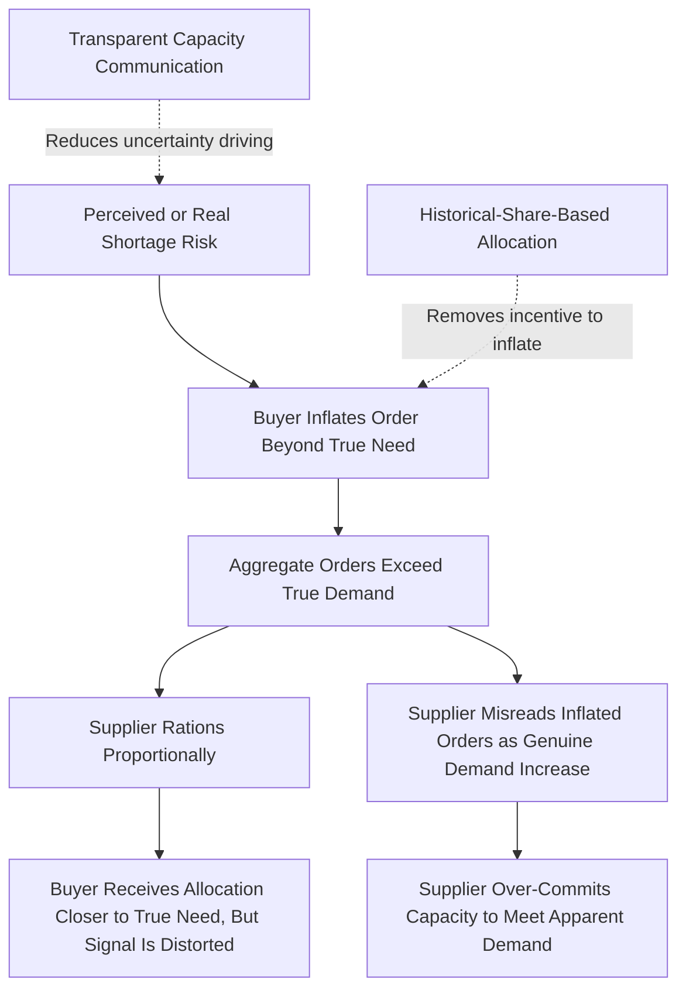

## Rationing and Shortage Gaming

### Definition and Core Concept

Rationing and shortage gaming is one of the primary structural causes of the bullwhip effect: it occurs when buyers, anticipating that a supplier may not be able to fill their full order during a real or perceived shortage, inflate their orders beyond actual need in order to secure a larger allocation. This behavior is a rational individual response to a specific allocation mechanism — proportional rationing based on order size — but produces order quantities that no longer reflect true demand, distorting the signal every upstream tier receives and often creating or worsening the very shortage the buyers were trying to protect against.

### The Proportional Rationing Mechanism

**Key Points**

- When a supplier faces insufficient supply to fill all customer orders in full, a common allocation approach is to fill each customer's order in proportion to the size of the order placed relative to total orders received (e.g., if total orders are double available supply, each customer receives 50% of what they ordered)
- Under this mechanism, a buyer's rational response to anticipated shortage is to order more than actually needed, since a larger order results in a larger absolute allocation even after proportional rationing is applied
- This creates a self-reinforcing dynamic: as more buyers inflate orders in anticipation of rationing, total reported demand rises further, which can trigger or extend the very shortage perception that motivated the inflated ordering in the first place — the phenomenon is sometimes referred to informally as "the shortage game" in supply chain literature

### Quantitative Illustration

**Example**

A supplier has 1,000 units available. Two customers each have true underlying need of 400 units (total true demand: 800 units, within available supply).

**Without shortage gaming**: both customers order their true need of 400 units each; total orders (800) are within supply (1,000); both receive their full order.

**With shortage gaming**: Customer A hears a rumor of an upcoming supply constraint and orders 800 units (double true need) to protect against anticipated rationing. Customer B, observing Customer A's behavior or independently anticipating the same risk, also inflates its order to 800 units. Total orders now equal 1,600 units against 1,000 units available — a shortage that did not exist based on true demand (800 units total) has now been created by the inflated ordering itself. Under proportional rationing, each customer receives 1,000 × (800/1,600) = 500 units — more than their true need of 400, but achieved only by artificially creating an apparent shortage that then had to be rationed.

This illustrates the core paradox of shortage gaming: the behavior can produce a self-fulfilling shortage where none was structurally necessary, and the supplier, observing orders of 1,600 units, may reasonably (but incorrectly) conclude that true demand has doubled and adjust capacity planning accordingly. [Inference: this is a simplified two-buyer illustration; real markets involve many buyers with heterogeneous information and risk tolerance, and the degree of self-fulfilling amplification depends on how widely the shortage perception spreads and how buyers' inflation behavior correlates]

### Common Triggers for Shortage Gaming Behavior

**Key Points**

- **Genuine supply disruptions**: a real supply constraint (raw material shortage, capacity outage, natural disaster affecting a key facility) that becomes publicly known or rumored among customers
- **New product launch hype**: anticipated high demand for a new product release, where buyers order aggressively to secure allocation ahead of expected sell-out, even without a genuine underlying supply constraint at the time of ordering
- **Rumored or anticipated disruption**: shortage gaming can occur even without a confirmed shortage — mere rumor or anticipation of future scarcity (e.g., anticipated tariff-driven material shortages, geopolitical supply risk) is sufficient to trigger the behavior
- **Historical precedent**: buyers who have previously experienced rationing from a given supplier during a past shortage may adopt a persistently more aggressive ordering posture going forward, anticipating that history could repeat

### Distinguishing Shortage Gaming from Other Bullwhip Causes

**Key Points**

- Shortage gaming differs from order batching in that it is triggered by supply-side uncertainty (fear of not receiving enough) rather than transaction-cost or transportation-efficiency incentives on the ordering side
- Shortage gaming differs from price-driven forward buying in that it is motivated by allocation risk rather than price arbitrage — a buyer engaging in shortage gaming is not trying to capture a discount, but to secure sufficient supply at any price
- The two can compound: a promotional price discount combined with a perceived supply constraint can trigger simultaneous forward buying and shortage gaming, producing an order spike larger than either cause alone would generate

### Allocation Mechanism Design as Mitigation

The core insight for mitigating shortage gaming is that the specific allocation rule a supplier uses during a shortage directly shapes buyers' incentive to inflate orders. Several alternative allocation mechanisms are used or proposed to reduce this incentive.

**Allocation Based on Historical Sales Share**

Rather than allocating in proportion to current (potentially inflated) orders, the supplier allocates based on each customer's historical purchase share over a prior reference period, removing the incentive to inflate current orders since current order size does not affect the allocation received.

**Turn-and-Earn / Historical Consumption-Based Allocation**

A variant used in some industries (notably documented in automotive parts distribution) where future allocation is explicitly tied to a customer's past actual sell-through or consumption performance rather than current order volume, directly removing the link between inflated ordering and increased allocation.

**Transparent Capacity and Demand Communication**

Suppliers proactively sharing accurate information about actual capacity constraints and expected fulfillment timelines can reduce the uncertainty that drives precautionary over-ordering, since buyers who trust they will be treated fairly and have accurate information have less incentive to game the system defensively.

**Firm Order Commitments with Penalties for Cancellation**

Requiring binding order commitments (with cancellation penalties) rather than allowing orders to be freely inflated and later canceled or reduced once the shortage resolves removes the low-risk, low-cost nature of speculative over-ordering.

### Downstream Consequences of Unaddressed Shortage Gaming

**Key Points**

- Suppliers who misinterpret gamed orders as genuine demand growth may invest in capacity expansion that proves unnecessary once true demand is revealed after the shortage resolves, representing a real capital misallocation cost stemming from a purely behavioral/informational distortion
- Once the perceived shortage resolves, buyers who over-ordered are typically left holding excess inventory, which they then work down by reducing subsequent orders — creating a demand trough at the supplier that mirrors the spike-and-trough pattern seen in price-driven forward buying, compounding the overall bullwhip pattern in the network
- Repeated cycles of shortage gaming can erode trust between trading partners over time, as suppliers become skeptical of reported order volumes during future periods of tight supply, potentially leading suppliers to discount orders during genuine future shortages — a reputational and information-quality cost beyond the immediate capacity/inventory misallocation

### Industry Examples and Context

**Key Points**

- Shortage gaming behavior has been documented and studied in various industries facing episodic supply constraints, with the automotive parts and semiconductor industries frequently cited as examples where allocation mechanism design has been explicitly used as a countermeasure
- The COVID-19 pandemic period saw widely reported instances of shortage-gaming-like behavior across multiple product categories (notably certain consumer staples and semiconductor components), illustrating how rapidly the dynamic can emerge and propagate across a supply chain when disruption risk becomes broadly perceived [Unverified: the specific magnitude and causal attribution of demand inflation during this period versus genuine demand shifts is difficult to isolate empirically and is a subject of ongoing analysis in supply chain research; general directional patterns are widely reported but precise quantification varies by source]

### Common Pitfalls

**Key Points**

- Using simple proportional-to-current-order rationing without recognizing that this specific mechanism directly incentivizes the order inflation it is meant to manage
- Suppliers treating a sudden order surge during a period of known supply tightness as straightforward evidence of genuine demand growth, without adjusting for the strong likelihood of gaming-driven distortion
- Failing to communicate capacity constraints and fulfillment expectations transparently, leaving buyers with insufficient information and a rational incentive to over-order defensively
- Allowing orders to be freely placed and later canceled with no penalty, which minimizes the downside risk of speculative over-ordering and encourages the behavior
- Overreacting to a resolved shortage by immediately reducing capacity based on the post-shortage demand trough, without recognizing that the trough itself is partly an artifact of buyers working down previously gamed excess inventory rather than a genuine long-term demand decline

### Related Topics

- Order Batching and Lot-Sizing Amplification
- Price Fluctuation and Forward Buying Effects
- Allocation Mechanism Design During Supply Constraints
- Multi-Tier Supply Chain Flow Synchronization
- Supply Chain Risk Management and Disruption Response
- Trust and Information Sharing in Buyer-Supplier Relationships