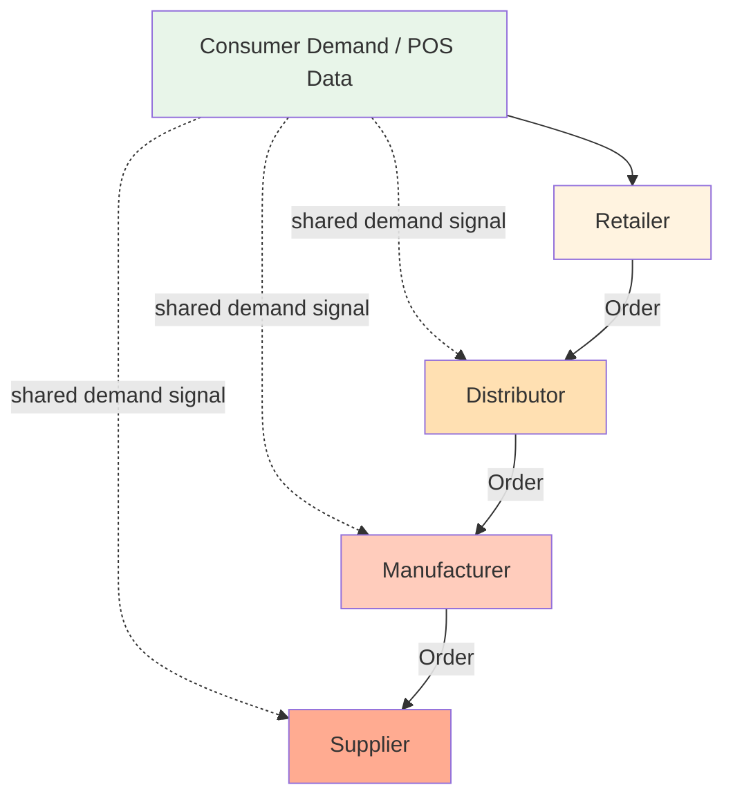
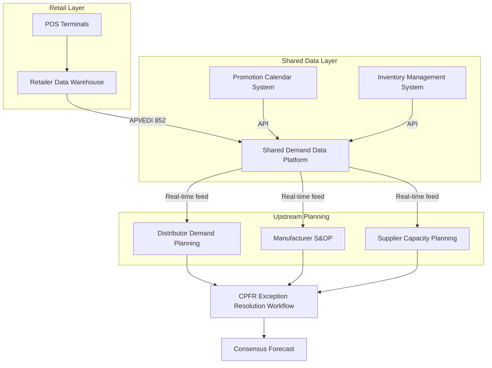

## Information Sharing as a Bullwhip Mitigation Strategy

### Overview

Information sharing addresses the bullwhip effect at its structural root: order variance amplification occurs because each tier in a supply chain reacts only to the orders placed by its immediate downstream partner, not to actual end-consumer demand. When retailers, distributors, and manufacturers exchange point-of-sale (POS) data, inventory positions, and forecasts directly, each tier can plan against real demand signals instead of inferring demand from a noisy, delayed proxy (the order stream). This decouples forecast quality from chain position.

### The Information Asymmetry Problem

In a traditional serial supply chain, each node only observes:

- Orders received from the tier immediately downstream
- Its own inventory position
- Its own lead times

Each node is blind to:

- Actual consumer/end-customer demand
- Downstream inventory levels and safety stock policies
- Downstream promotional calendars, pricing changes, or one-time events
- Upstream capacity constraints until a shortage manifests as delayed replenishment

This creates what Lee, Padmanabhan, and Whang (1997) formally identified as one of the four operational causes of the bullwhip effect: **demand signal processing**, where each tier updates its own forecast based on the order pattern it receives rather than ground-truth demand, and this re-forecasting compounds at every echelon.

### Mechanism: How Shared Information Dampens Variance

$$\text{Var}(\text{orders}_{tier\ n}) \propto f(\text{forecast error}, \text{lead time}, \text{batching}, \text{information lag})$$

Information sharing primarily reduces the **forecast error** and **information lag** terms.

**Without information sharing:**

Each arrow represents an independent forecasting and re-forecasting event. Noise and lag accumulate multiplicatively as it propagates upstream.

**With shared information (POS/consumption data broadcast to all tiers):**

Every upstream tier still receives orders, but now also receives the same ground-truth demand signal the retailer sees. This allows each tier to independently validate or override signal-based inference from the order stream, reducing reliance on order history as a demand proxy.

### Categories of Shared Information

**1. Point-of-Sale (POS) data**

Actual sell-through at the retail level, shared upstream in near real time. This is the most direct antidote to demand signal processing, since it represents undistorted consumer demand rather than a derived order.

**2. Inventory position data**

Current on-hand stock, in-transit stock, and safety stock targets at each downstream node. Lets upstream tiers distinguish a large order caused by a stockout replenishment from one caused by a genuine demand spike.

**3. Forecasts and forecast revisions**

Sharing the demand forecast itself (not just historical orders) allows upstream planners to align production/procurement plans with downstream expectations before orders are even placed.

**4. Promotion and event calendars**

Advance notice of price promotions, markdowns, or planned events prevents upstream tiers from misreading a promotion-driven spike as a baseline demand shift.

**5. Order/production schedules and capacity signals**

Bidirectional sharing — upstream capacity constraints shared downstream — prevents downstream tiers from over-ordering defensively (a shortage-gaming behavior) when they fear future allocation cuts.

### Formal Mechanisms and Frameworks

**Vendor-Managed Inventory (VMI)**

The supplier is given direct access to the retailer's POS and inventory data and assumes responsibility for replenishment decisions, effectively collapsing the order-signal step for that tier pair. Since the supplier plans directly against consumption data, the tier-to-tier variance amplification for that link is largely eliminated.

**Collaborative Planning, Forecasting, and Replenishment (CPFR)**

A structured, multi-step process (per the VICS CPFR model) in which trading partners jointly develop a single shared forecast, flag and resolve exceptions where forecasts diverge beyond a tolerance threshold, and commit to a collaborative replenishment plan. CPFR extends information sharing beyond raw data exchange into joint forecast governance.

**Continuous Replenishment Programs (CRP)**

Retailer POS and inventory data trigger automatic replenishment against pre-agreed rules, reducing discretionary reordering behavior that introduces variance.

**Electronic Data Interchange (EDI) and API-based data feeds**

The technical substrate for most of the above. Standard EDI transaction sets relevant here include:

- 852 (Product Activity Data) — POS/inventory movement
- 830 (Planning Schedule) — forecast data
- 852/867 combinations for sell-through reporting

Modern implementations increasingly replace batch EDI with real-time APIs or shared data platforms (e.g., retail data clouds, supplier portals) that reduce information lag from days to near-instant.

### Quantitative Effect: Why It Works

Lee et al.'s analytical model shows that under an order-up-to inventory policy with demand forecasting via exponential smoothing, the variance of orders placed by an upstream tier can be expressed as:

$$\frac{\text{Var}(q)}{\text{Var}(D)} \geq 1 + \frac{2L}{p} + \frac{2L^2}{p^2}$$

where $L$ is the lead time and $p$ is the smoothing/observation window used for demand estimation. [Inference] Information sharing does not change this equation directly — it changes what data feeds $\text{Var}(D)$'s estimation. When upstream tiers estimate demand from true consumer demand rather than from the already-amplified order stream of the tier below, the effective $\text{Var}(D)$ term each tier works from shrinks back toward the true end-demand variance rather than compounding at each hop.

### Worked Example

**Scenario:** A retailer sees relatively stable consumer demand (weekly sales fluctuating narrowly around a baseline) but periodically places large, lumpy orders to the distributor due to batch ordering and occasional promotions.

**Without information sharing:**

The distributor sees only the retailer's lumpy order stream. It cannot distinguish "this order is large because of a promotion next week" from "this order is large because baseline demand has permanently shifted." The distributor forecasts using the order stream itself, over-reacts, and places an even larger, more volatile order to the manufacturer.

**With information sharing (POS + promotion calendar shared):**

The distributor observes that underlying POS sell-through remains stable and sees the promotion flagged in the shared calendar. It recognizes the large order as promotion-driven and temporary, adjusts its own order to the manufacturer proportionally to the known promotional lift rather than reactively, and reverts to baseline ordering immediately after the promotion window — without a lagged "correction" cycle.

### Limitations and Preconditions

Information sharing mitigates but does not eliminate the bullwhip effect, because it addresses only one of the four classical causal mechanisms:

| Bullwhip Cause | Addressed by Information Sharing? |
| --- | --- |
| Demand signal processing | Directly addressed |
| Order batching | Not addressed (requires smaller/frequent order sizing) |
| Price fluctuations (forward buying) | Partially addressed (if promotion calendars are shared) |
| Rationing/shortage gaming | Partially addressed (if capacity data is shared) |

[Inference] Because information sharing only fully addresses one of the four causes, most practitioner and academic guidance treats it as necessary but not sufficient — typically paired with order batching reduction (e.g., smaller/frequent replenishment via CRP) and stable everyday-low-pricing strategies to counter forward buying.

Additional preconditions for effectiveness:

- **Data quality and standardization**: Inconsistent SKU mapping, unit-of-measure mismatches, or delayed data feeds undermine the value of shared data.
- **Trust and contractual alignment**: Partners must trust that shared data (e.g., true cost or inventory levels) will not be used opportunistically (e.g., to extract price concessions), or sharing will be resisted or gamed.
- **Technical infrastructure**: Requires EDI/API connectivity, and increasingly, shared cloud data platforms with appropriate access controls.
- **Behavioral alignment**: Even with perfect data, if planners continue to apply local, non-collaborative forecasting heuristics on top of shared data, benefits are muted. [Inference] This is why CPFR emphasizes a jointly governed exception-resolution process rather than simply broadcasting data.

### System Architecture Pattern (Reference Implementation)

### SVG Diagram: Variance Comparison

<svg xmlns="http://www.w3.org/2000/svg" viewBox="0 0 700 340">
<text x="350" y="25" text-anchor="middle" font-size="16" font-weight="bold" fill="#1a1a1a">Order Variance by Tier: With vs. Without Information Sharing (svg_diagram)</text>

<line x1="70" y1="280" x2="650" y2="280" stroke="#333" stroke-width="2" />
<line x1="70" y1="280" x2="70" y2="50" stroke="#333" stroke-width="2" />
<text x="360" y="315" text-anchor="middle" font-size="13" fill="#333">Supply Chain Tier (downstream to upstream)</text>
<text x="30" y="165" text-anchor="middle" font-size="13" fill="#333" transform="rotate(-90 30 165)">Order Variance</text>

<text x="140" y="298" text-anchor="middle" font-size="12" fill="#333">Retailer</text>

<text x="280" y="298" text-anchor="middle" font-size="12" fill="#333">Distributor</text>

<text x="420" y="298" text-anchor="middle" font-size="12" fill="#333">Manufacturer</text>

<text x="560" y="298" text-anchor="middle" font-size="12" fill="#333">Supplier</text>

<polyline points="140,255 280,210 420,140 560,60" fill="none" stroke="#e53935" stroke-width="3" />
<circle cx="140" cy="255" r="5" fill="#e53935" />
<circle cx="280" cy="210" r="5" fill="#e53935" />
<circle cx="420" cy="140" r="5" fill="#e53935" />
<circle cx="560" cy="60" r="5" fill="#e53935" />

<polyline points="140,255 280,245 420,235 560,225" fill="none" stroke="#43a047" stroke-width="3" />
<circle cx="140" cy="255" r="5" fill="#43a047" />
<circle cx="280" cy="245" r="5" fill="#43a047" />
<circle cx="420" cy="235" r="5" fill="#43a047" />
<circle cx="560" cy="225" r="5" fill="#43a047" />

<rect x="450" y="60" width="14" height="14" fill="#e53935" />
<text x="470" y="72" font-size="12" fill="#333">Without information sharing</text>
<rect x="450" y="85" width="14" height="14" fill="#43a047" />
<text x="470" y="97" font-size="12" fill="#333">With information sharing</text>
</svg>

### Key Points

- Information sharing directly targets **demand signal processing**, one of four canonical bullwhip causes, by replacing the noisy order stream as a demand proxy with actual consumption/POS data.
- Effective mechanisms include VMI, CPFR, and CRP, all underpinned by EDI or API-based data exchange (e.g., EDI 852, 830).
- Sharing must include not just historical demand but also inventory position, promotion calendars, and capacity constraints to be maximally effective.
- It is necessary but not sufficient — order batching and price-driven forward buying require separate countermeasures (order size reduction, everyday-low-pricing).
- Effectiveness depends on data quality, inter-organizational trust, and collaborative (not just informational) planning processes such as CPFR's exception-resolution workflow.

### Next Steps

- Order Batching Reduction and EOQ Strategies as a Bullwhip Mitigation
- Everyday Low Pricing (EDLP) vs. Forward Buying and Promotion-Driven Variance
- Vendor-Managed Inventory (VMI): Implementation Architecture
- CPFR Process Model: The Nine-Step VICS Framework
- Quantifying the Bullwhip Effect: The Lee, Padmanabhan, and Whang Analytical Model
- Shortage Gaming and Rationing Schemes in Allocation-Constrained Supply Chains