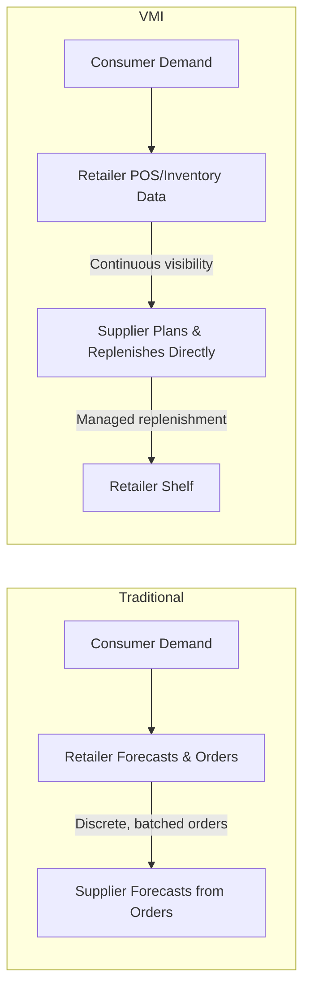
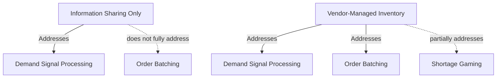
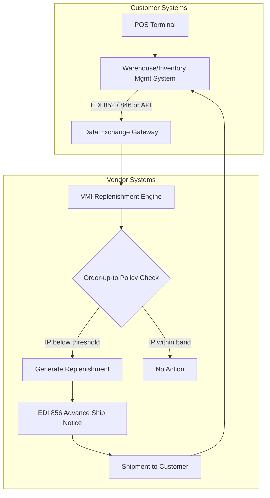

## Vendor-Managed Inventory as a Bullwhip Countermeasure

### Overview

Vendor-Managed Inventory (VMI) is a supply chain arrangement in which the upstream supplier (vendor), rather than the downstream customer (typically a retailer or distributor), takes responsibility for determining replenishment quantities and timing. The customer grants the vendor visibility into POS data, inventory levels, and consumption patterns, and the vendor uses this data to generate and execute replenishment orders against mutually agreed inventory policies (min/max levels, service level targets). Because the reordering decision moves upstream and is made directly against real demand data, VMI structurally removes one full tier of independent, locally-optimized forecasting from the chain — directly attacking the bullwhip effect's demand signal processing and order batching causes simultaneously.

### Why VMI Mitigates the Bullwhip Effect

In a conventional arrangement, the retailer forecasts its own demand, applies its own safety stock policy, and places discrete orders to the supplier. The supplier sees only this order stream and must reverse-engineer demand from it — introducing lag, distortion, and batching artifacts.

Under VMI:

The vendor no longer infers demand from an order signal; it observes the signal directly and controls the replenishment decision end-to-end. This collapses two independent decision-making layers (retailer's order-up-to logic, then supplier's forecast-from-orders logic) into a single layer operating on ground-truth data, eliminating one full stage of variance amplification.

### Core Mechanism Detail

**1. Data visibility granted to vendor**

- Point-of-sale (POS) sell-through data
- Current on-hand inventory at the customer location
- In-transit inventory (already shipped, not yet received)
- Agreed min/max inventory thresholds or target service levels

**2. Vendor-side replenishment logic**

The vendor runs its own replenishment algorithm (commonly an order-up-to or (s, S) policy) directly against the customer's real inventory position:

$$Q_{replenish} = S - IP$$

where $S$ is the order-up-to target level (agreed contractually or dynamically calculated) and $IP$ is current inventory position (on-hand + in-transit − backorders) at the customer site.

**3. Execution**

The vendor generates and ships replenishment shipments, typically confirmed via an Advance Ship Notice (ASN, EDI 856), without the customer issuing a discrete purchase order for each replenishment cycle.

### Which Bullwhip Causes VMI Addresses

| Bullwhip Cause | VMI Effect |
| --- | --- |
| Demand signal processing | Directly eliminated for this tier pair — vendor plans from real demand/inventory data, not from an order proxy |
| Order batching | Substantially reduced — replenishment can be continuous/frequent rather than batched to meet order minimums, since the vendor consolidates replenishment decisions across its full customer base rather than per discrete PO |
| Price fluctuations / forward buying | Not directly addressed — must be paired with stable pricing agreements |
| Shortage gaming | Reduced — since the vendor sees true inventory position, customers have less incentive/ability to over-order defensively during perceived shortages |

[Inference] VMI is generally considered one of the stronger bullwhip countermeasures precisely because it addresses two of the four causes simultaneously, rather than one in isolation as with plain information sharing without transferred decision authority.

### VMI vs. Plain Information Sharing

A critical distinction: information sharing alone (retailer shares POS data, but retailer still decides and places orders) reduces demand signal distortion but does not eliminate order batching, since the retailer may still batch orders for logistics or administrative efficiency. VMI goes further by also transferring the **decision rights** for replenishment timing and quantity to the vendor, who can then optimize replenishment frequency and lot sizing across its entire customer network rather than per individual customer order cycle.

### Worked Example

**Setup:** A retailer stocks a fast-moving consumer good, historically ordering in batches of 500 units whenever inventory drops below 200 units, generating lumpy weekly order spikes to the supplier even though daily consumer demand is nearly flat.

**Traditional arrangement:** The supplier sees order spikes of 500 units arriving irregularly (whenever the retailer's threshold is crossed) and must forecast future orders from this batched, lagged pattern — overestimating volatility and holding excess safety stock or overproducing in anticipation of the next spike.

**Under VMI:** The supplier has direct visibility into the retailer's actual daily sell-through (nearly flat) and current inventory position. Rather than waiting for and reacting to a 500-unit order trigger, the supplier initiates smaller, more frequent replenishments (e.g., 100 units every 1–2 days) timed to actual depletion, keeping the retailer's inventory near target levels continuously. The supplier's own production/procurement planning now tracks the true flat demand curve instead of a lumpy proxy, and the retailer's discrete large-order pattern disappears entirely from the supplier's input signal.

### Governance and Contractual Structure

VMI arrangements typically specify:

- **Service level agreements (SLAs)**: minimum fill rate or stockout frequency the vendor must maintain
- **Inventory ownership/consignment terms**: in many VMI arrangements, the vendor retains ownership of inventory until it is sold or consumed (consignment inventory), shifting carrying cost and risk upstream
- **Min/max or target inventory bands**: contractually bounded so the vendor cannot under- or over-stock unilaterally
- **Data-sharing protocols**: typically EDI transaction sets:
  - 852 (Product Activity Data) — POS/consumption reporting
  - 846 (Inventory Inquiry/Advice) — current inventory position
  - 856 (Advance Ship Notice) — vendor-initiated shipment confirmation
  - 810 (Invoice) — billing, often decoupled from individual order events under consignment terms
- **Exception handling**: escalation procedures if actual inventory diverges materially from forecast (e.g., unplanned promotion, stockout risk)

### System Architecture Pattern

### Preconditions for Successful VMI Implementation

- **Data accuracy and latency**: The vendor's replenishment decisions are only as good as the inventory/POS data feed. Stale or inaccurate data (e.g., unrecorded shrinkage, RFID/barcode scan failures) directly degrades replenishment quality.
- **Trust and contract clarity**: Because the vendor gains significant control over the customer's inventory levels, clear SLAs and audit mechanisms are needed to prevent misaligned incentives (e.g., a vendor over-stocking to hit its own sales targets at the customer's carrying-cost expense).
- **Systems integration**: Requires EDI or API connectivity between customer inventory/POS systems and vendor planning systems; legacy or manual systems raise implementation cost and latency.
- **Demand volatility fit**: [Inference] VMI tends to perform best for steady, moderate-volume items with relatively predictable consumption; highly volatile, promotion-driven, or long-tail SKUs may still exhibit bullwhip-like variance under VMI if promotional and event data are not also shared as part of the arrangement.

### Well-Known Industry Examples

[Inference — general industry knowledge, not from a specific verified source in this session] Procter & Gamble's VMI relationship with Walmart is commonly cited in supply chain literature as an early, large-scale implementation credited with reducing stockouts and inventory variance for P&G products across Walmart's stores. Specific performance figures from that program should be treated as illustrative rather than independently verified here.

### Limitations

- VMI does not address price-driven forward buying; promotional or discount-driven order spikes can still distort the vendor's replenishment signal unless promotion calendars are shared as a supplementary data feed.
- Shifts inventory carrying risk and cost upstream to the vendor (particularly under consignment terms), which may be commercially unattractive to suppliers unless priced into the relationship.
- Requires a level of inter-organizational trust and systems integration that smaller or less digitally mature trading partners may not have.
- [Inference] Vendor over- or under-investment in service level can occur if SLA terms are not carefully calibrated, since the vendor's replenishment cost/benefit tradeoff differs from the customer's stockout cost/benefit tradeoff.

### Key Points

- VMI transfers replenishment decision authority from customer to vendor, who plans directly against POS/inventory data rather than an order-stream proxy.
- It addresses both demand signal processing and order batching, making it a stronger bullwhip countermeasure than information sharing alone.
- Typically implemented via EDI (852, 846, 856) or equivalent API data feeds, often paired with consignment inventory ownership terms.
- Does not address price-driven forward buying or fully eliminate shortage gaming; best combined with promotion-calendar sharing and stable pricing agreements.
- Success depends on data accuracy, contractual SLA clarity, and systems integration maturity between trading partners.

### Next Steps

- Continuous Replenishment Programs (CRP) vs. VMI: Structural Differences
- Consignment Inventory Accounting and Risk Allocation in VMI Contracts
- CPFR as an Extension Beyond VMI: Joint Forecast Governance
- Order-Up-To Policy Design and Safety Stock Calculation under VMI
- EDI Transaction Set Architecture for Supply Chain Data Exchange (852, 846, 856, 810)
- Case Study Analysis: Large-Scale VMI Implementations and Measured Bullwhip Reduction