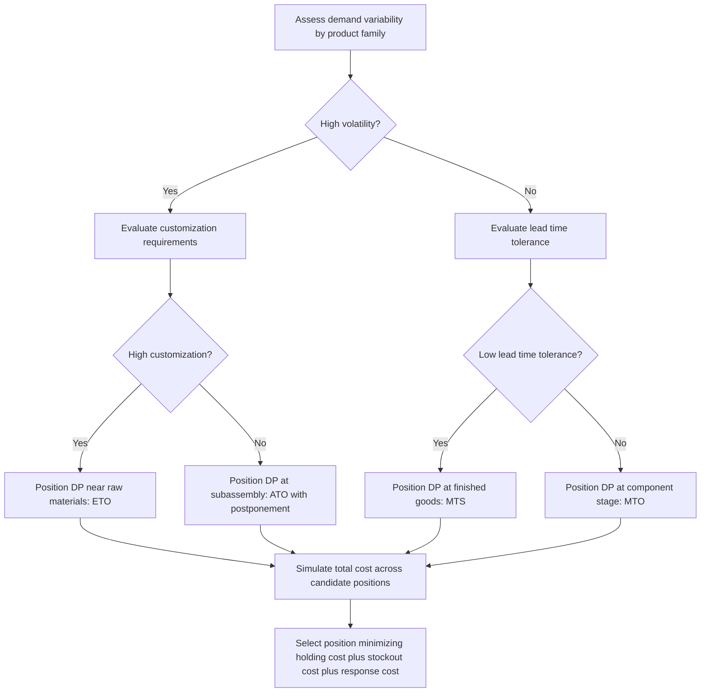

## Inventory Positioning and Decoupling Points


### Definition and Conceptual Basis

Inventory positioning is the strategic decision of where in a supply chain — across raw materials, components, subassemblies, and finished goods — to hold buffer stock. A decoupling point (also called the order penetration point, OPP) is the specific location in the value stream where forecast-driven ("push") production meets order-driven ("pull") fulfillment. Upstream of the decoupling point, production and replenishment are triggered by forecasts; downstream of it, activity is triggered by actual customer orders. The decoupling point functions as a buffer that absorbs demand variability so that upstream stages can operate on smoother, more predictable signals while downstream stages remain responsive to actual customer requirements.

### The Push-Pull Boundary

**Key Points**:

- Everything upstream of the decoupling point is planned against a forecast and is exposed to forecast error.
- Everything downstream of the decoupling point is triggered by a confirmed customer order and is exposed to lead time risk (the customer must wait at least as long as the downstream lead time).
- The decoupling point itself holds strategic inventory in whatever form allows the fastest, most flexible response to actual demand once it arrives.
- Moving the decoupling point upstream (toward raw materials) increases responsiveness but increases inventory holding cost and forecast risk; moving it downstream (toward finished goods) reduces customer lead time to near-zero at the cost of holding fully finished, non-fungible inventory exposed to full demand uncertainty.

### Strategic Positioning Archetypes

The position of the decoupling point defines a small number of canonical fulfillment strategies, ordered from most upstream to most downstream:

- **Engineer-to-Order (ETO)**: The decoupling point sits at the raw material or design stage. Nothing is procured or produced until a customer order specifies the exact configuration. Lead time is longest; inventory risk is lowest.
- **Make-to-Order (MTO)**: Raw materials and possibly some components are stocked, but final production only begins on order receipt. Common in custom manufacturing and specialty apparel.
- **Assemble-to-Order (ATO)**: Subassemblies or modules are produced to forecast and held in inventory; final configuration and assembly happen only after the order arrives. This is the classic "postponement" strategy, exemplified historically by Dell's build-to-order PC model.
- **Make-to-Stock (MTS)**: Finished goods are produced to forecast and held in inventory ahead of demand; the customer order is fulfilled directly from finished-goods stock. Lead time is shortest (effectively instantaneous); inventory risk and holding cost are highest.

### Decoupling Point Diagram

(svg_diagram)

<svg xmlns="http://www.w3.org/2000/svg" viewBox="0 0 900 260">
<text x="450" y="24" text-anchor="middle" font-size="16" font-weight="bold" fill="#111">Push-Pull Boundary at the Decoupling Point (svg_diagram)</text>
<rect x="30" y="70" width="380" height="70" rx="6" fill="#dceeff" stroke="#2a6fb0" />
<text x="220" y="100" text-anchor="middle" font-size="13" fill="#111">PUSH — Forecast-Driven</text>
<text x="220" y="120" text-anchor="middle" font-size="12" fill="#333">Raw Materials → Components → Subassembly</text>
<rect x="440" y="70" width="60" height="70" rx="6" fill="#ffe08a" stroke="#a67c00" stroke-width="3" />
<text x="470" y="100" text-anchor="middle" font-size="11" fill="#111">DP</text>
<text x="470" y="115" text-anchor="middle" font-size="10" fill="#333">Buffer</text>
<rect x="530" y="70" width="340" height="70" rx="6" fill="#ffd6d6" stroke="#b03030" />
<text x="700" y="100" text-anchor="middle" font-size="13" fill="#111">PULL — Order-Driven</text>
<text x="700" y="120" text-anchor="middle" font-size="12" fill="#333">Final Assembly → Fulfillment → Customer</text>
<line x1="410" y1="105" x2="437" y2="105" stroke="#333" stroke-width="2" marker-end="url(#arr)" />
<line x1="500" y1="105" x2="527" y2="105" stroke="#333" stroke-width="2" marker-end="url(#arr)" />

<text x="220" y="175" text-anchor="middle" font-size="11" fill="`#2a6fb0`">Driven by demand forecast</text>

<text x="700" y="175" text-anchor="middle" font-size="11" fill="`#b03030`">Driven by confirmed order</text>

<text x="470" y="160" text-anchor="middle" font-size="10" fill="`#a67c00`">Order Penetration Point</text>

<line x1="470" y1="150" x2="470" y2="230" stroke="#a67c00" stroke-width="1" stroke-dasharray="4,3" />
<text x="470" y="245" text-anchor="middle" font-size="10" fill="#555" font-style="italic">Position moves left (ETO) to right (MTS) by strategy</text>
</svg>

### Quantitative Framework for Positioning Decisions

The decoupling point decision is fundamentally a trade-off between two costs, and can be framed formally as minimizing total expected cost across candidate positions $k$ in the value stream:

$$TC(k) = H(k) + P(k) \cdot C_{stockout} + R(k) \cdot C_{response}$$

where $H(k)$ is the holding cost of carrying inventory at position $k$ (higher for finished goods than raw materials due to added value), $P(k)$ is the probability of a stockout given the forecast error accumulated up to position $k$, $C_{stockout}$ is the cost of a stockout (lost sale, expediting, backorder penalty), and $C_{response}$ captures the cost of the customer-facing lead time implied by position $k$ (lost sales to more responsive competitors, contractual penalties).

**Key Points**: [Inference] In practice, firms rarely solve this formally as a closed-form optimization; more commonly they apply heuristic decision rules such as demand variability, product customization degree, and lead time competitiveness thresholds to select an archetype (MTS/ATO/MTO/ETO) per product family, then refine positioning through simulation or phased pilots rather than analytical minimization.

### Demand Variability and Positioning Correlation

Products are generally positioned according to two intersecting dimensions: demand predictability and delivery lead time tolerance.

| Demand Volatility | Customer Lead Time Tolerance | Typical Decoupling Strategy |
| --- | --- | --- |
| Low (stable, predictable) | Low (expects immediate) | Make-to-Stock (MTS) |
| Low (stable, predictable) | High (will wait) | Make-to-Order (MTO) |
| High (volatile, unpredictable) | Low (expects immediate) | Assemble-to-Order (ATO) with modular postponement |
| High (volatile, unpredictable) | High (will wait, highly custom) | Engineer-to-Order (ETO) |

### Postponement as a Positioning Lever

Postponement is the design and process strategy that enables the decoupling point to move upstream without sacrificing customer responsiveness, by delaying product differentiation until closer to the point of actual demand. Two primary forms:

- **Form postponement**: Manufacturing or assembly of the final product configuration is delayed until order receipt (e.g., generic sub-assemblies configured with region-specific components only after order confirmation).
- **Logistics/geographic postponement**: Finished goods are held in a centralized location rather than pre-distributed to regional warehouses, with final distribution triggered only after demand is confirmed at the regional level — trading transportation speed for reduced risk of misallocated regional inventory.

Postponement strategies are what allow firms to achieve ATO-level customer responsiveness while keeping the bulk of committed inventory positioned as generic, undifferentiated stock further upstream, which is cheaper to hold and less exposed to product-specific demand risk.

### Simulation-Based Evaluation of Candidate Positions

A common evaluation approach models each candidate decoupling point as a two-stage inventory system: upstream stock is managed to a forecast-based base-stock level, and downstream stages consume only what's actually ordered. A simplified simulation loop:

```plaintext
for candidate_position in value_stream_stages:
    upstream_stock = forecast_demand(candidate_position) * lead_time_upstream + safety_stock
    for t in range(T):
        actual_order = realized_demand[t]
        downstream_fulfillment_time = process_time(candidate_position, end)
        stockout_flag = actual_order > available_inventory(candidate_position)
        total_cost += holding_cost(candidate_position) + stockout_flag * stockout_penalty
    record(candidate_position, total_cost, avg_customer_lead_time)

optimal_position = min(candidates, key=lambda c: c.total_cost)
```

### Decoupling Point Selection Process Flow



### Interaction with the Bullwhip Effect

Decoupling point positioning directly affects the variance-amplification dynamics discussed in bullwhip analysis: because everything downstream of the decoupling point responds to actual orders rather than forecasts, moving the decoupling point upstream shortens the forecast-driven segment of the chain and reduces the number of tiers across which demand-signal distortion can compound. This is one of the primary mechanisms by which postponement strategies reduce measured bullwhip ratios in multi-echelon simulations.

### Common Positioning Pitfalls

**Key Points**:

- Positioning the decoupling point based solely on historical product-family classification without periodically re-evaluating demand volatility shifts, since a product's demand pattern can migrate (e.g., a stable SKU becoming volatile due to a competitive entrant), stranding the decoupling point at a suboptimal location.
- Treating the decoupling point as a single fixed point for an entire product portfolio rather than allowing it to vary by SKU or product family, which under-serves both highly stable, high-volume items (which could support a more downstream MTS position) and highly custom, low-volume items (which require an upstream ETO position).
- Underestimating the process redesign cost required to enable postponement (modular product architecture, delayed labeling/packaging, configurable BOMs), which is frequently the actual barrier to moving a decoupling point upstream rather than any true operational necessity for the current position.

### Related Topics

- Postponement Strategies: Form, Time, and Place Postponement in Practice
- Modular Product Architecture and Bill-of-Materials (BOM) Design for ATO Systems
- Safety Stock Sizing at the Decoupling Point Under Demand Uncertainty
- Multi-Echelon Inventory Optimization (MEIO) Models
- Configure-to-Order (CTO) Systems and Mass Customization
- Lead Time Compression Strategies and Their Effect on Decoupling Point Selection
- Bullwhip Effect Quantification and Its Relationship to Push-Pull Boundaries