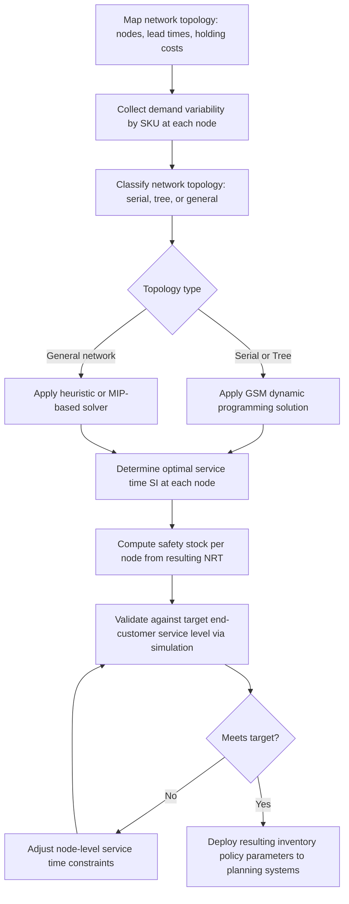

## Multi-Echelon Inventory Optimization (MEIO)


### Definition and Conceptual Basis

Multi-Echelon Inventory Optimization (MEIO) is the practice of setting inventory targets — safety stock, reorder points, and order-up-to levels — jointly across every tier (echelon) of a supply chain simultaneously, rather than optimizing each tier's inventory independently against its immediate downstream demand. A single-echelon approach sizes each node's safety stock only against the variability it directly observes, ignoring how upstream nodes can share risk with, or be protected by, inventory held elsewhere in the network. MEIO instead treats the entire network — from raw material suppliers through distribution centers to retail or customer-facing nodes — as one coupled optimization problem, recognizing that inventory placed at one echelon changes the risk profile faced by every other echelon connected to it.

### Why Single-Echelon Optimization Under-Performs

**Key Points**:

- Independently optimizing each node ignores **risk pooling**: demand variability observed by an upstream node is often a smoothed, partially aggregated version of downstream variability (subject to bullwhip amplification), so the upstream node's true protection requirement is not simply its own local variance.
- It ignores the **substitutability of buffers**: a unit of safety stock held further upstream (as raw material or a generic subassembly) can protect against uncertainty for multiple downstream SKUs or configurations simultaneously, whereas a unit of finished-goods stock protects only its specific SKU. Independent optimization cannot capture this shared-protection value.
- It typically results in **double-counting of protection**: if both a distribution center and its downstream retail nodes independently size safety stock against the same underlying demand uncertainty, the combined system holds more total buffer than is actually needed to hit the target end-customer service level.
- [Inference] Published case studies and vendor benchmarks commonly report inventory reductions in the range of roughly 10-30% from moving to MEIO from independently-optimized single-echelon policies, though the actual magnitude is highly network- and product-mix-dependent and should not be treated as a universal guarantee.

### Two Foundational Modeling Approaches

MEIO methodology splits into two major analytical traditions, distinguished by how they treat lead time and service guarantees between tiers.

#### Guaranteed-Service Model (GSM)

The Guaranteed-Service Model, most closely associated with the Graves-Willems framework, assumes each node commits to a **guaranteed service time** to its downstream customer (internal or external) — a maximum time within which it will always fulfill an order, regardless of upstream disruption, as long as demand stays within a bounded range. Key properties:

- Each stage covers demand only up to a specified maximum, and holds enough safety stock to guarantee its committed service time under that bounded demand assumption.
- The **net replenishment time** at each stage is the stage's own processing/production lead time, plus the maximum of the guaranteed service times promised by its upstream suppliers, minus the service time it promises downstream.
- The optimization problem reduces to choosing each node's **outbound service time** to minimize total system-wide safety stock, subject to the constraint that every node's committed service time is actually achievable given its own lead time and its suppliers' commitments.
- GSM is computationally efficient for large networks (it can be formulated as a dynamic program on the network's topology, particularly for tree-structured networks) and is the more common choice for large-scale industrial MEIO deployments.

#### Stochastic-Service Model (SSM)

The Stochastic-Service Model instead treats every stage's fulfillment time as inherently random, driven by actual upstream stockout probabilities rather than a guaranteed bound. Key properties:

- No stage guarantees a fixed service time; instead, each stage's effective lead time to its downstream customer is a random variable determined by whether upstream inventory happens to be available when needed.
- This produces a more behaviorally realistic picture of how stockouts actually propagate and compound through a real network, but the resulting mathematical formulation is significantly harder to solve — exact solutions are generally intractable beyond small networks, requiring approximation or simulation-based methods.
- SSM is more commonly used in academic and specialized analytical settings; most commercial MEIO software defaults to GSM or a GSM-derived formulation for tractability at industrial scale.

### GSM Safety Stock Formula at a Single Node

Within the GSM framework, the safety stock at a given node $i$ with net replenishment time $NRT_i$ and demand standard deviation $\sigma_i$ over the relevant demand aggregation window is:

$$SS_i = z_i \cdot \sigma_i \cdot \sqrt{NRT_i}$$


$$NRT_i = T_i + max(SI_j \text{ for upstream suppliers } j) - SI_i$$

where $T_i$ is the node's own internal processing lead time, $SI_j$ is the guaranteed outbound service time promised by upstream supplier $j$, and $SI_i$ is the service time node $i$ promises to its own downstream customer. The optimization selects $SI_i$ for every node in the network to minimize $\sum_i SS_i \cdot h_i$ (total holding cost across all nodes), subject to feasibility constraints linking each node's promised service time to its actual achievable replenishment performance.

### Network Topology and Solvability

MEIO network structure directly determines solution tractability:

- **Serial chains** (a straight line of tiers, e.g., Supplier → Plant → DC → Retailer) have closed-form or efficient dynamic-programming solutions under GSM.
- **Tree/divergent networks** (one upstream source feeding multiple downstream branches, e.g., one DC feeding many regional warehouses) remain efficiently solvable under GSM via dynamic programming over the tree structure — this is the most common real-world topology addressed by commercial MEIO tools.
- **General (non-tree) networks** with multiple sourcing paths converging on a single node (a node that can be replenished from more than one upstream supplier) require heuristic, mixed-integer programming, or metaheuristic (e.g., genetic algorithm, simulated annealing) solution approaches, since the exact dynamic-programming decomposition used for trees no longer applies cleanly.

### Network Topology Diagram

(svg_diagram)

<svg xmlns="http://www.w3.org/2000/svg" viewBox="0 0 850 320">
<text x="425" y="24" text-anchor="middle" font-size="16" font-weight="bold" fill="#111">MEIO Tree Network with Service-Time Coupling (svg_diagram)</text>
<rect x="30" y="130" width="140" height="60" rx="6" fill="#dceeff" stroke="#2a6fb0" />
<text x="100" y="165" text-anchor="middle" font-size="12" fill="#111">Supplier (SI=5d)</text>
<rect x="220" y="130" width="140" height="60" rx="6" fill="#dceeff" stroke="#2a6fb0" />
<text x="290" y="165" text-anchor="middle" font-size="12" fill="#111">Plant (SI=2d)</text>
<rect x="410" y="130" width="140" height="60" rx="6" fill="#ffe9cc" stroke="#c07b1e" />
<text x="480" y="165" text-anchor="middle" font-size="12" fill="#111">Central DC</text>
<rect x="620" y="50" width="150" height="55" rx="6" fill="#ffd6d6" stroke="#b03030" />
<text x="695" y="82" text-anchor="middle" font-size="12" fill="#111">Region A Warehouse</text>
<rect x="620" y="135" width="150" height="55" rx="6" fill="#ffd6d6" stroke="#b03030" />
<text x="695" y="167" text-anchor="middle" font-size="12" fill="#111">Region B Warehouse</text>
<rect x="620" y="220" width="150" height="55" rx="6" fill="#ffd6d6" stroke="#b03030" />
<text x="695" y="252" text-anchor="middle" font-size="12" fill="#111">Region C Warehouse</text>
<line x1="170" y1="160" x2="217" y2="160" stroke="#333" stroke-width="2" marker-end="url(#a1)" />
<line x1="360" y1="160" x2="407" y2="160" stroke="#333" stroke-width="2" marker-end="url(#a1)" />
<line x1="550" y1="150" x2="617" y2="90" stroke="#333" stroke-width="2" marker-end="url(#a1)" />
<line x1="550" y1="160" x2="617" y2="162" stroke="#333" stroke-width="2" marker-end="url(#a1)" />
<line x1="550" y1="170" x2="617" y2="235" stroke="#333" stroke-width="2" marker-end="url(#a1)" />
<text x="425" y="295" text-anchor="middle" font-size="11" fill="#555" font-style="italic">
Each node's Net Replenishment Time = own lead time + max(upstream SI) − own promised SI
</text>
</svg>

### MEIO Implementation Workflow



### Simplified Python Illustration (Serial Chain, GSM Logic)

```python
import math
from scipy.stats import norm

def net_replenishment_time(own_lead_time, upstream_service_time, own_service_time):
    return own_lead_time + upstream_service_time - own_service_time

def node_safety_stock(sigma, nrt, service_level=0.95):
    z = norm.ppf(service_level)
    return z * sigma * math.sqrt(max(nrt, 0))

# Serial chain: Supplier -> Plant -> DC -> Retailer
nodes = [
    {"name": "Supplier", "lead_time": 5, "sigma": 15, "service_time": 5},
    {"name": "Plant",    "lead_time": 3, "sigma": 12, "service_time": 2},
    {"name": "DC",       "lead_time": 2, "sigma": 10, "service_time": 1},
    {"name": "Retailer", "lead_time": 1, "sigma": 8,  "service_time": 0},
]

upstream_si = 0
total_holding_units = 0
for node in nodes:
    nrt = net_replenishment_time(node["lead_time"], upstream_si, node["service_time"])
    ss = node_safety_stock(node["sigma"], nrt)
    total_holding_units += ss
    print(f"{node['name']}: NRT={nrt}d, Safety Stock={ss:.1f} units")
    upstream_si = node["service_time"]

print(f"Total network safety stock: {total_holding_units:.1f} units")
```

**Key Points**: This illustration simplifies a real GSM solver, which would treat each node's `service_time` as a decision variable to be optimized (typically via dynamic programming over the network graph) rather than a fixed input, searching over feasible service-time combinations to minimize total weighted safety stock across the entire chain.

### Software and Implementation Landscape

**Key Points**: [Unverified] Commercial MEIO capability is commonly embedded within broader supply chain planning suites (e.g., o9 Solutions, Blue Yonder, Kinaxis RapidResponse, SAP IBP) as well as offered by specialized MEIO-focused vendors (e.g., Llamasoft/Coupa Supply Chain Design, Slimstock); specific feature sets, algorithm choices (GSM vs. proprietary heuristics), and pricing vary by vendor and change over time, so current vendor documentation should be consulted directly rather than relying on this description for procurement decisions.

### Common Pitfalls

- Applying MEIO logic to a network with materially incomplete or stale lead-time and demand-variability data, since the entire optimization is only as accurate as its input parameter estimates — a well-solved model on bad data still produces bad inventory targets.
- Modeling a genuinely general (non-tree) network as if it were a tree by arbitrarily picking one sourcing path per node, which can significantly misstate achievable service levels since it ignores the real risk-pooling benefit of multi-sourcing flexibility.
- Treating the GSM's "guaranteed service time" as an operational promise that must never be violated in practice, when it is actually a modeling assumption bounding demand within a specified range — real demand spikes beyond that bound can still cause stockouts even under a theoretically optimal GSM solution.
- Failing to periodically re-solve the MEIO model as network topology, lead times, or demand patterns shift, since the optimal service-time allocation is a function of current network parameters and becomes stale as those parameters drift.

### Related Topics

- Guaranteed-Service Model (GSM) and the Graves-Willems Dynamic Programming Solution
- Safety Stock Under Demand and Lead-Time Variability (single-echelon foundation)
- Inventory Positioning and Decoupling Points
- Risk Pooling Strategies in Distribution Network Design
- Dynamic Programming Approaches to Tree-Structured Network Optimization
- Bullwhip Effect Quantification and Its Interaction with Echelon Inventory Targets
- Sales and Operations Planning (S&OP) Integration with Multi-Echelon Inventory Policy