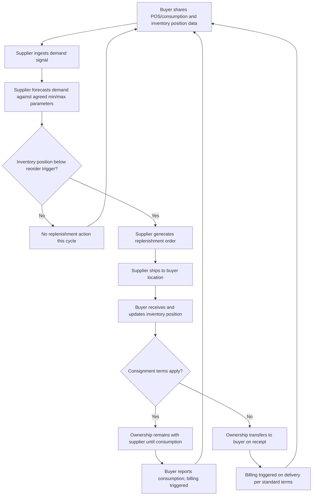

## Vendor-Managed Inventory (VMI) and Consignment Stock

### Definition and Conceptual Basis

Vendor-Managed Inventory (VMI) is a supply chain arrangement in which the supplier (vendor), rather than the buyer (customer), takes responsibility for monitoring inventory levels and deciding when and how much to replenish at the customer's location. The buyer shares real-time or near-real-time demand and inventory data with the supplier — typically point-of-sale data, inventory position, or consumption rates — and the supplier uses that data to generate and execute replenishment orders on the buyer's behalf, within pre-agreed parameters (minimum/maximum stock levels, service level targets, contractual constraints). This inverts the traditional ordering relationship: instead of the buyer pushing purchase orders upstream, the supplier pulls demand signals downstream and pushes inventory forward proactively.

Consignment stock is a closely related but distinct commercial arrangement concerning **ownership**, not decision authority: inventory is physically located at the buyer's premises but remains legally owned by the supplier until the buyer actually consumes or sells it. VMI and consignment are frequently combined (the supplier both manages replenishment decisions and retains ownership until consumption) but are conceptually separable — VMI can exist without consignment (the buyer takes ownership on delivery, but the supplier still decides replenishment timing), and consignment can exist without VMI (the buyer still places orders, but ownership transfers only at consumption).

### VMI vs. Consignment: Clarifying the Distinction

| Dimension | VMI | Consignment Stock |
| --- | --- | --- |
| Who decides replenishment timing/quantity | Supplier | Typically buyer (unless combined with VMI) |
| Who owns inventory while at buyer's site | Typically buyer (unless combined with consignment) | Supplier |
| When does payment obligation trigger | On delivery/receipt | On consumption/sale |
| Primary risk shifted | Stockout risk (to supplier's responsiveness) | Carrying cost and obsolescence risk (to supplier) |
| Data required | Demand/inventory visibility shared with supplier | Consumption reporting shared with supplier |

**Key Points**: The two arrangements are often bundled commercially because they address complementary risks — VMI reduces the buyer's stockout and planning burden, while consignment reduces the buyer's capital tied up in inventory — but a syllabus or contract should treat them as two independent dimensions of a supply arrangement rather than a single combined concept.

### How VMI Alters the Decoupling Point and Information Flow

In a traditional replenishment model, the buyer forecasts its own demand, places a purchase order based on that internal forecast, and the supplier only observes the resulting order stream — which, as established in bullwhip effect analysis, is a distorted proxy for true end-customer demand. VMI restructures this information flow directly:

- The supplier gains direct visibility into the buyer's actual consumption or point-of-sale data, rather than inferring demand from the order stream.
- This removes the demand-signal-processing driver of the bullwhip effect for this link in the chain, since the supplier now forecasts from real demand rather than a downstream tier's order-derived approximation.
- The supplier can also pool visibility and replenishment decisions across multiple buyer locations simultaneously, enabling a form of risk pooling that an individual buyer, forecasting only for its own location, cannot achieve on its own.

### VMI Process Flow



### Architectural Components of a VMI System

A functioning VMI implementation requires several coordinated system capabilities:

- **Data exchange layer**: EDI (Electronic Data Interchange) transaction sets are the long-standing industry standard for VMI data exchange — commonly EDI 852 (Product Activity Data, reporting sales/consumption) and EDI 830 (Planning Schedule, communicating forecasted requirements) in North American retail/CPG contexts, alongside EDI 855 (Purchase Order Acknowledgment) and EDI 856 (Advance Ship Notice) for the resulting replenishment transactions. Increasingly, API-based (REST/JSON) integration supplements or replaces batch EDI for real-time visibility, particularly in newer implementations.
- **Demand signal repository**: A system on the supplier side that ingests, normalizes, and stores incoming consumption/inventory data from potentially many buyer locations, each with different reporting formats and cadences.
- **Replenishment decision engine**: The forecasting and inventory-policy logic (commonly a min/max, order-up-to, or reorder-point policy configured per SKU per location) that translates the ingested demand signal into a concrete replenishment recommendation or automatic order.
- **Exception and override workflow**: A mechanism for buyer or supplier planners to review, adjust, or override system-generated replenishment recommendations, since fully automated replenishment without human oversight is rare in practice, particularly for high-value or promotionally volatile SKUs.
- **Contractual parameter store**: The agreed min/max inventory levels, service level targets, lead time commitments, and (for consignment) billing/ownership-transfer triggers that bound the supplier's decision authority.

### VMI System Architecture Diagram

(svg_diagram)

<svg xmlns="http://www.w3.org/2000/svg" viewBox="0 0 850 340">
<text x="425" y="24" text-anchor="middle" font-size="16" font-weight="bold" fill="#111">VMI System Architecture (svg_diagram)</text>
<rect x="30" y="60" width="220" height="90" rx="6" fill="#dceeff" stroke="#2a6fb0" />
<text x="140" y="90" text-anchor="middle" font-size="13" fill="#111">Buyer Location</text>
<text x="140" y="110" text-anchor="middle" font-size="11" fill="#333">POS / consumption data</text>
<text x="140" y="126" text-anchor="middle" font-size="11" fill="#333">Inventory position</text>
<rect x="330" y="40" width="220" height="130" rx="6" fill="#ffe9cc" stroke="#c07b1e" />
<text x="440" y="65" text-anchor="middle" font-size="13" fill="#111">Data Exchange Layer</text>
<text x="440" y="85" text-anchor="middle" font-size="11" fill="#333">EDI 852 / 830</text>
<text x="440" y="102" text-anchor="middle" font-size="11" fill="#333">or REST/JSON API</text>
<text x="440" y="122" text-anchor="middle" font-size="11" fill="#333">Demand signal</text>
<text x="440" y="138" text-anchor="middle" font-size="11" fill="#333">repository</text>
<rect x="630" y="30" width="200" height="80" rx="6" fill="#ffd6d6" stroke="#b03030" />
<text x="730" y="55" text-anchor="middle" font-size="12" fill="#111">Replenishment</text>
<text x="730" y="72" text-anchor="middle" font-size="12" fill="#111">Decision Engine</text>
<text x="730" y="90" text-anchor="middle" font-size="10" fill="#333">(Supplier side)</text>
<rect x="630" y="140" width="200" height="70" rx="6" fill="#e6d6ff" stroke="#7030a0" />
<text x="730" y="165" text-anchor="middle" font-size="12" fill="#111">Exception /</text>
<text x="730" y="182" text-anchor="middle" font-size="12" fill="#111">Override Workflow</text>
<line x1="250" y1="105" x2="327" y2="105" stroke="#333" stroke-width="2" marker-end="url(#vmiarrow)" />
<line x1="550" y1="90" x2="627" y2="70" stroke="#333" stroke-width="2" marker-end="url(#vmiarrow)" />
<line x1="730" y1="110" x2="730" y2="137" stroke="#333" stroke-width="2" marker-end="url(#vmiarrow)" />
<path d="M730 210 C 730 260, 140 260, 140 152" stroke="#333" stroke-width="2" fill="none" marker-end="url(#vmiarrow)" />
<text x="430" y="280" text-anchor="middle" font-size="11" fill="#555">Replenishment shipment executed back to buyer location</text>

<text x="425" y="320" text-anchor="middle" font-size="10" fill="#555" font-style="italic">Contractual min/max parameters bound decision engine authority throughout</text>

</svg>

### Business Case: Costs, Benefits, and Risk Allocation

**Key Points**:

- **Buyer benefits**: Reduced stockout risk (supplier is directly accountable for availability against agreed service levels), lower planning/ordering administrative burden, and — under consignment terms — reduced capital tied up in owned inventory and improved cash conversion cycle.
- **Buyer risks/costs**: Loss of direct control over exact order timing and quantity, dependency on supplier's forecasting competence, and typically a requirement to share more granular internal demand/inventory data than in a traditional arm's-length ordering relationship.
- **Supplier benefits**: Improved demand visibility (mitigating the bullwhip-driven distortion described above), the ability to smooth production planning by pooling replenishment decisions across multiple buyer locations, and — often — increased account stickiness since VMI relationships raise the switching cost for the buyer.
- **Supplier risks/costs**: Assumption of inventory carrying cost (especially under consignment), the operational cost of building and maintaining the replenishment decision engine and data-integration infrastructure, and exposure to stockout penalties or service-level contractual liability that previously sat with the buyer.
- [Inference] VMI relationships tend to be most commercially viable where the buyer represents meaningful order volume relative to the supplier's fixed integration and account-management cost, which is part of why VMI is historically most prevalent in large-retailer/CPG-supplier relationships (e.g., Walmart-P&G, an early and widely cited case) rather than being universally applied across all supplier relationships regardless of scale.

### Replenishment Policy Logic Under VMI

A typical VMI replenishment decision engine implements a min/max or order-up-to policy per SKU per buyer location, evaluated on each data refresh cycle:

```python
def vmi_replenishment_decision(current_inventory, in_transit, min_level, max_level, lead_time_days, forecast_daily_demand):
    inventory_position = current_inventory + in_transit
    projected_position_at_arrival = inventory_position - (forecast_daily_demand * lead_time_days)

    if inventory_position <= min_level:
        order_quantity = max_level - inventory_position
        return {
            "action": "replenish",
            "order_quantity": max(0, order_quantity),
            "reason": f"Inventory position {inventory_position} at or below min {min_level}"
        }
    return {"action": "no_action", "reason": "Inventory position above reorder trigger"}

# Example evaluation
decision = vmi_replenishment_decision(
    current_inventory=120,
    in_transit=0,
    min_level=150,
    max_level=500,
    lead_time_days=5,
    forecast_daily_demand=30
)
print(decision)
# Output: {'action': 'replenish', 'order_quantity': 380, 'reason': 'Inventory position 120 at or below min 150'}
```

**Key Points**: Real production VMI engines typically layer additional logic on top of this baseline min/max check — batch/pallet rounding constraints, minimum order quantities, truck-load optimization across multiple SKUs destined for the same location, and promotional demand overrides — rather than executing the raw calculated quantity as-is.

### Relationship to Consignment Billing and Ownership Transfer

Under consignment terms, the billing trigger moves from delivery to actual consumption, which requires the buyer to report consumption events (point-of-sale scans, production draw-downs, or periodic physical counts) back to the supplier as a distinct data stream from the inventory-position data used for replenishment decisions. This creates a dependency: consignment arrangements are only as accurate and low-friction as the buyer's consumption-reporting discipline, since any gap between physical consumption and reported consumption directly translates into billing discrepancies and reconciliation overhead for both parties.

### Common Pitfalls

- Sharing only order history rather than true consumption/POS data with the supplier, which undermines the core bullwhip-reduction benefit of VMI since the supplier is still forecasting from a distorted, order-derived proxy rather than real demand.
- Setting min/max parameters once at contract signing and never revisiting them as demand patterns shift, causing the replenishment engine to systematically over- or under-stock as the underlying demand distribution the parameters were calibrated against becomes stale.
- Treating VMI as a purely technical/EDI integration project without establishing clear contractual service-level accountability, since ambiguity about who bears stockout risk once replenishment authority has shifted to the supplier is a common source of relationship friction.
- Under consignment terms, failing to reconcile physical inventory counts against reported consumption on a regular cadence, allowing ownership/billing discrepancies to compound silently over successive cycles.

### Related Topics

- EDI Transaction Sets for Supply Chain Data Exchange (852, 830, 855, 856)
- Bullwhip Effect Quantification and How Shared Demand Visibility Reduces It
- Collaborative Planning, Forecasting, and Replenishment (CPFR)
- Multi-Echelon Inventory Optimization (MEIO) and Cross-Location Risk Pooling
- Reorder Point and Min/Max Inventory Policy Design
- Supplier Relationship Management and Contract Structuring for Managed Inventory Programs
- Inventory Positioning and Decoupling Points