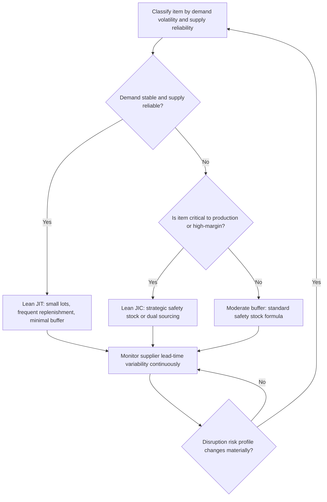

## Just-in-Time versus Just-in-Case Strategies

### Definition and Conceptual Basis

Just-in-Time (JIT) and Just-in-Case (JIC) represent two opposing philosophies for managing the trade-off between inventory carrying cost and supply continuity risk. JIT minimizes inventory by synchronizing material arrival as closely as possible to the moment of actual need, holding minimal buffer and relying on frequent, reliable, small-lot replenishment. JIC deliberately holds larger buffer inventory — safety stock, redundant supplier capacity, or strategic reserves — as insurance against demand variability, supply disruption, or lead-time uncertainty, accepting higher carrying cost in exchange for continuity resilience. Neither is universally superior; the appropriate choice (or blend) depends on the volatility of demand and supply, the cost of carrying inventory, and the cost of a stockout or production disruption for the specific product and market in question.

### Just-in-Time: Origins and Core Principles

JIT originated as a core pillar of the Toyota Production System (TPS), developed principally by Taiichi Ohno at Toyota from the 1950s onward, and later popularized globally as "lean manufacturing." Its core principles:

- **Pull-based production**: Downstream stages signal upstream stages to produce only what has actually been consumed, traditionally implemented via kanban cards or their digital equivalents, rather than upstream stages pushing output based on a forecast.
- **Small lot sizes and frequent delivery**: Materials arrive in small batches on a tight, predictable cadence (often multiple deliveries per day for high-volume automotive JIT programs) rather than large infrequent shipments.
- **Waste elimination (muda)**: Inventory itself is classified as a form of waste in TPS thinking — capital tied up, space consumed, and a mechanism that masks underlying process problems (quality defects, machine downtime, supplier unreliability) that would otherwise be immediately visible and forced to be resolved.
- **Continuous improvement (kaizen)** and standardized work are treated as prerequisites: JIT is viable only when upstream processes are stable and predictable enough to support minimal buffering, which is why JIT implementations are typically paired with quality programs (e.g., jidoka, statistical process control) rather than deployed in isolation.

### Just-in-Case: Rationale and Core Principles

JIC treats inventory as a deliberate risk-management asset rather than pure waste. Core principles:

- **Buffer against demand uncertainty**: Safety stock sized to absorb demand variability, following the standard formulas covered under safety stock sizing, protects service level even when consumption spikes unpredictably.
- **Buffer against supply uncertainty**: Additional stock, redundant supplier qualification, or strategic reserves protect against supplier disruption, lead-time variability, or single-source dependency risk.
- **Economies of scale in procurement and production**: Larger batch ordering or production runs can reduce per-unit cost through volume discounts and reduced setup/changeover frequency, a rationale independent of pure risk buffering.
- **Resilience prioritized over efficiency**: JIC philosophy explicitly accepts higher carrying cost as the price of reduced disruption risk, particularly for critical, hard-to-substitute, or long-lead-time inputs.

### Comparative Framework

| Dimension | Just-in-Time | Just-in-Case |
| --- | --- | --- |
| Inventory holding cost | Low | High |
| Exposure to supply disruption | High | Low |
| Exposure to demand-forecast error | High (little buffer to absorb surprises) | Low |
| Capital tied up in inventory | Low | High |
| Sensitivity to supplier lead-time variability | High | Low |
| Warehouse/storage space required | Low | High |
| Typical demand profile fit | Stable, predictable demand | Volatile or uncertain demand |
| Typical supply profile fit | Reliable, short, consistent lead times | Unreliable, long, or variable lead times |
| Waste/inefficiency visibility | High (problems surface immediately) | Low (buffer masks underlying issues) |

### Quantitative Trade-off Framing

The decision between JIT-leaning and JIC-leaning positioning can be framed as a cost-minimization problem balancing holding cost against expected disruption cost:

$$TC = H \cdot Q_{avg} + P_{disruption} \cdot C_{disruption}$$

where $H$ is the holding cost rate, $Q_{avg}$ is average inventory carried, $P_{disruption}$ is the probability of a stockout or supply disruption event given the chosen inventory level, and $C_{disruption}$ is the cost of that disruption (lost sales, expedited freight, production line stoppage, contractual penalties). JIT positioning minimizes the first term at the cost of increasing the second; JIC positioning does the reverse. The optimal point is where the marginal reduction in expected disruption cost from holding one more unit of inventory equals the marginal holding cost of that unit — structurally the same newsvendor-style trade-off that underlies safety stock sizing, but applied at a strategic rather than purely tactical level.

### Strategic Positioning Diagram

(svg_diagram)

<svg xmlns="http://www.w3.org/2000/svg" viewBox="0 0 820 280">
<text x="410" y="24" text-anchor="middle" font-size="16" font-weight="bold" fill="#111">JIT vs JIC Cost Trade-off (svg_diagram)</text>
<line x1="80" y1="230" x2="750" y2="230" stroke="#333" stroke-width="1.5" />
<line x1="80" y1="230" x2="80" y2="50" stroke="#333" stroke-width="1.5" />
<text x="415" y="260" text-anchor="middle" font-size="12" fill="#333">Inventory Level (JIT → JIC)</text>
<text x="35" y="140" text-anchor="middle" font-size="12" fill="#333" transform="rotate(-90 35 140)">Total Cost</text>
<path d="M90 60 C 250 220, 350 225, 450 200 C 600 160, 700 120, 740 90" stroke="#b03030" stroke-width="2" fill="none" />
<text x="700" y="75" font-size="11" fill="#b03030">Holding Cost (rises with inventory)</text>
<path d="M90 220 C 200 120, 300 70, 450 55 C 600 45, 700 42, 740 40" stroke="#2a6fb0" stroke-width="2" fill="none" transform="scale(1,-1) translate(0,-240)" />
<text x="150" y="65" font-size="11" fill="#2a6fb0">Disruption Cost (falls with inventory)</text>
<circle cx="430" cy="155" r="5" fill="#a67c00" />
<text x="430" y="140" text-anchor="middle" font-size="11" fill="#a67c00">Optimal blended position</text>

<text x="180" y="250" text-anchor="middle" font-size="11" fill="#555">JIT-leaning</text>

<text x="640" y="250" text-anchor="middle" font-size="11" fill="#555">JIC-leaning</text>

</svg>

### JIT and the Bullwhip Effect

**Key Points**: JIT's small-lot, high-frequency replenishment cadence directly counters the order-batching driver of the bullwhip effect covered separately, since orders arrive in a smoother, more continuous stream rather than large infrequent batches — but this benefit is conditional on genuinely reliable, low-variance lead times; if applied against an unreliable supply base, JIT's minimal buffering can instead amplify a chain's sensitivity to lead-time variability precisely because the safety-stock cushion that would normally absorb that variability has been deliberately removed.

### Supply Chain Disruption Exposure

**Key Points**:

- [Inference] Global disruptions such as the COVID-19 pandemic and associated semiconductor and shipping-capacity shortages are widely cited in industry and academic commentary as having exposed a structural fragility in heavily JIT-optimized global supply chains, prompting many firms to shift portfolio-wide toward greater buffer inventory, dual-sourcing, and nearshoring — though the specific magnitude and permanence of this shift varies by industry and individual firm strategy, and should be treated as an observed directional trend rather than a precisely quantified, universal reallocation.
- This has led to increased adoption of hybrid strategies rather than a wholesale abandonment of JIT principles, since the underlying efficiency benefits of JIT for stable, low-risk product categories remain valid even as firms add strategic buffers for high-risk or single-sourced categories.

### Hybrid and Segmented Strategies

Because JIT and JIC represent opposite ends of a spectrum rather than a strict binary choice, most mature supply chain strategies apply differentiated positioning by product segment rather than a single uniform policy:

- **Portfolio segmentation by criticality and volatility**: High-volume, stable-demand, reliably-sourced items lean JIT; low-volume, volatile, or single-sourced critical items lean JIC — often formalized via a Kraljic-style purchasing portfolio matrix (leverage, strategic, non-critical, bottleneck items) that maps procurement strategy to supply risk and profit impact.
- **Strategic buffer stock for designated critical inputs**: Even a predominantly JIT-oriented operation frequently maintains explicit strategic reserves for a small subset of inputs identified as single-sourced, long-lead-time, or mission-critical, rather than applying JIT uniformly across the entire bill of materials.
- **Dual sourcing and supplier redundancy as a JIC substitute for physical inventory**: Rather than holding additional stock, some firms achieve JIC-equivalent resilience by qualifying and maintaining relationships with multiple suppliers for critical inputs, trading inventory carrying cost for supplier-relationship and qualification overhead instead.

### Decision Framework Flow

### Common Pitfalls

- Applying JIT uniformly across an entire product portfolio without differentiating by demand volatility or supply reliability, exposing critical or volatile items to disruption risk that a segmented strategy would have buffered against.
- Treating JIT purely as an inventory-reduction tactic while neglecting the quality and process-stability prerequisites (kaizen, jidoka, supplier quality programs) that make minimal buffering safe to sustain in the first place.
- Over-correcting toward JIC across an entire portfolio in response to a single disruption event, incurring substantial carrying cost increases even for product categories where the underlying demand and supply stability that originally justified a JIT approach has not actually changed.
- Confusing JIT (a production/replenishment philosophy) with lean manufacturing broadly (a wider set of waste-elimination principles) — JIT is one component of lean, not a synonym for it.

### Related Topics

- Safety Stock Under Demand and Lead-Time Variability
- Kraljic Purchasing Portfolio Matrix and Supplier Segmentation
- Kanban Systems and Pull-Based Production Control
- Bullwhip Effect Quantification and Order Batching
- Dual Sourcing and Supply Base Diversification Strategies
- Total Cost of Ownership (TCO) in Inventory Strategy Decisions
- Toyota Production System (TPS) and Lean Manufacturing Principles