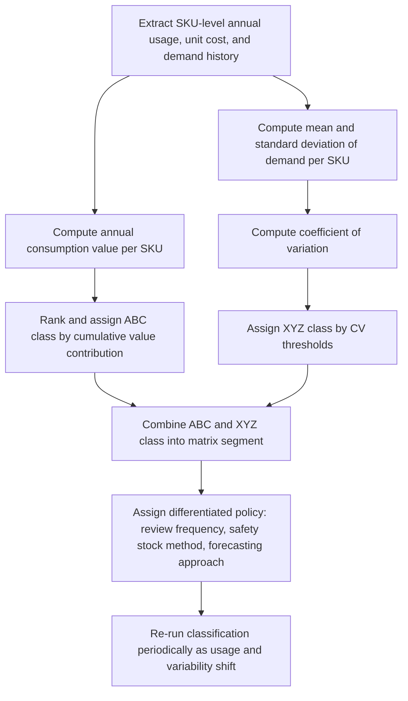

## ABC and XYZ Inventory Classification

### Definition and Conceptual Basis

ABC classification and XYZ classification are complementary inventory segmentation techniques used to prioritize management attention and tailor control policy across a large SKU portfolio, rather than applying uniform inventory rules to every item regardless of its actual business impact or demand behavior. ABC classification segments items by their **value contribution** (typically annual consumption value, sometimes revenue or margin contribution), following the Pareto principle that a small fraction of SKUs typically accounts for the large majority of value. XYZ classification segments items by **demand variability/predictability**, independent of value. Used together, the two dimensions form a combined matrix that allows a far more differentiated inventory policy than either dimension alone — a common practical application in the "Inventory Strategy and Multi-Echelon Optimization" domain, since the policy prescriptions from safety stock sizing, MEIO, and JIT/JIC frameworks are rarely applied identically across an entire SKU portfolio.

### ABC Classification Methodology

ABC classification ranks items by annual consumption value (unit cost × annual usage volume) and groups them into tiers based on their cumulative contribution to total value:

- **A items**: Typically the top ~10-20% of SKUs by count, but collectively accounting for roughly 70-80% of total annual consumption value. These receive the tightest inventory control, most frequent review, and most rigorous forecasting attention.
- **B items**: The next ~20-30% of SKUs by count, accounting for roughly 15-25% of total value. These receive moderate control — periodic review, standard safety stock formulas, less frequent manual oversight.
- **C items**: The remaining ~50-70% of SKUs by count, but collectively accounting for only roughly 5-10% of total value. These typically receive the loosest control — simple reorder-point policies, larger order quantities to minimize transaction/ordering overhead, infrequent manual review.

**Key Points**: [Inference] The specific percentage breakpoints (e.g., exactly 80/20, or 70/20/10) are illustrative conventions rather than fixed universal thresholds; the actual cumulative-value curve for any specific SKU portfolio should be plotted directly and breakpoints chosen based on where natural inflection points occur in that portfolio's own Pareto curve, rather than mechanically applying a textbook percentage.

### ABC Classification Calculation

```python
import pandas as pd

def classify_abc(df, value_col="annual_value", a_threshold=0.80, b_threshold=0.95):
    df = df.sort_values(value_col, ascending=False).reset_index(drop=True)
    df["cumulative_value"] = df[value_col].cumsum()
    df["cumulative_pct"] = df["cumulative_value"] / df[value_col].sum()

    def assign_class(pct):
        if pct <= a_threshold:
            return "A"
        elif pct <= b_threshold:
            return "B"
        else:
            return "C"

    df["abc_class"] = df["cumulative_pct"].apply(assign_class)
    return df

# Example usage
data = pd.DataFrame({
    "sku": ["SKU1", "SKU2", "SKU3", "SKU4", "SKU5"],
    "annual_value": [500000, 150000, 80000, 20000, 5000]
})

result = classify_abc(data)
print(result[["sku", "annual_value", "cumulative_pct", "abc_class"]])
```

**Output**:

```plaintext
   sku  annual_value  cumulative_pct abc_class
0 SKU1        500000        0.658228         A
1 SKU2        150000        0.855696         B
2 SKU3         80000        0.960759         C
3 SKU4         20000        0.987342         C
4 SKU5          5000        1.000000         C
```

### XYZ Classification Methodology

XYZ classification segments items by the **coefficient of variation (CV)** of demand — the standard deviation of demand divided by mean demand — which normalizes variability for comparison across items with very different volume scales:

$$CV = \frac{\sigma_d}{\bar{d}}$$

- **X items**: Low CV (typically CV < ~0.5), indicating stable, highly predictable demand. Forecasting accuracy is high; safety stock requirements are comparatively low relative to volume.
- **Y items**: Moderate CV (typically ~0.5 to ~1.0), indicating some fluctuation — seasonal, trend-driven, or moderately variable demand that is still reasonably forecastable with appropriate methods.
- **Z items**: High CV (typically > ~1.0), indicating irregular, sporadic, or highly unpredictable demand — often intermittent-demand items where standard normal-distribution safety stock formulas may not apply well, as covered under safety stock methodology.

**Key Points**: [Inference] As with ABC breakpoints, the specific CV thresholds separating X/Y/Z tiers are conventional starting points rather than fixed universal values, and are commonly recalibrated per industry or company based on the actual observed distribution of CV values across the portfolio being classified.

### XYZ Classification Calculation

```python
def classify_xyz(df, mean_col="mean_demand", std_col="std_demand", x_threshold=0.5, y_threshold=1.0):
    df = df.copy()
    df["cv"] = df[std_col] / df[mean_col]

    def assign_class(cv):
        if cv <= x_threshold:
            return "X"
        elif cv <= y_threshold:
            return "Y"
        else:
            return "Z"

    df["xyz_class"] = df["cv"].apply(assign_class)
    return df

# Example usage
demand_data = pd.DataFrame({
    "sku": ["SKU1", "SKU2", "SKU3"],
    "mean_demand": [100, 50, 20],
    "std_demand": [20, 40, 35]
})

result = classify_xyz(demand_data)
print(result[["sku", "cv", "xyz_class"]])
```

**Output**:

```plaintext
   sku    cv xyz_class
0 SKU1  0.20         X
1 SKU2  0.80         Y
2 SKU3  1.75         Z
```

### The Combined ABC-XYZ Matrix

Combining both dimensions produces a 3×3 (or finer-grained) matrix that yields nine distinct policy segments, each warranting a differentiated inventory management approach:

|  | X (stable demand) | Y (moderate variability) | Z (high variability) |
| --- | --- | --- | --- |
| **A (high value)** | Tight control, frequent review, precise forecasting, low but carefully calculated safety stock | Tight control with elevated safety stock; strong candidate for VMI or collaborative forecasting | Highest management attention; consider make-to-order or postponement rather than stocking to forecast |
| **B (medium value)** | Standard periodic review, standard safety stock formula | Standard review with moderate safety stock buffer | Elevated buffer or alternative sourcing strategy; monitor closely for reclassification |
| **C (low value)** | Simple reorder-point policy, large order quantities, minimal review | Simple reorder-point policy with modest buffer | Consider min/max with generous buffer, or accept occasional stockout given low value-at-risk |

**Key Points**: The AZ and BZ segments are typically where standard normal-distribution safety stock formulas break down most severely (as covered under intermittent demand modeling), making them the segments most likely to require Croston's method, empirical-distribution-based safety stock, or a fundamentally different fulfillment strategy (e.g., make-to-order) rather than simply widening a conventional safety stock buffer.

### ABC-XYZ Matrix Diagram

(svg_diagram)

<svg xmlns="http://www.w3.org/2000/svg" viewBox="0 0 700 480">
<text x="350" y="24" text-anchor="middle" font-size="16" font-weight="bold" fill="#111">ABC-XYZ Combined Classification Matrix (svg_diagram)</text>

<text x="120" y="60" text-anchor="middle" font-size="12" fill="#333" font-weight="bold">X (stable)</text>

<text x="350" y="60" text-anchor="middle" font-size="12" fill="#333" font-weight="bold">Y (moderate)</text>

<text x="580" y="60" text-anchor="middle" font-size="12" fill="#333" font-weight="bold">Z (volatile)</text>

<text x="40" y="140" text-anchor="middle" font-size="12" fill="#333" font-weight="bold">A</text>

<text x="40" y="270" text-anchor="middle" font-size="12" fill="#333" font-weight="bold">B</text>

<text x="40" y="400" text-anchor="middle" font-size="12" fill="#333" font-weight="bold">C</text>

<rect x="65" y="80" width="150" height="110" fill="#ffb3b3" stroke="#b03030" />
<text x="140" y="130" text-anchor="middle" font-size="10" fill="#111">AX: tight control</text>
<text x="140" y="145" text-anchor="middle" font-size="10" fill="#111">precise forecast</text>
<rect x="295" y="80" width="150" height="110" fill="#ffcccc" stroke="#b03030" />
<text x="370" y="130" text-anchor="middle" font-size="10" fill="#111">AY: tight control</text>
<text x="370" y="145" text-anchor="middle" font-size="10" fill="#111">elevated buffer</text>
<rect x="525" y="80" width="150" height="110" fill="#ff8080" stroke="#b03030" />
<text x="600" y="120" text-anchor="middle" font-size="10" fill="#111">AZ: highest</text>
<text x="600" y="135" text-anchor="middle" font-size="10" fill="#111">attention;</text>
<text x="600" y="150" text-anchor="middle" font-size="10" fill="#111">MTO/postponement</text>
<rect x="65" y="210" width="150" height="110" fill="#ffe0b3" stroke="#c07b1e" />
<text x="140" y="260" text-anchor="middle" font-size="10" fill="#111">BX: standard</text>
<text x="140" y="275" text-anchor="middle" font-size="10" fill="#111">review</text>
<rect x="295" y="210" width="150" height="110" fill="#ffd699" stroke="#c07b1e" />
<text x="370" y="260" text-anchor="middle" font-size="10" fill="#111">BY: moderate</text>
<text x="370" y="275" text-anchor="middle" font-size="10" fill="#111">buffer</text>
<rect x="525" y="210" width="150" height="110" fill="#ffc266" stroke="#c07b1e" />
<text x="600" y="260" text-anchor="middle" font-size="10" fill="#111">BZ: elevated</text>
<text x="600" y="275" text-anchor="middle" font-size="10" fill="#111">buffer/monitor</text>
<rect x="65" y="340" width="150" height="110" fill="#dceeff" stroke="#2a6fb0" />
<text x="140" y="390" text-anchor="middle" font-size="10" fill="#111">CX: simple ROP</text>
<text x="140" y="405" text-anchor="middle" font-size="10" fill="#111">large lot size</text>
<rect x="295" y="340" width="150" height="110" fill="#cfe6ff" stroke="#2a6fb0" />
<text x="370" y="390" text-anchor="middle" font-size="10" fill="#111">CY: simple ROP</text>
<text x="370" y="405" text-anchor="middle" font-size="10" fill="#111">modest buffer</text>
<rect x="525" y="340" width="150" height="110" fill="#a6d0ff" stroke="#2a6fb0" />
<text x="600" y="390" text-anchor="middle" font-size="10" fill="#111">CZ: generous</text>
<text x="600" y="405" text-anchor="middle" font-size="10" fill="#111">buffer or accept risk</text>
</svg>

### Classification Workflow



### Integration with Other Inventory Policy Decisions

**Key Points**:

- ABC-XYZ classification is typically an input to, not a replacement for, the quantitative methods covered elsewhere in this chapter — for example, an AX item still uses the standard safety stock formula, just with a tighter review cadence and more forecasting investment than a CX item would receive.
- AZ and high-value-volatile segments are natural candidates for the decoupling-point and postponement strategies discussed separately, since holding conventional forecast-driven safety stock against highly volatile, high-value demand is often the most expensive possible way to manage that risk.
- C-class items, precisely because of their low value-at-risk, are common candidates for JIC-style large-batch ordering purely to minimize transaction and ordering overhead, since the cost of excess C-item inventory is low relative to the administrative cost of frequent small orders.

### Common Pitfalls

- Classifying only by ABC and applying uniform safety stock policy within each value tier, ignoring that an AX item and an AZ item — both high-value — require fundamentally different inventory strategies due to their very different demand predictability.
- Treating classification as a one-time exercise rather than re-running it on a regular cadence (commonly quarterly or semi-annually), since both value contribution and demand variability drift as products move through their lifecycle, get promoted, or are affected by market changes.
- Applying rigid percentage breakpoints (80/15/5, CV of exactly 0.5/1.0) without validating them against the actual shape of the specific portfolio's Pareto and variability curves, which can produce classification boundaries that don't reflect meaningful discontinuities in the underlying data.
- Using ABC-XYZ classification as the sole basis for a stocking decision without also considering strategic factors outside the two dimensions — such as single-sourcing risk, contractual service-level commitments, or product lifecycle stage — that may warrant elevated attention regardless of value or variability tier.

### Related Topics

- Safety Stock Under Demand and Lead-Time Variability
- Just-in-Time versus Just-in-Case Strategies
- Inventory Positioning and Decoupling Points
- Croston's Method and Intermittent Demand Forecasting
- Kraljic Purchasing Portfolio Matrix and Supplier Segmentation
- Reorder Point and Min/Max Inventory Policy Design
- Multi-Echelon Inventory Optimization (MEIO)