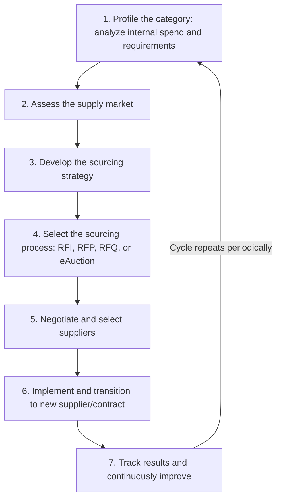

## The Strategic Sourcing Process

### Definition and Conceptual Basis

Strategic sourcing is a structured, cyclical procurement methodology that moves beyond transactional purchasing (simply placing orders against existing supplier relationships) toward a systematic, data-driven process for analyzing spend, evaluating the supply market, and continuously optimizing the supplier base to maximize total value — cost, quality, risk, innovation, and service — rather than minimizing unit price alone. It is distinguished from ad hoc or reactive purchasing by its emphasis on periodic re-evaluation of category strategy, structured supplier evaluation, and formalized contract and relationship management as an ongoing cycle rather than a one-time event.

### The Strategic Sourcing Cycle

Most strategic sourcing methodologies (commonly presented as a 7-step process, though the exact step count varies by framework and consulting practice) follow a broadly consistent structure:

### Step 1: Category Spend Profiling

**Key Points**:

- The process begins with a detailed internal analysis of **what** is being purchased, **how much** is spent, **from whom**, and **by whom** across the organization — frequently revealing maverick spend (purchases made outside approved contracts or preferred suppliers) and spend fragmentation (the same category being purchased independently by multiple business units at different prices).
- Spend data is typically normalized and categorized using a taxonomy (commonly aligned to UNSPSC — United Nations Standard Products and Services Code — or a custom category tree) to enable meaningful aggregation and cross-supplier comparison.
- This step establishes the baseline against which future sourcing initiative savings and performance will be measured, making data quality at this stage foundational to the credibility of the entire subsequent cycle.

### Step 2: Supply Market Assessment

This step shifts analysis outward, from internal spend to external market conditions. Key components include:

- **Supplier landscape mapping**: Identifying the full set of potential suppliers in the category, not just those the organization currently uses, including assessing market concentration (how many viable suppliers exist) and competitive dynamics.
- **Porter's Five Forces analysis** (or an equivalent framework) applied at the category level: supplier bargaining power, buyer bargaining power, threat of substitutes, threat of new entrants, and competitive rivalry — used to assess how much negotiating leverage the buying organization is likely to have in this specific category.
- **Total Cost of Ownership (TCO) modeling**: Assessing not just unit price but the full cost of acquiring, using, and disposing of the good or service, including logistics, quality-related costs, and switching costs.

### Step 3: Sourcing Strategy Development

Using the outputs of the first two steps, a category-specific sourcing strategy is formulated. This is commonly where the **Kraljic Portfolio Matrix** is applied, segmenting categories along two axes — profit impact and supply risk — into four quadrants that each warrant a fundamentally different sourcing posture:

|  | Low Supply Risk | High Supply Risk |
| --- | --- | --- |
| **High Profit Impact** | **Leverage items**: Competitive bidding, multiple qualified suppliers, aggressive price negotiation | **Strategic items**: Deep supplier partnership, joint planning, long-term contracts, supply continuity focus |
| **Low Profit Impact** | **Non-critical items**: Efficient transactional processes, catalog/e-procurement, minimize administrative overhead | **Bottleneck items**: Secure supply continuity, qualify backup suppliers, consider safety stock over aggressive negotiation |

**Key Points**: The Kraljic matrix directly informs the JIT-versus-JIC and safety-stock decisions covered elsewhere in this syllabus — strategic and bottleneck items (high supply risk) are natural candidates for JIC-style buffering or dual-sourcing, while leverage and non-critical items (low supply risk) are better suited to JIT-style efficiency-focused sourcing.

### Kraljic Matrix Diagram

(svg_diagram)

<svg xmlns="http://www.w3.org/2000/svg" viewBox="0 0 700 420">
<text x="350" y="24" text-anchor="middle" font-size="16" font-weight="bold" fill="#111">Kraljic Portfolio Matrix (svg_diagram)</text>
<line x1="100" y1="360" x2="620" y2="360" stroke="#333" stroke-width="1.5" />
<line x1="100" y1="360" x2="100" y2="60" stroke="#333" stroke-width="1.5" />
<text x="360" y="390" text-anchor="middle" font-size="12" fill="#333">Supply Risk →</text>
<text x="60" y="210" text-anchor="middle" font-size="12" fill="#333" transform="rotate(-90 60 210)">Profit Impact →</text>
<rect x="100" y="60" width="260" height="150" fill="#ffe9cc" stroke="#c07b1e" />
<text x="230" y="130" text-anchor="middle" font-size="13" fill="#111" font-weight="bold">Leverage</text>
<text x="230" y="150" text-anchor="middle" font-size="10" fill="#333">Competitive bidding,</text>
<text x="230" y="165" text-anchor="middle" font-size="10" fill="#333">multiple suppliers</text>
<rect x="360" y="60" width="260" height="150" fill="#ffd6d6" stroke="#b03030" />
<text x="490" y="130" text-anchor="middle" font-size="13" fill="#111" font-weight="bold">Strategic</text>
<text x="490" y="150" text-anchor="middle" font-size="10" fill="#333">Partnership, joint</text>
<text x="490" y="165" text-anchor="middle" font-size="10" fill="#333">planning, long-term</text>
<rect x="100" y="210" width="260" height="150" fill="#dceeff" stroke="#2a6fb0" />
<text x="230" y="280" text-anchor="middle" font-size="13" fill="#111" font-weight="bold">Non-critical</text>
<text x="230" y="300" text-anchor="middle" font-size="10" fill="#333">Catalog/e-procurement,</text>
<text x="230" y="315" text-anchor="middle" font-size="10" fill="#333">minimize overhead</text>
<rect x="360" y="210" width="260" height="150" fill="#e6d6ff" stroke="#7030a0" />
<text x="490" y="280" text-anchor="middle" font-size="13" fill="#111" font-weight="bold">Bottleneck</text>
<text x="490" y="300" text-anchor="middle" font-size="10" fill="#333">Secure continuity,</text>
<text x="490" y="315" text-anchor="middle" font-size="10" fill="#333">qualify backups</text>
</svg>

### Step 4: Sourcing Process Selection (RFI, RFP, RFQ, eAuction)

**Key Points**:

- **RFI (Request for Information)**: Used early to gather general supplier capability information when the buying organization does not yet know the full supplier landscape well enough to issue a detailed formal solicitation.
- **RFP (Request for Proposal)**: Used when the buying organization needs suppliers to propose a solution approach, not just a price — appropriate for complex, customizable, or service-based categories where supplier methodology and capability materially differ.
- **RFQ (Request for Quotation)**: Used when specifications are well-defined and the primary differentiator between suppliers is price — appropriate for standardized goods, particularly in leverage and non-critical Kraljic quadrants.
- **eAuction (reverse auction)**: A real-time competitive bidding mechanism, typically used for well-specified, commoditized leverage-category items where price is the dominant selection criterion and a sufficient number of qualified suppliers exist to create genuine competitive tension.

### Step 5: Negotiation and Supplier Selection

This step formalizes supplier evaluation using a weighted scoring methodology that balances multiple criteria rather than selecting on price alone — typically incorporating price/TCO, quality metrics, delivery reliability, financial stability, and (particularly for strategic-quadrant categories) innovation capability and cultural/strategic fit. Negotiation strategy itself typically differentiates by Kraljic quadrant: leverage items support more adversarial, price-focused negotiation given multiple viable alternatives, while strategic items warrant collaborative, value-creating negotiation aimed at a durable long-term relationship rather than one-time price concessions.

### Step 6: Implementation and Transition

**Key Points**: This step is frequently under-resourced relative to its actual risk, since the transition to a new supplier or contract — onboarding, system integration, quality validation, first-article inspection, and change management for internal stakeholders accustomed to the prior supplier — is where much of the theoretical savings identified during negotiation is either realized or eroded by transition friction, disruption, or quality issues during ramp-up.

### Step 7: Tracking Results and Continuous Improvement

The final step closes the loop by measuring actual realized savings and performance against the baseline established in Step 1, using supplier scorecards and category performance reviews to feed directly back into the next iteration of the sourcing cycle. This step is what distinguishes strategic sourcing as a continuous discipline rather than a one-time project — category strategies are formally revisited on a defined cadence (commonly annually for strategic/bottleneck categories, less frequently for stable non-critical categories) rather than left static indefinitely.

### Category Management as the Organizing Structure

**Key Points**: [Inference] Strategic sourcing is commonly organized around dedicated category managers who own the full cycle for a defined spend category (e.g., "packaging," "logistics services," "indirect IT") rather than generalist buyers handling requisitions across unrelated categories, since category-specific market expertise compounds in value the more deeply the sourcing cycle is applied to that category over successive iterations — though the specific organizational model (centralized category management vs. hybrid vs. decentralized) varies considerably by company size and industry.

### Common Pitfalls

- Treating strategic sourcing as a one-time cost-reduction project rather than a recurring cycle, allowing category strategies and supplier performance to drift unmonitored between infrequent, ad hoc re-sourcing events.
- Applying the same sourcing process (e.g., a pure RFQ price competition) uniformly across all Kraljic quadrants, which is well-suited to leverage items but actively counterproductive for strategic items where price-only competition undermines the collaborative relationship the category actually requires.
- Under-resourcing the implementation/transition step relative to the negotiation step, allowing negotiated savings to be eroded by poor onboarding, quality issues, or internal change-management friction during supplier transition.
- Skipping or under-investing in the supply market assessment step and proceeding directly from internal spend analysis to solicitation, resulting in a sourcing strategy that doesn't reflect actual market structure, competitive dynamics, or realistic supplier alternatives.

### Related Topics

- Kraljic Portfolio Matrix and Category Segmentation
- Total Cost of Ownership (TCO) Modeling in Supplier Evaluation
- Supplier Relationship Management (SRM) and Performance Scorecards
- RFI, RFP, RFQ, and eAuction Process Design
- Category Management Organizational Models
- Just-in-Time versus Just-in-Case Strategies (Kraljic quadrant linkage)
- Dual Sourcing and Supply Base Diversification Strategies