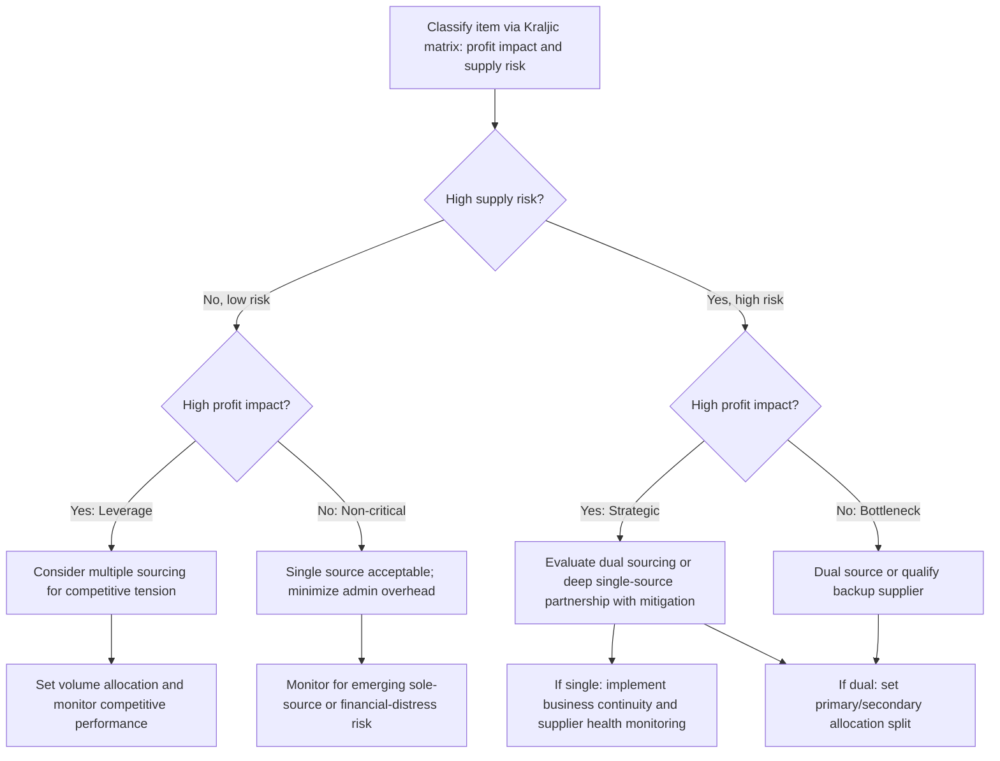

## Single, Multiple, and Dual Sourcing Strategies

### Definition and Conceptual Basis

Sourcing strategy refers to the decision of how many suppliers to qualify and actively use for a given item, component, or service category. The three canonical structures — single sourcing, dual sourcing, and multiple sourcing — represent distinct points on a spectrum trading off cost efficiency and relationship depth (favored by fewer suppliers) against supply continuity and competitive leverage (favored by more suppliers). The right choice is category-specific and connects directly to the Kraljic portfolio matrix from strategic sourcing methodology: supply risk and profit impact are the primary variables that should drive this decision, not a default organizational preference applied uniformly across all spend.

### Single Sourcing

Single sourcing means deliberately using exactly one qualified supplier for an item or category, even when alternative suppliers exist in the market — distinct from **sole sourcing**, where only one supplier is technically capable of supplying the item at all (a monopoly or unique-capability situation with no true choice involved).

**Key Points**:

- **Advantages**: Deepest possible relationship investment, highest potential for volume-based pricing leverage, simplified quality and specification management (only one supplier's process to qualify and monitor), and the strongest foundation for the kind of joint planning and collaborative innovation associated with VMI and strategic Kraljic-quadrant relationships.
- **Disadvantages**: Maximum supply continuity risk — any disruption at the single supplier (quality failure, financial distress, natural disaster, labor action, geopolitical event) directly and immediately threatens the buyer's own production or fulfillment, with no qualified alternative to fall back on.
- Single sourcing is most defensible for **strategic quadrant** items (high profit impact, but where the relationship depth and joint-planning benefits are judged to outweigh the concentration risk) and can be a deliberate, well-reasoned choice rather than an oversight — but it requires active risk-mitigation measures (contingency planning, supplier financial health monitoring, business continuity clauses) precisely because the concentration risk is real and consciously accepted rather than eliminated.

### Multiple Sourcing

Multiple sourcing means maintaining several qualified, actively-used suppliers for the same item or category simultaneously, typically allocating volume across them based on price, performance, or strategic considerations.

**Key Points**:

- **Advantages**: Strong competitive tension sustained over time (suppliers know they can be reallocated volume based on performance), reduced single-point-of-failure risk, and flexibility to shift volume quickly in response to a disruption at any one supplier.
- **Disadvantages**: Diluted volume per supplier (potentially forfeiting volume-discount pricing tiers), higher administrative overhead (multiple relationships, multiple quality systems to manage, multiple contracts to negotiate and monitor), and shallower relationship depth with any single supplier, which can limit access to that supplier's best capacity, innovation, or preferential treatment during industry-wide shortages.
- Multiple sourcing is most naturally suited to **leverage quadrant** items (high profit impact, low supply risk) where a genuinely competitive supply market exists and price/performance-driven allocation is both feasible and valuable.

### Dual Sourcing

Dual sourcing is the specific, deliberate case of using exactly two qualified suppliers — often positioned as a middle-ground compromise between the relationship depth of single sourcing and the risk mitigation of broader multiple sourcing.

**Key Points**:

- Dual sourcing is frequently adopted specifically as a resilience strategy for **bottleneck** or **strategic** quadrant items where single-sourcing's concentration risk is judged unacceptable, but where the administrative and relationship-dilution cost of full multiple sourcing (three or more suppliers) is not justified by the item's profit impact or the depth of market competition available.
- A common allocation pattern is a primary/secondary split (e.g., 70/30 or 80/20 volume allocation) rather than an even split — the primary supplier retains most volume and the deepest relationship investment, while the secondary supplier is kept qualified, technically current, and receiving enough real volume to remain commercially viable and production-ready, rather than being a purely theoretical backup that would require a lengthy requalification process if actually called upon during a disruption.
- [Inference] Since the COVID-19 pandemic and the semiconductor shortage period, dual sourcing has been widely discussed in industry and academic commentary as an increasingly favored strategy specifically for categories previously single-sourced primarily for cost efficiency, reflecting the broader JIT-to-JIC resilience shift covered elsewhere in this syllabus — though the extent and permanence of this shift varies by industry, category criticality, and individual firm risk tolerance.

### Comparative Framework

| Dimension | Single Sourcing | Dual Sourcing | Multiple Sourcing |
| --- | --- | --- | --- |
| Supply continuity risk | Highest | Moderate | Lowest |
| Volume-based pricing leverage | Highest potential | Moderate | Diluted across suppliers |
| Relationship/partnership depth | Deepest | Split, primary deeper | Shallowest per supplier |
| Administrative overhead | Lowest | Moderate | Highest |
| Competitive tension over time | None (no alternative) | Moderate (credible alternative exists) | Highest (active ongoing competition) |
| Best-fit Kraljic quadrant | Strategic (deliberate) | Bottleneck or Strategic (risk-managed) | Leverage |
| Qualification/onboarding cost | One-time | Two suppliers to maintain | Ongoing, multiple suppliers |

### Decision Framework Diagram

(svg_diagram)

<svg xmlns="http://www.w3.org/2000/svg" viewBox="0 0 800 340">
<text x="400" y="24" text-anchor="middle" font-size="16" font-weight="bold" fill="#111">Sourcing Strategy Selection by Risk Profile (svg_diagram)</text>
<line x1="80" y1="290" x2="740" y2="290" stroke="#333" stroke-width="1.5" />
<line x1="80" y1="290" x2="80" y2="60" stroke="#333" stroke-width="1.5" />
<text x="410" y="315" text-anchor="middle" font-size="12" fill="#333">Supply Risk / Criticality →</text>
<text x="40" y="175" text-anchor="middle" font-size="12" fill="#333" transform="rotate(-90 40 175)">Number of Suppliers →</text>
<rect x="100" y="230" width="180" height="50" fill="#dceeff" stroke="#2a6fb0" />
<text x="190" y="260" text-anchor="middle" font-size="12" fill="#111">Single Source</text>
<rect x="310" y="170" width="180" height="50" fill="#ffe9cc" stroke="#c07b1e" />
<text x="400" y="200" text-anchor="middle" font-size="12" fill="#111">Dual Source (70/30)</text>
<rect x="520" y="100" width="180" height="50" fill="#ffd6d6" stroke="#b03030" />
<text x="610" y="130" text-anchor="middle" font-size="12" fill="#111">Multiple Source</text>
<line x1="190" y1="230" x2="400" y2="220" stroke="#333" stroke-width="1.5" stroke-dasharray="4,3" />
<line x1="400" y1="170" x2="610" y2="150" stroke="#333" stroke-width="1.5" stroke-dasharray="4,3" />

<text x="190" y="220" text-anchor="middle" font-size="10" fill="#555">Low risk, deep</text>

<text x="190" y="205" text-anchor="middle" font-size="10" fill="#555">partnership value</text>

<text x="610" y="90" text-anchor="middle" font-size="10" fill="#555">High-competition</text>

<text x="610" y="76" text-anchor="middle" font-size="10" fill="#555">leverage category</text>

</svg>

### Total Cost Comparison Model

The choice between sourcing structures can be evaluated through an expected-cost framework that weighs the pricing benefit of consolidation against the expected cost of disruption:

$$E[TC] = C_{unit} \cdot V + C_{admin} \cdot n + P_{disruption}(n) \cdot C_{disruption}$$

where $C_{unit}$ is the (typically volume-discounted, so decreasing in concentration) unit cost, $V$ is total volume, $C_{admin}$ is the per-supplier administrative overhead, $n$ is the number of active suppliers, $P_{disruption}(n)$ is the probability of a supply-continuity-threatening disruption (decreasing as $n$ increases, since redundancy reduces the probability that a single event eliminates all supply), and $C_{disruption}$ is the cost of that disruption if it occurs. This is structurally the same risk-versus-efficiency trade-off framing used in the JIT-versus-JIC comparison, applied here to supplier count rather than inventory level.

### Sourcing Strategy Selection Workflow

### Common Pitfalls

- Defaulting to single sourcing purely for administrative simplicity or historical inertia without a deliberate Kraljic-informed assessment of the category's actual supply risk profile.
- Maintaining a "paper" secondary supplier under a dual-sourcing strategy that receives negligible real volume, resulting in a supplier that is not actually production-ready or currently qualified when a real disruption requires activating it — undermining the entire rationale for dual sourcing.
- Pursuing multiple sourcing for categories with only one or two genuinely capable suppliers in the market, which produces the administrative cost of multiple sourcing without the competitive-tension benefit that depends on real supplier substitutability.
- Failing to revisit sourcing structure decisions as category risk profiles shift — a previously stable, low-risk single-sourced category can become a bottleneck risk following supplier consolidation, geopolitical shifts, or capacity changes elsewhere in that supplier's business.

### Related Topics

- Kraljic Purchasing Portfolio Matrix and Category Segmentation
- The Strategic Sourcing Process
- Just-in-Time versus Just-in-Case Strategies
- Supplier Relationship Management (SRM) and Performance Scorecards
- Supply Chain Risk Management and Business Continuity Planning
- Total Cost of Ownership (TCO) Modeling in Supplier Evaluation
- Vendor-Managed Inventory (VMI) and Consignment Stock