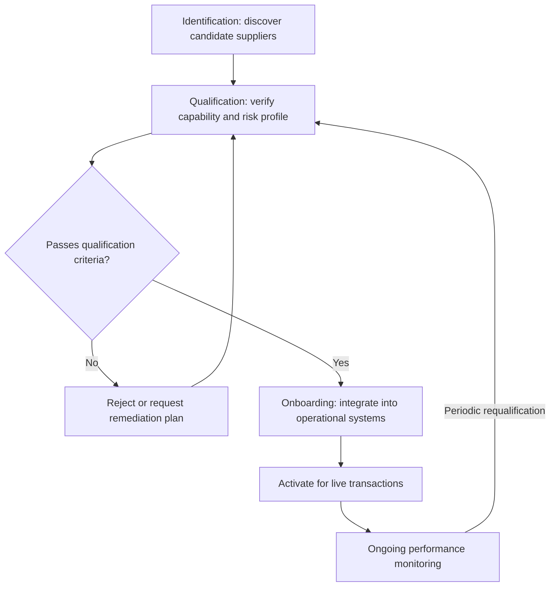
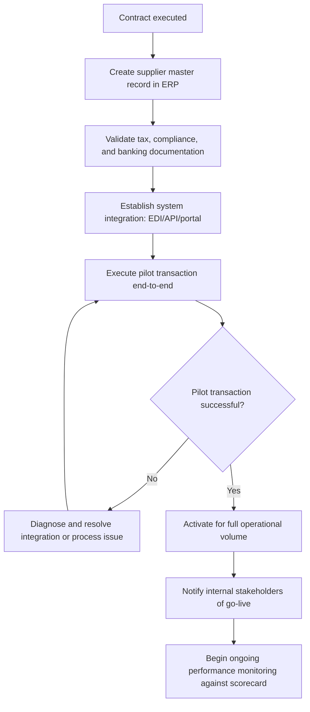

## Supplier Identification, Qualification, and Onboarding


### Definition and Conceptual Basis

Supplier identification, qualification, and onboarding is the structured, sequential process by which an organization discovers candidate suppliers, verifies their capability and fitness to supply, and formally integrates approved suppliers into active operational use. This process sits downstream of category strategy development (from the strategic sourcing process) and upstream of ongoing supplier relationship management — it is the mechanism by which a sourcing strategy's chosen approach (single, dual, or multiple sourcing; leverage or strategic Kraljic positioning) is actually translated into a real, vetted, operationally-ready supply base.

### The Three-Stage Process Overview



### Stage 1: Supplier Identification

Identification is the discovery phase — building a candidate pool broader than the organization's existing, known relationships. Common sourcing channels include:

- **Supplier databases and marketplaces**: Industry-specific directories, B2B sourcing platforms, and trade association member listings that allow filtering by capability, certification, geography, and scale.
- **Trade shows and industry events**: Direct discovery of emerging or specialized suppliers, particularly valuable for niche capabilities not well-indexed in general databases.
- **Referrals and existing supplier networks**: Recommendations from current suppliers, industry peers, or consultants, often yielding higher initial-trust candidates but at risk of narrowing the pool to a homogeneous network rather than genuinely broadening it.
- **Reverse marketing / supplier-initiated outreach**: Responding to unsolicited supplier proposals, which requires a structured intake process to evaluate fairly rather than defaulting to dismissal or informal, undocumented consideration.
- **Incumbent market research from the supply market assessment step**: Directly reusing the supplier landscape mapping conducted during strategic sourcing's category profiling phase, ensuring identification isn't a disconnected, duplicated effort.

**Key Points**: The breadth of the identification stage should scale with category risk and strategic importance — a non-critical, low-risk category may reasonably draw from a narrow, familiar candidate pool, while a strategic or bottleneck category warrants a deliberately wide search to avoid prematurely narrowing to suppliers that happen to be easiest to find rather than genuinely best-fit.

### Stage 2: Supplier Qualification

Qualification is the verification phase, assessing whether each candidate actually meets the requirements to be trusted with live business. This is typically structured around several parallel assessment tracks:

#### Capability and Capacity Assessment

- Technical capability to meet specification requirements (equipment, process certifications, relevant experience with comparable products or services).
- Production/service capacity relative to the buyer's expected volume, including headroom for demand growth or surge requirements.
- Quality management system maturity, commonly evidenced by certifications such as ISO 9001 (general quality management) or industry-specific equivalents (e.g., IATF 16949 for automotive, AS9100 for aerospace).

#### Financial Health Assessment

- Financial stability review (credit ratings, financial statement analysis, days-payable/receivable metrics) to assess the risk of supplier insolvency or distress disrupting supply continuity — directly relevant to the concentration risk discussed under single/dual sourcing strategy.
- [Inference] Financial health assessment is generally weighted more heavily for strategic and bottleneck-quadrant suppliers, where a financial failure would have outsized operational impact, than for non-critical, easily-substituted suppliers, though the specific weighting methodology varies by organization.

#### Compliance and Risk Assessment

- Regulatory compliance verification relevant to the category and jurisdiction (labor standards, environmental regulations, industry-specific licensing).
- Corporate social responsibility (CSR) and sustainability criteria, increasingly formalized through frameworks such as EcoVadis ratings or equivalent third-party ESG (Environmental, Social, Governance) assessment services.
- Cybersecurity posture assessment for suppliers with system integration or data access requirements, particularly relevant where the qualification process feeds into a VMI or EDI data-exchange relationship as covered separately.
- Geopolitical and business continuity risk factors — single points of failure in the supplier's own supply chain, facility concentration in disaster-prone or politically unstable regions.

#### Site Audits and Sample Evaluation

- On-site facility audits (conducted directly or via third-party auditors) to verify claimed capabilities match actual operational reality, particularly for strategic-quadrant or safety-critical categories.
- First-article inspection or pilot batch evaluation, testing actual output quality against specification before committing to full-volume qualification.

### Qualification Scorecard Structure

A typical weighted qualification scorecard combines multiple assessment dimensions into a composite score used for pass/fail or comparative ranking decisions:

```python
def calculate_qualification_score(scores, weights):
    """
    scores: dict of dimension -> raw score (0-100)
    weights: dict of dimension -> weight (must sum to 1.0)
    """
    total_score = sum(scores[dim] * weights[dim] for dim in weights)
    return total_score

# Example: strategic-quadrant supplier qualification
weights = {
    "technical_capability": 0.25,
    "quality_system_maturity": 0.20,
    "financial_stability": 0.20,
    "compliance_and_risk": 0.15,
    "capacity_headroom": 0.10,
    "cost_competitiveness": 0.10
}

candidate_scores = {
    "technical_capability": 85,
    "quality_system_maturity": 90,
    "financial_stability": 70,
    "compliance_and_risk": 80,
    "capacity_headroom": 75,
    "cost_competitiveness": 65
}

score = calculate_qualification_score(candidate_scores, weights)
qualification_threshold = 75

print(f"Composite qualification score: {score:.1f}")
print(f"Status: {'QUALIFIED' if score >= qualification_threshold else 'NOT QUALIFIED — review or reject'}")
# Output:
# Composite qualification score: 79.5
# Status: QUALIFIED
```

**Key Points**: Weighting should shift by Kraljic quadrant — a leverage-category qualification would typically weight cost competitiveness more heavily and financial stability less heavily than the strategic-quadrant example above, reflecting the different risk/value profile established during category strategy development.

### Qualification Weighting by Category Type Diagram

(svg_diagram)

<svg xmlns="http://www.w3.org/2000/svg" viewBox="0 0 800 320">
<text x="400" y="24" text-anchor="middle" font-size="16" font-weight="bold" fill="#111">Qualification Weight Shift by Kraljic Quadrant (svg_diagram)</text>

<text x="200" y="55" text-anchor="middle" font-size="13" fill="#111" font-weight="bold">Leverage Category</text>

<rect x="80" y="70" width="240" height="24" fill="`#2a6fb0`" />

<text x="90" y="87" font-size="10" fill="#fff">Cost competitiveness (heavy)</text>

<rect x="80" y="98" width="120" height="24" fill="`#7ba7d1`" />

<text x="90" y="115" font-size="10" fill="#fff">Financial stability (light)</text>

<rect x="80" y="126" width="90" height="24" fill="`#b0c9e6`" />

<text x="90" y="143" font-size="10" fill="#333">Capability (baseline)</text>

<text x="600" y="55" text-anchor="middle" font-size="13" fill="#111" font-weight="bold">Strategic Category</text>

<rect x="480" y="70" width="90" height="24" fill="`#b03030`" />

<text x="490" y="87" font-size="10" fill="#fff">Cost (light)</text>

<rect x="480" y="98" width="220" height="24" fill="`#d16060`" />

<text x="490" y="115" font-size="10" fill="#fff">Financial stability (heavy)</text>

<rect x="480" y="126" width="230" height="24" fill="`#e69a9a`" />

<text x="490" y="143" font-size="10" fill="#333">Technical/quality capability (heavy)</text>

<text x="400" y="200" text-anchor="middle" font-size="11" fill="#555" font-style="italic">
Leverage: price-driven, transactional qualification
</text>
<text x="400" y="220" text-anchor="middle" font-size="11" fill="#555" font-style="italic">
Strategic: continuity- and capability-driven qualification
</text>
</svg>

### Stage 3: Supplier Onboarding

Onboarding is the operational integration phase, converting an approved-but-not-yet-active supplier into a live, transacting participant in the buyer's supply chain systems and processes.

**Key Points**: Onboarding typically encompasses:

- **Contract execution**: Formalizing negotiated terms (from the strategic sourcing negotiation step) into a legally binding agreement, including service level agreements, pricing terms, and — where relevant — the VMI/consignment or EDI data-exchange arrangements covered separately.
- **Master data setup**: Creating the supplier record in ERP/procurement systems (payment terms, tax and compliance documentation, banking details for payment processing), a step prone to data-entry errors that can cause downstream payment or ordering disruptions if not carefully validated.
- **System integration**: Establishing EDI connections, API integrations, or portal access as required by the sourcing relationship's data-exchange needs — directly connecting to the data exchange layer architecture discussed under vendor-managed inventory.
- **First-order or pilot transaction**: Executing an initial low-risk transaction to validate the full order-to-pay cycle end-to-end (ordering, shipment, receipt, invoicing, payment) before scaling to full operational volume.
- **Internal stakeholder communication**: Informing relevant internal teams (production planning, quality, accounts payable) of the new supplier's activation, required especially when onboarding replaces or supplements an existing supplier relationship.

### Onboarding Workflow



### Periodic Requalification

**Key Points**: Qualification is not a one-time gate but a status that should be periodically revisited, particularly for strategic and bottleneck-quadrant suppliers, since a supplier's financial health, quality performance, and compliance status can materially change after initial onboarding — requalification cadence is typically risk-tiered, with strategic and high-risk suppliers reviewed more frequently (e.g., annually) than stable, low-risk transactional suppliers.

### Common Pitfalls

- Narrowing supplier identification to only the most easily discoverable or referral-based candidates, particularly for strategic or bottleneck categories where a genuinely thorough market search is most valuable and most often skipped due to time pressure.
- Applying a uniform qualification scorecard and weighting across all categories regardless of Kraljic quadrant, producing qualification decisions that don't actually reflect the risk/value profile the category strategy established.
- Treating onboarding as complete once the contract is signed, without validating the full operational data flow (master data accuracy, system integration functionality, first-transaction success) before scaling to full volume — a common source of early-relationship disruption that erodes the credibility of the broader sourcing initiative.
- Failing to build in periodic requalification, allowing a supplier's risk profile to drift silently after initial onboarding until a disruption event forces reactive, rather than proactive, discovery of the changed status.

### Related Topics

- The Strategic Sourcing Process
- Single, Multiple, and Dual Sourcing Strategies
- Kraljic Purchasing Portfolio Matrix and Category Segmentation
- Supplier Relationship Management (SRM) and Performance Scorecards
- Total Cost of Ownership (TCO) Modeling in Supplier Evaluation
- Vendor-Managed Inventory (VMI) and Consignment Stock (system integration linkage)
- Supply Chain Risk Management and Business Continuity Planning