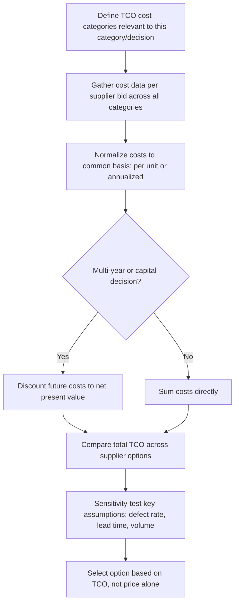

## Total Cost of Ownership (TCO) Analysis

### Definition and Conceptual Basis

Total Cost of Ownership (TCO) is a procurement analysis methodology that quantifies the full lifecycle cost of acquiring, using, and disposing of a good or service, rather than evaluating supplier options on purchase price alone. Purchase price is frequently only a fraction of the true cost a buyer incurs — quality failures, logistics, inventory carrying cost, administrative overhead, and end-of-life disposal costs can, in aggregate, exceed the price differential between competing supplier bids, sometimes reversing which option is actually cheaper once the full cost picture is assembled. TCO analysis is the quantitative discipline that surfaces this reality and prevents purchasing decisions from being distorted by a narrow, price-only comparison.

### The TCO Iceberg: Visible vs. Hidden Costs

**Key Points**: TCO frameworks are commonly illustrated as an iceberg — purchase price is the visible tip, while the much larger mass of total cost sits beneath the surface, unmeasured in a naive price comparison. This visual is a standard pedagogical device in procurement training rather than a formal analytical construct itself, but it captures the central insight TCO analysis is built to address: the costs that don't appear on the invoice are frequently where the real cost differentiation between suppliers actually lives.

### TCO Iceberg Diagram

(svg_diagram)

<svg xmlns="http://www.w3.org/2000/svg" viewBox="0 0 700 400">
<text x="350" y="24" text-anchor="middle" font-size="16" font-weight="bold" fill="#111">TCO Iceberg: Visible vs. Hidden Costs (svg_diagram)</text>
<line x1="40" y1="140" x2="660" y2="140" stroke="#2a6fb0" stroke-width="1" stroke-dasharray="6,4" />
<text x="600" y="130" font-size="11" fill="#2a6fb0">Waterline</text>
<polygon points="280,60 420,60 400,140 300,140" fill="#a6d0ff" stroke="#2a6fb0" stroke-width="1.5" />
<text x="350" y="90" text-anchor="middle" font-size="11" fill="#111">Purchase</text>
<text x="350" y="105" text-anchor="middle" font-size="11" fill="#111">Price</text>
<text x="350" y="120" text-anchor="middle" font-size="9" fill="#333">(visible)</text>
<polygon points="300,140 400,140 550,380 150,380" fill="#dceeff" stroke="#2a6fb0" stroke-width="1.5" />
<text x="350" y="180" text-anchor="middle" font-size="11" fill="#111">Logistics &amp; freight</text>
<text x="350" y="205" text-anchor="middle" font-size="11" fill="#111">Quality/defect costs</text>
<text x="350" y="230" text-anchor="middle" font-size="11" fill="#111">Inventory carrying cost</text>
<text x="350" y="255" text-anchor="middle" font-size="11" fill="#111">Administrative overhead</text>
<text x="350" y="280" text-anchor="middle" font-size="11" fill="#111">Switching/transition cost</text>
<text x="350" y="305" text-anchor="middle" font-size="11" fill="#111">Warranty &amp; support cost</text>
<text x="350" y="330" text-anchor="middle" font-size="11" fill="#111">End-of-life disposal cost</text>
<text x="350" y="355" text-anchor="middle" font-size="10" fill="#333" font-style="italic">(hidden, unmeasured in price-only comparison)</text>
</svg>

### TCO Cost Category Framework

A comprehensive TCO model typically organizes cost components across the acquisition lifecycle:

- **Pre-transaction costs**: Supplier identification and qualification costs, RFP/RFQ process administration, site audit and evaluation costs — the sourcing-process overhead described under strategic sourcing methodology, amortized across the relationship's expected volume.
- **Transaction costs**: Purchase price, taxes and tariffs, currency conversion/hedging costs for international suppliers, payment processing and financing costs.
- **Logistics and delivery costs**: Freight and transportation, customs brokerage, packaging, insurance in transit, and lead-time-related costs (expediting fees when required, or the inventory carrying cost of safety stock held to buffer a longer or less reliable supplier lead time).
- **Quality-related costs**: Incoming inspection cost, cost of defects (scrap, rework, warranty claims), cost of production disruption caused by quality failures, and the cost of any additional quality-assurance oversight required for a less mature supplier.
- **Operational/usage costs**: Costs incurred while actually using the good or service — for capital equipment, this includes energy consumption, maintenance, spare parts, and operator training; for a component, it can include the downstream manufacturing yield impact of using that specific input.
- **Post-transaction costs**: End-of-life disposal or decommissioning cost, environmental compliance cost, and any contractual exit or transition costs if the relationship is discontinued.

### TCO Calculation Formula

The general TCO formula sums all cost components, typically expressed on a per-unit or annualized basis for comparability across supplier bids with different volume or contract structures:

$$TCO = P + C_{logistics} + C_{quality} + C_{admin} + C_{inventory} + C_{operational} + C_{disposal} - V_{residual}$$

where $P$ is purchase price, and $V_{residual}$ is any residual or salvage value recovered at disposal (subtracted since it offsets total cost). For capital equipment or multi-year contracts, costs occurring in future periods are frequently discounted to present value using the organization's cost of capital, converting the TCO calculation into a net present value (NPV) analysis rather than a simple undiscounted sum.

### Worked Example: Comparing Two Supplier Bids

**Key Points**: A common TCO pitfall in practice is comparing two supplier bids on price alone when their underlying cost structures differ substantially — this worked example illustrates how a nominally higher-priced bid can represent the lower true total cost.

| Cost Component | Supplier A | Supplier B |
| --- | --- | --- |
| Unit purchase price | $18.00 | $20.00 |
| Annual volume | 100,000 units | 100,000 units |
| Freight cost per unit | $1.20 (overseas, longer lead time) | $0.40 (domestic, shorter lead time) |
| Defect rate | 3.5% | 0.8% |
| Cost per defect (rework/scrap) | $25.00 | $25.00 |
| Additional safety stock required (units, due to longer/variable lead time) | 8,000 | 2,000 |
| Inventory holding cost rate | 20% of unit price annually | 20% of unit price annually |
| Annual qualification/admin overhead | $15,000 (overseas compliance) | $6,000 |

```python
def calculate_tco(unit_price, annual_volume, freight_per_unit, defect_rate,
                   cost_per_defect, safety_stock_units, holding_cost_rate, admin_overhead):
    material_cost = unit_price * annual_volume
    freight_cost = freight_per_unit * annual_volume
    quality_cost = defect_rate * annual_volume * cost_per_defect
    inventory_cost = safety_stock_units * unit_price * holding_cost_rate

    total_cost = material_cost + freight_cost + quality_cost + inventory_cost + admin_overhead
    tco_per_unit = total_cost / annual_volume

    return {
        "material_cost": material_cost,
        "freight_cost": freight_cost,
        "quality_cost": quality_cost,
        "inventory_cost": inventory_cost,
        "admin_overhead": admin_overhead,
        "total_annual_cost": total_cost,
        "tco_per_unit": tco_per_unit
    }

supplier_a = calculate_tco(18.00, 100000, 1.20, 0.035, 25.00, 8000, 0.20, 15000)
supplier_b = calculate_tco(20.00, 100000, 0.40, 0.008, 25.00, 2000, 0.20, 6000)

print(f"Supplier A TCO per unit: ${supplier_a['tco_per_unit']:.2f}")
print(f"Supplier B TCO per unit: ${supplier_b['tco_per_unit']:.2f}")
```

**Output**:

```plaintext
Supplier A TCO per unit: $21.83
Supplier B TCO per unit: $21.13
```

**Output**: Despite Supplier B's $2.00 higher unit price, its true total cost of ownership per unit ($21.13) is lower than Supplier A's ($21.83), driven primarily by Supplier B's substantially lower defect rate, lower freight cost, and reduced safety stock requirement from its shorter, more reliable lead time. A price-only comparison would have selected Supplier A and understated the true annual cost by roughly $70,000 across the 100,000-unit volume.

### TCO Cost Breakdown Diagram

(svg_diagram)

<svg xmlns="http://www.w3.org/2000/svg" viewBox="0 0 750 300">
<text x="375" y="24" text-anchor="middle" font-size="16" font-weight="bold" fill="#111">TCO per Unit: Supplier A vs Supplier B (svg_diagram)</text>
<line x1="80" y1="260" x2="700" y2="260" stroke="#333" stroke-width="1.5" />
<text x="390" y="285" text-anchor="middle" font-size="12" fill="#333">Cost Component (stacked)</text>

<text x="220" y="245" text-anchor="middle" font-size="12" fill="#111" font-weight="bold">Supplier A ($21.83)</text>

<rect x="150" y="150" width="140" height="90" fill="`#a6d0ff`" stroke="`#2a6fb0`" />

<text x="220" y="200" text-anchor="middle" font-size="10" fill="#111">Price $18.00</text>

<rect x="150" y="115" width="140" height="35" fill="`#ffb3b3`" stroke="`#b03030`" />

<text x="220" y="136" text-anchor="middle" font-size="9" fill="#111">Freight+Quality $2.15</text>

<rect x="150" y="95" width="140" height="20" fill="`#ffe0b3`" stroke="`#c07b1e`" />

<text x="220" y="109" text-anchor="middle" font-size="9" fill="#111">Inv+Admin $1.68</text>

<text x="560" y="245" text-anchor="middle" font-size="12" fill="#111" font-weight="bold">Supplier B ($21.13)</text>

<rect x="490" y="140" width="140" height="100" fill="`#a6d0ff`" stroke="`#2a6fb0`" />

<text x="560" y="195" text-anchor="middle" font-size="10" fill="#111">Price $20.00</text>

<rect x="490" y="120" width="140" height="20" fill="`#ffb3b3`" stroke="`#b03030`" />

<text x="560" y="134" text-anchor="middle" font-size="9" fill="#111">Freight+Quality $0.60</text>

<rect x="490" y="105" width="140" height="15" fill="`#ffe0b3`" stroke="`#c07b1e`" />

<text x="560" y="116" text-anchor="middle" font-size="9" fill="#111">Inv+Admin $0.53</text>

</svg>

### TCO Analysis Process



### Relationship to Other Sourcing and Inventory Concepts

**Key Points**:

- TCO analysis is the quantitative backbone of the supply market assessment step within the strategic sourcing process, and directly informs the weighted qualification scorecards used in supplier qualification.
- The inventory carrying cost component of TCO connects directly to the safety stock and EOQ formulas covered elsewhere in this chapter — a supplier's lead time and lead-time variability flow directly into the safety stock term of a proper TCO calculation, meaning TCO and inventory strategy are not independent analyses but share underlying inputs.
- Kraljic-quadrant positioning should influence which TCO cost categories receive the most rigorous quantification effort — for strategic and bottleneck items, disruption-related and quality-related cost categories typically warrant the most careful modeling, while for leverage and non-critical items, price and administrative overhead often dominate the comparison sufficiently that exhaustive TCO modeling may not be cost-justified.

### Common Pitfalls

- Comparing supplier bids on purchase price alone, or including only the most visible additional cost (typically freight) while omitting harder-to-quantify categories like quality/defect cost, inventory carrying cost impact, and administrative overhead.
- Using inconsistent normalization across supplier bids — comparing one supplier's annualized cost to another's per-unit cost, or failing to align volume assumptions, currency, and time period across the comparison.
- Applying a static TCO calculation without sensitivity testing key uncertain assumptions (defect rate, currency fluctuation, volume changes), producing a false sense of precision around what are frequently estimated, not measured, cost inputs.
- Over-investing analytical effort in exhaustive TCO modeling for low-value, non-critical categories where the administrative cost of the analysis itself exceeds any decision-quality improvement it could plausibly deliver.

### Related Topics

- The Strategic Sourcing Process
- Supplier Identification, Qualification, and Onboarding
- Kraljic Purchasing Portfolio Matrix and Category Segmentation
- Safety Stock Under Demand and Lead-Time Variability
- Economic Order Quantity and Reorder Point Models
- Net Present Value (NPV) and Discounted Cash Flow Analysis in Procurement
- Single, Multiple, and Dual Sourcing Strategies